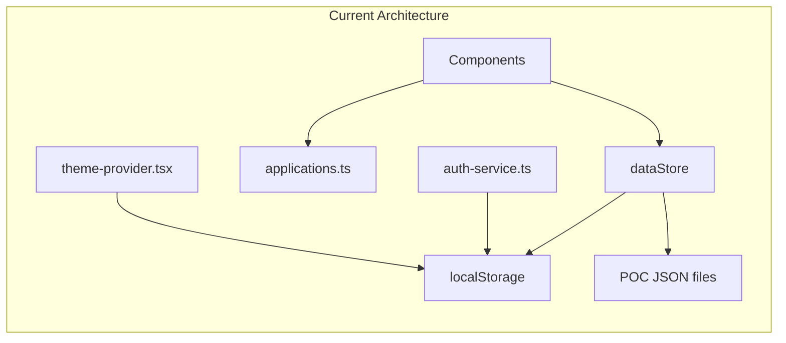
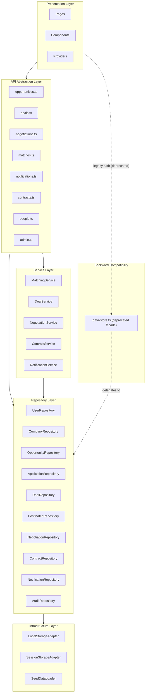

# PMTwin Sprint 1 Architecture Refactoring Plan

## Important Migration Rules

1. Do NOT remove any working functionality.
2. Keep all existing screens operational.
3. Introduce repositories incrementally.
4. Keep `data-store.ts` as a compatibility facade during Sprint 1.
5. `PostMatch` and `Negotiation` are first-class domain entities and MUST have dedicated repositories.
6. All repositories must use `StorageAdapter`.
7. No direct `localStorage` access is allowed outside `StorageAdapter`.
8. Generate a migration report at completion.
9. Do NOT start backend implementation.
10. Do NOT add PostgreSQL code yet.
11. Do NOT add authentication redesign yet.
12. Do NOT change UI behavior.

## Current Architecture

All data access flows through a single `dataStore` object in [data-store.ts](web/src/lib/data-store.ts) that directly reads JSON seed files, merges localStorage overrides, and exposes CRUD methods. Components call `dataStore` directly. Business logic lives in [applications.ts](web/src/lib/applications.ts) and is scattered across components. Deals are derived dynamically from negotiations in [deals-pages.tsx](web/src/pages/workspace/deals-pages.tsx) with no standalone persistence.



localStorage is used in exactly 3 files with 3 keys:
- `pm-twin-theme` in `theme-provider.tsx`
- `pmtwin_web_overrides` in `data-store.ts`
- `pmtwin_web_session` in `auth-service.ts`

## Target Architecture (Sprint 1)



## New Folder Structure

```
web/src/
  api/
    opportunities.ts           # API facade for OpportunityRepository
    deals.ts                   # API facade for DealRepository + DealService
    negotiations.ts            # API facade for NegotiationRepository + NegotiationService
    matches.ts                 # API facade for PostMatchRepository + MatchingService
    notifications.ts           # API facade for NotificationRepository + NotificationService
    contracts.ts               # API facade for ContractRepository + ContractService
    people.ts                  # API facade for UserRepository + CompanyRepository
    admin.ts                   # API facade for admin-specific queries (audit, pending users)
    index.ts                   # Barrel re-export of all API modules
  infrastructure/
    storage/
      storage-adapter.ts       # IStorageAdapter interface
      local-storage-adapter.ts # localStorage implementation
      session-storage-adapter.ts # sessionStorage implementation
    seed/
      seed-loader.ts           # JSON import + merge logic (extracted from dataStore)
  repositories/
    base-repository.ts         # Shared generic CRUD base
    user-repository.ts
    company-repository.ts
    opportunity-repository.ts
    application-repository.ts
    deal-repository.ts         # Dedicated Deal entity repository (NOT derived from Negotiations)
    post-match-repository.ts   # First-class PostMatch repository
    negotiation-repository.ts  # First-class Negotiation repository
    contract-repository.ts
    notification-repository.ts # Full CRUD: create, update, delete, markRead, markAllRead
    audit-repository.ts
    index.ts                   # Barrel + singleton instances
  services/
    matching-service.ts
    deal-service.ts
    negotiation-service.ts
    contract-service.ts
    notification-service.ts
    index.ts                   # Barrel + singleton instances
  types/
    domain.ts                  # All entity types consolidated (including Deal, PostMatch, Negotiation)
    storage.ts                 # Storage/adapter types
  lib/
    applications.ts            # Kept for status constants/labels only (display helpers)
    auth-service.ts            # Refactored to use StorageAdapter
    data-store.ts              # Thin facade delegating to repositories (backward compat, @deprecated)
    format.ts                  # Unchanged
    mock-user.ts               # Unchanged
    utils.ts                   # Unchanged
  hooks/
    use-data-store.ts          # Unchanged (pub/sub mechanism stays)
  ...rest unchanged...
```

## Implementation Phases

### Phase 1: Foundation (types + storage adapter)

**1a. Consolidate types into `web/src/types/domain.ts`**

Extract all domain types from `data-store.ts`, `applications.ts`, `auth-service.ts`, and `mock-user.ts` into one canonical file. Types to consolidate:
- `Opportunity`, `PostMatch`, `AppNotification`, `Negotiation`, `PersonProfile`, `PlatformUser`, `Company`, `PendingUser`, `AuditEntry` (from `data-store.ts`)
- `Application`, `ApplicationValue` (from `applications.ts`)
- `AuthSession`, `AccountType` (from `auth-service.ts`)

Add new first-class domain types:

```typescript
export type Deal = {
  id: string
  negotiationId: string
  opportunityId: string
  title: string
  status: string
  parties: Array<{ userId: string; role: string }>
  terms?: {
    value?: number
    currency?: string
    duration?: string
    paymentSchedule?: string
  }
  createdAt: string
  updatedAt: string
}

export type Contract = {
  id: string
  dealId: string
  status: string
  parties: Array<{ userId: string; role: string }>
  terms?: Record<string, unknown>
  createdAt: string
  updatedAt: string
}
```

Expand `Negotiation` to match the full seed data structure (currently only `id`, `status`, `updatedAt`):

```typescript
export type Negotiation = {
  id: string
  opportunityId: string
  matchId?: string
  applicationId?: string
  parties: Array<{ userId: string; role: string }>
  status: string
  initialTerms?: {
    value?: number
    currency?: string
    duration?: string
    paymentSchedule?: string
  }
  rounds?: Array<{
    by: string
    at: string
    proposal: Record<string, unknown>
    message?: string
  }>
  createdAt?: string
  updatedAt?: string
}
```

Expand `PostMatch` to match the full seed data structure:

```typescript
export type PostMatch = {
  id: string
  matchType: string
  status: string
  matchScore: number
  runId?: string
  participants: Array<{
    userId: string
    opportunityId?: string
    role: string
    participantStatus: string
    respondedAt?: string | null
  }>
  payload?: {
    needOpportunityId?: string
    offerOpportunityId?: string
    breakdown?: Record<string, number>
    valueAnalysis?: unknown
  }
  createdAt?: string
  updatedAt?: string
  expiresAt?: string
  isReplacement?: boolean
}
```

Create `web/src/types/storage.ts` with `IStorageAdapter` interface and `Overrides` type.

**1b. Create `web/src/infrastructure/storage/storage-adapter.ts`**

```typescript
export interface IStorageAdapter {
  get<T>(key: string): T | null
  set<T>(key: string, value: T): void
  remove(key: string): void
  clear(): void
}
```

**1c. Create `web/src/infrastructure/storage/local-storage-adapter.ts`**

Implements `IStorageAdapter` using `window.localStorage` with JSON serialization and try/catch error handling. This is the **single point of contact** with `localStorage`.

**1d. Create `web/src/infrastructure/storage/session-storage-adapter.ts`**

Implements `IStorageAdapter` using `window.sessionStorage`. Used by `auth-service.ts` for non-rememberMe sessions.

**1e. Create `web/src/infrastructure/seed/seed-loader.ts`**

Extract the JSON import statements and `rows()` / `mergeById()` helpers from `data-store.ts`. This module is responsible for loading and deduplicating seed data from POC JSON files. It provides typed getter functions like `loadOpportunities()`, `loadUsers()`, `loadPostMatches()`, `loadNegotiations()`, etc.

### Phase 2: Repository Layer

**2a. Create `web/src/repositories/base-repository.ts`**

Generic base providing:
- Inject `IStorageAdapter` and seed data loader function
- `getAll()`, `getById()`, `update()`, `create()`, `delete()` with override-merge pattern
- Trigger `notifyDataStore()` on writes (preserves reactivity)

The override-merge pattern (seed JSON + localStorage patches) currently in `dataStore.getOpportunities()` and `dataStore.getApplications()` moves here.

**2b. Implement 10 repositories**

Each repository wraps the corresponding slice of the current `dataStore`:

- **`UserRepository`** -- Replaces `dataStore.getUsers`, `getUserById`. Read-only from seed. Methods: `getAll()`, `getById()`.

- **`CompanyRepository`** -- Replaces `dataStore.getCompanies`, `getCompanyById`. Read-only from seed. Methods: `getAll()`, `getById()`.

- **`OpportunityRepository`** -- Replaces `dataStore.getOpportunities`, `getOpportunityById`, `updateOpportunity`. Methods: `getAll()`, `getById()`, `update()`.

- **`ApplicationRepository`** -- Replaces `dataStore.getApplications`, `updateApplication`, `createApplication`. Methods: `getAll()`, `getById()`, `getByOpportunity()`, `getByApplicant()`, `create()`, `update()`.

- **`DealRepository`** (dedicated, NOT derived from Negotiations) -- Deal is a first-class entity with its own persistence. Initial seed can be generated from negotiation data via seed-loader but is stored independently. Methods: `getAll()`, `getById()`, `create()`, `update()`.

- **`PostMatchRepository`** (first-class) -- Replaces `dataStore.getPostMatches`, `getPostMatchById`. Methods: `getAll()`, `getById()`, `getByUser()`, `getByOpportunity()`.

- **`NegotiationRepository`** (first-class) -- Replaces `dataStore.getNegotiations`, `getNegotiationById`. Methods: `getAll()`, `getById()`, `getByOpportunity()`, `getByParty()`, `update()`.

- **`ContractRepository`** -- Currently placeholder. Methods: `getAll()`, `getById()`, `create()`, `update()`.

- **`NotificationRepository`** -- Replaces `dataStore.getNotifications`. Full CRUD support:
  - `getAll()`
  - `getByUserId(userId)`
  - `create(notification)` -- create a new notification
  - `update(id, patch)` -- update notification fields
  - `delete(id)` -- remove a notification
  - `markRead(id)` -- set `read: true` for a single notification
  - `markAllRead(userId)` -- set `read: true` for all notifications of a user

- **`AuditRepository`** -- Replaces `dataStore.getAuditLog`. Read-only from seed. Methods: `getAll()`.

**2c. Create `web/src/repositories/index.ts`**

Instantiate singletons with `LocalStorageAdapter` injected, and export them. Also export a combined `repositories` object for easy access.

### Phase 3: Service Layer

**3a. `MatchingService` (`web/src/services/matching-service.ts`)**

Extract from components and `applications.ts`:
- `getHighMatches(threshold)` -- from `DashboardPage` line 38 (`matchScore >= 0.9`)
- `getMatchesForUser(userId)` -- from `MatchesPage`
- `getMatchBreakdown(matchId)` -- from `MatchDetailPage`
- `sortApplicationsByValueScore()` -- from `applications.ts`
- `normalizeApplicationValue()` / `formatApplicationValueAmount()` -- from `applications.ts`

Dependencies: `PostMatchRepository`, `ApplicationRepository`, `OpportunityRepository`.

**3b. `DealService` (`web/src/services/deal-service.ts`)**

Deal operations -- reads/writes go through `DealRepository` (NOT derived from negotiations):
- `getDeals()` -- list all deals from `DealRepository`
- `getDealById(id)` -- single deal from `DealRepository`
- `createDealFromNegotiation(negotiationId)` -- creates a Deal entity when a negotiation is agreed
- `updateDealStatus(id, status)` -- update deal lifecycle stage
- `bucketOpportunitiesForPipeline()` -- from `applications.ts` lines 170-189
- `updateOpportunityStatus(id, stage)` -- from `PipelineBoard.handleOppDrop`

Dependencies: `DealRepository`, `NegotiationRepository`, `OpportunityRepository`, `ApplicationRepository`.

**3c. `NegotiationService` (`web/src/services/negotiation-service.ts`)**

Extract from `ApplicationsPanel` and `PipelineBoard`:
- `transitionApplicationStatus(appId, newStatus)` -- from `ApplicationsPanel.handleStatusChange`
- `acceptApplication(appId)` -- from `ApplicationsPanel.handleAccept`
- `rejectApplication(appId)` -- from `ApplicationsPanel.handleReject`
- `canUserApplyToOpportunity()` -- from `applications.ts` lines 34-58
- `resolveUserApplication()` -- from `applications.ts` lines 136-151
- `findBlockingApplication()` -- from `applications.ts` lines 121-134
- `submitApplication(data)` -- from `ApplyWizard.submit`
- `bucketApplicationsForPipeline()` -- from `applications.ts` lines 191-212
- `updateApplicationStatus(id, stage)` -- from `PipelineBoard.handleAppDrop`

Dependencies: `ApplicationRepository`, `OpportunityRepository`, `NegotiationRepository`.

**3d. `ContractService` (`web/src/services/contract-service.ts`)**

Minimal for now (pages are placeholders):
- `getContracts()`, `getContractById(id)`

Dependencies: `ContractRepository`.

**3e. `NotificationService` (`web/src/services/notification-service.ts`)**

Extract from `NotificationCenter` and `DashboardPage`:
- `getNotificationsForUser(userId)` -- delegates to `NotificationRepository.getByUserId()`
- `getUnreadCount(userId)` -- from `NotificationCenter` and `DashboardPage`
- `createNotification(data)` -- delegates to `NotificationRepository.create()`
- `updateNotification(id, patch)` -- delegates to `NotificationRepository.update()`
- `deleteNotification(id)` -- delegates to `NotificationRepository.delete()`
- `markAsRead(notificationId)` -- delegates to `NotificationRepository.markRead()`
- `markAllAsRead(userId)` -- delegates to `NotificationRepository.markAllRead()`

Dependencies: `NotificationRepository`.

### Phase 4: API Abstraction Layer

Create `web/src/api/` as the intended public interface for UI components. All UI components should eventually communicate through the API layer rather than repositories directly.

**Purpose:** Decouple UI from internal data architecture. When a real backend arrives, only the API layer implementation changes -- component imports remain the same.

**4a. `web/src/api/opportunities.ts`**

```typescript
export const opportunitiesApi = {
  list: () => opportunityRepository.getAll(),
  get: (id: string) => opportunityRepository.getById(id),
  update: (id: string, patch: Partial<Opportunity>) => opportunityRepository.update(id, patch),
}
```

**4b. `web/src/api/deals.ts`**

```typescript
export const dealsApi = {
  list: () => dealService.getDeals(),
  get: (id: string) => dealService.getDealById(id),
  create: (data: ...) => dealService.createDealFromNegotiation(data),
  update: (id: string, patch: ...) => dealService.updateDealStatus(id, patch),
}
```

**4c. `web/src/api/negotiations.ts`**

```typescript
export const negotiationsApi = {
  list: () => negotiationRepository.getAll(),
  get: (id: string) => negotiationRepository.getById(id),
  getByOpportunity: (oppId: string) => negotiationRepository.getByOpportunity(oppId),
}
```

**4d. `web/src/api/matches.ts`**

```typescript
export const matchesApi = {
  list: () => postMatchRepository.getAll(),
  get: (id: string) => postMatchRepository.getById(id),
  getHighMatches: (threshold?: number) => matchingService.getHighMatches(threshold),
  getForUser: (userId: string) => matchingService.getMatchesForUser(userId),
}
```

**4e. `web/src/api/notifications.ts`**

```typescript
export const notificationsApi = {
  list: (userId: string) => notificationService.getNotificationsForUser(userId),
  unreadCount: (userId: string) => notificationService.getUnreadCount(userId),
  create: (data: ...) => notificationService.createNotification(data),
  update: (id: string, patch: ...) => notificationService.updateNotification(id, patch),
  delete: (id: string) => notificationService.deleteNotification(id),
  markRead: (id: string) => notificationService.markAsRead(id),
  markAllRead: (userId: string) => notificationService.markAllAsRead(userId),
}
```

**4f. `web/src/api/contracts.ts`**

```typescript
export const contractsApi = {
  list: () => contractService.getContracts(),
  get: (id: string) => contractService.getContractById(id),
}
```

**4g. `web/src/api/people.ts`**

```typescript
export const peopleApi = {
  listUsers: () => userRepository.getAll(),
  listCompanies: () => companyRepository.getAll(),
  listAll: () => [...userRepository.getAll(), ...companyRepository.getAll()],
  get: (id: string) => userRepository.getById(id) ?? companyRepository.getById(id),
}
```

**4h. `web/src/api/admin.ts`**

```typescript
export const adminApi = {
  getAuditLog: () => auditRepository.getAll(),
  getPendingUsers: () => /* from seed-loader */,
  getSiteContent: () => /* from seed-loader */,
}
```

**4i. `web/src/api/index.ts`** -- Barrel re-export of all API modules.

### Phase 5: Backward Compatibility Facade

**5a. Refactor `data-store.ts` into a thin deprecated facade**

Keep `dataStore` as a facade that delegates every method to the corresponding repository. This ensures any missed references still work and reduces risk. Every method will be marked with `@deprecated` JSDoc comments pointing to the replacement.

```typescript
/** @deprecated Use opportunitiesApi.list() or opportunityRepository.getAll() */
getOpportunities() { return opportunityRepository.getAll() },

/** @deprecated Use dealsApi.list() or dealRepository.getAll() */
getNegotiations() { return negotiationRepository.getAll() },
```

**5b. Preserve `notifyDataStore()` reactivity**

The existing `notifyDataStore()` / `useDataStoreVersion()` pub/sub pattern in [use-data-store.ts](web/src/hooks/use-data-store.ts) is preserved unchanged. Repositories call `notifyDataStore()` on writes, exactly as `dataStore` does today.

### Phase 6: Component Integration

Update components to call the API layer or services instead of `dataStore` directly. No UI changes. No JSX modifications except swapping data source imports.

**Files to update (12 component/page files):**

- `components/opportunity/apply-wizard.tsx` -- Replace `dataStore.createApplication()` with `negotiationsApi` or `negotiationService.submitApplication()`
- `components/opportunity/applications-panel.tsx` -- Replace `dataStore.updateApplication()` calls with `negotiationService.transitionApplicationStatus()` / `.acceptApplication()` / `.rejectApplication()`
- `components/pipeline/pipeline-board.tsx` -- Replace `dataStore.getOpportunities/getApplications/updateOpportunity/updateApplication` with API layer or service calls
- `components/layout/notification-center.tsx` -- Replace `dataStore.getNotifications()` and local mark-read state with `notificationsApi`
- `pages/dashboard-page.tsx` -- Replace `dataStore` calls with API layer imports
- `pages/workspace/opportunity-detail-page.tsx` -- Replace `dataStore` + `applications.ts` calls with API layer
- `pages/workspace/opportunities-pages.tsx` -- Replace `dataStore.getOpportunities()` with `opportunitiesApi.list()`
- `pages/workspace/deals-pages.tsx` -- Replace `dataStore.getNegotiations()` mapping with `dealsApi.list()` (reads from DealRepository, not derived from Negotiations)
- `pages/workspace/pipeline-pages.tsx` -- Replace `dataStore.getPostMatches()` with `matchesApi.list()`
- `pages/workspace/people-pages.tsx` -- Replace `dataStore.getPeople()` with `peopleApi.listAll()`
- `pages/admin/admin-pages.tsx` -- Replace all `dataStore.*` calls with API layer or repository imports
- `providers/auth-provider.tsx` -- No change needed (already uses `authService`)

**Update `auth-service.ts`:** Refactor `readSession()` / `writeSession()` to use `LocalStorageAdapter` and `SessionStorageAdapter` instead of direct `localStorage`/`sessionStorage` access.

**Update `theme-provider.tsx`:** Refactor to use `LocalStorageAdapter` for the theme key instead of direct `localStorage.getItem/setItem`.

### Phase 7: Cleanup and Migration Report

**7a. Slim down `applications.ts`**

Keep only display-oriented constants and labels:
- `APPLICATION_STATUS_LABELS`
- `TRANSITIONABLE_APPLICATION_STATUSES`
- `OPP_STAGE_TO_STATUS`
- `APP_STAGE_TO_STATUS`

Move all functions (`canUserApplyToOpportunity`, `normalizeApplicationValue`, `formatApplicationValueAmount`, `filterApplicationsForOpportunity`, `sortApplicationsByValueScore`, `findBlockingApplication`, `resolveUserApplication`, `bucketOpportunitiesForPipeline`, `bucketApplicationsForPipeline`) into their respective services.

**7b. Update type imports**

All files importing types from `data-store.ts` or `applications.ts` update to import from `types/domain.ts`.

**7c. Generate migration report**

Output a `MIGRATION-REPORT.md` in the project root documenting:
- Files changed (with before/after summary)
- Direct localStorage usages removed (count and locations)
- Repositories created (10 total)
- Services created (5 total)
- API modules created (8 total)
- Remaining technical debt (e.g., components still using facade, future backend migration needs)

## Key Design Decisions

- **Deal is a first-class entity** -- Deals have their own `DealRepository` with independent persistence. They are NOT derived dynamically from Negotiations. Initial seed data can be generated from negotiation data by the seed-loader, but once persisted, deals are independent entities.
- **PostMatch and Negotiation are first-class** -- Each has a dedicated repository, not lumped into other entity repositories.
- **NotificationRepository has full CRUD** -- `create()`, `update()`, `delete()`, `markRead()`, `markAllRead()` are all repository-level operations, not just component-local state.
- **API abstraction layer** -- `web/src/api/` provides a stable interface for UI. When a real backend arrives, only the API module implementations change; component imports stay the same.
- **Singleton repositories** -- Instantiated once with `LocalStorageAdapter` injected, exported from `repositories/index.ts`. No DI container needed for a browser-only SPA.
- **Services are stateless** -- They receive repository singletons and orchestrate logic. No internal state.
- **Seed data stays static imports** -- The JSON seed files from `POC/data/` continue to be imported at build time via the `@poc-data` Vite alias. The `SeedLoader` just organizes these imports.
- **Override-merge pattern preserved** -- The `readOverrides()` / `writeOverrides()` pattern from `data-store.ts` moves into `BaseRepository`, keeping the same localStorage key (`pmtwin_web_overrides`) and structure so existing user data is not lost.
- **No React Context for repositories/services** -- Direct imports of singletons keep things simple. Components already import `dataStore` directly; this swaps the import target, not the pattern.

## Risk Mitigation

- **Zero UI changes** -- No JSX modifications except swapping data source imports
- **Facade ensures backward compat** -- `dataStore` survives as a deprecated thin redirect throughout Sprint 1
- **Same localStorage keys** -- No data migration needed; existing browser state continues to work
- **Same pub/sub reactivity** -- `useDataStoreVersion()` hook unchanged; repositories trigger the same `notifyDataStore()` on writes
- **Incremental rollout** -- Each phase can be verified independently before moving to the next

## Files Created (new, ~27 files)

- `web/src/types/domain.ts`
- `web/src/types/storage.ts`
- `web/src/infrastructure/storage/storage-adapter.ts`
- `web/src/infrastructure/storage/local-storage-adapter.ts`
- `web/src/infrastructure/storage/session-storage-adapter.ts`
- `web/src/infrastructure/seed/seed-loader.ts`
- `web/src/repositories/base-repository.ts`
- `web/src/repositories/user-repository.ts`
- `web/src/repositories/company-repository.ts`
- `web/src/repositories/opportunity-repository.ts`
- `web/src/repositories/application-repository.ts`
- `web/src/repositories/deal-repository.ts`
- `web/src/repositories/post-match-repository.ts`
- `web/src/repositories/negotiation-repository.ts`
- `web/src/repositories/contract-repository.ts`
- `web/src/repositories/notification-repository.ts`
- `web/src/repositories/audit-repository.ts`
- `web/src/repositories/index.ts`
- `web/src/services/matching-service.ts`
- `web/src/services/deal-service.ts`
- `web/src/services/negotiation-service.ts`
- `web/src/services/contract-service.ts`
- `web/src/services/notification-service.ts`
- `web/src/services/index.ts`
- `web/src/api/opportunities.ts`
- `web/src/api/deals.ts`
- `web/src/api/negotiations.ts`
- `web/src/api/matches.ts`
- `web/src/api/notifications.ts`
- `web/src/api/contracts.ts`
- `web/src/api/people.ts`
- `web/src/api/admin.ts`
- `web/src/api/index.ts`
- `MIGRATION-REPORT.md`

## Files Modified (~15 files)

- `web/src/lib/data-store.ts` -- gutted to deprecated facade delegating to repositories
- `web/src/lib/applications.ts` -- slimmed to display constants only
- `web/src/lib/auth-service.ts` -- use StorageAdapter (no auth redesign)
- `web/src/providers/theme-provider.tsx` -- use StorageAdapter
- `web/src/components/opportunity/apply-wizard.tsx`
- `web/src/components/opportunity/applications-panel.tsx`
- `web/src/components/pipeline/pipeline-board.tsx`
- `web/src/components/layout/notification-center.tsx`
- `web/src/pages/dashboard-page.tsx`
- `web/src/pages/workspace/opportunity-detail-page.tsx`
- `web/src/pages/workspace/opportunities-pages.tsx`
- `web/src/pages/workspace/deals-pages.tsx`
- `web/src/pages/workspace/pipeline-pages.tsx`
- `web/src/pages/workspace/people-pages.tsx`
- `web/src/pages/admin/admin-pages.tsx`
