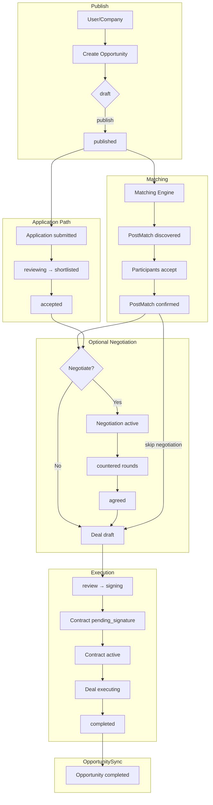
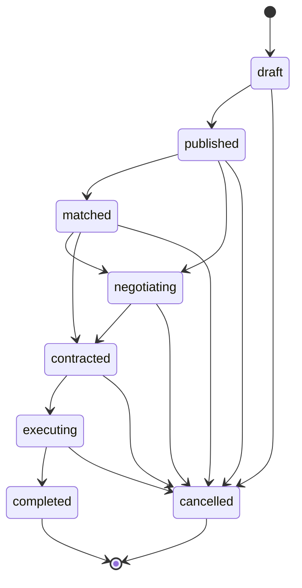
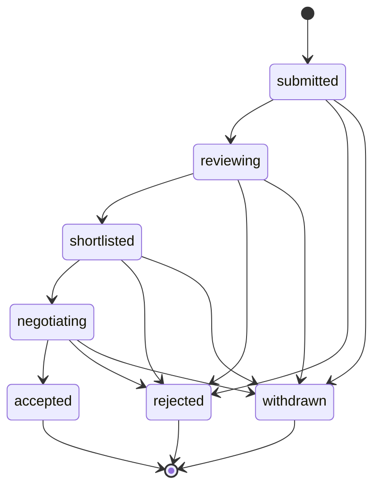
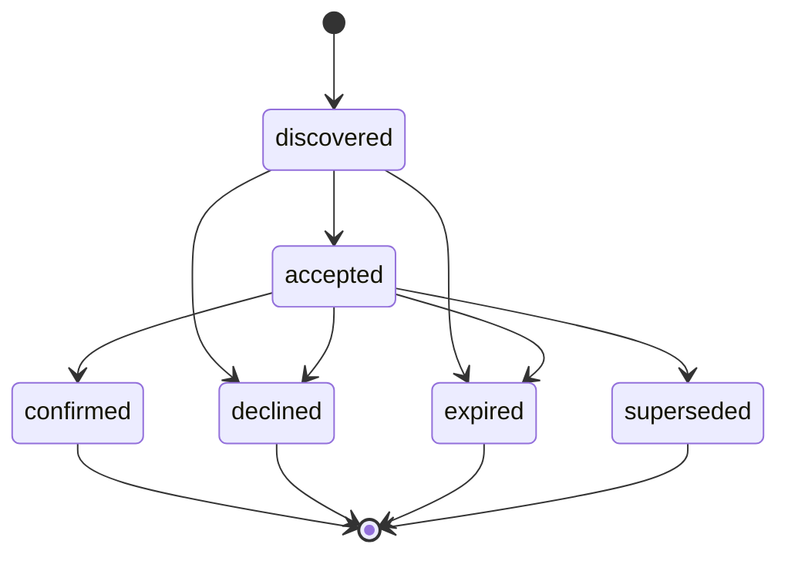
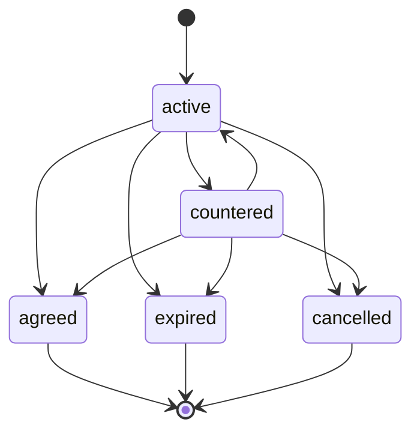
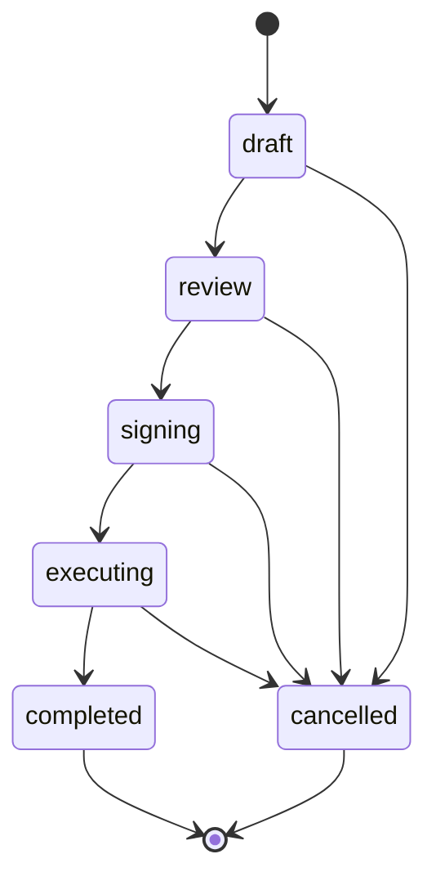
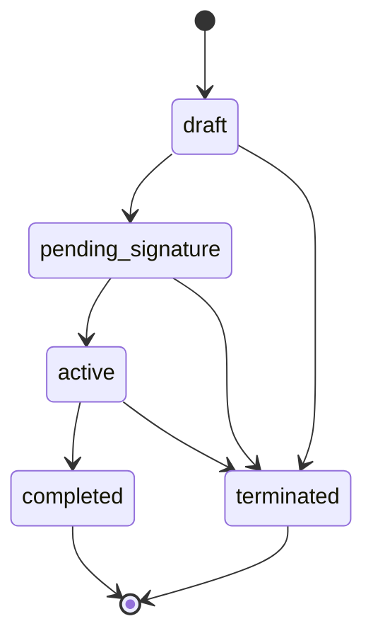

# PM-Twin Architecture, Domain, Lifecycle, Readiness & Technical Debt Assessment

**Audit date:** 23 June 2026  
**Scope:** Full repository (POC, web, packages, docs, BRD)  
**Method:** Read-only code and documentation review; test execution verified  
**Evidence base:** 236+ TypeScript files in `web/`, 47 POC test files (401 tests), 223 web tests, `@pm-twin/lifecycle` manifest, `@pm-twin/commands` contracts, existing audit reports

---

# 1. Executive Summary

## Project purpose

PM-Twin is a **B2B construction collaboration marketplace** for Saudi Arabia and the GCC. It connects project managers, consultants, and companies through **Need/Offer opportunities**, algorithmic **PostMatch** discovery across four exchange models, optional **negotiation**, **deal** execution workspaces, and **contract** legal snapshots. The platform targets eventual SaaS scale (100,000+ concurrent users) with KSA compliance requirements (PDPL, 15% VAT, Arabic RTL, Hijri dates).

## Current maturity level

**Advanced proof-of-concept with emerging target architecture.** The repository is in a deliberate **dual-runtime transition**:

| Runtime | Role | Maturity |
|---------|------|----------|
| `POC/` | Primary working system today (40+ MPA pages, ~1,450-line matching engine) | Feature-rich, client-only |
| `web/` | Target SaaS frontend (React 19, TypeScript, repository + command layers) | Partially wired; strongest on PostMatch → Deal → Contract |
| `packages/lifecycle/` | Canonical state vocabulary (ADR-001) | Source of truth, zero-dep |
| `packages/commands/` | Command DTO contracts (ADR-002) | Types only; execution in `web/` |

There is **no backend server, database, or real API**. All persistence is `localStorage` + static JSON seeds.

## Current implementation status

| Area | Status |
|------|--------|
| Opportunity publishing & matching (4 models) | ✅ POC complete; ✅ web partial |
| PostMatch command write path | ✅ web (Discover/Accept/Decline/Confirm) |
| Negotiation lifecycle | ✅ POC; ⚠️ web (Start only; Agree/Cancel missing) |
| Deal creation from PostMatch | ✅ web command path |
| Contract lifecycle | ✅ web command path (Create/Sign/Complete/Terminate) |
| Application workflow | ✅ POC; ⚠️ web (commands exist, UI partial) |
| Admin governance | ✅ POC; ⚠️ web (routes exist, role guard missing) |
| Authentication | ⚠️ Client-only, Base64 passwords |
| Multi-tenancy / billing / notifications delivery | ❌ Not implemented |

## Major achievements

1. **Rich domain model** documented in `docs/data-model.md` with ER diagrams and entity relationships.
2. **`@pm-twin/lifecycle`** — zero-dependency canonical FSM for 6 entity types with legacy alias maps and validated manifest.
3. **`@pm-twin/commands`** — 26 typed command contracts defining the target write model.
4. **Post-to-post matching engine** supporting one-way, two-way barter, consortium, and circular models in POC.
5. **Web Sprint 1 migration** — repository pattern, API abstraction, command gateway, lifecycle status guards, read models.
6. **401 POC tests + 223 web tests** covering matching, lifecycle, permissions, and command handlers.
7. **Cross-entity sync orchestrator** (Phase 8.1/8.2) for contract → deal → opportunity propagation.

## Major risks

| Risk | Severity |
|------|----------|
| No server-side persistence or auth — all data bypassable via DevTools | Critical |
| Base64 password encoding in both runtimes | Critical |
| Web admin routes accessible to any authenticated user | Critical |
| Dual-runtime drift (POC imperative vs web command paths) | High |
| RBAC advisory-only in web; not enforced at command boundary | High |
| No E2E tests despite Playwright in devDependencies | High |
| Lifecycle FSM not uniformly enforced (deal/negotiation handlers) | Medium |
| `docs/adr/` directory empty — ADRs live only in packages and cursor rules | Medium |

## Scores

| Dimension | Score (/10) | Rationale |
|-----------|:-----------:|-----------|
| **Domain Architecture** | 7.0 | Well-modeled entities, relationships, docs; legacy field proliferation |
| **Lifecycle Architecture** | 6.0 | Canonical registry exists; uneven enforcement across runtimes |
| **Command Architecture** | 5.5 | 20/26 commands wired; negotiation/deal transitions bypassed |
| **UI Architecture** | 4.5 | Modern React SPA; POC still primary; zero component tests |
| **Test Coverage** | 5.5 | 632 tests total; no E2E; lifecycle package under-covered |
| **Backend Readiness** | 1.0 | No PostgreSQL, Prisma, REST API, or JWT |
| **Security Readiness** | 1.5 | Client-only auth, reversible passwords, no CSRF/XSS hardening |
| **SaaS Readiness** | 1.5 | No multi-tenancy, billing, PDPL flows, or VAT in business logic |
| **Production Readiness** | 1.8 | Single-browser execution; no concurrency, email, or file storage |

### Overall score: **38 / 100**

Weighted assessment: strong **domain and business-logic design** offset by **zero production infrastructure** and **incomplete command/lifecycle migration**.

---

# 2. Project Vision

## Need/Offer marketplace model

Users and companies publish **Opportunities** with intent:

| Intent | Meaning | Matching direction |
|--------|---------|-------------------|
| **Need** (`request`) | Seeks resources, partners, or services | Matched against Offers |
| **Offer** | Provides resources, capacity, or expertise | Matched against Needs |
| **Hybrid** | Both directions | Bidirectional one-way matching |

Five collaboration model families (`modelType`): project-based, strategic partnership, resource pooling, hiring, competition — each with sub-models (consortium, barter, JV, RFP, etc.).

## PostMatch concept

When two published opportunities are algorithmically compatible, the system creates a **PostMatch** (`match` in lifecycle registry):

- Links Need ↔ Offer (or multi-party for consortium/circular)
- States: `discovered → accepted → confirmed` (or terminal: declined, expired, superseded)
- All participants must accept before **confirmed** status
- Replaces deprecated person↔opportunity `pmtwin_matches`

## Negotiation

Optional commercial bridge after confirmed PostMatch (or from accepted Application):

- States: `active ↔ countered → agreed` (or expired, cancelled)
- Multi-round counter-offers with commercial terms
- When agreed → eligible for deal creation

## Deal

Execution workspace created from confirmed PostMatch, agreed Negotiation, or accepted Application:

- States: `draft → review → signing → executing → completed`
- Holds milestones, participants, scope, commercial terms, consortium role slots

## Contract

Immutable legal snapshot at deal signing:

- States: `draft → pending_signature → active → completed` (or terminated)
- Captures parties, payment schedule, milestones snapshot

## Lifecycle orchestration

Cross-entity propagation via `LifecycleOrchestrator`:

- Contract activation → deal status sync (Phase 8.1)
- Deal completion → opportunity status sync (Phase 8.2)
- Guards block direct status patches outside CommandGateway/orchestrator

## Complete business flow



---

# 3. Current Domain Model

## Entity audit summary

| Entity | Purpose | Key fields | Relationships | Lifecycle owner | Maturity |
|--------|---------|------------|---------------|-----------------|----------|
| **User** | Platform actor (professional, admin, etc.) | `id`, `email`, `passwordHash`, `role`, `status`, `profile` | 1:N Opportunities, Applications, Notifications | N/A (account status only) | POC complete; web read-only seed |
| **Company** | Organization account (alias of PlatformUser) | Same as User + CR number, classifications | 1:N Opportunities | N/A | POC complete; deprecated alias in web |
| **Opportunity** | Need/Offer/Hybrid listing | `intent`, `modelType`, `status`, `scope`, `normalized` | N creator → N Applications, PostMatches, Deals | `@pm-twin/lifecycle` `opportunity` | Rich POC; web command transitions |
| **Application** | Proposal on an opportunity | `opportunityId`, `applicantId`, `status`, `commercialTerms` | N:1 Opportunity, User; → Deal/Negotiation | `@pm-twin/lifecycle` `application` | POC complete; web commands partial |
| **PostMatch** | Post-to-post match record | `matchType`, `participants[]`, `needOpportunityId`, `offerOpportunityId`, `payload` | N participants; 0:1 Deal, Negotiation | `@pm-twin/lifecycle` `match` | Best-migrated entity in web |
| **Negotiation** | Commercial negotiation rounds | `postMatchId`, `status`, `rounds[]`, `commercialTerms` | 0:1 PostMatch; → Deal | `@pm-twin/lifecycle` `negotiation` | POC complete; web Start only |
| **Deal** | Execution workspace | `postMatchId`, `milestones[]`, `participants[]`, `status` | 0:1 Contract; N Opportunities | `@pm-twin/lifecycle` `deal` | POC + web CreateDeal command |
| **Contract** | Legal snapshot | `dealId`, `milestonesSnapshot`, `status`, `commercialTerms` | N:1 Deal | `@pm-twin/lifecycle` `contract` | Web command path most complete |
| **Notification** | In-app alert | `userId`, `type`, `title`, `entityType`, `entityId` | N:1 User | No lifecycle | Skeleton; no delivery channel |
| **AuditLog** | Compliance trail | `action`, `entityType`, `entityId`, `userId`, `timestamp` | N:1 User | No lifecycle | POC substantive; web append-only |

### Per-entity detail

#### User

- **Storage:** `pmtwin_users` (POC), seed JSON (web)
- **Roles:** professional, consultant, company_owner, admin, moderator, auditor
- **Status:** pending, active, suspended, rejected, clarification_requested
- **Maturity:** Functional for demo; no server-side identity provider

#### Company

- **Storage:** `pmtwin_companies`
- **Profile:** CR number, classifications, financial capacity
- **Note:** Web types mark `Company` as deprecated alias of `PlatformUser`; `Organization` type prepared but unwired

#### Opportunity

- **Canonical states:** draft → published → matched → negotiating → contracted → executing → completed | cancelled
- **Legacy in seeds:** `in_negotiation`, `in_execution`, `closed`
- **Relationships:** creatorId → User/Company; referenced by Application, PostMatch.participants, Deal.opportunityIds

#### Application

- **Canonical states:** submitted → reviewing → shortlisted → negotiating → accepted | rejected | withdrawn
- **Legacy:** `pending`, `in_negotiation`
- **Alternative path to Deal** bypassing PostMatch (hiring flows)

#### PostMatch

- **Match types:** one_way, two_way, consortium, circular
- **Participant roles:** need_owner, offer_provider, consortium_lead, consortium_member, chain_participant
- **Payload variants:** need/offer IDs (one-way), sideA/sideB (two-way), leadNeedId/roles (consortium), cycle/links (circular)

#### Negotiation

- **Links:** `postMatchId` (canonical), `applicationId` (legacy path)
- **Commercial terms:** rounds with proposals; agreed terms frozen on `agreed`

#### Deal

- **Sources:** PostMatch confirmed, Negotiation agreed, Application accepted
- **Consortium:** `roleSlots` map for multi-party execution
- **Legacy states in POC data:** negotiating, active, execution, delivery, closed

#### Contract

- **Created at deal signing** via `CreateContractFromDeal` command
- **Immutable snapshot** of milestones, parties, payment terms at creation time

#### Notification

- **Types:** new_match_found, deal_created, negotiation_started, etc.
- **Delivery:** localStorage only; no email/SMS/push

#### AuditLog

- **POC:** 1000-entry cap, IP enrichment via ipify, login/logout/mutation events
- **Web:** append to `overrides.newAuditEntries`; tamperable client-side

---

# 4. Lifecycle Architecture Audit

## `@pm-twin/lifecycle` review

**Location:** `packages/lifecycle/`  
**Authority:** ADR-001 (`manifest.json`, `schemaVersion: 1`)  
**Build:** esbuild → `dist/index.js` + copy to `POC/vendor/@pm-twin/lifecycle/`

### Canonical states (all entities)

| Entity key | States |
|------------|--------|
| opportunity | draft, published, matched, negotiating, contracted, executing, completed, cancelled |
| application | submitted, reviewing, shortlisted, negotiating, accepted, rejected, withdrawn |
| match | discovered, accepted, confirmed, declined, expired, superseded |
| negotiation | active, countered, agreed, expired, cancelled |
| deal | draft, review, signing, executing, completed, cancelled |
| contract | draft, pending_signature, active, completed, terminated |

### Aliases (legacy → canonical)

| Entity | Aliases |
|--------|---------|
| opportunity | in_negotiation→negotiating, in_execution→executing, closed→completed |
| application | pending→submitted, in_negotiation→negotiating |
| match | pending→discovered |
| negotiation | open→active, counter_offered→countered, failed→cancelled |
| deal | negotiating→draft, active→executing, execution→executing, delivery→executing, closed→completed |
| contract | pending→pending_signature |

### FSM coverage

All 6 entities have complete transition graphs in `transitions.json`. Validation script covers manifest + aliases only — **transitions.json is not validated**.

### Entity coverage

100% of lifecycle-managed aggregates covered. PostMatch maps to entity key **`match`** (not `post_match`).

### Lifecycle diagrams

#### Opportunity



#### Application



#### Match (PostMatch)



#### Negotiation



#### Deal



#### Contract



### Enforcement gaps

| Entity | web handler FSM | POC enforcement |
|--------|----------------|-----------------|
| Opportunity | ✅ `getFsm` | Local helpers + `toCanonical` |
| Application | ✅ `getFsm` | data-service guards |
| PostMatch | ✅ `allowedTransitions` | `post-match-lifecycle.js` |
| Negotiation | ❌ Hand-coded status sets | `negotiation-lifecycle.js` |
| Deal | ❌ No FSM in handler | `deal-lifecycle.js` |
| Contract | ✅ `getFsm` | data-service |

**Extra aliases in `web/src/domain/workflow/legacy-map.ts`** not in package registry create vocabulary drift risk.

---

# 5. Command Architecture Audit

## Package structure

```
packages/commands/     → DTO types only (ADR-002)
web/src/commands/      → Gateway, handlers, idempotency
web/src/services/      → Command services (thin facades)
web/src/lib/*-ui-actions.ts → UI → service → gateway
```

## Command / Handler / Repository / Aggregate matrix

| Command | Handler | Repository | Aggregate ID | Status |
|---------|---------|------------|--------------|--------|
| TransitionOpportunityStatus | OpportunityCommandHandler | opportunity-repository | opportunityId | ✅ Wired |
| SubmitApplication | ApplicationCommandHandler | application-repository | opportunityId | ✅ Wired |
| AcceptApplication | ApplicationCommandHandler | application-repository | applicationId | ✅ Wired |
| RejectApplication | ApplicationCommandHandler | application-repository | applicationId | ✅ Wired |
| TransitionApplicationStatus | ApplicationCommandHandler | application-repository | applicationId | ✅ Wired |
| DiscoverPostMatch | PostMatchCommandHandler | post-match-repository | postMatchId | ✅ Wired |
| AcceptPostMatch | PostMatchCommandHandler | post-match-repository | postMatchId | ✅ Wired |
| DeclinePostMatch | PostMatchCommandHandler | post-match-repository | postMatchId | ✅ Wired |
| ConfirmPostMatch | PostMatchCommandHandler | post-match-repository | postMatchId | ✅ Wired (auto-quorum) |
| ExpirePostMatch | PostMatchCommandHandler | post-match-repository | postMatchId | ✅ Wired (no UI) |
| SupersedePostMatch | PostMatchCommandHandler | post-match-repository | postMatchId | ✅ Wired (no UI) |
| TransitionPostMatchStatus | PostMatchCommandHandler | post-match-repository | postMatchId | ✅ Wired (tests only) |
| StartNegotiationFromPostMatch | NegotiationCommandHandler | negotiation-repository + post-match-repository | postMatchId | ✅ Wired (no UI) |
| StartNegotiation | — | — | — | ❌ Missing handler |
| AgreeNegotiation | — | — | — | ❌ Missing handler |
| CancelNegotiation | — | — | — | ❌ Missing handler |
| TransitionNegotiationStatus | — | — | — | ❌ Missing handler |
| CreateDealFromPostMatch | DealCommandHandler | deal-repository + post-match-repository | postMatchId | ✅ Wired |
| CreateDealFromNegotiation | — | — | — | ❌ Missing handler |
| TransitionDealStatus | — | LifecycleOrchestrator direct writes | — | ⚠️ Bypass |
| CreateContractFromDeal | ContractCommandHandler | contract-repository + deal-repository | dealId | ✅ Wired |
| SignContract | ContractCommandHandler | contract-repository | contractId | ✅ Wired |
| ActivateContract | ContractCommandHandler | contract-repository | contractId | ✅ Wired (auto via Sign) |
| CompleteContract | ContractCommandHandler | contract-repository | contractId | ✅ Wired |
| TerminateContract | ContractCommandHandler | contract-repository | contractId | ✅ Wired |
| TransitionContractStatus | — | — | — | ❌ Missing handler |

**Totals:** 26 contracts, 20 gateway-routed, 6 without handlers.

## Missing commands

- Negotiation agree/cancel/transition (POC has imperative methods only)
- Deal from negotiation (contract exists, no handler)
- Generic transition commands for deal/negotiation/contract

## Dead / unwired commands

- `ConfirmPostMatch`, `ExpirePostMatch`, `SupersedePostMatch` — handler complete, no production UI callers
- `StartNegotiationFromPostMatch` — handler complete, zero page imports
- `ActivateContract` — redundant with SignContract auto-activation
- `WebCommandAdapter` interface — never implemented
- `PocCommandAdapter` — returns "not implemented"

## Unused contracts

- `CommandContext`, `CommandMetadata` exported but never passed to handlers
- `CommandGateway.execute` is sync; interface suggests async

---

# 6. PostMatch Transformation Audit

## Evolution

### Legacy: Application-driven matching

- Person ↔ Opportunity matches in deprecated `pmtwin_matches`
- `LEGACY_PERSON_OPPORTUNITY_ENABLED = false` — no longer loaded
- Application accept → direct deal creation (hiring path retained)

### Current: Need Opportunity + Offer Opportunity → PostMatch

```
Need Opportunity (intent=request)  ──┐
                                     ├── Matching Engine ──→ PostMatch (discovered)
Offer Opportunity (intent=offer)  ──┘
```

### Match types

| Type | Description | Implementation |
|------|-------------|----------------|
| **One-way** | Single Need matched to single Offer | ✅ POC + web |
| **Two-way (Barter)** | Mutual exchange (sideA ↔ sideB) | ✅ POC + web |
| **Consortium** | Multi-party with lead need + member roles | ✅ POC; replacement flow |
| **Circular** | Chain of opportunities forming closed loop | ✅ POC; hydration tests |

### Current implementation status

| Capability | POC | web |
|------------|-----|-----|
| Discover on publish/admin save | ✅ `persistPostMatches()` | ✅ `DiscoverPostMatch` command |
| Accept/Decline with quorum | ✅ data-service | ✅ AcceptPostMatch → auto ConfirmPostMatch |
| Expire/Supersede | ✅ TTL + replacement | ✅ Handlers; no scheduler |
| Read normalization | ✅ `normalizePostMatchForRead()` | ✅ `domain/normalized/adapters.ts` |
| Command adapter bridge | ❌ Stub | N/A |
| Start negotiation | ✅ imperative | ✅ handler; ❌ UI |
| Create deal | ✅ imperative | ✅ command path |

---

# 7. Repository & Data Layer Audit

## Architecture

```
UI → api/* → services | repositories → LocalStorageAdapter → seed JSON + pmtwin_web_overrides
                              ↓
                    domain/normalized/ (read-only shadow)
```

## Ownership boundaries

| Layer | Authority | Can mutate lifecycle status? |
|-------|-----------|------------------------------|
| Repositories | Seed merge + localStorage patches | ❌ Blocked by lifecycle-status-guard |
| Command handlers | Via gateway only | ✅ |
| LifecycleOrchestrator | Cross-entity sync | ✅ (orchestrated paths only) |
| POC data-service.js | Legacy sole mutation surface | ✅ (unrestricted) |

## Read models

- `deal-detail-read-model.ts`, `contract-detail-read-model.ts` — enriched views for detail pages
- `domain/normalized/` — canonical field mapping, health scans, relationship resolution
- `pipeline-*-drop.ts` — kanban bucketing for pipeline UI

## Write models

- Command handlers write canonical status names directly
- Repositories: `create()` appends to `overrides.new{Entity}[]`; `update()` patches seed rows

## Technical debt

| ID | Item | Impact |
|----|------|--------|
| R1 | Dual persistence (POC keys vs `pmtwin_web_overrides`) | Data divergence between runtimes |
| R2 | `audit-repository.ts` wrong `entityKey: 'applications'` | Confusing; works by accident |
| R3 | Normalized layer not on write path | Read/write shape drift possible |
| R4 | User/company repositories read-only | No registration command path in web |
| R5 | No transaction boundaries | Partial writes possible on multi-repo commands |
| R6 | 1000-entry audit cap (POC) | Compliance data loss |

---

# 8. UI Architecture Audit

## `web/` evaluation

### Routing

- **React Router v7** with public marketing/auth routes and authenticated portal shell
- 48 component files; ~236 total TS/TSX files in `web/src/`
- Admin routes under `/admin/*` — **no role-based route guard** (only `ProtectedRoute` for auth)

### State management

- React Context: `AuthProvider`, `ThemeProvider`, `CommandMenuProvider`
- No Redux/Zustand — repositories + localStorage as implicit global state
- `notifyDataStore()` event for cross-component refresh

### Component structure

```
components/
  auth/          protected-route.tsx
  layout/        app-shell, sidebar, header, command-menu
  ui/            shadcn primitives (button, dialog, table, etc.)
  opportunity/   apply-wizard, applications-panel
  pipeline/      pipeline-board
  negotiation/   create-deal-button
  deal/          create-contract-button
  contract/      sign/complete/terminate buttons
  shared/        StatusBadge, page-primitives
pages/
  public/        marketing, auth
  workspace/     opportunities, pipeline, matches, deals, contracts
  admin/         20+ admin pages
```

### Read model usage

- Detail pages use read models for enriched display
- Pipeline uses drop helpers for lifecycle-aware bucketing
- `StatusBadge` uses `toCanonical` from lifecycle package

### Lifecycle-aware UI

- Command-driven buttons for deal/contract creation
- PostMatch accept/decline via `post-match-ui-actions.ts`
- Status badges lifecycle-normalized
- **Gap:** Negotiation UI not wired to command services

### Strengths

- Clean layered architecture post-Sprint 1 migration
- shadcn/ui component library with consistent design tokens
- Command menu (⌘K) for navigation
- Lifecycle status guards prevent bypass from API layer
- TypeScript strict mode with canonical domain types

### Weaknesses

- **Zero component tests** (48 components untested; contradicts cursor rules)
- Admin accessible without role check
- POC remains the richer, more complete UI for many flows
- No i18n/RTL despite KSA requirement
- `lang="en"` only in `index.html`
- Messages feature is placeholder
- No loading/error boundary patterns consistently applied

---

# 9. Test Coverage Audit

## Test inventory (executed 23 June 2026)

| Area | Files | Tests | Runner |
|------|------:|------:|--------|
| POC/tests/ | 47 | **401** | Vitest |
| web/src/ | 23 | **223** | Node test runner |
| packages/lifecycle/ | 1 | **8** | node --test |
| packages/commands/ | 2 | type fixtures | tsc --noEmit |
| **Total** | **~73** | **~632** | |

## Areas covered

- PostMatch discovery, accept, decline, confirm, quorum logic
- Negotiation lifecycle (POC), deal lifecycle, replacement, dispute
- Matching algorithm constraints, hard constraints, circular/barter hydration
- Command handlers (all 6 entity handlers in web)
- UI action orchestration (deal, contract, post-match)
- Lifecycle orchestrator cross-entity sync
- Permission matrix (POC admin capabilities)
- Auth input validation (not auth service itself)
- Domain alignment and normalization
- Admin command centers (matching, negotiation, dispute)

## Areas NOT covered

| Gap | Risk |
|-----|------|
| Authentication service (login, session, password reset) | Critical |
| Web admin route authorization | Critical |
| RBAC policy enforcement | High |
| ~48 React components | High |
| `web/src/api/*` modules | High |
| E2E browser flows | High |
| Contract lifecycle (POC) | Medium |
| Registration/vetting/messages | Medium |
| packages/lifecycle full branch coverage | Medium |
| Idempotency store | Low |

## Integration / E2E

| Type | Present? |
|------|----------|
| POC integration | ✅ `data-service-matching-lifecycle.integration.test.js` |
| Web integration | ✅ `read-model-orchestration-sync.test.ts` |
| Matching simulation | ✅ `simulation/matching-simulation.test.js` |
| Playwright E2E | ❌ DevDependency only; no config or specs |
| E2E seed script | ✅ `seed-e2e-workflow.js` (data only) |

---

# 10. Security Audit

## Authentication

| Finding | Runtime | Severity |
|---------|---------|----------|
| Base64 password encoding (`btoa`) | Both | **Critical** |
| Client-only session (localStorage) | Both | **Critical** |
| Predictable tokens (`Date.now()` + `Math.random()`) | Both | **High** |
| Hardcoded demo credentials in source | web | **High** |
| Password reset token returned to client | POC | **High** |
| No server session validation | Both | **Critical** |

## Authorization

| Finding | Runtime | Severity |
|---------|---------|----------|
| Web admin routes: auth only, no role guard | web | **Critical** |
| RBAC policy engine advisory-only | web | **High** |
| POC admin guard on `/admin` routes | POC | Medium (client-side only) |
| Auditor role mapped to `user` in web RBAC | web | Medium |
| Data-layer mutation guards | POC | Medium (bypassable) |

## Storage

| Finding | Severity |
|---------|----------|
| All data mutable via DevTools | **Critical** |
| Seed files contain reversible password hashes | **High** |
| No encryption at rest | **High** |
| Audit logs client-side, 1000-entry cap | Medium |

## Passwords

- Stored as Base64 in JSON seeds (`UG10d2luQDIwMjY=` = `Pmtwin@2026`)
- No bcrypt/argon2/scrypt anywhere in codebase

## Audit logging

- POC: substantive `createAuditLog()` on mutations
- Web: append-only via command handlers; tamperable
- No immutable server-side trail

## Risk summary

| Severity | Count | Examples |
|----------|------:|---------|
| Critical | 4 | No server auth, reversible passwords, admin bypass, DevTools tampering |
| High | 5 | Hardcoded creds, predictable tokens, RBAC not enforced, no CSRF/XSS hardening |
| Medium | 4 | Audit cap, auditor mapping, client IP in audit, Playwright without E2E |
| Low | 1 | Pending user read-only login by design |

---

# 11. SaaS Readiness Audit

| Dimension | Score (/10) | Evidence |
|-----------|:-----------:|----------|
| Multi-tenancy | 0.5 | `tenantId?` optional on types; `Organization` type unwired |
| Tenant isolation | 0 | Single global localStorage namespace |
| Subscription readiness | 1 | POC admin UI stub; no payment processor |
| Billing readiness | 0 | No Stripe, no VAT calculation in business logic |
| Audit readiness | 2 | Client-side logs only; no retention policy |
| Compliance readiness | 0.5 | PDPL mentioned in rules; no consent/export flows |
| Arabic/RTL | 1 | CSS classes exist; no i18n layer |
| Scalability | 0 | Single-browser execution |

### SaaS Readiness Score: **14 / 100**

(Consistent with prior `AUDIT_REPORT.md` score of 8/100; slight increase reflects web repository prep and optional tenant fields.)

---

# 12. Backend Readiness Audit

| Capability | Status | Evidence |
|------------|--------|----------|
| PostgreSQL | **Missing** | `docs/database-schema.md` is future-design only |
| Prisma | **Missing** | No schema, no ORM |
| REST API | **Missing** | `web/src/api/*` reads repositories directly |
| JWT | **Missing** | Client tokens only |
| Refresh Tokens | **Missing** | No token rotation |
| RBAC (server) | **Missing** | Client advisory policies only |
| Background jobs | **Missing** | Matching runs synchronously in browser |
| Notifications (delivery) | **Missing** | localStorage only; no SendGrid/Twilio |
| File storage (S3) | **Missing** | Referenced but not implemented |
| WebSocket (real-time) | **Missing** | No negotiation sync |
| Redis/caching | **Missing** | — |
| CI/CD pipeline | **Partial** | Tests runnable; no deployment config found |

### Backend Readiness Score: **10 / 100**

---

# 13. Production Gap Analysis

## Current vs target

| Dimension | Current | Target (AUDIT_REPORT Phase 0–3) |
|-----------|---------|--------------------------------|
| Persistence | localStorage | PostgreSQL + Redis |
| Auth | btoa + client session | JWT + refresh + HttpOnly cookies |
| API | Direct repository reads | Fastify REST + OpenAPI |
| Matching | Browser sync | BullMQ worker + background jobs |
| Notifications | In-app only | SendGrid + push + SMS |
| Multi-tenancy | None | Row-level tenant isolation |
| File uploads | None | S3 + virus scan |
| E-signatures | None | DocuSign integration |
| Billing | UI stub | Stripe + ZATCA Fatoorah |
| Observability | console.warn | PostHog + structured logging |
| Data residency | None | KSA region hosting |

## Gaps ranked

### Critical

1. No backend server or database
2. No real authentication or authorization
3. No cross-user data sharing (single-browser isolation)
4. Passwords reversibly encoded

### High

5. No email/notification delivery
6. No file storage for contracts/deliverables
7. Dual-runtime command drift
8. Web admin routes unguarded
9. No E2E test suite
10. Negotiation agree/cancel not migrated to web commands

### Medium

11. Lifecycle FSM not enforced on deal/negotiation handlers
12. No VAT calculation in financial fields
13. No PDPL consent/retention flows
14. No Arabic i18n/RTL
15. ADR documents not committed to `docs/adr/`
16. packages/lifecycle below required test coverage

### Low

17. `WebCommandAdapter` / `PocCommandAdapter` stubs
18. Audit log entry cap
19. Duplicate alias maps in web legacy-map.ts
20. Company type deprecated but still in seeds

---

# 14. Technical Debt Register

Sorted by severity (Critical → Low):

| ID | Description | Risk | Impact | Priority |
|----|-------------|------|--------|----------|
| TD-001 | No backend; all logic client-side | Critical | Cannot serve multiple users | P0 |
| TD-002 | Base64 password encoding | Critical | Credential compromise | P0 |
| TD-003 | Web admin routes lack role guard | Critical | Privilege escalation | P0 |
| TD-004 | Dual runtime (POC + web) with divergent write paths | High | Regression, data inconsistency | P0 |
| TD-005 | 6 command contracts without handlers | High | Incomplete lifecycle migration | P1 |
| TD-006 | RBAC advisory-only in web | High | Unauthorized mutations if enforced later | P1 |
| TD-007 | Negotiation UI not wired to command services | High | Broken user journey in web | P1 |
| TD-008 | No E2E test suite | High | Regression undetected | P1 |
| TD-009 | Deal/negotiation handlers skip FSM | Medium | Invalid state transitions possible | P2 |
| TD-010 | Extra aliases in web/legacy-map.ts not in lifecycle package | Medium | Vocabulary drift | P2 |
| TD-011 | Normalized layer read-only; not on write path | Medium | Shape inconsistency | P2 |
| TD-012 | audit-repository wrong entityKey | Low | Maintenance confusion | P3 |
| TD-013 | PocCommandAdapter stub | Low | Migration blocker | P2 |
| TD-014 | packages/lifecycle 8 tests vs 100% branch rule | Medium | Registry regression risk | P2 |
| TD-015 | Zero web component tests | Medium | UI regression risk | P2 |
| TD-016 | Hardcoded DEMO_CREDENTIALS in source | High | Security exposure in repo | P1 |
| TD-017 | No VAT in financial calculations | Medium | KSA compliance gap | P2 |
| TD-018 | docs/adr/ empty | Low | Architecture governance gap | P3 |
| TD-019 | Company deprecated alias still in use | Low | Type confusion | P3 |
| TD-020 | Audit log 1000-entry cap (POC) | Medium | Compliance data loss | P2 |

---

# 15. Lifecycle Ownership Certification

Classification key: **[COMMAND]** = command handler owns transitions | **[ORCHESTRATOR]** = cross-entity sync | **[GUARDED]** = lifecycle helpers + guards | **[LEGACY]** = imperative data-service | **[BYPASS]** = direct repo/orchestrator writes | **[DEAD CODE]** = unused paths

| Entity | web | POC | Primary classification | Notes |
|--------|-----|-----|----------------------|-------|
| **Opportunity** | TransitionOpportunityStatus command + orchestrator sync | data-service imperative | web: **[COMMAND]** + **[ORCHESTRATOR]**; POC: **[LEGACY]** | FSM enforced in web handler |
| **Application** | Full command set (Submit/Accept/Reject/Transition) | data-service | web: **[COMMAND]**; POC: **[LEGACY]** | Both functional |
| **PostMatch** | Full command set (Discover→Supersede) | post-match-lifecycle.js + data-service | web: **[COMMAND]**; POC: **[GUARDED]** | Best-migrated entity |
| **Negotiation** | StartNegotiationFromPostMatch only | Full lifecycle in data-service | web: **[COMMAND]** partial; POC: **[LEGACY]** | Agree/Cancel missing in web |
| **Deal** | CreateDealFromPostMatch | createDealFromMatch imperative | web: **[COMMAND]** create; **[BYPASS]** status via orchestrator; POC: **[LEGACY]** | No TransitionDealStatus handler |
| **Contract** | Create/Sign/Complete/Terminate commands | data-service | web: **[COMMAND]**; POC: **[LEGACY]** | Most complete web vertical slice |

### Dead / bypass paths

- `TransitionDealStatus`, `TransitionNegotiationStatus`, `TransitionContractStatus` — contracts exist, no handlers **[DEAD CODE]**
- `CreateDealFromNegotiation` — contract only **[DEAD CODE]**
- `PocCommandAdapter` — always fails **[DEAD CODE]**
- POC `pmtwin_matches` — deprecated, not loaded **[DEAD CODE]**

### Lifecycle Ownership Score: **47 / 100**

Rationale: PostMatch and Contract nearing full command ownership in web; Opportunity and Application partially migrated; Negotiation and Deal still predominantly legacy in POC with bypass paths in web.

---

# 16. Phase History

> The repository uses **multiple parallel phase numbering schemes**. Below is a consolidated narrative.

| Phase | Context | What changed |
|-------|---------|--------------|
| **Phase 0** | Production roadmap (`AUDIT_REPORT.md`) | Defined target: Node/Fastify + PostgreSQL + JWT + BullMQ. **Not started.** |
| **Phase 1 (Business)** | BRD rollout | Production baseline scope: onboarding, core flow, admin governance |
| **Phase 1–7 (Web Sprint)** | Repository refactor (`MIGRATION-REPORT.md`) | Types → storage adapters → 10 repos → 5 services → API layer → data-store facade → component integration → cleanup |
| **Phases A–G** | Domain hardening | Relationship integrity, vocabulary normalization, commercial terms, type enums, Organization prep |
| **Phase 4** | POC lifecycle alignment | Opportunity invitations, admin disputes, PostMatch ADR-002 discover command path |
| **Phase 5** | Negotiation | Negotiation lifecycle, transcripts, StartNegotiationFromPostMatch |
| **Phase 6** | Replacement + Deal | Replacement lifecycle, CreateDealFromPostMatch |
| **Phase 7** | Deal helpers | Deal lifecycle helpers, deal payload from application |
| **Phase 8** | Admin + sync | Admin Matching Command Center; contract→deal sync (8.1); deal→opportunity sync (8.2) |

**Phase 8** appears primarily in code comments and tests, not in top-level program documentation.

---

# 17. Recommended Roadmap

## Phase 8.6 — Complete web lifecycle migration

| | |
|---|---|
| **Goal** | Close command handler gaps; wire negotiation UI |
| **Deliverables** | AgreeNegotiation/CancelNegotiation handlers; StartNegotiationFromPostMatch UI wiring; TransitionDealStatus handler; FSM enforcement on deal/negotiation handlers |
| **Risk** | Medium — regression in POC parity |
| **Dependencies** | Phase 8 sync rules stable |

## Phase 9A — Security hardening (web)

| | |
|---|---|
| **Goal** | Enforce authorization before backend exists |
| **Deliverables** | AdminRouteGuard with role check; RBAC enforcement in command handlers; remove hardcoded credentials; auth-service unit tests |
| **Risk** | Low |
| **Dependencies** | None |

## Phase 9B — Backend foundation (Phase 0 execution)

| | |
|---|---|
| **Goal** | Real multi-user persistence |
| **Deliverables** | Fastify/Express API; PostgreSQL + Prisma schema mirroring domain types; JWT auth with refresh tokens; port matching engine to worker |
| **Risk** | High — largest scope item |
| **Dependencies** | Command contracts stable; lifecycle registry imported server-side |

## Phase 9C — POC deprecation boundary

| | |
|---|---|
| **Goal** | Freeze POC writes; web becomes sole mutation surface |
| **Deliverables** | Implement PocCommandAdapter delegating to shared command logic OR retire POC pages incrementally; single data source |
| **Risk** | High — feature parity required first |
| **Dependencies** | Phase 8.6, 9B |

## Phase 9D — Test & quality gate

| | |
|---|---|
| **Goal** | Production-quality test pyramid |
| **Deliverables** | Playwright E2E smoke suite; web component tests; lifecycle 100% branch coverage; CI pipeline (lint → type-check → test → build) |
| **Risk** | Medium |
| **Dependencies** | Web UI wiring complete |

## Phase 10 — SaaS production launch

| | |
|---|---|
| **Goal** | Limited production pilot in KSA |
| **Deliverables** | Multi-tenancy with row-level isolation; SendGrid notifications; S3 file storage; PDPL consent flows; VAT in financial fields; Arabic RTL; ZATCA readiness assessment; KSA data residency |
| **Risk** | High — compliance and scale |
| **Dependencies** | Phase 9B backend, 9A security, 9D tests |

---

# 18. Final Verdict

## Summary scores

| Metric | Score |
|--------|------:|
| **Current project maturity** | Advanced POC / Early Alpha |
| **Production readiness** | **18 / 100** |
| **SaaS readiness** | **14 / 100** |
| **Lifecycle ownership** | **47 / 100** |
| **Backend readiness** | **10 / 100** |
| **Overall architecture health** | **38 / 100** |

## Final decision

## **LIMITED PILOT READY**

*(Not production ready; suitable for controlled internal/demo pilot only)*

### Justification

**Why not PRODUCTION READY:**

- No server, database, or real authentication
- Passwords are reversibly encoded; sessions are client-side only
- Data exists only in one browser's localStorage — no multi-user isolation
- Web admin routes accessible without role enforcement
- No notification delivery, file storage, payment processing, or e-signatures
- No PDPL compliance flows, VAT calculation, or production-grade audit trail

**Why not NOT READY FOR PRODUCTION (absolute):**

- The POC demonstrates a **complete business workflow** end-to-end in a controlled environment
- 401 POC tests + 223 web tests provide confidence in business logic correctness
- Domain model, lifecycle registry, and command contracts are **well-designed foundations** for backend implementation
- PostMatch → Deal → Contract vertical slice in web proves the target architecture works
- Admin governance, matching command center, and audit logging exist for demo/training scenarios

**Recommended use today:**

- Internal stakeholder demos and training (with seeded accounts)
- Architecture validation and backend schema design
- UX prototyping via web SPA
- Algorithm tuning via matching simulation tests

**Minimum path to production pilot (estimated):** Execute Phases 9A → 9B → 8.6 → 9D → 10 (backend + security + lifecycle completion + E2E + SaaS features). Prior audit (`AUDIT_REPORT.md`) estimated Phase 0 alone at 6 weeks for two cross-device users to register and match.

---

*Report generated from read-only repository audit. No files were modified during audit. All findings are evidence-based from code, tests, and documentation reviewed 23 June 2026.*
