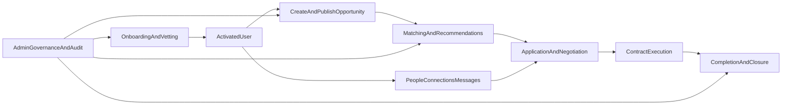

# Business Requirements Document (BRD)

**Last updated:** 2025-03-07

## 1. Executive Summary

PMTwin is a collaboration platform for construction and related industries that connects companies, professionals, and consultants across opportunity creation, intelligent matching, application management, contracting, and execution governance.  
This BRD defines business objectives, scope, requirements, and acceptance criteria for a production-ready baseline aligned with current platform modules and workflows.

## 2. Business Objectives

1. Enable structured collaboration opportunities across multiple models (project-based, strategic, resource pooling, hiring, competition).
2. Improve collaboration velocity through reliable matching and actionable recommendations.
3. Provide governed lifecycle management from onboarding to closure with auditability.
4. Support operational control for administrators through vetting, monitoring, and configuration.
5. Deliver measurable business outcomes in activation, conversion, and completion.

## 3. Scope

### 3.1 In Scope
- User onboarding, authentication, and profile lifecycle.
- Opportunity lifecycle from draft/publish through completion/closure.
- Matching (person-to-opportunity and post-to-post model variants).
- Applications, negotiation, contracts, and execution tracking.
- People discovery, connections, messaging, and notifications.
- Admin portal operations: users, vetting, opportunities, audit, reports, matching, settings, skills, subscriptions, collaboration models.

### 3.2 Out of Scope (Current Phase)
- Payment gateway processing and settlement automation.
- Legally binding digital signature infrastructure.
- Full dispute resolution automation.
- External compliance integrations and third-party KYC providers.

## 4. Stakeholders

| Stakeholder | Interest |
|---|---|
| Product Owner | Business value, adoption, roadmap alignment |
| Platform Admin Team | Governance, control, compliance visibility |
| Company Users | Opportunity publishing, partner discovery, contract outcomes |
| Professionals/Consultants | Opportunity discovery, application success, reputation growth |
| Engineering Team | Stable implementation of workflows and quality gates |
| Operations/Support | Incident handling, data quality, user support readiness |

## 5. Current State and Constraints

- Core role model and route map are implemented via configuration constants.
- Lifecycle states for user, opportunity, application, and contract are defined and used by features/services.
- Matching supports multiple model routes and weighted scoring thresholds.
- Data quality and canonical normalization directly affect match quality and trust.
- Some enterprise-grade capabilities remain roadmap items (payments, signatures, advanced dispute management).

## 6. Business Process Overview

## 7. Functional Requirements

### 7.1 Authentication, Registration, and Vetting

- FR-1: The system shall support registration for defined account types and set initial status to `pending`.
- FR-2: The system shall support login, session lifecycle management, and protected-route access controls.
- FR-3: The system shall support admin vetting actions: approve, reject, clarification requested.
- FR-4: The system shall notify users of vetting outcomes and persist audit records for admin actions.

### 7.2 Opportunity Management

- FR-5: The system shall provide a multi-step opportunity creation flow covering basic info, intent, scope, model/sub-model, and exchange terms.
- FR-6: The system shall support opportunity statuses: `draft`, `published`, `in_negotiation`, `contracted`, `in_execution`, `completed`, `closed`, `cancelled`.
- FR-7: The system shall enforce validation rules based on selected model/sub-model and exchange mode.
- FR-8: The system shall allow authorized edit/update flows and preserve activity traceability.

### 7.3 Matching and Recommendations

- FR-9: The system shall execute person-to-opportunity matching using normalized criteria and scoring.
- FR-10: The system shall execute post-to-post matching across one-way, two-way barter, consortium, and circular models.
- FR-11: The system shall apply configurable thresholds for minimum inclusion and auto-notification.
- FR-12: The system shall store match results with score and criteria/breakdown metadata.

### 7.4 Applications, Negotiation, and Contracts

- FR-13: The system shall allow eligible users to apply to published opportunities.
- FR-14: The system shall support application statuses: `pending`, `reviewing`, `shortlisted`, `in_negotiation`, `accepted`, `rejected`, `withdrawn`.
- FR-15: The system shall support acceptance-driven contract creation and contract lifecycle statuses: `pending`, `active`, `completed`, `terminated`.
- FR-16: The system shall align opportunity status transitions with application/contract outcomes.

### 7.5 People, Connections, Messaging, and Notifications

- FR-17: The system shall support discovery of people and companies with profile access.
- FR-18: The system shall support connection requests and statuses (`pending`, `accepted`, `rejected`).
- FR-19: The system shall support thread messaging between connected users.
- FR-20: The system shall support in-app notifications for key events with read/unread management and deep links.

### 7.6 Admin Governance

- FR-21: The system shall provide admin dashboards and operational modules for users, vetting, opportunities, matching, reports, audit, settings, skills, subscriptions, and collaboration model management.
- FR-22: The system shall enforce role-based permissions for admin, moderator, and auditor.
- FR-23: The system shall log critical admin actions in the audit trail.
- FR-24: The system shall provide filtering and reporting views to support governance decisions.

## 8. Non-Functional Requirements

### 8.1 Performance
- NFR-1: Core route navigation shall be responsive for normal operational loads.
- NFR-2: Matching operations shall complete within acceptable user-facing latency for practical dataset sizes.

### 8.2 Reliability and Availability
- NFR-3: Core flows (auth, opportunities, applications, contracts) shall remain stable without data loss in normal usage.
- NFR-4: Data persistence and retrieval shall preserve integrity across reloads and sessions.

### 8.3 Security and Access Control
- NFR-5: Protected routes shall require valid session and role authorization.
- NFR-6: Sensitive admin operations shall be restricted by role.
- NFR-7: Production deployment shall avoid demo/default credentials and enforce secure credential policies.

### 8.4 Usability
- NFR-8: Workflow steps shall provide validation feedback and clear recoverable error states.
- NFR-9: Users shall be able to complete primary workflows with minimal training.

### 8.5 Maintainability and Auditability
- NFR-10: Business rules and status constants shall remain centralized and version-controlled.
- NFR-11: Audit logs shall support forensic review of governance-critical actions.

## 9. Business Rules and Lifecycle Policies

### 9.1 User Status Rules
- Accounts begin in `pending`.
- Only approved (`active`) accounts can fully operate protected workflows.

### 9.2 Opportunity Rules
- `draft` opportunities are private/non-participatory.
- `published` opportunities are discoverable and eligible for matching/application.
- Cancellation is allowed only in eligible pre-execution phases.

### 9.3 Matching Rules
- Minimum threshold governs inclusion in recommendations.
- Higher threshold governs automatic candidate notification.
- Model selection logic routes post-to-post matching by explicit options and opportunity properties.

### 9.4 Contracting Rules
- Contract initiation follows accepted application outcomes.
- Contract completion or termination affects opportunity closeout progression.

## 10. Data and Reporting Requirements

- DR-1: The platform shall store complete records for users, companies, opportunities, applications, matches, contracts, messages, notifications, and audit events.
- DR-2: Reports shall support operational visibility for matching quality, readiness, and governance.
- DR-3: Admin views shall support filtering by status, type, and time windows.
- DR-4: Data quality checks shall be part of release readiness to protect matching accuracy.

## 11. KPIs and Success Metrics

| KPI | Definition | Target Direction |
|---|---|---|
| Activation Rate | % of pending accounts approved and active | Increase |
| Publish-to-Application Rate | % of published opportunities receiving applications | Increase |
| Match Conversion | % of recommended matches leading to application/connection | Increase |
| Contract Conversion | % of negotiated opportunities resulting in active contract | Increase |
| Completion Rate | % of active contracts that complete successfully | Increase |
| Admin SLA | Time to vetting decision and critical moderation actions | Decrease |

## 12. Assumptions and Dependencies

### Assumptions
- Core route, status, and matching constants remain the source of truth.
- Admin teams are available to operate vetting and governance loops.
- Users provide enough profile/scope quality for meaningful matching.

### Dependencies
- Matching quality depends on normalized and complete opportunity/profile attributes.
- Governance quality depends on reliable audit logging and role enforcement.
- Production hardening depends on credential/security policies and environment controls.

## 13. Risks and Mitigations

| Risk | Impact | Mitigation |
|---|---|---|
| Incomplete profile/opportunity data | Lower match precision and trust | Enforce stronger validations and guided completion UX |
| Misconfigured thresholds | Over/under-notification and weak recommendations | Controlled admin settings with monitored KPIs |
| Weak credential policies | Security exposure | Mandatory secure credentials and policy enforcement before go-live |
| Governance bottlenecks | Slower onboarding and moderation | Operational SLAs, workload visibility, role delegation |
| Missing advanced contract/payment controls | Process friction in later phases | Phase roadmap with explicit boundaries and handoff procedures |

## 14. Acceptance Criteria

1. All primary workflows are documented, testable, and traceable to modules/routes.
2. Lifecycle transitions for user, opportunity, application, and contract are consistently enforced.
3. Matching produces ranked outputs with configured threshold behavior and notification triggers.
4. Admin governance modules support vetting, monitoring, audit review, and settings control.
5. Production baseline excludes demo dependency for credentials and follows secure operational policy.

## 15. Phased Rollout Recommendation

### Phase 1 -- Production Baseline
- Secure onboarding/login policies.
- Opportunity, matching, application, and contract core flow stabilization.
- Admin governance and audit readiness.

### Phase 2 -- Operational Maturity
- Enhanced reporting and KPI dashboards.
- Improved data quality automation and rule checks.
- UX improvements for workflow conversion.

### Phase 3 -- Advanced Commercial Features
- Payment integration, digital signatures, and advanced dispute handling.
- Extended compliance and ecosystem integrations.

## 16. Traceability Map (Requirements to Modules)

| Requirement Group | Primary Modules/References |
|---|---|
| Auth and vetting | `POC/features/register`, `POC/features/login`, `POC/features/admin-vetting`, `POC/src/core/router/auth-guard.js` |
| Opportunity lifecycle | `POC/features/opportunity-create`, `POC/features/opportunity-detail`, `POC/features/opportunity-edit`, `POC/src/services/opportunities/opportunity-service.js` |
| Matching | `POC/src/services/matching/matching-service.js`, `POC/src/services/matching/matching-models.js`, `POC/src/services/matching/post-preprocessor.js`, `POC/features/admin-matching` |
| Applications/contracts | `POC/features/pipeline`, `POC/features/contracts`, `POC/features/contract-detail`, `POC/src/core/data/data-service.js` |
| Network and notifications | `POC/features/people`, `POC/features/person-profile`, `POC/features/messages`, `POC/features/notifications` |
| Admin governance | `POC/features/admin-dashboard`, `POC/features/admin-users`, `POC/features/admin-opportunities`, `POC/features/admin-audit`, `POC/features/admin-reports`, `POC/features/admin-settings`, `POC/features/admin-skills`, `POC/features/admin-subscriptions`, `POC/features/admin-collaboration-models` |
