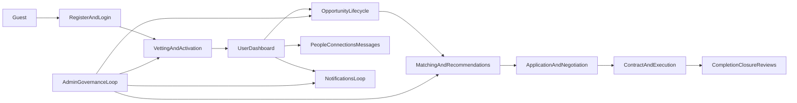
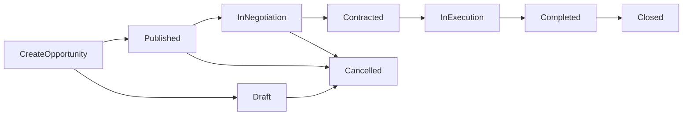
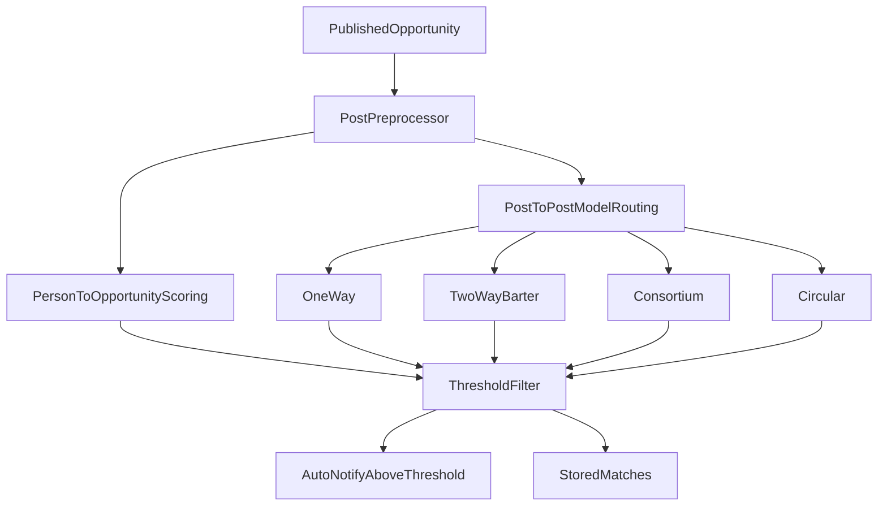

# Full Workflows

**Last updated:** 2025-03-07

## Overview

This document defines the end-to-end PMTwin workflows across all user and admin modules. It is business-readable and implementation-aware, with route and service references to support delivery, QA, and operations.

## Actors

| Actor | Description |
|---|---|
| Guest | Unauthenticated visitor using home, find, and auth entry points. |
| Professional / Consultant | Individual user who creates or applies to opportunities and participates in matching/contracts. |
| Company User | Company-side actor who publishes opportunities and manages applications/contracts. |
| Admin | Platform governance actor managing users, vetting, settings, and monitoring workflows. |
| Moderator | Admin-side actor focused on operational content/user management. |
| Auditor | Admin-side actor focused on visibility and audit/reporting. |
| System | Routing, validation, persistence, matching, notifications, and audit logging services. |

## Core Workflow Map

## Workflow 1 -- Registration, Vetting, and Activation

**Trigger**  
User creates a new account through registration.

**Preconditions**
- User is not authenticated.
- Route access available: `/register`, `/login`.

**Steps**
1. User submits registration form by role type.
2. System creates account with status `pending`.
3. Admin sees the account in vetting queue.
4. Admin action is one of: approve, reject, clarification requested.
5. System updates user status and creates notification/audit record.
6. Approved users log in and access protected routes.

**State changes**
- `pending` -> `active`
- `pending` -> `rejected`
- `pending` -> `clarification_requested`

**Exceptions**
- Duplicate email -> registration rejected.
- Non-active status -> login blocked/restricted by guard/business logic.

**Outputs**
- Account state, notifications, audit entries.

**Implementation references**
- `POC/src/core/config/config.js`
- `POC/src/core/router/auth-guard.js`
- `POC/features/register/register.js`
- `POC/features/login/login.js`
- `POC/features/admin-vetting/admin-vetting.js`

## Workflow 2 -- Opportunity Lifecycle (Draft to Closure)

**Trigger**  
Authenticated user starts new opportunity via create flow.

**Preconditions**
- Authenticated user.
- Access to `/opportunities/create`.

**Steps**
1. User completes wizard (basic info, intent, scope, model/sub-model, exchange, review).
2. User saves as `draft` or publishes directly.
3. If `published`, opportunity is visible and matching can run.
4. Applicants submit applications; owner reviews and negotiates.
5. Accepted application leads to contract workflow and status progression.
6. Opportunity is executed, completed, then closed.

**State changes**
- `draft` -> `published` -> `in_negotiation` -> `contracted` -> `in_execution` -> `completed` -> `closed`
- Cancellation path: `draft|published|in_negotiation` -> `cancelled`

**Exceptions**
- Validation failure in any wizard step blocks submission.
- Unauthorized edit/delete blocked by owner/admin policies.
- Missing scope data reduces matching quality.

**Outputs**
- Opportunity record, application pipeline records, audit entries.

**Implementation references**
- `POC/features/opportunity-create/opportunity-create.js`
- `POC/features/opportunity-detail/opportunity-detail.js`
- `POC/features/opportunity-edit/opportunity-edit.js`
- `POC/src/services/opportunities/opportunity-service.js`
- `POC/src/services/opportunities/opportunity-form-service.js`

## Workflow 3 -- Matching and Recommendation Engine

**Trigger**
- Opportunity publish/update events.
- Admin matching operations.
- Candidate/opportunity discovery requests.

**Preconditions**
- Candidate profiles and opportunities exist in active states.
- Matching configuration thresholds are defined.

**Steps**
1. System preprocesses opportunity/profile attributes.
2. System executes person-to-opportunity scoring and/or post-to-post matching.
3. Results below threshold are filtered.
4. Qualified matches are stored and sorted.
5. Notifications are sent for high-confidence scores.

**State changes**
- Match records are created/updated with score and criteria.

**Exceptions**
- Sparse or malformed profile/opportunity attributes reduce precision.
- Circular/consortium logic requires model-specific fields to be complete.

**Outputs**
- Ranked matches, scoring breakdown, suggested partner sets.

**Implementation references**
- `POC/src/services/matching/matching-service.js`
- `POC/src/services/matching/matching-models.js`
- `POC/src/services/matching/post-preprocessor.js`
- `POC/src/core/config/config.js`
- `POC/features/admin-matching/admin-matching.js`

## Workflow 4 -- Application, Negotiation, and Contracting

**Trigger**  
User applies to a published opportunity.

**Preconditions**
- Opportunity is open/eligible.
- Applicant is authenticated and eligible.

**Steps**
1. Applicant submits application to opportunity.
2. Owner reviews: shortlist, reject, accept.
3. Negotiation stage begins while decisioning/terms align.
4. Accepted path creates contract.
5. Contract progresses to active execution.

**State changes**
- Application: `pending -> reviewing|shortlisted|rejected|accepted|withdrawn`
- Opportunity: often transitions to `in_negotiation` then `contracted`
- Contract: `pending -> active -> completed|terminated`

**Exceptions**
- Duplicate application handling.
- Opportunity status changed mid-application.
- Contract generation blocked by missing required data.

**Outputs**
- Application decisions, contract records, notifications, audit logs.

**Implementation references**
- `POC/features/opportunity-detail/opportunity-detail.js`
- `POC/features/pipeline/pipeline.js`
- `POC/features/contracts/contracts.js`
- `POC/features/contract-detail/contract-detail.js`
- `POC/src/core/data/data-service.js`

## Workflow 5 -- Execution, Completion, Closure, and Reviews

**Trigger**  
Contract becomes active and delivery begins.

**Preconditions**
- Contract exists and participants are active.

**Steps**
1. Parties execute scope and milestones.
2. Progress updates and activity logs are maintained.
3. Contract is marked completed/terminated according to outcomes.
4. Linked opportunity closes after completion criteria.
5. Participants submit post-completion reviews when supported.

**State changes**
- Contract: `active -> completed|terminated`
- Opportunity: `in_execution -> completed -> closed`

**Exceptions**
- Milestone disputes/escalation processes.
- Partial completion and re-scope scenarios.

**Outputs**
- Contract completion history, closure data, reputation signals.

## Workflow 6 -- People, Connections, and Messaging

**Trigger**  
User discovers people/companies and initiates connection.

**Preconditions**
- User authenticated.
- Search/profile routes accessible.

**Steps**
1. User discovers candidates through `/people` or `/find`.
2. User sends connection request.
3. Receiver accepts/rejects request.
4. Accepted connections enable thread communication.
5. Ongoing messages support negotiation and coordination.

**State changes**
- Connection: `pending -> accepted|rejected`
- Messages: unread -> read as recipients open threads.

**Exceptions**
- Self-connection prevention.
- Duplicate connection request handling.

**Outputs**
- Connection graph updates, conversation records.

**Implementation references**
- `POC/features/people/people.js`
- `POC/features/person-profile/person-profile.js`
- `POC/features/messages/messages.js`
- `POC/src/core/data/data-service.js`

## Workflow 7 -- Notifications Loop

**Trigger**
- Match creation, application updates, vetting decisions, and system actions.

**Preconditions**
- Notification store and target user context exist.

**Steps**
1. Business event emits notification payload.
2. System creates unread notification with route link.
3. User opens notification center and navigates.
4. Notification is marked as read.

**State changes**
- Notification: unread -> read.

**Exceptions**
- Missing target user/context.
- Broken deep link target route.

**Outputs**
- User awareness and actionable event routing.

**Implementation references**
- `POC/features/notifications/notifications.js`
- `POC/src/core/data/data-service.js`

## Workflow 8 -- Admin Governance Loop

**Trigger**  
Continuous platform operations and oversight.

**Preconditions**
- Admin/moderator/auditor access rights.

**Steps**
1. Review vetting queue and enforce account policies.
2. Monitor/manage opportunities and user behavior.
3. Review matching performance and quality reports.
4. Track compliance/activity in audit views.
5. Maintain platform configuration: settings, skills, subscriptions, collaboration models.

**State changes**
- User, opportunity, and system configuration states are updated with audit trail.

**Exceptions**
- Role-based access denial for restricted admin actions.
- Incomplete audit context requiring investigation.

**Outputs**
- Governance decisions, operational controls, compliance evidence.

**Implementation references**
- `POC/features/admin-dashboard/admin-dashboard.js`
- `POC/features/admin-users/admin-users.js`
- `POC/features/admin-user-detail/admin-user-detail.js`
- `POC/features/admin-opportunities/admin-opportunities.js`
- `POC/features/admin-audit/admin-audit.js`
- `POC/features/admin-reports/admin-reports.js`
- `POC/features/admin-settings/admin-settings.js`
- `POC/features/admin-skills/admin-skills.js`
- `POC/features/admin-subscriptions/admin-subscriptions.js`
- `POC/features/admin-collaboration-models/admin-collaboration-models.js`

## Route Appendix (Module Coverage)

| Domain | Routes |
|---|---|
| Public/Auth | `/`, `/login`, `/register`, `/forgot-password`, `/reset-password`, `/find`, `/knowledge-base`, `/collaboration-models`, `/collaboration-wizard` |
| User Core | `/dashboard`, `/company-dashboard`, `/opportunities`, `/opportunities/create`, `/opportunities/:id`, `/opportunities/:id/edit`, `/contracts`, `/contracts/:id`, `/profile`, `/settings` |
| Network | `/people`, `/people/:id`, `/messages`, `/messages/:id`, `/notifications` |
| Admin | `/admin`, `/admin/users`, `/admin/people`, `/admin/vetting`, `/admin/opportunities`, `/admin/audit`, `/admin/reports`, `/admin/matching`, `/admin/settings`, `/admin/skills`, `/admin/subscriptions`, `/admin/collaboration-models` |

## Service Dependency Appendix

| Workflow | Primary Services |
|---|---|
| Onboarding and vetting | `auth-service`, `data-service`, `auth-guard`, admin vetting feature modules |
| Opportunity lifecycle | `opportunity-service`, `opportunity-form-service`, `data-service` |
| Matching | `matching-service`, `matching-models`, `post-preprocessor`, matching thresholds in `config` |
| Applications/contracts | `data-service`, opportunity detail/pipeline/contracts features |
| People/messages | `data-service` connection and message methods, people/messages features |
| Notifications | notification creation/read methods in `data-service`, notification UI feature |
| Admin governance | admin feature modules with data/audit/report services and policy constants |
