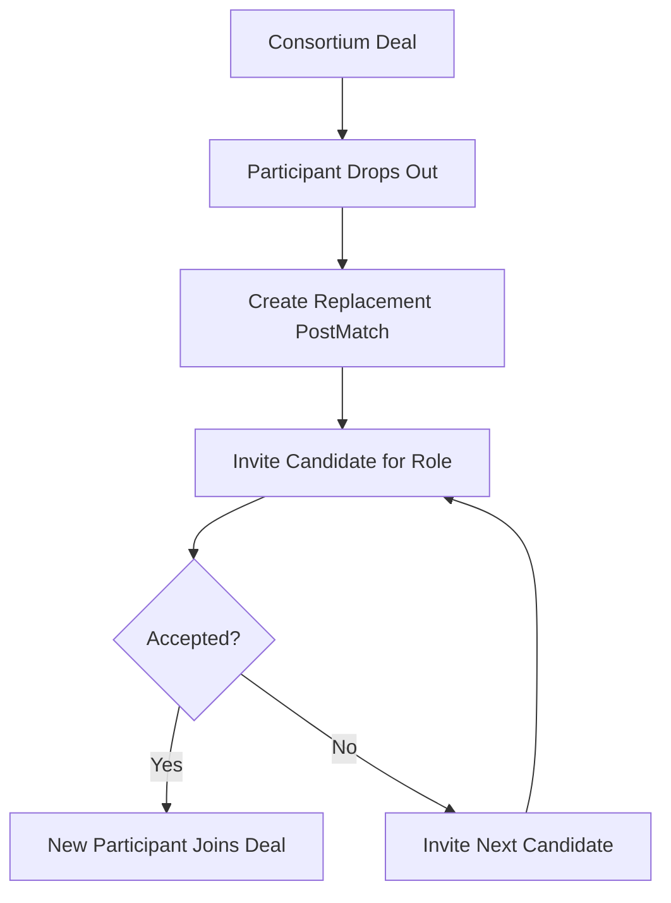

# Consortium participant replacement

### What this page is

Describes **replacement** when a consortium member leaves mid-deal and a new candidate is needed.

### What happens next

Confirm stage gates in config and [deal-workflow.md](../../docs/workflow/deal-workflow.md).

---

When a consortium deal is in progress and one participant **drops out**, the platform supports **replacement**: inviting a new candidate for the same role without dissolving the deal.

## Flow

1. **Drop-out**: A participant (e.g. Contractor) leaves the deal. The system records the dropped participant (e.g. via audit log and/or deal participant status).
2. **Replacement match**: The lead (or system) creates a **replacement post_match** with:
   - `isReplacement: true`
   - `replacementDealId`: the consortium deal ID
   - `replacementRole`: the role to fill (e.g. Contractor)
   - `replacementPayload`: e.g. `{ droppedUserId, droppedAt }`
   - One or more **participants**: the invited candidate(s) for that role.
3. **Invite next**: If the first replacement candidate declines, the system can **invite the next** candidate (from a ranked list) up to a maximum number of attempts (`CONFIG.MATCHING.MAX_REPLACEMENT_ATTEMPTS`).
4. **Acceptance**: When a replacement candidate accepts, they are added to the deal in the same role slot; the dropped participant is marked as no longer active.

## Participant Replacement Flow Diagram

## Data Shape

- **Replacement post_match** (in `demo-post-matches.json` or via `dataService.createReplacementPostMatch()`):
  - `matchType`: "consortium"
  - `isReplacement`: true
  - `replacementDealId`: deal id
  - `replacementRole`: string (e.g. "Contractor")
  - `replacementPayload`: { droppedUserId, droppedAt }
  - `participants`: [{ userId, opportunityId, role: "consortium_member", participantStatus }]

## Allowed Stages

Replacement is allowed only in certain deal stages (see `CONFIG.MATCHING.CONSORTIUM_REPLACEMENT_ALLOWED_STAGES`), e.g. negotiating, draft, review, signing, active, execution.

## Related Documentation

- [Matching Consortium](matching-consortium.md)
- [Deal Lifecycle](deal-lifecycle.md)
- [Platform Workflow](platform-workflow.md)
