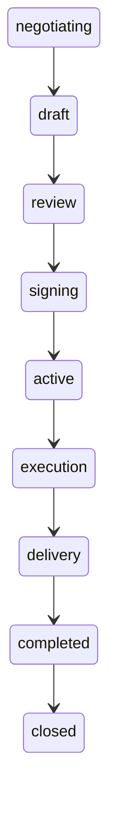

# Deal lifecycle

### What this page is

Deal **statuses** and transitions in the POC, with short descriptions.

### Why it matters

Same labels appear on deal detail, admin deals, and reports.

### What you can do here

- Read the status table.
- Compare with [docs/workflow/deal-workflow.md](../../docs/workflow/deal-workflow.md).

### What happens next

Contract steps: [docs/workflow/contract-workflow.md](../../docs/workflow/contract-workflow.md).

---

Deals are the central collaboration object after matching and negotiation. This document describes the deal lifecycle stages and transitions.

## Deal statuses

The platform uses the following deal statuses (see `CONFIG.DEAL_STATUS` in config):

| Status        | Description |
|---------------|-------------|
| `negotiating` | Terms are still being negotiated (linked to a negotiation). |
| `draft`       | Deal created; document in draft; participants not yet approved. |
| `review`      | Deal under review (e.g. legal or internal approval). |
| `signing`     | Contract created; awaiting all party signatures. |
| `active`      | Contract signed; deal is active (pre-execution or no milestones yet). |
| `execution`   | Work in progress; milestones being executed. |
| `delivery`    | Final delivery phase. |
| `completed`   | All milestones and delivery done. |
| `closed`      | Deal formally closed (archived). |

## State Machine

Transitions can be triggered by user actions (e.g. submit for review, sign contract, complete milestone) or by system rules (e.g. all parties signed → active).

## Deal Fields

- **participants**: Array of `{ userId, role, approvalStatus, signedAt }`.
- **opportunityId** / **opportunityIds**: Linked opportunity(ies).
- **matchType**: one_way, two_way, consortium, circular.
- **title**, **scope**, **timeline**, **exchangeMode**, **valueTerms**.
- **milestones**: Array of `{ id, title, description, dueDate, status, deliverables, submittedAt, approvedAt, approvedBy }`. Milestone statuses: pending, in_progress, submitted, approved, rejected.
- **negotiationId**, **contractId**: Links to negotiation and contract when present.
- **progressUpdates**, **documents**: Optional execution data (demo).

## Contract Link

When a deal reaches **signing**, a **contract** is created (or linked). The contract holds parties, scope, payment mode, duration, agreed value, and optional **milestonesSnapshot**. The deal holds the live milestones and execution; the contract is the legal snapshot at signing.

## Related Documentation

- [Platform Workflow](platform-workflow.md)
- [User Guide](user-guide.md)
- [System Architecture](system-architecture.md)
