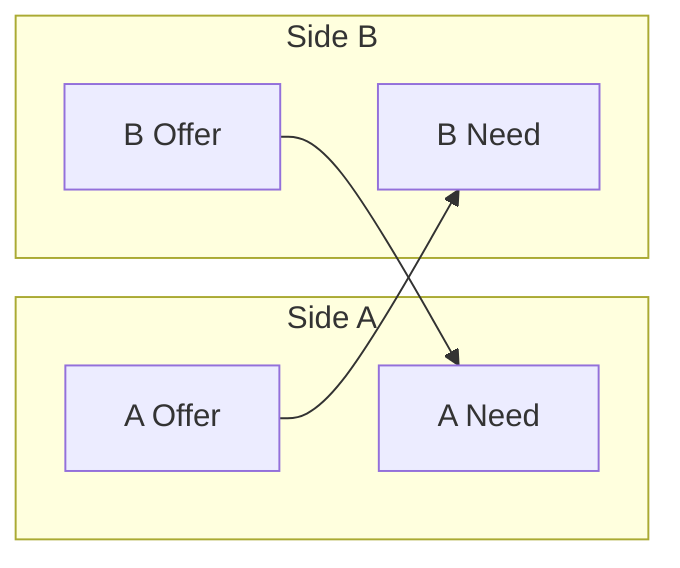

# Barter (two-way) matching

### What this page is

POC note on **two-way / barter** matching and when both directions must score well.

### What happens next

See [matching-workflow.md](../../docs/workflow/matching-workflow.md) and `findBarterMatches` in code.

---

Barter matching pairs two parties who each have both a **need** and an **offer**, so they can exchange value without cash (or with hybrid terms).

## Model

- **Side A**: User with a need (e.g. office space) and an offer (e.g. engineering consulting).
- **Side B**: User with a need (e.g. engineering consulting) and an offer (e.g. office space).
- The engine checks that A’s offer satisfies B’s need and B’s offer satisfies A’s need, and scores value equivalence.
- A **post_match** is created with `matchType: "two_way"` and four participant entries (each user appears twice: need_owner and offer_provider for their respective opportunities).

## Barter Matching Diagram

## Participant Roles

- Each side has **need_owner** and **offer_provider** for their own need and offer opportunities.
- Payload includes `sideA`, `sideB` (userId, needId, offerId), `scoreAtoB`, `scoreBtoA`, and optional `valueEquivalence`.

## Statuses

- **pending**, **accepted**, **declined** — same as one-way; both sides must accept for the barter match to proceed.

## Related Documentation

- [Platform Workflow](platform-workflow.md)
- [Matching One-Way](matching-one-way.md)
- [Matching Consortium](matching-consortium.md)
- [Matching Circular](matching-circular.md)
