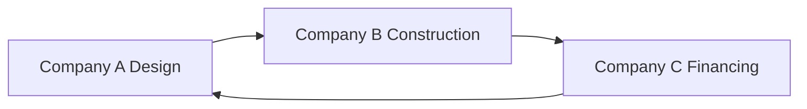

# Circular exchange matching

### What this page is

POC note on **circular** cycles (3+ parties) and how edges are scored.

### What happens next

See [matching-workflow.md](../../docs/workflow/matching-workflow.md) § circular.

---

Circular exchange matching forms a **cycle** of three or more parties where value flows in a circle: A provides to B, B to C, C to A (and so on). No single payer; each party gives and receives.

## Model

- Each participant has at least one **need** and one **offer**.
- The engine finds a cycle such that: Participant 1’s offer satisfies Participant 2’s need; Participant 2’s offer satisfies Participant 3’s need; …; Participant N’s offer satisfies Participant 1’s need.
- A **post_match** is created with `matchType: "circular"` and all participants as **chain_participant**.

## Circular Exchange Diagram

## Participant Roles

- **chain_participant**: Each party in the cycle (same role for all in circular).

## Payload

- `cycle`: Ordered list of creator/user IDs.
- `links`: Array of `{ fromCreatorId, toCreatorId, offerId, needId, score }` describing each link in the chain.
- `chainBalance`: chainBalanceScore, viable.

## Example

- Company A → provides design to B  
- Company B → provides construction to C  
- Company C → provides financing to A  

Value circulates without a single cash payer.

## Related Documentation

- [Platform Workflow](platform-workflow.md)
- [Matching One-Way](matching-one-way.md)
- [Matching Barter](matching-barter.md)
- [Matching Consortium](matching-consortium.md)
