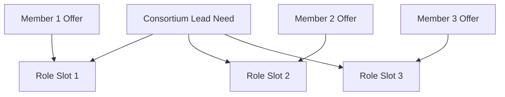

# Consortium Matching

Consortium matching forms a group around one **lead** need that requires multiple roles (e.g. investor, contractor, equipment supplier). The lead has one opportunity; members contribute with their offers mapped to role slots.

## Model

- **Lead need**: One opportunity (e.g. "Need: Solar plant EPC — equity, EPC, and O&M partners") with `intent: "request"` and collaboration model that supports consortium.
- **Member offers**: Multiple opportunities (e.g. "Offer: Equity and debt financing", "Offer: Construction execution", "Offer: Equipment supply") that fill role slots.
- The matching engine finds a set of members that collectively satisfy the lead’s need and scores consortium balance (value, roles).
- A **post_match** is created with `matchType: "consortium"`, one **consortium_lead** and multiple **consortium_member** participants.

## Consortium Collaboration Diagram

## Participant Roles

- **consortium_lead**: User/company that owns the lead need opportunity.
- **consortium_member**: User/company that owns an offer opportunity assigned to a role slot.

## Payload

- `leadNeedId`
- `roles`: Array of `{ role, opportunityId, userId, score }`
- `valueBalance`: consortiumBalanceScore, viable

## Deal Structure

When the consortium match is accepted and a deal is created, the deal has:

- **roleSlots**: Array of `{ role, userId, opportunityId }` (e.g. Investor, Contractor, Equipment supplier).
- **participants**: All members plus lead, with approval/signing status.

## Related Documentation

- [Platform Workflow](platform-workflow.md)
- [Consortium Replacement](consortium-replacement.md)
- [Matching One-Way](matching-one-way.md)
- [Matching Circular](matching-circular.md)
