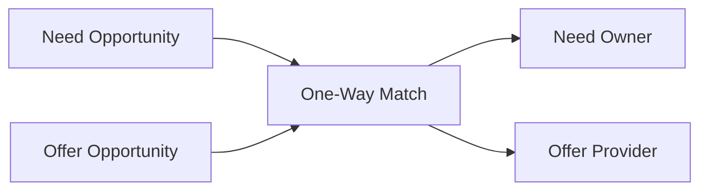

# One-Way Matching

One-way matching connects a **need** (request) with an **offer** (capacity to provide). One party has a need; another has a matching offer.

## Model

- **Need**: Opportunity with `intent: "request"` — e.g. "Need: Structural engineer for shop drawing review."
- **Offer**: Opportunity with `intent: "offer"` — e.g. "Offer: Structural engineering and shop drawing review services."
- The matching engine scores compatibility using skills, budget, timeline, location, and exchange mode.
- A **post_match** record is created with `matchType: "one_way"`, linking need owner and offer provider (each with an opportunityId and role).

## One-Way Matching Diagram

## Participant Roles

- **need_owner**: User/company that owns the need opportunity.
- **offer_provider**: User/company that owns the offer opportunity.

## Payload

The match payload typically includes:

- `needOpportunityId`, `offerOpportunityId`
- `breakdown`: scores for skills, budget, timeline, location
- `valueAnalysis`: fit, budgetInRange, etc.

## Statuses

- **pending**: Awaiting response from one or both parties.
- **accepted**: Both parties accepted; can proceed to negotiation/deal.
- **declined**: One or both parties declined.

## Related Documentation

- [Platform Workflow](platform-workflow.md)
- [Matching Barter](matching-barter.md)
- [Matching Consortium](matching-consortium.md)
- [Matching Circular](matching-circular.md)
