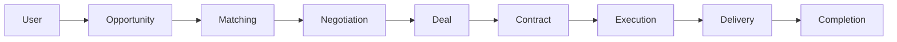

# Platform Workflow

This document describes the end-to-end workflow of the PMTwin B2B collaboration marketplace, from user registration through opportunity creation, matching, negotiation, deal formation, contracting, and execution.

## Overview

The platform connects professionals and companies who have **needs** (requests for services or resources) with those who have **offers** (capacity to provide them). The workflow is:

1. **User/Company registration** — Professionals and companies register and complete their profiles.
2. **Opportunity creation** — Users publish needs (requests) or offers (capacity) with scope, budget, timeline, and skills.
3. **Matching** — The matching engine finds compatible need–offer pairs (one-way), barter pairs (two-way), consortium formations, or circular exchanges.
4. **Application / Invitation** — Users apply to opportunities or get invited to apply; opportunity owners review applications.
5. **Negotiation** — Accepted matches or applications move to negotiation (terms, value, timeline).
6. **Deal** — When terms are agreed, a deal is created and moves through lifecycle stages (draft, review, signing, active, execution, delivery, completed, closed).
7. **Contract** — For deals that reach signing, a multi-party contract is created (parties, scope, payment, milestones snapshot).
8. **Execution** — Active deals are executed via milestones, deliverables, progress updates, and documents.
9. **Completion** — When all milestones are done, the deal is completed and closed.

## Platform Workflow Diagram

## Key Concepts

- **Intent**: Opportunities are either **request** (need) or **offer**. Matching pairs needs with offers.
- **Match types**: One-way (need ↔ offer), two-way (barter), consortium (lead + members), circular (value circulates A→B→C→A).
- **Deal lifecycle**: `negotiating` → `draft` → `review` → `signing` → `active` → `execution` → `delivery` → `completed` → `closed`.
- **Contract**: Legal agreement with parties, scope, payment mode, duration, agreed value, and optional milestones snapshot. Status: pending, active, completed, terminated.

## Related Documentation

- [User Guide](user-guide.md)
- [Deal Lifecycle](deal-lifecycle.md)
- [Matching Models](matching-one-way.md) (one-way, barter, consortium, circular)
- [System Architecture](system-architecture.md)
