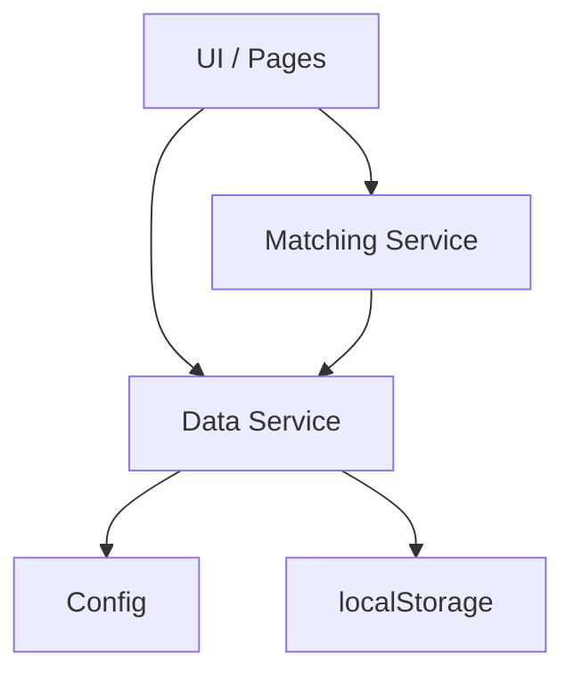

# System Architecture

This document describes the high-level architecture of the PMTwin POC: storage, config, services, and data flow.

## Overview

PMTwin is a **client-side POC** with no backend database. All persistence is in **localStorage**. Schema and business rules are defined in **config** and **data-service**; the **matching service** runs in the browser and writes match results back via the data service.

## System Architecture Diagram

## Components

### Config (`POC/src/core/config/config.js`)

- **STORAGE_KEYS**: Keys for users, companies, opportunities, applications, matches, post_matches, negotiations, deals, contracts, etc.
- **Status enums**: DEAL_STATUS, CONTRACT_STATUS, POST_MATCH_STATUS, APPLICATION_STATUS, NEGOTIATION status, milestone status.
- **Match types**: POST_MATCH_TYPE (one_way, two_way, consortium, circular).
- **Matching weights and thresholds**: e.g. MIN_THRESHOLD, POST_TO_POST_THRESHOLD, CONSORTIUM_REPLACEMENT_ALLOWED_STAGES, MAX_REPLACEMENT_ATTEMPTS.

### Data Service (`POC/src/core/data/data-service.js`)

- **Initialization**: `initializeFromJSON()` loads base JSON from `POC/data/*.json`; `mergeDemoData()` merges demo JSON (demo-users, demo-companies, demo-40-opportunities, demo-applications, demo-deals, demo-contracts, demo-post-matches, **demo-negotiations**, etc.) into localStorage.
- **CRUD**: get/create/update for users, companies, opportunities, applications, post_matches, negotiations, deals, contracts. Deals support milestones (addDealMilestone, updateDealMilestone). Contracts support optional **milestonesSnapshot**.
- **Consortium replacement**: createReplacementPostMatch(dealId, candidate, missingRole, droppedUserId), inviteNextReplacementCandidate(matchId, declinedByUserId).

### Matching Service (`POC/src/services/matching/`)

- **matching-models.js**: Pure functions for one-way (findOffersForNeed, findNeedsForOffer), two-way (findBarterMatches), consortium (findConsortiumCandidates, findReplacementCandidatesForRole), circular (findCircularExchanges).
- **matching-service.js**: Orchestrates matching, ranking, and persistence via `dataService.createPostMatch()`.

### Storage

- **localStorage** keyed by CONFIG.STORAGE_KEYS. No server; data is lost if cleared. Demo data is re-merged on init when seed version matches.

## Data Flow

1. **Load**: On app init, data service loads/merges JSON into localStorage.
2. **Matching**: User or system triggers matching; matching service reads opportunities (and users/companies for scoring), produces candidates, and creates post_match records via data service.
3. **Workflow**: Applications, negotiations, deals, and contracts are created/updated through the data service from the UI or from automated flows.
4. **Replacement**: For consortium deals, drop-out triggers replacement post_match creation; accept/decline and invite-next are handled via data service and config limits.

## Related Documentation

- [Platform Workflow](platform-workflow.md)
- [Deal Lifecycle](deal-lifecycle.md)
- [Consortium Replacement](consortium-replacement.md)
