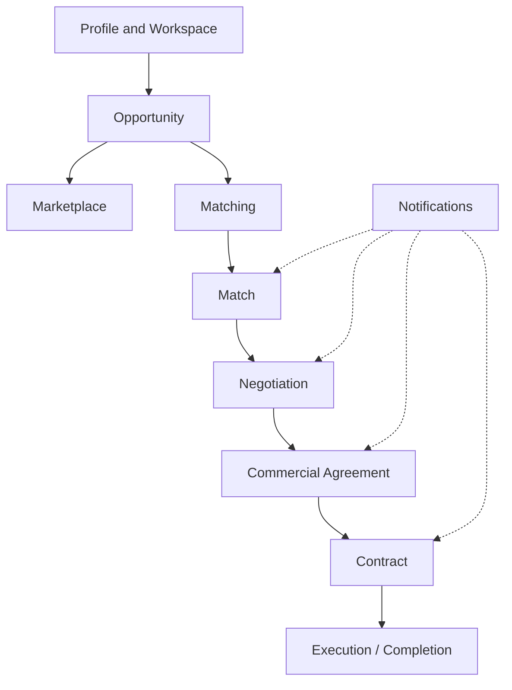
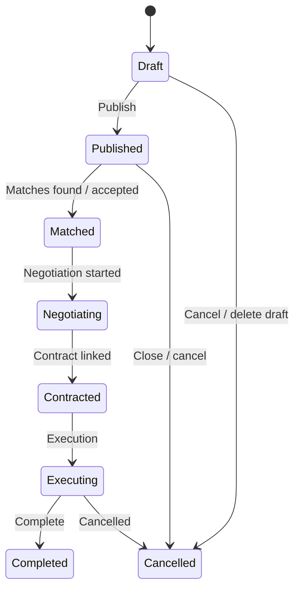
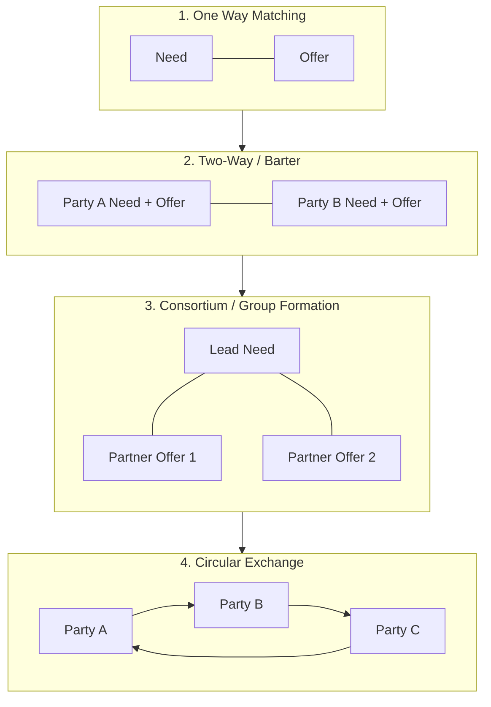
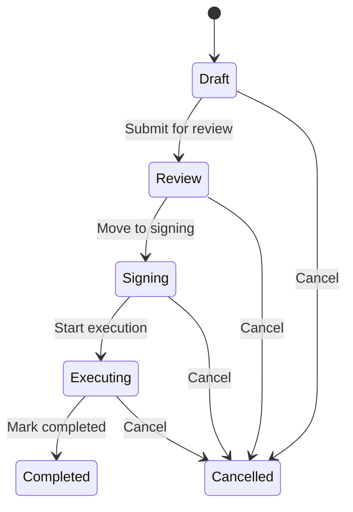
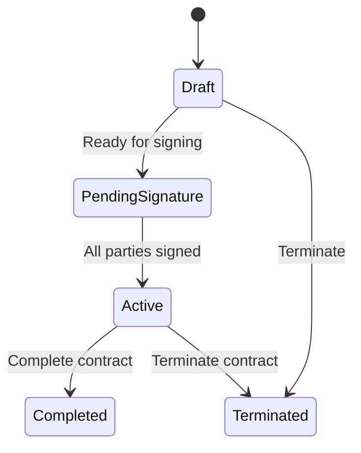
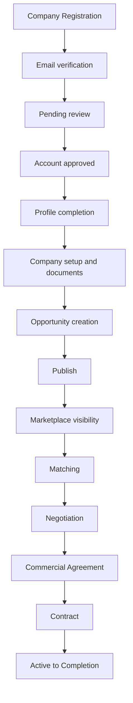

  

# PM-Twin Complete User Guide

**Official User Manual for onboarding, training, and day-to-day use**

| | |
|---|---|
| **Product** | PM-Twin — Construction Collaboration Marketplace |
| **Audience** | End users, company owners, employees, administrators, sales teams, trainers, and customers |
| **Purpose** | Explain what you can see and do in PM-Twin |
| **Region focus** | Saudi Arabia and the GCC (Arabic layout, Saudi Riyal, VAT, data protection expectations) |

> **Training environments:** Some training or acceptance environments may provide sample login accounts and practice data. Features labeled **Preview** in the application are available in a limited form. Your trainer or customer success contact can confirm what applies to your environment.

---

## Table of contents

1. [Introduction](#1-introduction)
2. [Platform overview](#2-platform-overview)
3. [Core concepts](#3-core-concepts)
4. [User roles](#4-user-roles)
5. [Getting started](#5-getting-started)
6. [Complete opportunity guide](#6-complete-opportunity-guide)
7. [Marketplace guide](#7-marketplace-guide)
8. [Matching guide](#8-matching-guide)
9. [Negotiation guide](#9-negotiation-guide)
10. [Commercial agreement guide](#10-commercial-agreement-guide)
11. [Contract guide](#11-contract-guide)
12. [Notifications](#12-notifications)
13. [Dashboard guide](#13-dashboard-guide)
14. [Admin portal (overview)](#14-admin-portal-overview) — [Demo Walkthrough verification](#demo-walkthrough-verification-demouat)
15. [Complete business journey](#15-complete-business-journey)
16. [Best practices](#16-best-practices)
17. [Troubleshooting](#17-troubleshooting)
18. [Frequently asked questions](#18-frequently-asked-questions)
19. [Glossary](#19-glossary)

---

## 1. Introduction

### What is PM-Twin?

PM-Twin is a **construction collaboration marketplace** for Saudi Arabia and the GCC. It helps companies, project managers, consultants, contractors, suppliers, and independent professionals find partners, share capacity, negotiate terms, and formalize work through commercial agreements and contracts.

You publish what you need or what you can offer. PM-Twin helps you find compatible partners, then guides you from match → negotiation → commercial agreement → contract.

### Why it exists

Construction projects rarely succeed with a single party. Teams need:

- Short-term capacity (schedulers, BIM coordinators, site supervisors)
- Equipment and resource sharing
- Joint bids and consortia
- Service-for-service exchange (barter)
- Hiring of professionals and consultants
- Clear commercial terms, VAT-aware pricing, and signed contracts

PM-Twin replaces fragmented chat threads, email RFPs, and informal introductions with a structured collaboration path.

### Business problems it solves

| Problem | How PM-Twin helps |
|---------|-------------------|
| Hard to find the right partner quickly | Marketplace discovery and automatic partner suggestions |
| Unclear scope and commercial terms | Guided opportunity form with collaboration models and commercial structure |
| No shared place for negotiations | Negotiation room with messages, offers, and history |
| Informal “handshake” deals | Commercial agreements with review and award |
| Missing legal closure | Contracts with multi-party signing |
| Incomplete profiles hurt trust | Readiness guidance before you publish |
| Company vs individual confusion | Personal and Company workspaces |

### Who should use it

- **Company owners** building partnerships and subcontracting pipelines  
- **Employees** working inside a company workspace  
- **Individual professionals and consultants** offering or seeking work  
- **Commercial, legal, and project managers** reviewing terms and contracts  
- **Platform administrators** reviewing accounts and overseeing the marketplace  
- **Sales and training teams** onboarding customers  

### Typical users

| Persona | Typical goals |
|---------|----------------|
| Contractor company owner | Publish needs for subcontractors; award commercial agreements |
| BIM / design consultant | Publish offers; accept matches; negotiate cash or barter |
| Developer / owner-client | Form consortia or joint ventures for large packages |
| Equipment provider | Share fleet capacity through resource-sharing models |
| Independent project manager | Hire into roles or offer availability |
| Platform admin | Approve registrations, manage awards, review activity |

---

## 2. Platform overview

PM-Twin is organized around two everyday ways of working:

| Area | How to think about it | Typical language |
|------|----------------------|------------------|
| **My Workspace** | Your work, ownership, and progress | My opportunities, pending, needs action, executing |
| **Marketplace** | Finding partners and opportunities | Explore, discover, available, recommended |

### Major modules

| Module | What it is | Where you find it |
|--------|------------|-------------------|
| **Dashboard** | Home for your active workspace: summary numbers, tasks, notifications, next actions | My Workspace → Dashboard |
| **Workspace** | Your Personal or Company business context (switchable) | Workspace switcher in the header |
| **Marketplace / Discover** | Browse published opportunities, people, and (where available) matches | Marketplace → Discover |
| **Opportunities** | Create, edit, publish, and manage needs and offers | My Opportunities / Browse Opportunities |
| **Matches** | Suggested partner pairings | My Matches |
| **Negotiations** | Term discussions, offers, and counter-offers | My Negotiations |
| **Commercial Agreements** | Structured business agreements after terms are agreed | My Commercial Agreements |
| **Contracts** | Formal agreements ready for signing | My Contracts |
| **Pipeline** | Board view across matches → agreements → contracts | My Pipeline |
| **Notifications** | Alerts for matches, invitations, agreements, contracts | Notifications |
| **Messages** | Messaging area | Messages |
| **Profile** | Your personal or company profile and readiness | Profile |
| **Party documents** | Documents for account review and compliance (CR, VAT, licenses, and similar) | Party documents |
| **Settings** | Language direction, password, and related preferences | Settings |
| **Admin Portal** | Platform operations for administrators | Admin |

> Screenshot: Sidebar showing My Workspace and Marketplace groups

### How modules work together

1. You complete a **profile** and work in a **workspace**.  
2. You create and **publish** an **opportunity** (Need or Offer).  
3. The **marketplace** shows published posts to others.  
4. Compatible partners appear as **matches**.  
5. Parties **accept** a match and start a **negotiation**.  
6. When terms are agreed, you create a **commercial agreement**.  
7. From the agreement you create and **sign** a **contract**.  
8. Work moves through execution statuses until **completed**.

---

## 3. Core concepts

### Workspace

A **workspace** is the business context you are acting in. You may have:

- A **Personal Workspace** (individual professional or consultant)
- One or more **Company Workspaces** (as owner, admin, member, or viewer)
- Platform staff may also enter the **PM-Twin Platform** admin area

Switching workspace changes what “mine” means for opportunities, matches, and agreements.

### Company

A **company** is an organization with its own company workspace. Owners invite employees. Some collaboration options (for example Project-Specific Joint Venture, Special Purpose Vehicle, Strategic Joint Venture) are available only to companies.

### Personal Workspace

A **Personal Workspace** is for professionals and consultants working independently. You can still collaborate with companies through matches and negotiations.

### Party

A **party** is who participates in the marketplace: either an **individual** or a **company**. Opportunities, matches, and contracts are always linked to the parties involved.

### Opportunity

An **opportunity** is a draft or published **Need** or **Offer** describing scope, collaboration model, commercial terms, and timeline. In simple terms: a need or offer ready for partners to find.

### Match

A **match** is a suggested pairing between compatible opportunities (including multi-party collaborations). Matches show a score and a status such as Discovered, Accepted, Confirmed, Declined, or Expired.

### Negotiation

A **negotiation** is the structured discussion of commercial terms after a match is accepted. It includes messages, offers, counter-offers, attachments, and a history of actions.

### Commercial Agreement

A **commercial agreement** is the business record created once terms are agreed (or awarded). It moves through statuses such as Draft, Review, Signing, Executing, Completed, or Cancelled. It sits between negotiation and contract.

> Older materials may say “deal.” In the product, the preferred name is **Commercial Agreement**.

### Contract

A **contract** is the formal signing record created from a commercial agreement. Parties sign it; when all required signatures are in place, it becomes **Active**.

### Readiness

**Readiness** is a percentage score that shows whether your **profile** and **opportunity** are complete enough to publish. Publishing usually requires both to be ready: required information filled in and a score of **80%** or higher.

### Validation

While you fill forms, PM-Twin highlights missing or incomplete information (for example required fields, or a payment schedule that does not add up to 100%). Warnings help you improve quality; required items must be fixed before you can publish.

### Marketplace

The **marketplace** is where you discover other people’s published opportunities, companies, and professionals. Your drafts stay under **My Opportunities**, not in public discovery.

### Ownership

Ownership answers “whose is this?”

| Label | Meaning |
|-------|---------|
| **Mine** | Created by you in your personal context |
| **Company** | Owned by your company workspace |
| **Marketplace** | Published by others outside your organization |

### Visibility

**Visibility** controls whether an opportunity appears in marketplace discovery. **Archive** removes it from active discovery. **Close** ends the opportunity for new matching.

---

## 4. User roles

Your access depends on how you registered, which workspace you are in, and (for staff) whether you are a platform administrator.

### Individual Professional (and Consultant)

**Who:** Registered with a Personal Workspace as Professional or Consultant.

**Can typically:**

- Complete personal profile and documents  
- Create opportunity drafts and publish when readiness and permissions allow  
- Browse the marketplace, view matches, accept or decline matches  
- Start and participate in negotiations (message, offer, counter, accept)  
- View commercial agreements and sign contracts when you are a signing party  

**Cannot typically:**

- Create a company without registering as Company  
- Use company-only collaboration options (Project Joint Venture, Special Purpose Vehicle, Strategic Joint Venture)  
- Access the Admin Portal  

### Company Owner

**Who:** Registered a Company Workspace and is the **owner**.

**Can typically:**

- Manage the full opportunity journey for company posts  
- Invite and manage employees (according to company permissions)  
- Accept matches, negotiate, and create or progress commercial agreements  
- Award agreements (where permitted) and create or sign contracts  
- Complete company profile and review documents (Commercial Registration, VAT certificate, and similar)  

### Employee

**Who:** Joined a company through an invitation. Does **not** create a new company.

**Can do:** Depends on the role assigned in the company workspace. Examples:

| Role | Typical focus |
|------|---------------|
| Company admin | Members, workspace settings, broad operational rights |
| Manager / Project manager | Opportunities and delivery coordination |
| Commercial manager | Negotiations, agreements, awards |
| Legal / Finance | Review, signing, commercial terms |
| Member | Day-to-day collaboration within granted permissions |
| Viewer | View only |

**Cannot:** Act outside the company workspace they belong to, or perform actions their role does not allow (for example publishing, signing, or awarding).

### Reviewer

**Who:** Assigned to review new registrations (often platform staff).

**Can:** Review registration packages, request clarification, approve or reject accounts.

**Cannot:** Act as a normal marketplace participant unless they also have a standard user account.

### Administrator (platform staff)

**Who:** Platform administrators, operations staff, moderators, auditors, and similar roles.

**Can:** Use the Admin Portal — users and companies, account review, marketplace oversight, commercial approvals and awards, reports, and activity review.

**Auditors:** May view information without changing records.

> Screenshot: Role badge in the sidebar (for example “Professional” or “Platform admin”)

---

## 5. Getting started

### Logging in

1. Open **Sign in**.  
2. Enter your **email** and **password**.  
3. Optionally choose to stay signed in.  
4. After sign-in you land on your dashboard (personal or company).

> Screenshot: Sign in page  
> **Tip for training sessions:** Your trainer may provide practice accounts.

**New users:** Use **Register** to create a Personal or Company workspace, complete the profile steps, accept Terms and Privacy, and verify your email. New accounts may be **pending review** — you can browse, but full actions unlock after approval.

### Switching workspaces

1. Open the **workspace switcher** in the header.  
2. Choose **Personal Workspace** or a **Company Workspace**.  
3. You are taken to the matching dashboard for that workspace.  
4. Platform staff may choose **enter Platform** to open Admin.

> Screenshot: Workspace switcher listing Personal and Company workspaces

### Updating your profile

1. Go to **My Profile**.  
2. Review Summary, Skills, Experience/Portfolio, and (for companies) Company information.  
3. Improve **profile readiness** until required fields are complete and the score reaches the publish threshold.

**Individual — required for readiness:** Full Name, Role, Skills, Services, Location, Availability.  
**Individual — recommended:** Portfolio, Experience, Certifications, Previous Projects.  

**Company — required:** Company Name, Business Category, Services, Project Categories, Location, Contact Person.  
**Company — recommended:** Portfolio, Team Size, Coverage Areas, Certifications, Financial Capacity.

### Completing company information

1. Ensure you are in the **Company Workspace**.  
2. Complete company profile fields and contact person.  
3. Upload required documents under **Party documents** (see below).  
4. If your account is pending review, follow the guidance on the pending dashboard (for example Upload VAT, Upload CR, Resubmit for review).

### Uploading required documents

Open **Party documents**.

| Document categories you may see | Common required items |
|---------------------------------|------------------------|
| Profile, vetting, legal, technical, commercial, financial, insurance, certification, attachment | Commercial Registration, **VAT Certificate**, Insurance Certificate, License, National ID |

> Screenshot: Party documents upload form

### Understanding dashboard widgets

See [Section 13 — Dashboard guide](#13-dashboard-guide). At a glance you will see:

- Greeting and readiness / active matches  
- Summary counts (opportunities, matches, negotiations, agreements, contracts)  
- My tasks and next best actions  
- Notifications  
- Matching summary and marketplace recommendations  

If your account is **pending review**, you see a **Pending Vetting Dashboard** instead of the full workspace dashboard.

---

## 6. Complete opportunity guide

This is the most important section for most users.

### What is an Opportunity?

An opportunity is a structured post that says either:

- **Need** — you are requesting services, skills, resources, capacity, or project support; or  
- **Offer** — you are providing services, skills, resources, equipment, or available capacity.

Opportunities include collaboration model, scope, commercial structure, timeline, and documents so partners can evaluate fit.

### When should you create one?

Create an opportunity when you have a real collaboration intent, for example:

- You need a concrete pumping subcontractor next month  
- You can offer BIM coordination capacity  
- You want partners for a consortium bid  
- You need to hire a senior project manager for six months  
- You want to exchange design capacity for site supervision (barter)

Do **not** publish empty placeholders — readiness and partner quality depend on complete information.

### Draft vs Published

| State | Meaning | In the marketplace | Partner suggestions |
|-------|---------|--------------------|---------------------|
| **Draft** | Work in progress; use **Save Draft** | Not shown as published | Not created yet |
| **Published** | Live for discovery | Visible according to ownership and visibility | Created after you publish |

If you leave the form with unsaved work, you may see **Recover unsaved local draft?** with options to **Continue draft** or **Discard**. Always use **Save Draft** or **Publish Opportunity** when you want to keep your work.

### Opportunity lifecycle

Statuses you will see: **Draft → Published → Matched → Negotiating → Contracted → Executing → Completed** (or **Cancelled**).

**Archive** removes the opportunity from active marketplace discovery. That is different from cancelling or closing the opportunity.

> Screenshot: Opportunity details header with status badge and journey strip

### Step-by-step creation

1. From the Dashboard, click **Create Opportunity**.  
2. Complete the five wizard steps below.  
3. Use **Save Draft** anytime.  
4. On **Review & Publish**, resolve readiness items, then click **Publish Opportunity**.

> Screenshot: Opportunity Wizard - Step 1  
> Screenshot: Opportunity Wizard - Step 2  
> Screenshot: Opportunity Wizard - Step 3  
> Screenshot: Opportunity Wizard - Step 4  
> Screenshot: Opportunity Wizard - Review & Publish

Wizard steps:

| Step | Label | Purpose |
|------|-------|---------|
| 1 | Opportunity | Post type and basics |
| 2 | Collaboration | Model and sub-model |
| 3 | Scope & Work | Requirements and packages |
| 4 | Commercial Structure | How value is exchanged |
| 5 | Review & Publish | Confirm and publish |

Messages you may see before continuing:

- “Choose Need or Offer before continuing.”  
- “Add a title and description before continuing.”  
- “Select a collaboration model and sub-model before continuing.”

---

### Step 1 — Opportunity (basics)

**On-screen help:** *Start with the post type and the basics partners need to evaluate fit.*

#### Post Type (required to continue)

| Option | Purpose | When to use |
|--------|---------|-------------|
| **Need** | Request capacity | You are looking for services or resources |
| **Offer** | Provide capacity | You are providing services or resources |

**Common mistake:** Choosing Offer when you are actually hiring — use Need (or the Hiring collaboration model) when you are requesting people.

#### Basic Information

| Field | Required? | Purpose | Best practice | Common mistake |
|-------|-----------|---------|---------------|----------------|
| **Title** | Required | Clear name partners can find | Specific: “BIM Coordination — Riyadh Tower Q3” | Vague titles like “Project help” |
| **Short description** | Required | Partner evaluation | 2–4 sentences on scope and outcome | Pasting a full RFP with no summary |
| **Category or profession** | Required | Discovery by sector | Align with the real trade or discipline | Leaving unrelated category |
| **Target role** | Required | Who should respond | “MEP Subcontractor”, “Planning Engineer” | Leaving blank or too broad |
| **Primary location** | Required | Location fit | City and site context | “KSA” only when city matters |
| **Service area** | Optional | Coverage | Regions you serve or need covered | Ignoring multi-city coverage |
| **Start date** | Required | Timing | Realistic start | Past dates without explanation |
| **Deadline** | Optional | Tender or delivery cutoff | Use for RFPs and hard ends | Conflicting with start date |
| **Availability end date (recommended)** | Recommended | Offer capacity window | Especially important for Offers | Omitting when capacity is time-bound |

---

### Step 2 — Collaboration Model

**On-screen help:** *Choose how parties will work together. Matching structure is shown automatically.*

#### Main Collaboration Model (required)

| Model | Meaning | Example |
|-------|---------|---------|
| **Cash Subcontracting** | Engage another party to deliver defined work for payment | Concrete pumping subcontract |
| **Service Exchange / Barter** | Exchange complementary services without pure cash | Design capacity for site supervision |
| **Joint Venture** | Partner for a shared project or business outcome | Special Purpose Vehicle for a mixed-use bid |
| **Resource Sharing** | Share equipment, people, or materials | Shared crane fleet |
| **Hiring / Professional Engagement** | Hire a professional or consultant | Senior project manager for 6 months |

#### Sub-model (required)

Pick the engagement pattern under the main model. Examples:

| Main model | Sub-models (examples) |
|------------|------------------------|
| Cash Subcontracting | Task-Based Engagement; Competition / RFP |
| Service Exchange | Long-Term Strategic Alliance; Mentorship Program; Task-Based Engagement |
| Joint Venture | Consortium; Project-Specific Joint Venture; Special Purpose Vehicle; Strategic Joint Venture |
| Resource Sharing | Bulk Purchasing; Equipment Sharing; Resource Sharing & Exchange |
| Hiring | Professional Hiring; Consultant Hiring |

**Company-only:** Project-Specific Joint Venture, Special Purpose Vehicle, and Strategic Joint Venture require a **company** account.

Each sub-model shows additional **Collaboration Details** (for example Task Title, Equity Split, Equipment Type). Complete required fields before publishing.

#### Recommended matching structure (read-only)

The screen shows **Recommended matching structure** (One Way, Two-Way, Consortium, or Circular). You do not choose this manually — it appears based on the collaboration and commercial choices you made. Use **Why?** if you want a short explanation.

---

### Step 3 — Scope & Work

**On-screen help:** *Define requirements, work packages, tasks, deliverables, and milestones.*

#### Skills

| Field | Purpose | Required? | Tips |
|-------|---------|-----------|------|
| Skills Required / Skills Offered | Better partner fit | Needed for strong readiness | Add level, years, certification, and mandatory flags where relevant |
| Skill name | Specific skill | Per skill entry | For example “BIM Coordination” |

**Common mistake:** Listing only soft skills or one vague skill.

#### Services

Enter **Services Required** or **Services Offered** (needed for strong readiness), usually as a comma-separated list. Example: Design Review, Coordination.

#### Qualifications & partner preference

| Field | Required? | Purpose |
|-------|-----------|---------|
| Preferred partner type | Recommended | Company, individual, or consultant preference |
| Experience level | Optional | Seniority expectation |
| Certifications | Optional | Compliance and trust |
| Team size | Optional | Capacity expectation |
| Minimum qualifications | Optional | Minimum standards for responders |

#### Resources

People, equipment, vehicles, materials, software, licenses — optionally linked to a work package.

| Field | Notes |
|-------|-------|
| Type | People, equipment, vehicles, materials, software, licenses |
| Name | Required for each resource |
| Quantity / Unit / Availability | Clarity for partners |
| Work package | Whole opportunity or a specific package |
| Mandatory | Checkbox |

**Available capacity** (Offer only): Available, Reserved, and Maximum capacity, plus Available from. This helps partners understand your capacity.

#### Work Packages

Break delivery into manageable units:

1. Click **Add Work Package**.  
2. Enter package title and description/scope.  
3. Add **Tasks** and **Package deliverables**.  
4. Set package dates as needed.

**Best practice:** Add at least one clear package for anything beyond a very small task.

#### Deliverables (opportunity-level)

Add deliverables with title and acceptance criteria. Scope can be the entire opportunity or a work package.

#### Milestones

Add milestones with completion criteria and optional **Payment trigger** — important when you use cash payment schedules.

#### Timeline & Location

| Context | Typical fields |
|---------|----------------|
| Need | Location, Start date, Deadline |
| Offer | Preferred location / service area, Availability from |
| Additional timeline options | Flexible start, Weekend allowed, Must finish before, Estimated duration, Working days, Shift type |

#### Attachments & compliance

| Field | Purpose | Best practice |
|-------|---------|---------------|
| Attachments | Document names | List SOW, drawings, and BOQ names clearly |
| Compliance requirements | Codes, licenses, H&S, data protection | Be explicit for KSA projects |
| Portfolio references | Proof of capability | Reference similar prior work |

---

### Step 4 — Commercial Structure

**On-screen help:** *Configure one or more value exchange components. Hybrid is shown automatically when more than one is selected.*

Enable one or more: **Cash**, **Barter**, **Profit Sharing**, **Revenue Sharing**, **Equity**, **Custom**. If more than one is enabled, the mode becomes **Hybrid**.

#### Cash (Saudi Riyal)

| Field | Purpose | Tips |
|-------|---------|------|
| Currency | Usually **SAR** | Keep consistent across the schedule |
| Budget type | Fixed, Range, Rate-based, Milestone-based, To be negotiated | Match how you really buy or sell |
| Fixed amount | Monetary value | Align with milestones |
| Advance % / Retention % | Cash flow and quality holdback | Common in KSA construction |
| Payment terms | When payment is due | Align with deliverables |
| **VAT handling** | Tax treatment | Be explicit; standard VAT in KSA is **15%** |
| Bank guarantee | Security instruments | Use when contractually required |
| Payment schedule | Milestones with % or amount | Percentages should total **100%** |

#### Barter

Offered asset or service, requested asset or service, valuation method, estimated value.

#### Profit / Revenue / Equity / Custom

Share percentages, calculation basis, settlement, equity type, exit strategy, or custom calculation method.

#### Allocation & constraints

When multiple components are enabled, set allocation method (Percentage, Fixed, Mixed, Not applicable) and optional commercial constraints (for example budget ceiling).

**Common mistakes:**

- Enabling Cash with empty amounts and “to be negotiated” everywhere — lowers readiness  
- Payment schedule percentages that do not total 100%  
- Barter without valuation  

---

### Step 5 — Review, Readiness, Validation, Publishing

Review shows an **executive summary** and section cards with **Edit** links:

- Opportunity Summary  
- Collaboration  
- Scope and Requirements  
- Work Packages and Tasks  
- Commercial Structure  
- Timeline and Location  
- Documents and Compliance  

#### Readiness

You can publish when:

1. Your **profile** is ready (required fields complete and score at least **80%**), and  
2. Your **opportunity** is ready (required fields complete and score at least **80%**)

Blocked message example: *Complete your profile and opportunity details before publishing for matching.*

Required items may include: title; Need or Offer; category; target role; skills; services; location; start or availability; collaboration model; description; commercial terms.

Recommended improvements (optional, but raise your score): preferred partner type, portfolio or documents, compliance, delivery milestones.

> Screenshot: Opportunity Readiness panel — Required Before Publishing

#### Publishing

1. Resolve required readiness items.  
2. Click **Publish Opportunity**.  
3. Status becomes **Published**.  
4. Compatible partners may appear as matches, and you may receive notifications.

---

### Editing, duplicating, closing, archiving, awarding

| Action | When available | Effect |
|--------|----------------|--------|
| **Edit** | Owner; not archived or closed | Update draft or published content |
| **Publish** | Owner; draft; readiness complete | Enter the marketplace; partner suggestions appear |
| **Duplicate as Draft** / **Template** | Owner | New draft copy |
| **Archive** | Owner; not draft or already archived | Removed from active marketplace discovery |
| **Close Opportunity** | Owner; not draft, closed, or archived | Ends the opportunity for new matching |
| **Delete Draft** | Owner; draft only | Permanently deletes the draft |
| **Export PDF / JSON**, Print, Share, Copy Link | Owner | Sharing and records |

**Awarding** is not an opportunity button. You award from **Commercial Agreements** or Admin **Award Management** when several agreements compete on one opportunity.

Opportunity detail tabs include: Overview, Scope & Work, Commercial, Marketplace, Matching, Documents, Related, History.

---

### Realistic example (start to finish)

**Scenario:** A Riyadh contractor needs BIM coordination for a tower fit-out (cash subcontract, task-based).

1. Sign in as company owner → Company Workspace.  
2. Profile readiness at least 80%; VAT certificate and Commercial Registration uploaded.  
3. **Create Opportunity** → Post Type **Need**.  
4. Title: “BIM Coordination Support — Tower Fit-out, Riyadh”.  
5. Category: Construction / BIM; Target role: BIM Coordinator; Location: Riyadh; Start date set.  
6. Collaboration: **Cash Subcontracting** → **Task-Based Engagement**; fill task title, scope, duration, skills, experience, payment terms.  
7. Scope: Skills Required = BIM Coordination (Expert); Services = Clash Detection, Model Coordination; one work package “Coordination Package”; milestones with payment triggers.  
8. Commercial: Cash, SAR, Fixed amount, Advance 20%, Retention 5%, VAT handling clear, schedule totaling 100%.  
9. Review → readiness complete → **Publish**.  
10. Matches appear → accept the best match → **Start negotiation** → agree terms → **Create Commercial Agreement** → **Create contract** → parties **Sign** → contract **Active**.

---

## 7. Marketplace guide

### Browsing opportunities

1. Open **Marketplace → Discover** for the discovery home (summary numbers and explore-by-model links), or  
2. Open **Browse Opportunities**.

Tabs commonly include:

- **All Marketplace** — published posts from others  
- **My Opportunities** — yours  
- **Company Opportunities** — your organization’s  

> Screenshot: Marketplace opportunity list with ownership badges

### Filters and search

| Control | Typical options |
|---------|-----------------|
| Search | “Search available opportunities…” / “Search my opportunities…” |
| Status | All / Published / Draft / Negotiating |
| Main collaboration model | Cash subcontracting, service exchange, joint venture, resource sharing, hiring |
| Exchange mode | Cash, Barter, Profit-Sharing, Equity, Hybrid |
| Match type | One Way, Two-Way, Consortium, Circular |

### Cards and details

Cards show ownership, Need or Offer, status, and a primary action. Open a card to view details. Some previews may show limited detail until verification is complete.

### Saving opportunities

There is currently **no bookmark or save-for-later**. Use Matches, Pipeline, or Notifications to track what matters.

### Marketplace rules and visibility

- Only **published** opportunities appear in marketplace discovery.  
- **Drafts** remain under My or Company tabs.  
- **Archived** posts are removed from active discovery.  
- **Browse Matches** and **Map** may be labeled **Preview**.  
- Use **Browse Companies** or **Browse Professionals** to explore people and organizations.

---

## 8. Matching guide

### What matching is

After you **publish** an opportunity, PM-Twin suggests compatible partners. Each **match** shows a **match score** and fit areas such as Skill match, Timeline fit, and Location fit.

### When it happens

Partner suggestions appear after you publish. You will see them under **My Matches**, in recommended areas on the dashboard, and in notifications such as **New match found**.

### Types of matching

| Type | Label you see | Meaning |
|------|---------------|---------|
| One Way | One Way Matching | A Need paired with Offers (or an Offer with Needs) |
| Two-Way | Two-Way Dependency (Barter) | Each side has both a need and an offer |
| Consortium | Group Formation | A lead Need fulfilled by several partner Offers |
| Circular | Circular Exchange | A ring of three or more parties (A → B → C → A) |

The type is shown automatically from your collaboration choices — you do not select it yourself.

### What to expect after a match appears

1. You receive a notification: **New match found**.  
2. Open **My Matches** and filter by **Discovered**.  
3. Review score, confidence (High / Medium / Low), related opportunities, and participants.  
4. Choose **Accept** or **Decline**.  
5. When the match is ready, click **Start negotiation**.  

Statuses you may see: **Discovered → Accepted → Confirmed**, or **Declined**, **Expired**, or **Superseded**.

> Screenshot: Match detail with score and Accept / Decline actions

---

## 9. Negotiation guide

### Starting negotiations

1. Accept the match.  
2. Click **Start negotiation**.  
3. Open the negotiation room.

### Negotiation room tabs

| Tab | Use it for |
|-----|------------|
| Overview | Status, mode, and linked match, commercial agreement, and contract |
| Discussion | Send messages |
| Offers & Counter Offers | Amounts in SAR; submit, accept, or reject |
| Commercial Terms | Structured terms |
| Attachments | Supporting files |
| Audit Trail | History of actions |

> Screenshot: Negotiation room — Offers & Counter Offers tab

### Messages, offers, and counter-offers

- **Send message** in Discussion.  
- Enter **Offer amount (SAR)** → **Submit offer** or **Submit counter offer**.  
- **Accept** an offer → negotiation becomes **Agreed**; other open offers may be rejected.  
- **Reject** an offer → negotiation can continue.  

Header actions may include **Agree terms**, **Cancel negotiation**, **Create Commercial Agreement**, **Submit proposal**, and **Accept updated proposal**.

### Statuses

Statuses you may see: **Active**, **Countered**, **Agreed**, **Expired**, **Cancelled**.

### Example conversation

> **Contractor (Need):** “We can accept 185,000 SAR including VAT handling as discussed, 20% advance, 5% retention.”  
> **BIM firm (Offer):** Submits offer **185,000 SAR**.  
> **Contractor:** Accepts offer → confirmation: “Offer accepted — negotiation agreed”.  
> **Next:** Create Commercial Agreement → Create contract.

### Cancelling and history

- **Cancel negotiation** sets status to Cancelled.  
- Use **Audit Trail** and list filters (Active, Countered, Agreed, Cancelled, Expired) for history.

---

## 10. Commercial Agreement guide

### Why it exists

A commercial agreement turns agreed negotiation terms into a clear business record with participants, commercial terms, and a status path for review, signing readiness, execution, award, and completion — alongside the legal contract.

### Relationship with negotiations

Typical path: **Match accepted → Negotiation agreed → Create Commercial Agreement**. Linked records show the related match and negotiation, and later the contract.

### Statuses and approval process

| Button | New status |
|--------|------------|
| Submit for review | Review |
| Move to signing | Signing |
| Start execution | Executing |
| Mark completed | Completed |
| Cancel commercial agreement | Cancelled |

### Review and award

- The detail page shows participants, commercial terms, and recommended actions (**Create contract**, **Review negotiation**).  
- **Award commercial agreement** (where permitted): the winner moves toward signing; other competing agreements may be rejected or cancelled; a contract may be created.  
- Admin **Award Management** lists opportunities that have multiple competing agreements.  
- Admin **Approvals** lists agreements awaiting review-related attention.

### Rate participants

From a commercial agreement, open **Rate participants**. Criteria include Communication, Quality, Timeliness, and Collaboration. Click **Submit review** when finished.

> Screenshot: Commercial agreement detail with status actions

---

## 11. Contract guide

### How contracts relate to commercial agreements

Contracts are created **from** a commercial agreement using **Create contract**. The contract page links back to the agreement, match, negotiation, and related Need or Offer.

### Lifecycle

### Creating, reviewing, signing, activating, completing, closing

| Step | User action | Result |
|------|-------------|--------|
| Create | **Create contract** from the agreement | Draft contract; notification **Contract created** |
| Review | Open the contract | Check parties, payment schedule, and links |
| Sign | **Sign contract** | Your signature is recorded; when everyone has signed → **Active** |
| Complete | **Complete contract** | Status **Completed** |
| Terminate | **Terminate contract** | Status **Terminated** |

List filters: Draft, Pending signature, Active, Completed, Terminated.

> **Note:** In some training environments, contract file upload may not be available yet. Follow on-screen guidance.

> Screenshot: Contract parties and signatures panel

---

## 12. Notifications

Open **Notifications**. Filter All / Unread / Read. Groups: **Today**, **Yesterday**, **Earlier**.

### Notification types and actions

| Notification | Meaning | What you should do |
|--------------|---------|-------------------|
| New match found | A partner was suggested | Open the match → review → Accept or Decline |
| Match accepted | A participant accepted | Wait for confirmation or continue |
| Match confirmed | All required parties accepted | **Start negotiation** |
| Match declined | A participant declined | Review other matches |
| Negotiation started | Discussion room opened | Open negotiation → respond |
| Commercial Agreement created | Agreement created from your collaboration | Review terms → move to the next status |
| Contract created | Contract drafted from the agreement | Review → **Sign contract** |
| Invitation received | Invited to a company workspace | Open the invitation and accept |
| Invitation accepted | Invitee accepted | Activate membership if you are owner or admin |
| Membership activated | Company membership is active | Switch to the company workspace |
| Workspace activated | Full collaboration unlocked | Create and publish opportunities |
| Opportunity creation enabled | Posting unlocked after account review | Create opportunity |
| Registration submitted / Resubmission | Onboarding package sent | Wait for the reviewer |
| Account approved | Review complete | Complete profile; start collaborating |
| Account rejected / suspended | Onboarding failed or suspended | Read the reason; contact support or clarify |
| Clarification requested | Reviewer needs more information | Upload documents or respond |
| Review received / Document replaced | Document activity | Check Party documents |
| Review overdue | Account review is overdue | Respond immediately |

The dashboard card **My notifications** shows the latest items with **View all**.

---

## 13. Dashboard guide

> Screenshot: Workspace dashboard summary strip and tasks

### Header

- Greeting (“Good morning, …”)  
- **Profile readiness** or **Active matches** highlight  
- Primary action: **Create Opportunity**  
- Secondary action: **My pipeline**

### Summary strip

| Item | Meaning |
|------|---------|
| My opportunities | Your posts in this workspace |
| My matches | Matches involving you |
| My negotiations | Active term discussions |
| My commercial agreements | Your agreements |
| My contracts | Your contracts |

### My tasks

Actionable items such as:

- Review new match → **Open match**  
- Respond to negotiation → **Open negotiation**  
- Agreement in review or signing → **Open commercial agreement**  
- Draft ready to publish → **Open opportunity** / **Edit**

### Next best actions and workspace health

Prioritized recommendations and, when available, a workspace health view that explains what needs attention.

### My workflow

Active negotiations and agreements; link to **Open pipeline**. Empty state: “No active workflow items”.

### Blocked — needs decision

Items that need a decision from you (for example a match that needs replacement). Resolve these so work can continue.

### My matching summary

Counts by type: One Way, Two-Way, Group Formation, Circular Exchange.

### Recommended from marketplace

Suggested match cards; browse further matches from here.

### Executive intelligence snapshot

Summary views for Portfolio readiness, Funnel conversion, Risk blockers, and Execution health.

### Pending vetting dashboard

Shown instead of the full dashboard until registration is approved. Follow upload and resubmit guidance.

---

## 14. Admin portal (overview)

For platform administrators only. This section describes what administrators can do in the application.

> Screenshot: Admin Command Center home

### Command Center

| Page | Purpose |
|------|---------|
| Executive | Overall operations home |
| Operations | Day-to-day operational queues |
| Risk & Compliance | Risk-oriented views |
| My Queue | Work assigned to you |
| Admin Inbox | Admin messages and items |

### Identity and onboarding

- **Users, Parties, Memberships, Roles** — manage who can act  
- **Onboarding Center / Vetting** — New Registrations, Pending Review, Clarifications, Approved, Rejected, Suspended  
- Activate workspaces and enable opportunity creation after successful review  

### Marketplace management

- Opportunities, Matching, Matches, Matching Quality, Taxonomy, Moderation  

### Commercial operations

- Negotiations, Commercial Agreements, **Approvals**, **Award Management**, Contracts, Legal Review  

### Reports

Reporting views for platform performance.

### Audit, environments, and settings

| Area | Purpose |
|------|---------|
| Audit | Review important activity |
| Environments | Training tools to restore or exchange practice scenarios; includes the **Demo Walkthrough** panel (cast-coverage badges and login-as steps for all four matching topologies) |
| Health and data quality | Platform status checks (including cast coverage and topology chain checks in Demo/UAT) |
| Settings | Commercial defaults such as currencies and **VAT rate % (default 15)** |

Some configuration areas (for example Skills, Site content, Subscriptions, Disputes, Vetting Config) may appear as coming soon or limited.

### Demo Walkthrough verification (Demo/UAT)

Use this checklist after seeding or before a customer training session. It confirms matching demos, demo-account casting, ownership rules, and environment reset.

#### Procedure

1. **Sign in as admin**  
   Email: `admin@pmtwin.com` · Password: `admin123`.

2. **Open Environments**  
   Go to `/admin/environments`.

3. **Confirm cast coverage**  
   On the **Demo Walkthrough** panel, confirm the Cast Coverage badge is complete (for example `Cast 63/63`) and that there are **no missing account IDs**.  
   Optionally open Admin **Health** and confirm `cast_coverage` and each `topology_chain_*` check are healthy.

4. **Walk each matching topology**  
   In **Demo Walkthrough**, open each scenario that covers the four topologies (`one_way`, `two_way`, `consortium`, `circular`) — for example Cash Subcontracting, Two-Way Barter, Joint Venture (Consortium), Circular Resource Sharing, and/or Marketplace. For every narrative step:
   - Use **Copy credentials** for the listed account.
   - Sign out, then sign in again with the correct account type (**Individual** or **Company**).
   - Open the step deep link.
   - Confirm the correct entity loads (opportunity, match, commercial agreement, or contract) and is visible to that role.

5. **Employee ownership check**  
   Sign in as one employee, for example `fahad.alotaibi@alriyadh-construction.test` / `Pmtwin@2026` (Individual login).  
   Open their cast match or employer-hosted opportunity.  
   Confirm ownership is the **employer company** workspace/party (company-owned opportunity under the company workspace), not a personally owned company opportunity.

6. **Pending account check**  
   Sign in as a Pending tab account, for example `noura.pending@pmtwin.test` / `Pmtwin@2026`.  
   Confirm their opportunity remains a **draft** and that **publishing is blocked** until onboarding is approved.

7. **Admin is not a marketplace participant**  
   Confirm `admin@pmtwin.com` is the walkthrough host only. The admin account must **not** appear as a need/offer counterparty on commercial marketplace post-matches. Admin presence is through Environments, notifications, and vetting — not marketplace participation.

8. **Reset and re-check**  
   Return to `/admin/environments` as admin. Run **Reset Entire Environment** and confirm the dialog.  
   Re-open **Demo Walkthrough** and confirm Cast Coverage is complete again and showcase deep links restore correctly.

#### Pass criteria

| Check | Expected result |
|-------|-----------------|
| Topology chains | All four (`one_way`, `two_way`, `consortium`, `circular`) show complete |
| Cast coverage | All demo accounts cast (no missing account IDs) |
| Deep links | Each walkthrough step opens the correct entity for that role |
| Employee | Opportunity ownership is company-scoped under the employer |
| Pending | Draft visible; publish blocked until approval |
| Admin | Not listed among marketplace match counterparties |
| Reset | Seed and walkthrough state restore after environment reset |

Demo account passwords and suggested logins are listed in `POC/docs/DEMO_CREDENTIALS.md` and on the login **Demo accounts** dialog.

---

## 15. Complete business journey

End-to-end walkthrough of a typical successful path.

### Step-by-step screens and actions

1. **Company Registration**  
   - Choose **Company Workspace** → role (Contractor, Consultant Company, Owner/Client, Supplier) → profile information → documents and terms → review → verify email.  

2. **Profile Completion**  
   - Fill required company fields until readiness reaches at least 80%.  

3. **Company Setup**  
   - Upload Commercial Registration, VAT Certificate, insurance or licenses as required; respond to clarifications.  

4. **Opportunity Creation**  
   - Complete all five wizard steps; **Save Draft** as needed.  

5. **Publish** (Review step)  
   - Clear readiness blockers → **Publish Opportunity**.  

6. **Marketplace**  
   - Partners discover your Need under Browse Opportunities or Discover.  

7. **Matching**  
   - Compatible partners appear; you receive **New match found**.  

8. **Negotiation**  
   - Accept match → Start negotiation → discuss → submit or accept offer → Agree terms.  

9. **Commercial Agreement**  
   - Create agreement → Submit for review → Move to signing → (optional) Award if there are competing agreements.  

10. **Contract**  
    - Create contract → parties Sign → contract Active.  

11. **Completion**  
    - Start execution on the agreement as applicable → Complete contract / Mark agreement completed → Close the related opportunity when appropriate.  

> Screenshot: Pipeline view showing Match → Negotiation → Agreement → Contract  

---

## 16. Best practices

### High-quality opportunities

- Write specific titles and honest short descriptions.  
- Always set Need vs Offer correctly.  
- Choose the collaboration model that matches the real engagement (do not use joint-venture language for a simple subcontract).  
- Add skills with levels; list services clearly.  
- Use work packages and milestones for anything non-trivial.  
- Make VAT handling and SAR amounts explicit.  
- Reach readiness of at least 80% before publish — do not publish empty and fix later.

### Negotiations

- Keep commercial numbers in Offers (SAR), not only in chat.  
- Accept only when scope, dates, and VAT treatment are clear.  
- Use Cancel rather than abandoning silent threads.  
- After terms are agreed, create the commercial agreement promptly.

### Profiles and trust

- Keep availability and location current.  
- Upload Commercial Registration and VAT Certificate early for company accounts.  
- Add portfolio and certifications to improve readiness and partner confidence.

### Collaboration success

- Respond to matches quickly while they are still **Discovered**.  
- Prefer one clear commercial structure over many empty options.  
- Use Pipeline weekly as your operating rhythm.  
- For multi-party models (consortium or circular), align roles before publishing.

---

## 17. Troubleshooting

### Why can't I publish?

| Possible cause | What to do |
|----------------|------------|
| Profile readiness below threshold or missing required fields | Complete Profile until ready (at least 80% and required fields) |
| Opportunity required items incomplete | Open Readiness; fix title, skills, services, commercial terms, and similar |
| Account pending review | Wait for approval or submit clarifications |
| Your role cannot publish | Ask your company owner or admin for the right role |
| Not signed in | Sign in again |

### Why can't I edit?

- You are not the owner.  
- The opportunity is **archived** or **closed**.  
- Your workspace role is **Viewer** or does not allow editing.

### Why can't I see opportunities?

- You are on **My Opportunities** looking for others’ posts — switch to **All Marketplace**.  
- Posts are still **Draft** (not published).  
- Posts were **archived**.  
- Filters hide results — reset filters.  
- A limited preview may hide full detail until verification is complete.

### Why is my opportunity still a draft?

- You clicked **Save Draft** but not **Publish Opportunity**.  
- Publish was blocked by readiness.  
- You recovered an unsaved draft that was never published.

### Why didn't matching happen?

- The opportunity was never successfully published.  
- No compatible Need or Offer exists in the marketplace yet.  
- Your collaboration and commercial choices may not have compatible partners yet.  
- Check notifications; administrators can also review matching quality.

### Why can't I access a negotiation?

- The match was not accepted, or negotiation was not started.  
- The negotiation was **Cancelled** or **Expired**.  
- You are not a participant.  
- You are in the wrong workspace.

### Why can't I create a contract?

- No commercial agreement exists yet (agree the negotiation first).  
- The agreement is not far enough along, or your role cannot create contracts.  
- Another agreement was awarded as the winner.  
- You do not have signing or create rights in this workspace.

---

## 18. Frequently asked questions

1. **What is PM-Twin?**  
   A construction collaboration marketplace for Saudi Arabia and the GCC that takes you from opportunity to match, negotiation, commercial agreement, and contract.

2. **Is PM-Twin only for companies?**  
   No. Individuals (professionals and consultants) use Personal Workspaces; companies use Company Workspaces.

3. **What is the difference between Need and Offer?**  
   Need requests capacity; Offer provides capacity.

4. **Do I need to publish to get matches?**  
   Yes. Partner suggestions appear after you publish.

5. **Can I edit after publishing?**  
   Owners can edit if the opportunity is not archived or closed. Major changes may affect partner fit; review matches afterward.

6. **What readiness score do I need?**  
   Publishing expects profile and opportunity readiness with required fields complete and scores at or above **80%**.

7. **What currency should I use?**  
   **SAR** (Saudi Riyal) is the usual commercial currency.

8. **How is VAT handled?**  
   Cash commercial fields include VAT handling. Platform commercial settings commonly use **15%**. Be explicit in your terms.

9. **Can I use Arabic?**  
   Settings support **العربية** (right-to-left layout). You can also write Arabic content in titles and descriptions.

10. **What is a workspace?**  
    The Personal or Company context you act in; switch it from the header.

11. **How do employees join?**  
    Owners send invitations; employees open the invitation link and accept.

12. **Why am I pending review?**  
    New registrations may require administrator review before full collaboration rights.

13. **What documents do companies need?**  
    Typically Commercial Registration, VAT Certificate, insurance, licenses, and related identity documents.

14. **Where should I upload company documents?**  
    Use **Party documents**, and follow any pending-review shortcuts such as Upload VAT or Upload CR.

15. **What collaboration model should I pick for a simple subcontract?**  
    Cash Subcontracting → Task-Based Engagement.

16. **When do I use Service Exchange?**  
    When value is primarily traded services or resources rather than pure cash.

17. **Who can create a Special Purpose Vehicle opportunity?**  
    Company accounts only (not personal workspaces).

18. **What is hybrid commercial structure?**  
    More than one value component enabled (for example Cash + Barter); Hybrid is shown automatically.

19. **Can I bookmark marketplace items?**  
    No. Bookmarks are not available currently.

20. **What does Archive do?**  
    Removes the opportunity from active marketplace discovery.

21. **What does Close Opportunity do?**  
    Ends the opportunity for new matching.

22. **Can I duplicate an opportunity?**  
    Yes — Duplicate as Draft or as Template.

23. **Where do I award a winner?**  
    On commercial agreement award actions or Admin Award Management — not on the opportunity action menu.

24. **What is a Match?**  
    A suggested pairing between compatible Needs and Offers (or multi-party collaborations).

25. **What do match confidence labels mean?**  
    High, Medium, or Low — a simple guide to how strong the fit appears.

26. **Must both sides accept a match?**  
    Required participants must accept before the match is confirmed; declining ends that match path.

27. **How do I start talking about price?**  
    Start negotiation → Offers & Counter Offers → submit amounts in SAR.

28. **What happens when I accept an offer?**  
    That offer is accepted, the negotiation becomes Agreed, and you can create a commercial agreement.

29. **Can I reject an offer without cancelling the negotiation?**  
    Yes. Reject keeps the negotiation open for further offers.

30. **How do I cancel a negotiation?**  
    Use **Cancel negotiation** on the detail or more menu.

31. **Should I use Messages or Negotiation Discussion for deal talks?**  
    Prefer **Negotiation → Discussion** for conversations tied to a deal. Messages is a separate messaging area.

32. **What is the Pipeline?**  
    A board view across your workspace items, matches, negotiations, agreements, and contracts.

33. **What are Applications?**  
    An older apply path you may still see in some views. Primary collaboration runs through Matches.

34. **Can Viewers publish opportunities?**  
    No. The Viewer role is view-only.

35. **What is the difference between commercial agreement and contract?**  
    The agreement is the business record; the contract is the formal signing record created from it.

36. **Who must sign a contract?**  
    The signing parties listed on the contract; status becomes Active when all required signatures are recorded.

37. **Can I terminate a contract?**  
    Yes — **Terminate contract** sets status to Terminated.

38. **Where do notifications appear?**  
    Under **Notifications** and on the dashboard **My notifications** card.

39. **I got “Clarification requested.” What now?**  
    Read the reason, upload or update documents, and resubmit for review.

40. **Why is Browse Matches marked Preview?**  
    That marketplace view is available in a limited form.

41. **Why is Map marked Preview?**  
    Map browsing is available in a limited form.

42. **If I edit a published opportunity, will new matches appear?**  
    Publishing is when partner suggestions are created. After major edits, review your matches; publish again if your process requires it.

43. **What does Ownership “Marketplace” mean on a card?**  
    The post was published by someone outside your organization.

44. **How do intelligence pages help?**  
    Portfolio, Funnel, Risk, and Execution views summarize readiness and workflow health.

45. **Can auditors edit negotiations?**  
    Auditor views may be read-only: you can see the transcript and offers, but cannot change them.

46. **What is Award Management?**  
    An admin tool to award one commercial agreement among several on the same opportunity.

47. **What VAT rate do commercial settings commonly use?**  
    **15%**.

48. **Can I export an opportunity?**  
    Yes — Export JSON or Export PDF (for PDF, use Print and choose Save as PDF).

49. **What if I see “Recover unsaved local draft?”**  
    Choose **Continue draft** or **Discard**. Use **Save Draft** or **Publish Opportunity** to keep your work.

50. **Is practice data permanent?**  
    In training environments, administrators may restore practice scenarios. Treat practice data as temporary unless told otherwise.

51. **How do trainers verify matching demos?**  
    Follow [Demo Walkthrough verification (Demo/UAT)](#demo-walkthrough-verification-demouat): admin → `/admin/environments` → confirm cast coverage, walk all four topologies with copied credentials, check employee/pending/admin rules, then reset and re-check.

52. **How do I switch language direction?**  
    Settings → English (left to right) or العربية (right to left).

53. **What is product language customization?**  
    Staff or owner settings can rename labels such as Opportunity, Negotiation, Commercial Agreement, and Contract for presentation.

54. **Can I create a contract without a commercial agreement?**  
    The supported path is from a commercial agreement.

55. **Why do joint venture options ask for equity split?**  
    Those engagements share capital and governance; equity fields capture the commercial terms.

56. **What payment schedule mistake should I avoid?**  
    Milestone percentages that do not total 100%.

57. **What are Offer capacity fields for?**  
    They help partners understand how much capacity you can provide.

58. **Where do I rate partners?**  
    Commercial agreement → Rate participants.

59. **What should sales teams demonstrate first?**  
    Create Need → Publish → Show match → Negotiation offer → Agreement → Contract sign.

60. **What should trainers emphasize?**  
    Workspace switch, readiness of at least 80%, correct collaboration model, and the Match → Contract journey.

61. **Who do I contact if account review is stuck?**  
    Platform administrators or Onboarding Center reviewers through your customer success contact.

---

## 19. Glossary

| Term | Definition |
|------|------------|
| **Accept (match)** | Agree to proceed with a suggested match |
| **Accept (offer)** | Accept a negotiation offer and typically agree the negotiation |
| **Admin Portal** | Operations area for platform administrators |
| **Archive** | Remove an opportunity from active marketplace discovery |
| **Audit Trail** | Chronological history of negotiation (or admin) actions |
| **Award** | Select a winning commercial agreement among competitors |
| **Barter** | Non-cash exchange of services, capacity, or resources |
| **BIM** | Building Information Modeling — a common collaboration area on PM-Twin |
| **Cash Subcontracting** | Paid delivery for a defined scope |
| **Circular Exchange** | Multi-party ring matching (A → B → C → A) |
| **Close Opportunity** | End the opportunity for new matching |
| **Commercial Agreement** | Business agreement after negotiation (sometimes called a “deal” in older materials) |
| **Commercial Structure** | How value is exchanged (cash, barter, equity, and similar) |
| **Company Workspace** | Workspace for an organization |
| **Consortium** | Multi-party group formation around a lead need |
| **Contract** | Formal signing record created from a commercial agreement |
| **Counter-offer** | Revised offer submitted during negotiation |
| **CR (Commercial Registration)** | Company registration document used in KSA account review |
| **Dashboard** | Workspace home with summaries, tasks, and recommendations |
| **Deliverable** | Agreed output with acceptance criteria |
| **Draft** | Unpublished opportunity (or agreement or contract) still being prepared |
| **Employee** | User invited into a company workspace |
| **Equity** | Ownership stake as part of the commercial structure |
| **Hybrid** | More than one value exchange option enabled |
| **Individual Professional** | Personal-workspace user offering or seeking work |
| **Joint Venture** | Shared delivery and governance collaboration model |
| **Marketplace** | Discovery area for published opportunities and people |
| **Match** | Suggested pairing of compatible opportunities |
| **Match score** | Fit indicator shown on a match |
| **Matching** | Automatic partner suggestions after publish |
| **Milestone** | Delivery checkpoint; may trigger payment |
| **Need** | Opportunity post requesting capacity |
| **Negotiation** | Structured term discussion after match acceptance |
| **Offer (post type)** | Opportunity post providing capacity |
| **Offer (negotiation)** | Priced proposal inside a negotiation |
| **One Way Matching** | Simple Need ↔ Offer pairing |
| **Opportunity** | Structured Need or Offer post |
| **Ownership** | Whether a record is Mine, Company, or Marketplace |
| **Party** | Individual or company participating in the marketplace |
| **Party documents** | Uploaded compliance and profile documents |
| **PDPL** | Personal Data Protection Law (KSA) |
| **Personal Workspace** | Workspace for an independent professional or consultant |
| **Pipeline** | Board view across your collaboration journey |
| **Preview** | Feature available in a limited form |
| **Profit sharing** | Split of profit as part of the commercial structure |
| **Publish** | Make a draft opportunity live so partners can find it |
| **Readiness** | Completeness score for profile and/or opportunity |
| **Resource Sharing** | Collaboration model for pooling equipment, people, or materials |
| **Revenue sharing** | Split of revenue as part of the commercial structure |
| **Reviewer** | Role that reviews onboarding packages |
| **SAR** | Saudi Riyal — usual commercial currency |
| **Service Exchange** | Barter-oriented collaboration model |
| **SPV** | Special Purpose Vehicle — company-only joint venture option |
| **Sub-model** | Specific engagement pattern under a main collaboration model |
| **Two-Way Dependency** | Reciprocal need and offer (barter) pairing |
| **Validation** | On-screen checks that required information is complete and consistent |
| **VAT** | Value Added Tax; commonly **15%** in KSA |
| **Vetting** | Account review before full platform access |
| **Visibility** | Whether a post is discoverable in the marketplace |
| **Work package** | Unit of scope containing tasks and deliverables |
| **Workspace** | Personal or company business context for your actions |
| **Workspace role** | Permission set inside a company workspace (owner, admin, member, viewer, and similar) |

---

*End of PM-Twin Complete User Guide*
