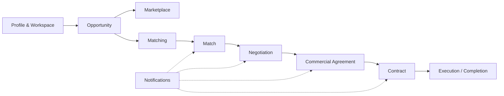
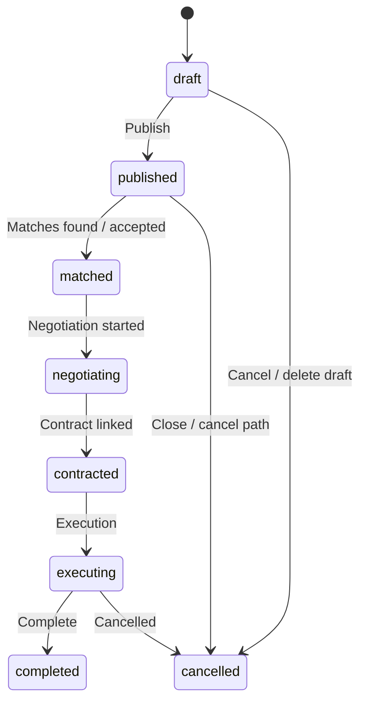
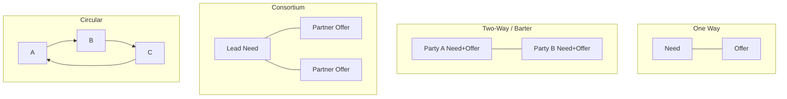
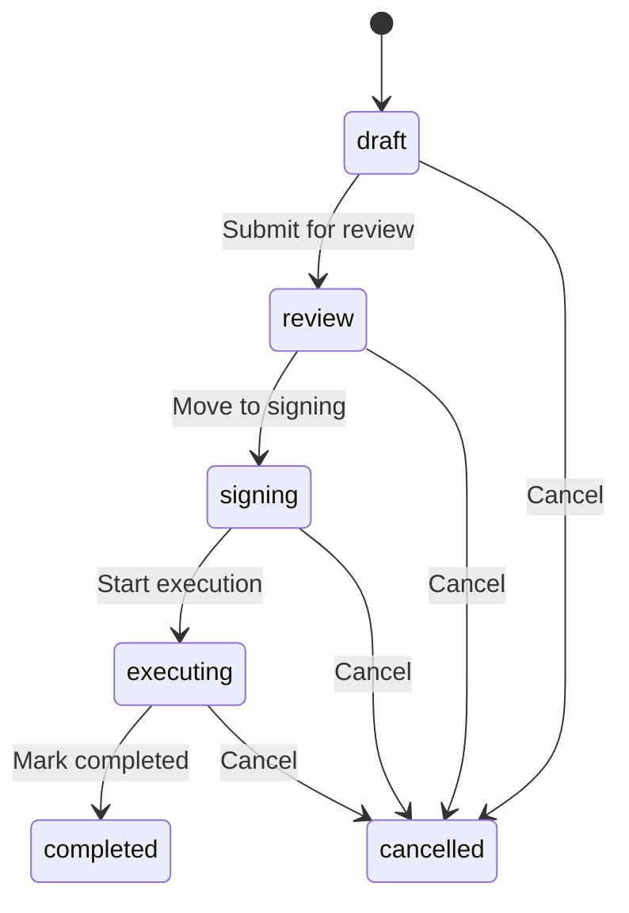
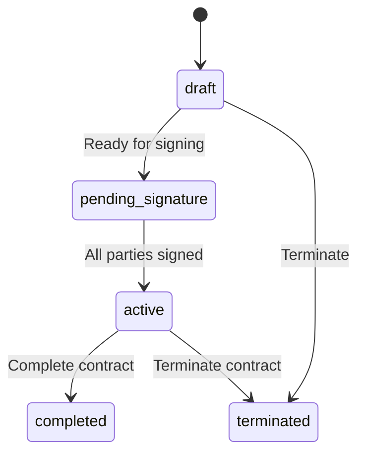
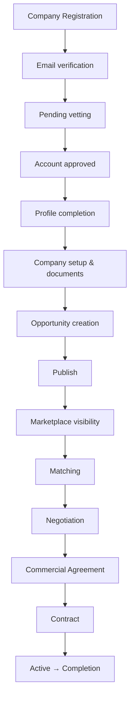

# PM-Twin Complete User Guide

**Official end-user manual for customer onboarding, training, and day-to-day use**

| | |
|---|---|
| **Product** | PM-Twin — Construction Collaboration Marketplace |
| **Audience** | End users, company owners, employees, administrators, sales teams, trainers, and customers |
| **Scope** | How the platform works today in the live web application |
| **Region focus** | Saudi Arabia and the GCC (Arabic RTL, SAR, VAT, PDPL-aware flows) |

> **Note (Demo / UAT):** In Demo and UAT environments, data may be stored in the browser and reset through admin Environment tools. Demo credentials may appear on the login and marketing screens. Features marked **Preview** or **Demo/UAT-only** in this guide are not fully production-backed yet.

---

## Table of contents

1. [Introduction](#1-introduction)
2. [Platform overview](#2-platform-overview)
3. [Core concepts](#3-core-concepts)
4. [User roles](#4-user-roles)
5. [Getting started](#5-getting-started)
6. [Complete opportunity guide](#6-complete-opportunity-guide)
7. [Marketplace guide](#7-marketplace-guide)
8. [Matching guide](#8-matching-guide)
9. [Negotiation guide](#9-negotiation-guide)
10. [Commercial agreement guide](#10-commercial-agreement-guide)
11. [Contract guide](#11-contract-guide)
12. [Notifications](#12-notifications)
13. [Dashboard guide](#13-dashboard-guide)
14. [Admin portal (overview)](#14-admin-portal-overview)
15. [Complete business journey](#15-complete-business-journey)
16. [Best practices](#16-best-practices)
17. [Troubleshooting](#17-troubleshooting)
18. [Frequently asked questions](#18-frequently-asked-questions)
19. [Glossary](#19-glossary)

---

## 1. Introduction

### What is PM-Twin?

PM-Twin is a **construction collaboration marketplace** for Saudi Arabia and the GCC. It helps companies, project managers, consultants, contractors, suppliers, and independent professionals find partners, share capacity, negotiate terms, and formalize work through commercial agreements and contracts.

The platform brings **3D design, BIM, construction delivery, equipment, and professional services** into one deal-ready workspace: you publish what you need or what you can offer, the system finds compatible partners, and you move from match → negotiation → commercial agreement → contract.

### Why it exists

Construction projects rarely succeed with a single party. Teams need:

- Short-term capacity (schedulers, BIM coordinators, site supervisors)
- Equipment and resource sharing
- Joint bids and consortia
- Service-for-service exchange (barter)
- Hiring of professionals and consultants
- Clear commercial terms, VAT-aware pricing, and signed contracts

PM-Twin replaces fragmented WhatsApp threads, email RFPs, and informal introductions with a structured collaboration path.

### Business problems it solves

| Problem | How PM-Twin helps |
|---------|-------------------|
| Hard to find the right partner quickly | Marketplace discovery + automated matching |
| Unclear scope and commercial terms | Opportunity wizard with collaboration models and commercial structure |
| No shared workspace for negotiations | Negotiation room with messages, offers, and audit trail |
| Informal “handshake” deals | Commercial agreements with review and award |
| Missing legal closure | Contracts with multi-party signing |
| Incomplete profiles hurt trust | Readiness scoring before publish |
| Company vs individual confusion | Personal and Company workspaces |

### Who should use it

- **Company owners** building partnerships and subcontracting pipelines  
- **Employees** operating inside a company workspace  
- **Individual professionals and consultants** offering or seeking work  
- **Commercial, legal, and project managers** reviewing terms and contracts  
- **Platform administrators** vetting accounts and moderating the marketplace  
- **Sales and training teams** onboarding customers  

### Typical users

| Persona | Typical goals |
|---------|----------------|
| Contractor company owner | Publish needs for subcontractors; award commercial agreements |
| BIM / design consultant | Publish offers; accept matches; negotiate cash or barter |
| Developer / owner-client | Form consortia or JVs for large packages |
| Equipment provider | Share fleet capacity via resource-sharing models |
| Independent project manager | Hire into roles or offer availability |
| Platform admin | Approve registrations, manage awards, audit activity |

---

## 2. Platform overview

PM-Twin is organized around two mental models:

| Domain | Mental model | Typical language |
|--------|--------------|------------------|
| **My Workspace** | Ownership and execution | My opportunities, pending, needs action, executing |
| **Marketplace** | Discovery | Explore, discover, available, recommended |

### Major modules

| Module | What it is | Where you find it |
|--------|------------|-------------------|
| **Dashboard** | Home for your active workspace: KPIs, tasks, notifications, next actions | My Workspace → Dashboard (`/dashboard` or `/company-dashboard`) |
| **Workspace** | Your Personal or Company business context (switchable) | Workspace switcher in the header |
| **Marketplace / Discover** | Browse published opportunities, people, and (preview) matches | Marketplace → Discover (`/marketplace`) |
| **Opportunities** | Create, edit, publish, and manage needs and offers | My Opportunities / Browse Opportunities (`/opportunities`) |
| **Matches** | System-discovered partner pairings | My Matches (`/matches`) |
| **Negotiations** | Term discussions, offers, and counter-offers | My Negotiations (`/negotiations`) |
| **Commercial Agreements** | Structured business agreements after terms are agreed | My Commercial Agreements (`/commercial-agreements`) |
| **Contracts** | Formal legal records with signing | My Contracts (`/contracts`) |
| **Pipeline** | Cross-workflow board across matches → agreements → contracts | My Pipeline (`/pipeline`) |
| **Notifications** | Alerts for matches, invitations, agreements, contracts | Notifications (`/notifications`) |
| **Messages** | Messaging surface | Messages (`/messages`) — **Demo/UAT:** threads may be mock data |
| **Profile** | Your personal or company profile and readiness | Profile (`/profile`) |
| **Company / Party documents** | Documents for vetting and compliance (CR, VAT, licenses, etc.) | Party documents (`/party-documents`) |
| **Settings** | Language direction (LTR/RTL), password, product language (staff) | Settings (`/settings`) |
| **Admin Portal** | Platform operations for administrators | Admin (`/admin/*`) |

> Screenshot: Sidebar showing My Workspace and Marketplace groups

### How modules work together

1. You complete a **profile** and work in a **workspace**.  
2. You create and **publish** an **opportunity** (Need or Offer).  
3. The **marketplace** shows published posts to others.  
4. **Matching** creates **matches** between compatible needs and offers.  
5. Parties **accept** a match and start a **negotiation**.  
6. When terms are agreed, you create a **commercial agreement**.  
7. From the agreement you create and **sign** a **contract**.  
8. Work moves through execution statuses until **completed**.

---

## 3. Core concepts

### Workspace

A **workspace** is the business context you are acting in. You may have:

- A **Personal Workspace** (individual professional or consultant)
- One or more **Company Workspaces** (as owner, admin, member, or viewer)
- Platform staff may also enter the **PM-Twin Platform** admin context

Switching workspace changes what “mine” means for opportunities, matches, and agreements.

### Company

A **company** is an organization party with its own company workspace. Owners invite employees. Some collaboration sub-models (for example Project-Specific JV, SPV, Strategic JV) require a company entity.

### Personal Workspace

A **Personal Workspace** is for professionals and consultants working independently. You can still collaborate with companies through matches and negotiations.

### Party

A **party** is a marketplace actor: either an **individual** or a **company**. Opportunities, matches, and contracts are always tied to parties (and the users acting for them).

### Opportunity

An **opportunity** is a published (or draft) **Need** or **Offer** describing scope, collaboration model, commercial terms, and timeline. Product language: *a published need or offer ready for matching*.

### Match

A **match** (also called PostMatch) is a pairing between compatible opportunities (or multi-party topologies). Matches have a score and status (discovered → accepted → confirmed, or declined/expired).

### Negotiation

A **negotiation** is the structured discussion of commercial terms after a match is accepted. It includes messages, offers, counter-offers, attachments, and an audit trail.

### Commercial Agreement

A **commercial agreement** is the business record created once terms are agreed (or awarded). It moves through draft → review → signing → executing → completed (or cancelled). It is the bridge between negotiation and contract.

> Older documentation may say “deal.” In the product UI, the preferred term is **Commercial Agreement**.

### Contract

A **contract** is the formal legal snapshot created from a commercial agreement. Parties sign it; when all required signatures are in place, it becomes **active**.

### Readiness

**Readiness** is a score (0–100%) that measures whether your **profile** and **opportunity** are complete enough for publishing and quality matching. Publishing typically requires both profile and opportunity readiness to be ready (required fields complete and score at or above **80%**).

### Validation

**Validation** checks required fields, commercial structure consistency (for example payment schedule percentages totaling 100%), and duplicate-draft warnings while you edit. Soft warnings guide quality; hard gates block publish.

### Marketplace

The **marketplace** is the discovery side of PM-Twin: browsing others’ published opportunities, companies, and professionals. Your drafts stay under **My Opportunities**, not the public marketplace.

### Ownership

Ownership answers “whose is this?”

| Scope | Meaning |
|-------|---------|
| **Mine** | Created by you in your personal context |
| **Company** | Owned by your company workspace |
| **Marketplace** | Published by others outside your organization |

### Visibility

**Visibility** controls whether an opportunity appears in active marketplace discovery (for example published vs archived). Archiving withdraws marketplace visibility; closing ends the lifecycle for new matching.

---

## 4. User roles

Roles combine **account type**, **workspace role**, and (for staff) **platform admin** permissions.

### Individual Professional (and Consultant)

**Who:** Registered with a Personal Workspace as Professional or Consultant.

**Can typically:**

- Complete personal profile and documents  
- Create opportunity drafts and publish when readiness and capabilities allow  
- Browse marketplace, view matches, accept/decline matches  
- Start and participate in negotiations (message, offer, counter, accept)  
- View commercial agreements and sign contracts when invited as a party  

**Cannot typically:**

- Create a company party without registering as Company  
- Use company-only sub-models (Project JV, SPV, Strategic JV)  
- Access the Admin Portal  

### Company Owner

**Who:** Registered a Company Workspace; membership role **owner**.

**Can typically:**

- Full opportunity lifecycle for company posts  
- Invite and manage employees (subject to workspace capabilities)  
- Accept matches, negotiate, create/execute commercial agreements  
- Award (where permitted) and create/sign contracts  
- Complete company profile and vetting documents (CR, VAT certificate, etc.)  

### Employee

**Who:** Joined a company via invitation (`/invite/:token`). Does **not** create a new company.

**Can do:** Depends on **workspace role**, for example:

| Workspace role | Typical focus |
|----------------|---------------|
| `company_admin` | Members, workspace settings, broad operational rights |
| `manager` / `project_manager` | Opportunities and delivery coordination |
| `commercial_manager` | Negotiations, agreements, awards |
| `legal` / `finance` | Review, signing, commercial terms |
| `member` | Day-to-day collaboration within granted capabilities |
| `viewer` | Read-only (no write capabilities) |

**Cannot:** Act outside the company workspace they belong to, or perform actions their role lacks (for example `opportunity.publish`, `contract.sign`, `agreement.award`).

### Reviewer

**Who:** Assigned reviewer in onboarding/vetting (often platform staff).

**Can:** Review registration packages, request clarification, approve or reject accounts.

**Cannot:** Act as a marketplace seller/buyer unless they also have a normal user membership.

### Administrator (platform staff)

**Who:** Roles such as platform admin, operations admin, moderator, auditor.

**Can:** Use the Admin Portal — identity, vetting, marketplace moderation, commercial approvals/awards, reports, audit, environments.

**Auditors / read-only analysts:** May view queues without mutating records.

> Screenshot: Role badge in the sidebar (for example “Professional” or “Platform admin”)

---

## 5. Getting started

### Logging in

1. Open **Sign in** (`/login`).  
2. Enter **email** and **password**.  
3. Optionally use remember-me (keeps session across browser restarts where enabled).  
4. After sign-in you land on your dashboard (personal or company).

> Screenshot: Sign in page  
> **Demo/UAT:** A demo credentials dialog may list seeded accounts for training.

**New users:** Use **Register** (`/register`) to create a Personal or Company workspace, complete profile steps, accept Terms and Privacy, and verify email. New accounts may be **pending vetting** — you can browse, but full actions unlock after approval.

### Switching workspaces

1. Open the **workspace switcher** in the header.  
2. Choose **Personal Workspace** or a **Company Workspace**.  
3. Company selection typically opens `/company-dashboard`; personal opens `/dashboard`.  
4. Platform staff may **enter Platform** to open Admin.

> Screenshot: Workspace switcher listing Personal and Company workspaces

### Updating your profile

1. Go to **My Profile** (`/profile`).  
2. Review Summary, Skills, Experience/Portfolio, and (for companies) Company information.  
3. Improve **profile readiness** until required fields are complete and the score reaches the publish threshold.

**Individual required (readiness):** Full Name, Role, Skills, Services, Location, Availability.  
**Individual recommended:** Portfolio, Experience, Certifications, Previous Projects.  

**Company required:** Company Name, Business Category, Services, Project Categories, Location, Contact Person.  
**Company recommended:** Portfolio, Team Size, Coverage Areas, Certifications, Financial Capacity.

### Completing company information

1. Ensure you are in the **Company Workspace**.  
2. Complete company profile fields and contact person.  
3. Upload required documents under **Party documents** (see below).  
4. If pending vetting, follow the pending dashboard guidance (upload VAT, CR, resubmit for review).

### Uploading required documents

Open **Party documents** (`/party-documents`).

| Category examples | Typical required badges |
|-------------------|-------------------------|
| profile, vetting, legal, technical, commercial, financial, insurance, certification, attachment | Commercial Registration, **VAT Certificate**, Insurance Certificate, License, National ID |

> **Note:** In some Demo/UAT registration steps, document cards may be **UI collection only** until production upload APIs are active. Party documents and pending-vetting shortcuts (Upload VAT, Upload CR) are the operational surfaces for metadata upload.

> Screenshot: Party documents upload form

### Understanding dashboard widgets

See [Section 13 — Dashboard guide](#13-dashboard-guide). At a glance you will see:

- Greeting and readiness / active matches  
- KPI strip (opportunities, matches, negotiations, agreements, contracts)  
- My tasks and next best actions  
- Notifications  
- Matching summary and marketplace recommendations  

If your account is **pending vetting**, you see a **Pending Vetting Dashboard** instead of the full workspace dashboard.

---

## 6. Complete opportunity guide

This is the most important operational section for most users.

### What is an Opportunity?

An opportunity is a structured post that says either:

- **Need** — you are requesting services, skills, resources, capacity, or project support; or  
- **Offer** — you are providing services, skills, resources, equipment, or available capacity.

Opportunities carry collaboration model, scope, commercial structure, timeline, and documents so matching and partners can evaluate fit.

### When should you create one?

Create an opportunity when you have a real collaboration intent, for example:

- You need a concrete pumping subcontractor next month  
- You can offer BIM coordination capacity  
- You want partners for a consortium bid  
- You need to hire a senior project manager for six months  
- You want to exchange design capacity for site supervision (barter)

Do **not** publish empty placeholders — readiness and matching quality depend on complete data.

### Draft vs Published

| State | Meaning | Marketplace | Matching |
|-------|---------|-------------|----------|
| **Draft** | Work in progress; autosave / Save Draft | Not discoverable as published | Does not run matching |
| **Published** | Live for discovery | Visible per ownership/visibility rules | Matching runs on publish |

You can recover a **local autosave** if the browser has a newer snapshot than the last saved draft (“Recover unsaved local draft?”).

### Opportunity lifecycle

Canonical statuses: **draft → published → matched → negotiating → contracted → executing → completed | cancelled**.

Visibility actions such as **Archive** withdraw marketplace visibility without necessarily meaning the same as lifecycle **cancelled**.

> Screenshot: Opportunity details header with status badge and lifecycle strip

### Step-by-step creation

1. From Dashboard, click **Create Opportunity** (or go to `/opportunities/create`).  
2. Complete the five wizard steps below.  
3. Use **Save Draft** anytime.  
4. On **Review & Publish**, resolve readiness items, then click **Publish Opportunity**.

> Screenshot: Opportunity Wizard - Step 1  
> Screenshot: Opportunity Wizard - Step 2  
> Screenshot: Opportunity Wizard - Step 3  
> Screenshot: Opportunity Wizard - Step 4  
> Screenshot: Opportunity Wizard - Review & Publish

Wizard steps:

| Step | Label | Purpose |
|------|-------|---------|
| 1 | Opportunity | Post type and basics |
| 2 | Collaboration | Model and sub-model |
| 3 | Scope & Work | Requirements and packages |
| 4 | Commercial Structure | Value exchange |
| 5 | Review & Publish | Confirm and publish |

Advance guards include:

- “Choose Need or Offer before continuing.”  
- “Add a title and description before continuing.”  
- “Select a collaboration model and sub-model before continuing.”

---

### Step 1 — Opportunity (basics)

**Screen help:** *Start with the post type and the basics partners need to evaluate fit.*

#### Post Type (required to advance)

| Option | Purpose | When to use |
|--------|---------|-------------|
| **Need** | Request capacity | You are the buyer of services/resources |
| **Offer** | Provide capacity | You are the seller of services/resources |

**Common mistake:** Choosing Offer when you are actually hiring — use Need (or Hiring model) when you are requesting people.

#### Basic Information

| Field | Required? | Purpose | Best practice | Common mistake |
|-------|-----------|---------|---------------|----------------|
| **Title** | Required | Searchable name | Specific: “BIM Coordination — Riyadh Tower Q3” | Vague titles like “Project help” |
| **Short description** | Required | Partner evaluation | 2–4 sentences on scope and outcome | Copy-paste of full RFP with no summary |
| **Category or profession** | Required | Discovery / sector | Align with real trade or discipline | Leaving default or unrelated category |
| **Target role** | Required | Who should respond | “MEP Subcontractor”, “Planning Engineer” | Leaving blank or too broad |
| **Primary location** | Required | Geography fit | City + site context | “KSA” only when city matters |
| **Service area** | Optional | Coverage | Regions you can serve or need covered | Ignoring multi-city coverage |
| **Start date** | Required | Timeline matching | Realistic start | Past dates without explanation |
| **Deadline** | Optional | Tender / delivery cutoff | Use for RFPs and hard ends | Conflicting with start date |
| **Availability end date (recommended)** | Recommended | Offer capacity window | Especially important for Offers | Omitting when capacity is time-bound |

---

### Step 2 — Collaboration Model

**Screen help:** *Choose how parties will work together. Matching structure is derived automatically.*

#### Main Collaboration Model (required)

| Model | Meaning | Example |
|-------|---------|---------|
| **Cash Subcontracting** | Engage another party to deliver defined work for payment | Concrete pumping subcontract |
| **Service Exchange / Barter** | Exchange complementary services without pure cash | Design capacity for site supervision |
| **Joint Venture** | Partner for shared project or business outcome | SPV for mixed-use development bid |
| **Resource Sharing** | Share equipment, people, or materials | Shared crane fleet |
| **Hiring / Professional Engagement** | Hire a professional or consultant | Senior PM for 6 months |

#### Sub-model (required)

Pick the engagement pattern under the main model. Examples:

| Main model | Sub-models (examples) |
|------------|------------------------|
| Cash Subcontracting | Task-Based Engagement; Competition / RFP |
| Service Exchange | Long-Term Strategic Alliance; Mentorship Program; Task-Based Engagement |
| Joint Venture | Consortium; Project-Specific Joint Venture; SPV; Strategic Joint Venture |
| Resource Sharing | Bulk Purchasing; Equipment Sharing; Resource Sharing & Exchange |
| Hiring | Professional Hiring; Consultant Hiring |

**Company-only:** Project-Specific JV, SPV, and Strategic JV require a **company entity**.

Each sub-model shows additional **Collaboration Details** fields (for example Task Title, Equity Split, Equipment Type). Required sub-model fields must be completed for a quality publish.

#### Matching structure (read-only)

The system shows **Recommended matching structure** (One Way, Two-Way, Consortium, or Circular). You cannot pick this manually — it is derived from model, sub-model, and value exchange. Use **Why?** for explainability.

---

### Step 3 — Scope & Work

**Screen help:** *Define requirements, work packages, tasks, deliverables, and milestones.*

#### Skills

| Field | Purpose | Required? | Tips |
|-------|---------|-----------|------|
| Skills Required / Skills Offered | Matching quality | Soft-required for readiness | Add level, years, certification, mandatory flags |
| Skill name | Specific capability | Per skill | e.g. “BIM Coordination” |

**Common mistake:** Listing only soft skills or one vague skill.

#### Services

Comma-separated **Services Required** or **Services Offered** (soft-required for readiness). Example: `Design Review, Coordination`.

#### Qualifications & partner preference

| Field | Required? | Purpose |
|-------|-----------|---------|
| Preferred partner type | Recommended | Company / individual / consultant preference |
| Experience level | Optional | Seniority filter |
| Certifications | Optional | Compliance and trust |
| Team size | Optional | Capacity expectation |
| Minimum qualifications | Optional | Hard floors for responders |

#### Resources

People, equipment, vehicles, materials, software, licenses — optionally linked to a work package.

| Field | Notes |
|-------|-------|
| Type | people, equipment, vehicles, materials, software, licenses |
| Name | Required per resource |
| Quantity / Unit / Availability | Clarity for partners |
| Work package | Global or package-specific |
| Mandatory | Checkbox |

**Offer capacity** (Offer only): Available / Reserved / Maximum capacity and Available from — metadata for partners (not used as the matching engine input by itself).

#### Work Packages

Break delivery into manageable units:

1. Click **Add Work Package**.  
2. Enter package title and description/scope.  
3. Add **Tasks** and **Package deliverables**.  
4. Set package dates as needed.

**Best practice:** At least one clear package for anything beyond a tiny task engagement.

#### Deliverables (opportunity-level)

Add deliverables with title and acceptance criteria; scope can be entire opportunity or a work package.

#### Milestones

Add milestones with completion criteria and optional **Payment trigger** — important for cash schedules.

#### Timeline & Location

| Context | Typical fields |
|---------|----------------|
| Need | Location, Start date, Deadline |
| Offer | Preferred location / service area, Availability from |
| Rich timeline (presentation) | Flexible start, Weekend allowed, Must finish before, Estimated duration, Working days, Shift type |

#### Attachments & compliance

| Field | Purpose | Best practice |
|-------|---------|---------------|
| Attachments | Document names (comma-separated in wizard) | List SOW, drawings, BOQ names clearly |
| Compliance requirements | SBC, PDPL, H&S, licenses | Be explicit for KSA projects |
| Portfolio references | Proof of capability | Link prior similar work |

---

### Step 4 — Commercial Structure

**Screen help:** *Configure one or more value exchange components. Hybrid is derived automatically.*

Enable one or more: **Cash**, **Barter**, **Profit Sharing**, **Revenue Sharing**, **Equity**, **Custom**. If more than one is enabled, mode becomes **Hybrid**.

#### Cash (SAR-focused)

| Field | Purpose | Tips |
|-------|---------|------|
| Currency | Usually **SAR** | Keep consistent across schedule |
| Budget type | Fixed, Range, Rate-based, Milestone-based, To be negotiated | Match how you really buy/sell |
| Fixed amount | Monetary value | Align with milestones |
| Advance % / Retention % | Cash flow and quality holdback | Common in KSA construction |
| Payment terms | When paid | Align with deliverables |
| **VAT handling** | Tax treatment | Be explicit; KSA standard VAT is **15%** at platform settings level |
| Bank guarantee | Security instruments | Use when contractually required |
| Payment schedule | Milestones with % / amount | Percentages should total **100%** |

#### Barter

Offered asset/service, requested asset/service, valuation method, estimated value.

#### Profit / Revenue / Equity / Custom

Share percentages, calculation basis, settlement, equity type, exit strategy, or custom calculation method.

#### Allocation & constraints

When multiple components are enabled, set allocation method (Percentage, Fixed, Mixed, Not applicable) and optional commercial constraints (for example budget ceiling).

**Common mistakes:**

- Enabling Cash with empty amounts and “to be negotiated” everywhere — hurts readiness  
- Payment schedule percentages that do not total 100%  
- Barter without valuation  

---

### Step 5 — Review, Readiness, Validation, Publishing

Review shows an **executive summary** and section cards with **Edit** links:

- Opportunity Summary  
- Collaboration  
- Scope and Requirements  
- Work Packages and Tasks  
- Commercial Structure  
- Timeline and Location  
- Documents and Compliance  

#### Readiness

Publish is allowed when:

1. **Profile** is ready for matching (required fields + score ≥ **80%**), and  
2. **Opportunity** is publish-ready (required fields + score ≥ **80%**)

Blocked message example: *Complete your profile and opportunity details before publishing for matching.*

Required opportunity messages include: add title; choose Need or Offer; category; target role; skills; services; location; start/availability; collaboration model; description; commercial terms.

Recommended improvements (optional but raise score): preferred partner type, portfolio/documents, compliance, delivery milestones.

> Screenshot: Opportunity Readiness drawer — Required Before Publishing

#### Publishing

1. Resolve required readiness items.  
2. Click **Publish Opportunity**.  
3. Status becomes **published**.  
4. Matching runs and may create matches + notifications.

---

### Editing, duplicating, closing, archiving, awarding

| Action | When available | Effect |
|--------|----------------|--------|
| **Edit** | Owner; not archived/closed | Update draft or published content |
| **Publish** | Owner + draft + readiness | Enter marketplace; trigger matching |
| **Duplicate as Draft** / **Template** | Owner | New draft copy |
| **Archive** | Owner; not draft/archived | Withdrawn from active marketplace visibility |
| **Close Opportunity** | Owner; not draft/closed/archived | Ends lifecycle for new matching |
| **Delete Draft** | Owner + draft | Permanent delete of draft |
| **Export PDF / JSON**, Print, Share, Copy Link | Owner tooling | Sharing and records |

**Awarding** is **not** an opportunity detail button. Awarding happens on **Commercial Agreements** / Admin **Award Management** when multiple agreements compete on one opportunity.

Opportunity detail workspaces include: Overview, Scope & Work, Commercial, Marketplace, Matching, Documents, Related, History.

---

### Realistic example (start to finish)

**Scenario:** A Riyadh contractor needs BIM coordination for a tower fit-out (cash subcontract, task-based).

1. Log in as company owner → Company Workspace.  
2. Profile readiness ≥ 80%; VAT certificate and CR uploaded.  
3. **Create Opportunity** → Post Type **Need**.  
4. Title: “BIM Coordination Support — Tower Fit-out, Riyadh”.  
5. Category: Construction / BIM; Target role: BIM Coordinator; Location: Riyadh; Start date set.  
6. Collaboration: **Cash Subcontracting** → **Task-Based Engagement**; fill task title, scope, duration, skills, experience, payment terms.  
7. Scope: Skills Required = BIM Coordination (Expert); Services = Clash Detection, Model Coordination; one work package “Coordination Package”; milestones with payment triggers.  
8. Commercial: Cash, SAR, Fixed amount, Advance 20%, Retention 5%, VAT handling explicit, schedule totaling 100%.  
9. Review → readiness green → **Publish**.  
10. Matches appear → accept best match → **Start negotiation** → agree terms → **Create Commercial Agreement** → **Create contract** → parties **Sign** → contract **Active**.

---

## 7. Marketplace guide

### Browsing opportunities

1. Open **Marketplace → Discover** (`/marketplace`) for the discovery hub (KPIs and explore-by-model links), or  
2. Open **Browse Opportunities** (`/opportunities` in marketplace presentation).

Tabs commonly include:

- **All Marketplace** — published posts from others  
- **My Opportunities** — yours  
- **Company Opportunities** — your organization’s  

> Screenshot: Marketplace opportunity list with ownership badges

### Filters and search

| Control | Typical options |
|---------|-----------------|
| Search | “Search available opportunities…” / “Search my opportunities…” |
| Status | All / Published / Draft / Negotiating |
| Main collaboration model | Cash subcontracting, service exchange, JV, resource sharing, hiring |
| Exchange mode | Cash, Barter, Profit-Sharing, Equity, Hybrid |
| Match type | One Way, Two-Way, Consortium, Circular |

### Cards and details

Cards emphasize ownership → need/offer → status → primary action. Open a card to view opportunity details (full fields may require verification for some teaser views).

### Saving opportunities

**Bookmark / save-for-later is not supported** in the current product. Use Matches, Pipeline, or notifications to track what matters.

### Marketplace rules and visibility

- Only **published** opportunities appear in marketplace discovery.  
- **Drafts** remain under My / Company ownership tabs.  
- **Archived** posts are withdrawn from active marketplace visibility.  
- **Browse Matches** and **Map** are marked **Preview**.  
- Browse Companies / Professionals uses the People routes with scope (companies vs professionals).

---

## 8. Matching guide

### What matching is

Matching is the automatic pairing of compatible Needs and Offers (and multi-party structures) after an opportunity is **published**. Each match includes a **match score** and fit breakdowns (for example Skill match, Timeline fit, Location fit).

### When it happens

Matching runs when you **publish** an opportunity. Users then see matches under **My Matches**, recommended areas on the dashboard, and notifications such as **New match found**.

### Matching topologies

| Topology | Label | Meaning |
|----------|-------|---------|
| `one_way` | One Way Matching | A Need matched to Offers (or Offer to Needs) |
| `two_way` | Two-Way Dependency (Barter) | Reciprocal need + offer |
| `consortium` | Group Formation | Lead need fulfilled by multiple partner offers |
| `circular` | Circular Exchange | Ring A → B → C → A |

Topology is **derived** from collaboration configuration — users do not pick it manually.

### What to expect after a match appears

1. Notification: **New match found**.  
2. Open **My Matches** → filter **Discovered**.  
3. Review score, confidence (High / Medium / Low), related opportunities, and participants.  
4. **Accept** or **Decline**.  
5. When accepted (and confirmed as required by flow), click **Start negotiation**.  

Statuses: **discovered → accepted → confirmed | declined | expired | superseded**.

> Screenshot: Match detail with score and Accept / Decline actions

---

## 9. Negotiation guide

### Starting negotiations

1. Accept the match.  
2. Click **Start negotiation**.  
3. You are taken to the negotiation detail / room (`/negotiations/:id`).

### Negotiation room tabs

| Tab | Use it for |
|-----|------------|
| Overview | Status, mode, linked records (match, commercial agreement, contract) |
| Discussion | Send messages |
| Offers & Counter Offers | Amounts in SAR, submit/accept/reject |
| Commercial Terms | Structured terms |
| Attachments | Supporting files/metadata |
| Audit Trail | History of actions |

> Screenshot: Negotiation room — Offers & Counter Offers tab

### Messages, offers, and counter-offers

- **Send message** in Discussion.  
- Enter **Offer amount (SAR)** → **Submit offer** or **Submit counter offer**.  
- **Accept** an offer → negotiation becomes **agreed**; other submitted offers may be rejected.  
- **Reject** an offer → negotiation can continue.  

Header actions may include **Agree terms**, **Cancel negotiation**, **Create Commercial Agreement**, **Submit proposal**, **Accept updated proposal**.

### Statuses

**active ↔ countered → agreed | expired | cancelled**

### Example conversation

> **Contractor (Need):** “We can accept 185,000 SAR including VAT handling as discussed, 20% advance, 5% retention.”  
> **BIM firm (Offer):** Submits offer **185,000 SAR**.  
> **Contractor:** Accepts offer → toast: “Offer accepted — negotiation agreed”.  
> **Next:** Create Commercial Agreement → Create contract.

### Cancelling and history

- **Cancel negotiation** sets status to cancelled.  
- Use **Audit Trail** and list filters (Active, Countered, Agreed, Cancelled, Expired) for history.

---

## 10. Commercial Agreement guide

### Why it exists

A commercial agreement turns agreed negotiation terms into a governed business record with participants, commercial terms, and a lifecycle that supports review, signing readiness, execution, award, and completion — before or alongside the legal contract.

### Relationship with negotiations

Typically: **Match accepted → Negotiation agreed → Create Commercial Agreement**. Linked records show the source match/negotiation and later the contract.

### Statuses and approval process

| Button | Moves to |
|--------|----------|
| Submit for review | review |
| Move to signing | signing |
| Start execution | executing |
| Mark completed | completed |
| Cancel commercial agreement | cancelled |

### Review and award

- Detail page shows participants, commercial terms, and recommended actions (**Create contract**, **Review negotiation**).  
- **Award commercial agreement** (where permitted): winner moves toward signing; sibling agreements may be rejected/cancelled; a contract may be created.  
- Admin **Award Management** groups opportunities that have multiple competing agreements.  
- Admin **Approvals** lists agreements in review-related statuses (decision actions on the list page may be limited depending on environment).

### Rate participants

At `/commercial-agreements/:id/rate`, parties can open **Rate participants** (criteria: Communication · Quality · Timeliness · Collaboration). Treat as a feedback surface; confirm with your trainer whether reviews are fully persisted in your environment.

> Screenshot: Commercial agreement detail with lifecycle actions

---

## 11. Contract guide

### How contracts relate to commercial agreements

Contracts are created **from** a commercial agreement (**Create contract**). The contract detail links back to the agreement, match, negotiation, and related need/offer opportunities.

### Lifecycle

### Creating, reviewing, signing, activating, completing, closing

| Step | User action | Result |
|------|-------------|--------|
| Create | **Create contract** from agreement | Draft contract; notification **Contract created** |
| Review | Open contract detail | Check parties, payment schedule, links |
| Sign | **Sign contract** | Records your signature; when all signed → **active** |
| Complete | **Complete contract** | Status **completed** |
| Terminate | **Terminate contract** | Status **terminated** |

List filters: Draft, Pending signature, Active, Completed, Terminated.

> **Note (Demo/UAT):** Attachment uploads on contracts may show that file uploads are not available in the preview build.

> Screenshot: Contract parties & signatures panel

---

## 12. Notifications

Open **Notifications** (`/notifications`). Filter All / Unread / Read. Groups: **Today**, **Yesterday**, **Earlier**.

### Notification types and actions

| Notification | Meaning | What you should do |
|--------------|---------|-------------------|
| New match found | Matching discovered a partner | Open match → review → Accept or Decline |
| Match accepted | A participant accepted | Wait for confirmation or continue workflow |
| Match confirmed | All required parties accepted | **Start negotiation** |
| Match declined | A participant declined | Review alternatives / other matches |
| Negotiation started | Discussion room opened | Open negotiation → respond |
| Commercial Agreement created | Agreement created from match/application | Review terms → advance lifecycle |
| Contract created | Contract drafted from agreement | Review → **Sign contract** |
| Invitation received | Invited to a company workspace | Open invite link / accept |
| Invitation accepted | Invitee accepted | Activate membership if you are owner/admin |
| Membership activated | Company membership is active | Switch to company workspace |
| Workspace activated | Full collaboration unlocked | Create/publish opportunities |
| Opportunity creation enabled | Posting unlocked after vetting | Create opportunity |
| Registration submitted / Resubmission | Onboarding package sent | Wait for reviewer |
| Account approved | Vetting complete | Complete profile; start collaborating |
| Account rejected / suspended | Onboarding failed or suspended | Read reason; contact support / clarify |
| Clarification requested | Reviewer needs more info | Upload docs / respond |
| Review received / Document replaced | Document activity | Check party documents |
| Review overdue | Onboarding SLA pressure | Respond immediately |

Dashboard card **My notifications** shows the latest items with **View all**.

---

## 13. Dashboard guide

> Screenshot: Workspace dashboard KPI strip and tasks

### Header

- Greeting (“Good morning, …”)  
- **Profile readiness** or **Active matches** highlight  
- Primary CTA: **Create Opportunity**  
- Secondary: **My pipeline**

### KPI strip

| KPI | Meaning |
|-----|---------|
| My opportunities | Your posts in this workspace |
| My matches | Match records involving you |
| My negotiations | Active term discussions |
| My commercial agreements | Agreement records |
| My contracts | Contract records |

### My tasks

Actionable items such as:

- Review new match → **Open match**  
- Respond to negotiation → **Open negotiation**  
- Agreement in review/signing → **Open commercial agreement**  
- Draft ready to publish → **Open opportunity** / **Edit**

### Next best actions & explainability

Prioritized recommendations and (when available) **Dashboard explainability** with a workspace health score.

### My workflow

Active negotiations and agreements; link to **Open pipeline**. Empty: “No active workflow items”.

### Blocked — needs decision

Items that need a human decision (for example match needs replacement). Address blockers before the pipeline stalls.

### My matching summary

Counts by topology: One Way, Two-Way, Group Formation, Circular Exchange.

### Recommended from marketplace

Suggested match cards; browse further matches from here.

### Executive intelligence snapshot

Links/summary for Portfolio readiness, Funnel conversion, Risk blockers, Execution health (intelligence module).

### Pending vetting dashboard

Shown instead of the full dashboard until registration is approved. Follow upload and resubmit guidance.

---

## 14. Admin portal (overview)

For platform administrators only (`/admin/*`). Functional overview — not a developer manual.

> Screenshot: Admin Command Center home

### Command Center

| Page | Purpose |
|------|---------|
| Executive | Ops command home |
| Operations | Operational queues |
| Risk & Compliance | Risk-oriented views |
| My Queue | Work assigned to you |
| Admin Inbox | Admin messages / items |

### Identity & access / onboarding

- **Users, Parties, Memberships, Roles** — manage who can act  
- **Onboarding Center / Vetting** — New Registrations, Pending Review, Clarifications, Approved, Rejected, Suspended  
- Activate workspaces and enable opportunity creation after successful review  

### Marketplace management

- Opportunities, Matching, PostMatches, Matching Quality, Taxonomy, Moderation  

### Commercial operations

- Negotiations, Commercial Agreements, **Approvals**, **Award Management**, Contracts, Legal Review  

### Reports

Analytics and reporting views for platform performance.

### Audit, environment, settings

| Area | Purpose |
|------|---------|
| Audit | Trace sensitive actions |
| Environments | **Demo/UAT:** scenario restore, export/import |
| Health / Feature Flags / Data Quality / Failed Commands | Platform operability |
| Settings | Includes commercial defaults such as currencies and **VAT rate % (default 15)** |

Some configuration shells (Skills, Site content, Subscriptions, Disputes, Vetting Config) may appear as **planned** or limited in the current build.

---

## 15. Complete business journey

End-to-end walkthrough of the happy path.

### Step-by-step screens and actions

1. **Company Registration** (`/register`)  
   - Choose **Company Workspace** → role (Contractor, Consultant Company, Owner/Client, Supplier) → profile info → documents & terms → review → verify email.  

2. **Profile Completion** (`/profile`)  
   - Fill required company fields until readiness ≥ 80%.  

3. **Company Setup** (`/party-documents`)  
   - Upload CR, VAT Certificate, insurance/licenses as required; respond to clarifications.  

4. **Opportunity Creation** (`/opportunities/create`)  
   - Complete all five wizard steps; **Save Draft** as needed.  

5. **Publish** (Review step)  
   - Clear readiness blockers → **Publish Opportunity**.  

6. **Marketplace**  
   - Partners discover your Need under Browse Opportunities / Discover.  

7. **Matching**  
   - System creates matches; you receive **New match found**.  

8. **Negotiation**  
   - Accept match → Start negotiation → discuss → submit/accept offer → Agree terms.  

9. **Commercial Agreement**  
   - Create agreement → Submit for review → Move to signing → (optional) Award if competing.  

10. **Contract**  
    - Create contract → parties Sign → contract Active.  

11. **Completion**  
    - Start execution on agreement as applicable → Complete contract / Mark agreement completed → Close related opportunity when appropriate.  

> Screenshot: Pipeline view showing Match → Negotiation → Agreement → Contract  

---

## 16. Best practices

### High-quality opportunities

- Write specific titles and honest short descriptions.  
- Always set Need vs Offer correctly.  
- Choose the collaboration model that matches the real engagement (do not force JV language onto a simple subcontract).  
- Add structured skills with levels; list services clearly.  
- Use work packages and milestones for anything non-trivial.  
- Make VAT handling and SAR amounts explicit.  
- Reach readiness ≥ 80% before publish — do not “publish empty and fix later.”

### Negotiations

- Keep commercial numbers in Offers (SAR), not only in chat.  
- Accept only when scope, dates, and VAT treatment are clear.  
- Use Cancel rather than abandoning silent threads.  
- After agree, create the commercial agreement promptly.

### Profiles and trust

- Keep availability and location current.  
- Upload CR and VAT Certificate early for company accounts.  
- Add portfolio and certifications to improve readiness and partner confidence.

### Collaboration success

- Respond to matches quickly while they are still **discovered**.  
- Prefer one clear commercial structure over many empty hybrid toggles.  
- Use Pipeline weekly as your operating cadence.  
- For multi-party models (consortium/circular), align roles before publishing.

---

## 17. Troubleshooting

### Why can't I publish?

| Possible cause | What to do |
|----------------|------------|
| Profile readiness below threshold or missing required fields | Complete Profile until ready (≥ 80% + required) |
| Opportunity required items incomplete | Open Readiness drawer; fix title, skills, services, commercial, etc. |
| Account pending vetting | Wait for approval or submit clarifications |
| Missing capability `opportunity.publish` | Ask company owner/admin for a role with publish rights |
| Not signed in | Sign in again |

### Why can't I edit?

- You are not the owner.  
- Opportunity is **archived** or **closed**.  
- Your workspace role is **viewer** or lacks edit capability.

### Why can't I see opportunities?

- You are on **My Opportunities** looking for others’ posts — switch to **All Marketplace**.  
- Posts are still **draft** (not published).  
- Posts were **archived**.  
- Filters (status/model) hide results — reset filters.  
- Preview teaser may limit detail until verification is complete.

### Why is my opportunity still a draft?

- You clicked **Save Draft** but not **Publish Opportunity**.  
- Publish was blocked by readiness.  
- Autosave recovered a local draft that was never published.

### Why didn't matching happen?

- Opportunity was never successfully published.  
- No compatible Need/Offer exists in the marketplace yet.  
- Collaboration/commercial configuration yields a topology with no partners.  
- Check notifications and Matching Quality (admin) in Demo/UAT seed scenarios.

### Why can't I access a negotiation?

- Match was not accepted / negotiation not started.  
- Negotiation was **cancelled** or **expired**.  
- You are not a participant.  
- Wrong workspace selected.

### Why can't I create a contract?

- No commercial agreement exists yet (agree negotiation first).  
- Agreement not advanced far enough / missing capability.  
- Award selected a different agreement as winner.  
- You lack `contract.sign` / create rights in this workspace.

---

## 18. Frequently asked questions

1. **What is PM-Twin?**  
   A construction collaboration marketplace for KSA/GCC that takes you from opportunity to match, negotiation, commercial agreement, and contract.

2. **Is PM-Twin only for companies?**  
   No. Individuals (professionals and consultants) use Personal Workspaces; companies use Company Workspaces.

3. **What is the difference between Need and Offer?**  
   Need requests capacity; Offer provides capacity.

4. **Do I need to publish to get matches?**  
   Yes. Matching runs after publish.

5. **Can I edit after publishing?**  
   Owners can edit if the opportunity is not archived or closed. Major changes may affect partner fit; review matches afterward.

6. **What readiness score do I need?**  
   Publish expects profile and opportunity readiness with required fields complete and scores at or above **80%**.

7. **What currency should I use?**  
   **SAR** is the default commercial currency in the product.

8. **How is VAT handled?**  
   Cash commercial fields include VAT handling. Platform commercial settings default VAT rate to **15%**. Be explicit in your terms.

9. **Can I use Arabic?**  
   Settings support **العربية (RTL)** layout direction. Use Arabic content in titles/descriptions as needed for your audience.

10. **What is a workspace?**  
    The Personal or Company context you act in; switch it from the header.

11. **How do employees join?**  
    Owners send invitations; employees open `/invite/:token` and accept.

12. **Why am I pending vetting?**  
    New registrations may require admin review before full collaboration rights.

13. **What documents do companies need?**  
    Typically Commercial Registration, VAT Certificate, insurance, licenses, and related identity documents.

14. **Are registration document uploads always stored?**  
    In some Demo/UAT registration steps, documents may be UI-only until production upload is active. Use Party documents / vetting flows for operational uploads.

15. **What collaboration model should I pick for a simple subcontract?**  
    Cash Subcontracting → Task-Based Engagement.

16. **When do I use Service Exchange?**  
    When value is primarily traded services/resources rather than pure cash.

17. **Who can create an SPV opportunity?**  
    Company entities only (not personal workspaces).

18. **What is hybrid commercial structure?**  
    More than one value component enabled (for example Cash + Barter); mode is derived automatically.

19. **Can I bookmark marketplace items?**  
    No. Bookmarks/saves are not supported currently.

20. **What does Archive do?**  
    Withdraws the opportunity from active marketplace visibility.

21. **What does Close Opportunity do?**  
    Ends the opportunity lifecycle for new matching.

22. **Can I duplicate an opportunity?**  
    Yes — Duplicate as Draft or as Template.

23. **Where do I award a winner?**  
    On commercial agreement award actions / Admin Award Management — not on the opportunity action menu.

24. **What is a PostMatch?**  
    The system record for a match between posts (shown to users as a Match).

25. **What do match confidence labels mean?**  
    High / Medium / Low based on score thresholds (for example ≥0.9 / ≥0.75).

26. **Must both sides accept a match?**  
    Flows move through accepted toward confirmed when all required participants accept; declining ends that match path.

27. **How do I start talking about price?**  
    Start negotiation → Offers & Counter Offers → submit SAR amounts.

28. **What happens when I accept an offer?**  
    That offer is accepted, negotiation becomes agreed, and you can create a commercial agreement.

29. **Can I reject an offer without cancelling the negotiation?**  
    Yes. Reject keeps the negotiation open for further offers.

30. **How do I cancel a negotiation?**  
    Use **Cancel negotiation** on the detail/more menu.

31. **Is Messages fully live?**  
    In Demo/UAT, Messages may show mock threads. Prefer Negotiation Discussion for deal conversations.

32. **What is the Pipeline?**  
    A workflow board across workspace items, matches, and (optionally legacy) applications.

33. **What are legacy applications?**  
    An older apply path. Primary collaboration runs through matches; legacy may appear only when enabled.

34. **Can viewers publish opportunities?**  
    No. Viewer workspace role has no write capabilities.

35. **What is the difference between commercial agreement and contract?**  
    The agreement is the business record; the contract is the legal signing record created from it.

36. **Who must sign a contract?**  
    The signing parties listed on the contract; status becomes active when all required signatures are recorded.

37. **Can I terminate a contract?**  
    Yes — **Terminate contract** sets status to terminated.

38. **Where do notifications appear?**  
    `/notifications` and the dashboard **My notifications** card.

39. **I got “Clarification requested.” What now?**  
    Read the reason, upload or update documents, and resubmit for review.

40. **Why is Browse Matches marked Preview?**  
    Marketplace match browsing is preview-scoped in the current product.

41. **Why is Map marked Preview?**  
    Geospatial map browsing is preview / not fully configured for production coordinates.

42. **Does editing always re-run matching?**  
    Publishing triggers matching. Do not assume every edit re-runs matching unless you publish again or your trainer confirms environment behavior.

43. **What is Ownership “Marketplace” on a card?**  
    The post was published by someone outside your organization.

44. **How do intelligence pages help?**  
    Portfolio, Funnel, Risk, and Execution intelligence summarize readiness and workflow health for operators.

45. **Can auditors edit negotiations?**  
    Auditor views may be read-only: transcript visible, write actions disabled.

46. **What is Award Management?**  
    Admin tool to award one commercial agreement among several on the same opportunity.

47. **What VAT rate does Admin Settings default to?**  
    **15%**.

48. **Can I export an opportunity?**  
    Yes — Export JSON / Export PDF (PDF via print dialog tip).

49. **What if local autosave differs from saved draft?**  
    Use **Continue draft** or **Discard** on the recovery banner; final persistence still uses Save Draft / publish.

50. **Is Demo data permanent?**  
    In Demo/UAT, admins may restore environments/scenarios; treat data as training data unless told otherwise.

51. **How do I switch language direction?**  
    Settings → English (LTR) or العربية (RTL).

52. **What is product language customization?**  
    Staff/owner settings can rename entity labels (Opportunity, Negotiation, etc.) for presentation.

53. **Can I create a contract without a commercial agreement?**  
    The supported path is from a commercial agreement.

54. **Why do JV sub-models ask for equity split?**  
    Those engagements share capital/governance; equity fields capture the commercial reality.

55. **What payment schedule mistake blocks quality?**  
    Milestone percentages that do not total 100%.

56. **Do Offer capacity fields drive matching alone?**  
    Offer capacity is metadata for partners; matching uses broader opportunity configuration.

57. **Where do I rate partners?**  
    Commercial agreement → Rate participants.

58. **What should sales teams demo first?**  
    Create Need → Publish → Show match → Negotiation offer → Agreement → Contract sign.

59. **What should trainers emphasize?**  
    Workspace switch, readiness ≥ 80%, correct collaboration model, and the Match → Contract chain.

60. **Who do I contact if vetting is stuck?**  
    Platform administrators / Onboarding Center reviewers via your customer success contact.

---

## 19. Glossary

| Term | Definition |
|------|------------|
| **Accept (match)** | Participant agrees to proceed with a discovered match |
| **Accept (offer)** | Accepts a negotiation offer and typically agrees the negotiation |
| **Admin Portal** | Platform operations area for administrators |
| **Archive** | Withdraw an opportunity from active marketplace visibility |
| **Audit Trail** | Chronological record of negotiation (or admin) actions |
| **Award** | Select a winning commercial agreement among competitors |
| **Barter** | Non-cash exchange of services, capacity, or resources |
| **BIM** | Building Information Modeling — a common collaboration domain on PM-Twin |
| **Cash Subcontracting** | Paid delivery for a defined scope |
| **Circular Exchange** | Multi-party ring matching (A→B→C→A) |
| **Close Opportunity** | End the opportunity lifecycle for new matching |
| **Commercial Agreement** | Business agreement record after negotiation (formerly often called “deal”) |
| **Commercial Structure** | Value exchange configuration (cash, barter, equity, etc.) |
| **Company Workspace** | Workspace for an organization party |
| **Consortium** | Multi-party group formation around a lead need |
| **Contract** | Legal record created from a commercial agreement for signing |
| **Counter-offer** | Revised offer submitted during negotiation |
| **CR (Commercial Registration)** | Company registration document used in KSA vetting |
| **Dashboard** | Workspace home with KPIs, tasks, and recommendations |
| **Deliverable** | Agreed output with acceptance criteria |
| **Demo / UAT** | Training or acceptance environments; may use browser persistence and demo tools |
| **Draft** | Unpublished opportunity (or contract/agreement) still being prepared |
| **Employee** | User invited into a company workspace |
| **Equity** | Ownership stake as a value exchange component |
| **Hybrid** | More than one value exchange component enabled |
| **Individual Professional** | Personal-workspace user offering or seeking work |
| **Joint Venture** | Shared delivery/governance collaboration model |
| **Marketplace** | Discovery domain for published opportunities and people |
| **Match / PostMatch** | Pairing of compatible opportunities |
| **Match score** | Numeric fit indicator for a match |
| **Matching** | Automatic process that creates matches after publish |
| **Milestone** | Delivery checkpoint; may trigger payment |
| **Need** | Opportunity post requesting capacity |
| **Negotiation** | Structured term discussion after match acceptance |
| **Offer (post type)** | Opportunity post providing capacity |
| **Offer (negotiation)** | Priced proposal inside a negotiation |
| **One Way Matching** | Simple Need↔Offer matching |
| **Opportunity** | Structured Need or Offer post |
| **Ownership** | Whether a record is mine, company, or marketplace |
| **Party** | Individual or company marketplace actor |
| **Party documents** | Uploaded compliance and profile documents |
| **PDPL** | Personal Data Protection Law (KSA) — data handling expectation |
| **Personal Workspace** | Workspace for an independent professional/consultant |
| **Pipeline** | Cross-entity workflow board |
| **Preview** | Feature available in limited/preview form |
| **Profit sharing** | Split of profit as commercial component |
| **Publish** | Make a draft opportunity live and trigger matching |
| **Readiness** | Completeness score for profile and/or opportunity |
| **Resource Sharing** | Collaboration model for pooling equipment/people/materials |
| **Revenue sharing** | Split of revenue as commercial component |
| **Reviewer** | Role that vets onboarding packages |
| **RTL** | Right-to-left layout (Arabic) |
| **SAR** | Saudi Riyal — default commercial currency |
| **Service Exchange** | Barter-oriented collaboration model |
| **SPV** | Special Purpose Vehicle — company-only JV sub-model |
| **Sub-model** | Specific engagement pattern under a main collaboration model |
| **Two-Way Dependency** | Reciprocal need+offer (barter) matching topology |
| **Validation** | Checks that fields and commercial structures are consistent |
| **VAT** | Value Added Tax; KSA standard rate reflected as 15% in settings |
| **Vetting** | Onboarding review before full platform activation |
| **Visibility** | Whether a post is discoverable in the marketplace |
| **Work package** | Unit of scope containing tasks and deliverables |
| **Workspace** | Personal or company business context for actions |
| **Workspace role** | Permission set inside a company workspace (owner, admin, member, viewer, etc.) |

---

## Document control

| | |
|---|---|
| **Document** | PM-Twin Complete User Guide |
| **Location** | `docs/PM-Twin-Complete-User-Guide.md` |
| **Based on** | Current `web/` product implementation and lifecycle vocabulary |
| **Not included** | Developer APIs, repository internals, or invented features |

For admin deep-dives, also see training materials under `docs/manuals/` when provided by your delivery team.

---

*End of PM-Twin Complete User Guide*
