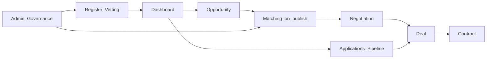
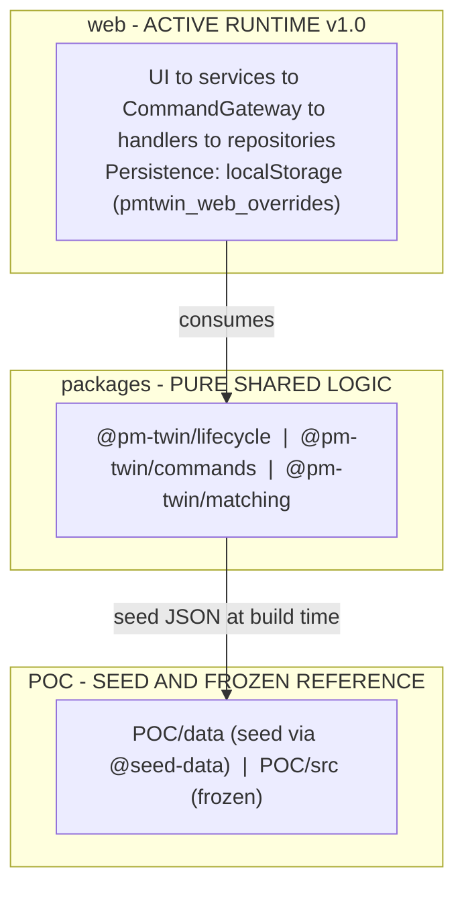
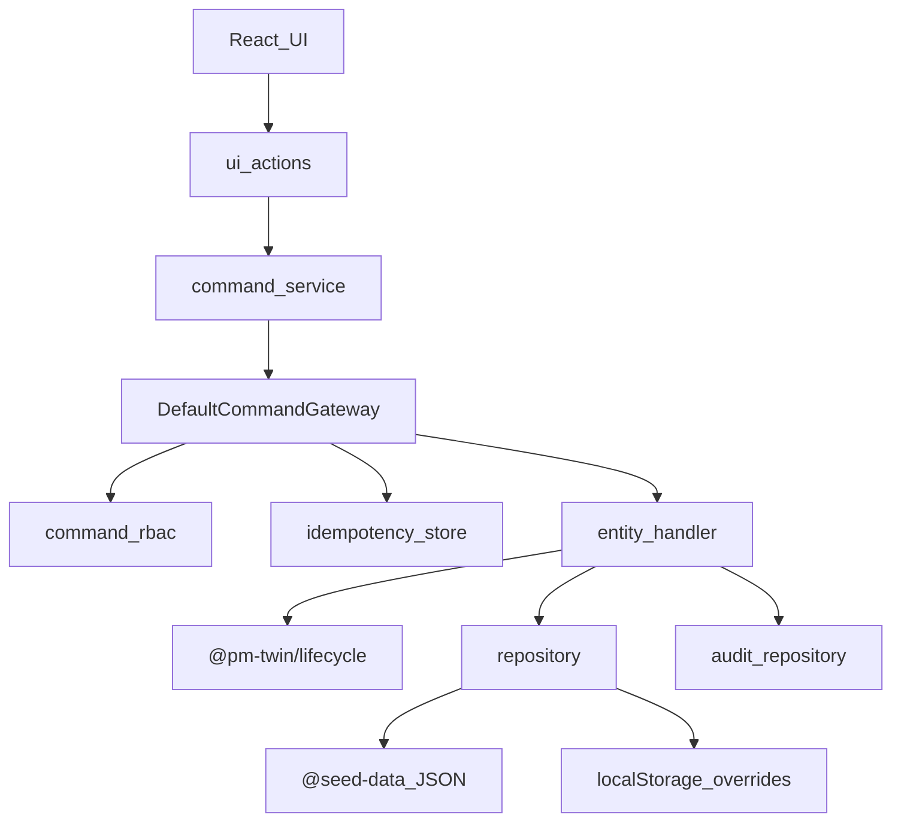
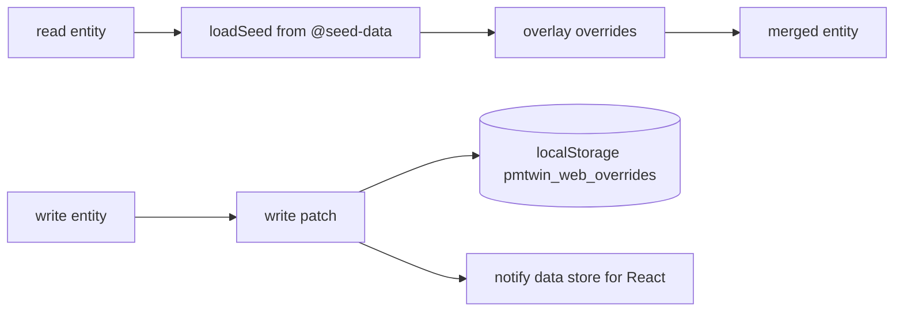
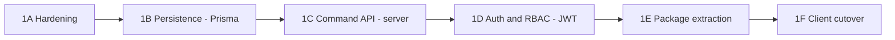

# PM-Twin MVP — Full Project Report

| Field | Value |
|-------|-------|
| Title | PM-Twin MVP — Comprehensive Project Report |
| Version | 1.0 |
| Report date | 28 June 2026 |
| Scope | Full repository — `web/`, `packages/`, `POC/`, `docs/`, `BRD/` |
| Method | Read-only review of source code and documentation; metrics verified against the live codebase |
| Audience | Executive stakeholders and the engineering team |
| Authoritative architecture | ADR-100 (Architecture Freeze v1.0) and ADR-101 (Backend Domain Ownership) |

---

## How to read this document

This report serves two audiences. Each major section opens with a short plain-language summary, then continues with technical detail.

- For a business or stakeholder view, read [Section 2 — Executive summary](#2-executive-summary), [Section 3 — Product vision and business context](#3-product-vision-and-business-context), [Section 10 — KSA compliance posture](#10-ksa-compliance-posture), and [Section 12 — Roadmap and ADR summary](#12-roadmap-and-adr-summary).
- For an engineering view, focus on [Section 4 — Repository structure and runtime ownership](#4-repository-structure-and-runtime-ownership) through [Section 9 — Data and seed layer](#9-data-and-seed-layer), plus the [Appendix](#appendix).

### Table of contents

1. [Document metadata](#1-document-metadata)
2. [Executive summary](#2-executive-summary)
3. [Product vision and business context](#3-product-vision-and-business-context)
4. [Repository structure and runtime ownership](#4-repository-structure-and-runtime-ownership)
5. [Technology stack](#5-technology-stack)
6. [Architecture deep dive](#6-architecture-deep-dive)
7. [UI and feature inventory](#7-ui-and-feature-inventory)
8. [Testing and quality](#8-testing-and-quality)
9. [Data and seed layer](#9-data-and-seed-layer)
10. [KSA compliance posture](#10-ksa-compliance-posture)
11. [Gaps, risks, and technical debt](#11-gaps-risks-and-technical-debt)
12. [Roadmap and ADR summary](#12-roadmap-and-adr-summary)
- [Appendix](#appendix)

---

## 1. Document metadata

This report consolidates the existing project documentation and a fresh scan of the codebase into a single reference. It is a snapshot as of the report date; the underlying code and documents continue to evolve.

Primary sources used to build this report:

| Source | Contribution |
|--------|--------------|
| [README.md](../README.md) | Product pitch, repository layout, getting started |
| [ARCHITECTURE-READINESS-ASSESSMENT.md](../ARCHITECTURE-READINESS-ASSESSMENT.md) | Readiness scores, risk framing, maturity (dated 23 June 2026; partly superseded by ADR-100) |
| [docs/runtime-ownership.md](runtime-ownership.md) | Authoritative runtime boundaries |
| [docs/implementation-status.md](implementation-status.md) | Module-by-module status tables |
| [docs/gaps-and-missing.md](gaps-and-missing.md) | Risk register and workflow overview |
| [docs/adr/ADR-100-architecture-freeze-v1.md](adr/ADR-100-architecture-freeze-v1.md) through ADR-105 | Freeze gate, backend roadmap, KSA compliance decisions |
| [packages/lifecycle/src/registry/manifest.json](../packages/lifecycle/src/registry/manifest.json) | Canonical lifecycle states |
| Live codebase scan | Routes, command catalog, test counts, tech stack |

A note on reconciliation: where the architecture assessment (23 June) and ADR-100 (28 June) disagree, this report follows ADR-100 — most notably the frozen test baseline and the command-gateway wiring.

---

## 2. Executive summary

PM-Twin is a business-to-business collaboration marketplace for the construction sector in Saudi Arabia and the wider GCC. It connects project managers, consultants, and companies so they can form partnerships, pool resources, hire professionals, and compete for work. The product is currently an advanced proof of concept with a deliberately chosen target architecture for software-as-a-service scale.

### What exists today

The active product is a browser-based single-page application in [web/](../web). It implements the full marketplace lifecycle — from publishing an opportunity, through algorithmic matching, negotiation, and deal-making, to a signed contract — along with a substantial administrative portal. All business writes flow through a single command gateway, and all shared business rules live in three pure logic packages. As of ADR-100, the client architecture is formally frozen at version 1.0 so that backend work can proceed without structural drift.

### Maturity at a glance

| Dimension | Standing |
|-----------|----------|
| Domain and business-logic design | Strong — well-modeled entities, a canonical lifecycle registry, and a four-model matching engine |
| Client application | Functional end to end for the core flows; built on a modern, maintainable stack |
| Production and SaaS readiness | Early — there is no backend server, database, or real authentication |
| KSA regulatory readiness | Planned but not yet built — PDPL, VAT, and Arabic right-to-left support are documented in ADRs, not implemented |

The most recent full-repository assessment scored overall production readiness low (around 38 of 100), driven almost entirely by the absence of server infrastructure rather than by weaknesses in the domain design. That assessment predates ADR-100; the architectural boundaries it recommended are now codified.

### Key achievements

- A single command gateway with idempotency and role checks routes every lifecycle write through typed command contracts.
- A four-model matching engine (one-way, two-way barter, consortium, and circular) runs automatically when an opportunity is published.
- A zero-dependency lifecycle package is the single source of truth for status vocabulary across six entity types.
- A frozen, green test baseline in the web runtime: 53 test files, 526 individual cases, 535 passing checks via the full runner.
- A broad administrative portal covering vetting, matching operations, disputes, audit, subscriptions, and site content.

### Top risks

1. There is no server-side persistence or authentication; all data lives in the browser and is reachable through developer tools.
2. Passwords are only Base64-encoded, not securely hashed.
3. Role-based access control is enforced at the command gateway in the client, but there is no authoritative server boundary behind it.
4. There are no end-to-end tests in the active runtime.
5. KSA compliance requirements — PDPL, 15% VAT, and Arabic right-to-left — are not yet implemented.

### Where the project stands

Runtime ownership work (Phases 10.1 through 10.3) is complete, and the architecture is frozen at v1.0. The next milestone, Backend Foundation Phase 1, is approved to begin: it introduces a real database, a server-side command API, and proper authentication.

---

## 3. Product vision and business context

PM-Twin's premise is that construction collaboration in the region is fragmented: finding the right partner, sharing equipment, forming a consortium, or hiring a specialist is slow and relationship-bound. The platform turns these needs into structured, matchable opportunities and then guides participants through a consistent lifecycle to a signed contract.

### Collaboration models

The platform supports five families of collaboration, each with sub-models:

- Project-based collaboration — tasks, consortiums, joint ventures, and special-purpose vehicles.
- Strategic partnerships — long-term joint ventures, alliances, and mentorship.
- Resource pooling — bulk buying, equipment sharing, and exchange.
- Hiring — professionals and consultants.
- Competitions — requests for proposals, requests for quotes, and design contests.

### Opportunity intent

Every opportunity carries an intent that drives matching direction:

| Intent | Meaning | Matching direction |
|--------|---------|--------------------|
| Need (request) | Seeks resources, partners, or services | Matched against offers |
| Offer | Provides resources, capacity, or expertise | Matched against needs |
| Hybrid | Both at once | Bidirectional |

### Match topologies

The matching engine discovers four kinds of collaboration link:

- One-way — a need meets an offer.
- Two-way (barter) — two parties exchange complementary value directly.
- Consortium — several parties combine to fill a set of roles.
- Circular — a chain of exchanges where each party gives to the next.

### End-to-end lifecycle

The core marketplace flow moves through six stages, each backed by a canonical state machine:



There are two entry paths into a deal: the PostMatch path (discovery, then optional negotiation) and the application path (an applicant proposes against a published opportunity, then moves through the pipeline). Both converge on a deal and ultimately a contract.

For the full business requirements, see [BRD/](../BRD) and the journey documents [docs/full-user-journey.md](full-user-journey.md) and [docs/admin-user-journey.md](admin-user-journey.md).

---

## 4. Repository structure and runtime ownership

In plain terms, the repository has one active product (the web app), a set of shared rule libraries it depends on, and a frozen legacy app that now serves only as a data source and a regression safety net. Keeping these roles separate is what allows the team to add a real backend later without rewriting the business rules.

### Top-level layout

| Path | Role |
|------|------|
| [web/](../web) | Active runtime — the React single-page application, command gateway, repositories, services, and UI |
| [packages/](../packages) | Shared pure business logic consumed by the web app |
| [POC/](../POC) | Legacy reference app, the physical seed dataset, data scripts, and the regression harness — frozen for new product logic |
| [docs/](.) | Technical and user documentation, architecture decision records |
| [BRD/](../BRD) | Business requirements documents |
| [.cursor/](../.cursor) | Workspace rules and skills |

The three shared packages are:

- `@pm-twin/lifecycle` — the canonical status vocabulary and finite-state machine (ADR-001).
- `@pm-twin/commands` — the command data-transfer-object contracts (ADR-002).
- `@pm-twin/matching` — the pure matching and scoring engine.

### Frozen topology (ADR-100)

ADR-100 freezes the following layering as version 1.0. The web app consumes the shared packages; the packages are pure and depend on nothing at runtime; the seed data is physically located in the POC and imported at build time.



### Import rules

The boundaries are enforced by rule and by an automated guard test:

| Rule | Enforcement |
|------|-------------|
| No new product behavior in `POC/src/` | Workspace rules and ADR-100 |
| No imports from `POC/src` into `web/` | [web/src/infrastructure/seed/runtime-ownership.guard.test.ts](../web/src/infrastructure/seed/runtime-ownership.guard.test.ts) |
| No imports from `web/` into `POC/` | Workspace rules |
| Seed JSON reaches the web app only via the `@seed-data` alias | Vite alias + guard test |
| Lifecycle state names must come from `@pm-twin/lifecycle` | Workspace rules and handler validation |

### Phase history

The runtime separation was reached over three phases, then frozen:

- Phase 10.1 — removed all web-to-POC JavaScript runtime dependencies.
- Phase 10.2 — renamed the seed alias from `@poc-data` to `@seed-data`.
- Phase 10.3 — documented runtime ownership and froze the POC for new product logic ([docs/runtime-ownership.md](runtime-ownership.md)).
- Architecture Freeze v1.0 — ADR-100 codified the result and gated Backend Foundation Phase 1.

---

## 5. Technology stack

The active app is built on a current, mainstream React stack chosen for maintainability and a clear upgrade path to a backend. The legacy POC uses an older vanilla-JavaScript approach and is kept only for reference and data.

| Layer | Technology |
|-------|------------|
| UI framework | React 19, TypeScript 6 (strict mode) |
| Build tooling | Vite 8, esbuild (for packages), `tsc` |
| Styling | Tailwind CSS 4, shadcn/ui on Radix UI, tw-animate-css |
| Routing | React Router DOM 7 |
| Validation | Zod 4 |
| Animation | Framer Motion, GSAP, Lenis |
| Icons and fonts | Lucide React, Inter and Plus Jakarta Sans |
| Persistence (v1.0) | Browser `localStorage` (`pmtwin_web_overrides`) plus static JSON seed |
| Shared logic | `@pm-twin/lifecycle`, `@pm-twin/commands`, `@pm-twin/matching` |
| Legacy runtime | Vanilla JavaScript multi-page app, Tailwind 3, Vitest, Playwright |
| Planned backend | PostgreSQL, Prisma, JWT authentication, a `server/` runtime (ADR-101) |

### Developer commands

From [web/package.json](../web/package.json):

```bash
cd web
npm install
npm run dev            # start the Vite dev server
npm run type-check     # tsc -b
npm test               # node scripts/run-command-tests.mjs
npm run build          # tsc -b && vite build
npm run validate:domain # seed and domain health diagnostic
```

There is no continuous-integration pipeline configured at the repository level. The quality gate documented in ADR-100 is the local sequence of type-check, test, and build in `web/`.

---

## 6. Architecture deep dive

The heart of the system is a write model: anything that changes business state is expressed as a typed command, validated against the lifecycle rules, and persisted through a repository that also records an audit entry. Reads are kept separate and never change lifecycle status directly. This section walks through that machinery.

### 6.1 Command gateway pattern

Every lifecycle change follows the same path. The UI calls a small action helper, which builds a command and hands it to a command service; the service stamps an idempotency key and calls the gateway. The gateway checks permissions, deduplicates, routes to the correct handler, validates the transition, writes through a repository, and appends to the audit log.



Key facts:

- The gateway interface is [web/src/commands/CommandGateway.ts](../web/src/commands/CommandGateway.ts); the implementation is [web/src/commands/default-command-gateway.ts](../web/src/commands/default-command-gateway.ts), wired in [web/src/commands/application-command-gateway.ts](../web/src/commands/application-command-gateway.ts).
- There are six entity handlers: application, opportunity, post-match, negotiation, deal, and contract.
- Idempotency is keyed on command type, aggregate id, and a `clientRequestId`, so a repeated submission returns the original result rather than duplicating work.
- Role checks run at the gateway via [web/src/domain/rbac/command-rbac.ts](../web/src/domain/rbac/command-rbac.ts). This is the strongest access boundary today, but it lives in the client; a server boundary is part of the backend roadmap.

The full list of command types appears in [Appendix B](#appendix-b--command-catalog).

### 6.2 Repository and persistence

Repositories implement a read-merge-write pattern. The immutable seed is read first, runtime overrides are layered on top at read time, and writes are recorded as patches into a single overrides store.



Storage keys:

| Key | Purpose |
|-----|---------|
| `pmtwin_web_overrides` | All runtime mutations |
| `pmtwin_web_session` | Auth session (in `localStorage` with remember-me, otherwise `sessionStorage`) |

A guard in the read API ([web/src/api/opportunities.ts](../web/src/api/opportunities.ts)) blocks lifecycle `status` from being changed through a direct patch — status changes must go through commands. The repository entity keys are listed in [Appendix](#appendix) and verified by [web/src/repositories/repository-entity-keys.test.ts](../web/src/repositories/repository-entity-keys.test.ts).

### 6.3 Shared packages

| Package | Responsibility | Notes |
|---------|----------------|-------|
| `@pm-twin/lifecycle` | Canonical states, allowed transitions, terminal states, legacy aliases | Zero runtime dependencies; the source of truth is [manifest.json](../packages/lifecycle/src/registry/manifest.json) |
| `@pm-twin/commands` | Typed command and result contracts | Pure TypeScript types and small topology guards; no I/O |
| `@pm-twin/matching` | Post-to-post matching engine | Pure functions; canonical data and weights are injected by the caller |

The lifecycle package exposes pure functions such as `toCanonical`, `getFsm`, `allowedTransitions`, and `isTerminal`. Handlers call these to validate every transition before writing.

### 6.4 Domain entities

The canonical entity shapes live in [web/src/types/domain.ts](../web/src/types/domain.ts); their lifecycle states come from the manifest.

| Entity | Description | Canonical states |
|--------|-------------|------------------|
| PlatformUser | Individual project manager or consultant | Account status: pending, active, suspended, rejected |
| Company | A `PlatformUser` whose profile type is company | Same as above |
| Opportunity | A need, offer, or hybrid post | draft, published, matched, negotiating, contracted, executing, completed, cancelled |
| Application | An applicant's proposal against an opportunity | submitted, reviewing, shortlisted, negotiating, accepted, rejected, withdrawn |
| PostMatch | An engine-discovered collaboration link | discovered, accepted, confirmed, declined, expired, superseded |
| Negotiation | Terms discussion on a match | active, countered, agreed, expired, cancelled |
| Deal | An agreed commercial engagement | draft, review, signing, executing, completed, cancelled |
| Contract | The legal document derived from a deal | draft, pending_signature, active, completed, terminated |
| AppNotification | User alerts | read / unread |
| AuditEntry | Append-only platform audit trail | n/a |

Commercial terms ([web/src/types/commercial-terms.ts](../web/src/types/commercial-terms.ts)) carry an amount, a currency (defaulting to SAR), duration, payment schedule, profit split, and exchange mode. They do not yet carry VAT fields; that is covered by ADR-104.

### 6.5 Matching engine

When an opportunity is published, the matching service converts opportunities into normalized posts, runs the pure engine, and emits discover commands for the resulting links. The engine pipeline is: normalize posts, apply hard constraints, score each pair, rank, and return matches for all four topologies. The web integration point is [web/src/services/matching-service.ts](../web/src/services/matching-service.ts), and the engine entry is [packages/matching/src/engine/run-matching-for-post.ts](../packages/matching/src/engine/run-matching-for-post.ts).

---

## 7. UI and feature inventory

The application is organized into three areas: a public marketing and authentication surface, an authenticated workspace for the marketplace lifecycle, and an administrative portal. This section inventories the routes and then summarizes how complete each functional module is.

### 7.1 Route map

Source: [web/src/routes.tsx](../web/src/routes.tsx). The complete table is in [Appendix A](#appendix-a--full-route-table); the overview is below.

- Public (under `PublicLayout`): home, find, workflow, knowledge base, collaboration wizard, collaboration models, and the auth pages (login, register, forgot password, reset password).
- Workspace (under `ProtectedRoute` and `AppShell`): dashboard, opportunities (list, map, create, edit, detail), pipeline, matches, negotiation detail, deals (list, detail, rate), contracts, people, messages, notifications, profile, and settings.
- Admin (under `AdminRouteGuard`): dashboard, reports, health, users, vetting, opportunities, matching, negotiations, disputes, deals, contracts, consortium, audit, settings, skills, collaboration models, site content, and subscriptions.

An unmatched route redirects to the dashboard.

### 7.2 Implementation status by module

The following condenses [docs/implementation-status.md](implementation-status.md). The markers mean: implemented, partial, and not implemented.

| Module | Status | Notes |
|--------|--------|-------|
| Authentication and authorization | Mostly done | Register, login, logout, password reset, session restore, route guards; social login and real password hashing are missing |
| Users and companies | Mostly done | Full data-layer CRUD, profile view and edit; company members and roles are not implemented |
| Opportunities | Done | Create, edit, delete, list, detail, map; publish triggers matching; unified lifecycle |
| Applications | Partial | Create, list, and pipeline kanban work; requirements, deliverables, and files are partial |
| Matching engine | Done | All four models plus scoring, candidate generation, and persistence on publish |
| Matches (user-facing) | Done | List, detail, filter by type, accept and decline, create a deal from a confirmed match; default expiry is partial |
| Negotiation | Mostly done | Start, multi-party agree, create deal from agreed negotiation, expiry sweep; round and counter UI is minimal |
| Deals | Done | Create, detail, status flow, milestones, rating; links to contract |
| Contracts | Done | Create, sign, auto-activate on full signature, complete, terminate |
| Notifications and audit | Mostly done | Create and list; mark-read and audit filters are partial in the UI |
| Pipeline and discovery | Done | Pipeline tabs, find, map, people, person profile |
| Admin portal | Done | Vetting, matching, deals, contracts, consortium, health, audit, reports, settings, skills, subscriptions, site content, with role guards |
| Infrastructure and data | Done | Seed loading, merge of demo data, seed version migration, storage service |
| Public and content | Mostly done | Home, wizard, models, knowledge base, workflow, connections; messages threading is partial |

In short, the core marketplace flow is complete end to end; the partial items are concentrated in secondary UI affordances (application detail richness, negotiation round UI, messages threading, and some admin filters) and in the deliberately deferred backend concerns.

### 7.3 Authentication, in the current runtime

Authentication today is a demonstration-grade, client-only mechanism. The service in [web/src/lib/auth-service.ts](../web/src/lib/auth-service.ts) checks email and password against seed users, with passwords only Base64-encoded. Sessions are stored under `pmtwin_web_session`. `ProtectedRoute` redirects unauthenticated users to the login page, and `AdminRouteGuard` restricts admin routes by role. A pending-approval account is allowed in but is held in a read-only mode. Demonstration credentials live in the seed dataset (see the seed-controlled users file) and are intentionally not reproduced here.

---

## 8. Testing and quality

Testing is concentrated in the active web runtime and the shared packages, with the legacy POC retaining its own large regression suite. The web baseline is frozen and green; the main gaps are the absence of coverage tooling and of end-to-end tests in the active runtime.

| Suite | Runner | Files | Baseline |
|-------|--------|-------|----------|
| web (active) | Node.js test runner via `tsx` | 53 `.test.ts` files | 526 cases; 535 passing via the full runner (ADR-100) |
| `@pm-twin/lifecycle` | Node.js test runner | 1 file | 100% branch coverage required by rule |
| `@pm-twin/matching` | Node.js test runner | 8 files | Engine, scoring, routing, constraints |
| `@pm-twin/commands` | `tsc --noEmit` | type-check only | Contracts validated by the type checker |
| POC (legacy) | Vitest | ~50 files | Regression only; no new product tests |

Notable points:

- The architecture guard [web/src/infrastructure/seed/runtime-ownership.guard.test.ts](../web/src/infrastructure/seed/runtime-ownership.guard.test.ts) fails the build if forbidden cross-runtime imports reappear.
- The web runtime has no coverage instrumentation configured and no end-to-end tests; Playwright exists only in the POC for manual capture and smoke checks.
- Domain health can be checked outside the unit tests via `npm run validate:domain` (and its strict variant), which inspects seed and domain consistency.

---

## 9. Data and seed layer

The platform ships with a rich, fixed dataset so the application is fully usable without a backend. That data physically lives in the POC and is imported into the web app at build time; nothing in the seed is changed at runtime.

The seed directory [POC/data/](../POC/data) contains roughly 51 JSON files in four groups:

- Core entity seeds — users, companies, opportunities, applications, matches, contracts, notifications, audit, locations, lookups, reviews, sessions, site content, and the canonical skills list.
- Demonstration and end-to-end datasets — the `demo-*` files covering opportunities, applications, deals, negotiations, post-matches, disputes, and more.
- Backups — snapshots taken before consolidation scripts run.
- Simulation — datasets and a matching report used by the simulation harness.

The data flow is straightforward:

```mermaid
flowchart LR
  Files[POC/data/*.json] --> Alias[@seed-data alias]
  Alias --> Loader[web seed-loader]
  Loader --> Repos[repositories]
  Repos --> Merge[merge with overrides]
  Merge --> App[app reads]
```

The seed is immutable at runtime. Every change a user makes is written as a patch into `pmtwin_web_overrides` and merged over the seed on read, which keeps the baseline reproducible and makes a future migration to a database clean.

---

## 10. KSA compliance posture

Saudi market requirements are well understood and documented as architecture decisions, but they are largely future work. Today the product defaults to SAR currency and references compliance concepts in seed metadata; the enforcement mechanisms are not yet built.

| Requirement | Status | Authority |
|-------------|--------|-----------|
| PDPL — consent, data export, erasure, residency | Not implemented | ADR-103 (proposed, Phase 2+) |
| VAT at 15% on financial fields | Not implemented | ADR-104 (proposed; planned `@pm-twin/finance` package) |
| Arabic right-to-left UI | Not implemented | Workspace rules; only a `dir` prop exists on the sidebar |
| Hijri dates | Not implemented | Workspace rules |
| SAR currency | Partial | Default currency in commercial terms |

The deliberate decision in the ADRs is to make compliance server-authoritative — for example, PDPL workflows and VAT calculation belong in the future backend and a finance package, with the client responsible only for presentation and consent capture. That keeps regulated logic out of a runtime that, today, can be inspected and altered in the browser.

---

## 11. Gaps, risks, and technical debt

The strongest message from every prior audit is consistent: the domain and business logic are well built, but there is no production infrastructure beneath them yet. The gaps below are drawn from [docs/gaps-and-missing.md](gaps-and-missing.md) and the architecture assessment, reconciled with the current frozen architecture.

### Severity-ranked gaps

| Severity | Gap | Implication |
|----------|-----|-------------|
| Critical | No server-side persistence or authentication | All data is in the browser and can be read or altered through developer tools |
| Critical | Passwords are Base64-encoded, not hashed | Credentials are trivially reversible |
| Critical | Admin role checks live only in the client | Without a server boundary, access control is advisory in practice |
| High | Role-based access control is not enforced at an authoritative API | The command gateway is the only barrier today |
| High | No end-to-end tests in the active runtime | Regressions across full user journeys can slip through |
| Medium | Lifecycle enforcement is uneven in some legacy paths | Mitigated by the command gateway and bypass guards for new work |
| Medium | Messages threading and some admin filters are partial | Secondary UX rather than core flow |
| Medium | KSA compliance (PDPL, VAT, RTL, Hijri) not implemented | Required before a Saudi production launch |

### Readiness scores

These scores come from the 23 June architecture assessment. They remain directionally accurate; ADR-100 has since hardened the architectural boundaries and confirmed the test baseline, which lifts confidence in the domain and command dimensions.

| Dimension | Score (out of 10) |
|-----------|:-----------------:|
| Domain architecture | 7.0 |
| Lifecycle architecture | 6.0 |
| Command architecture | 5.5 |
| UI architecture | 5.0 |
| Test coverage | 5.5 |
| Backend readiness | 1.0 |
| Security readiness | 1.5 |
| SaaS readiness | 1.5 |
| Production readiness | 1.8 |
| Overall | ~38 / 100 |

Proposed remediations for these gaps are tracked in [docs/gap-solutions.md](gap-solutions.md).

---

## 12. Roadmap and ADR summary

The path forward is well defined. The client is frozen at v1.0, and the next body of work builds the backend that turns this proof of concept into a deployable service. The architecture decision records below capture both the freeze and the forward plan.

### ADR catalog

| ADR | Title | Status |
|-----|-------|--------|
| ADR-001 | Lifecycle registry | Established (in `packages/lifecycle/`) |
| ADR-002 | Command contracts | Established (in `packages/commands/`) |
| ADR-100 | Architecture Freeze v1.0 | Accepted — frozen |
| ADR-101 | Backend domain ownership | Accepted |
| ADR-102 | Multi-tenancy | Proposed (Phase 2+) |
| ADR-103 | PDPL compliance | Proposed (Phase 2+) |
| ADR-104 | VAT and financial fields | Proposed (Phase 2+) |
| ADR-105 | Domain event catalog | Proposed (Phase 1B+) |

### Backend Foundation Phase 1 (ADR-101)

The backend introduces a three-tier model: pure rules in `packages/`, an authoritative `server/` runtime for persistence, authentication, and access control, and the existing `web/` app as the presentation tier. Phase 1 proceeds in sub-phases:



Sub-phase 1A (hardening) is complete; the remaining sub-phases deliver a PostgreSQL schema and seed import, a server-side command gateway with handler parity, JWT-based authentication and server-enforced access control, extraction of readiness and RBAC policy packages, and finally a client cutover to the API.

### Explicitly not frozen

ADR-100 freezes the client architecture but deliberately leaves the following open, because they are the substance of the backend work: PostgreSQL persistence, JWT authentication, server-side access control, end-to-end tests, and extraction of the seed into a dedicated `packages/seed-data/` package.

### Beyond Phase 1

Phase 2 and later address the SaaS and regulatory concerns captured in the proposed ADRs: row-level multi-tenancy (ADR-102), PDPL compliance workflows (ADR-103), VAT and financial fields via a finance package (ADR-104), and a versioned domain event catalog with an outbox and consumers (ADR-105).

---

## Appendix

### Appendix A — Full route table

Source: [web/src/routes.tsx](../web/src/routes.tsx).

| Area | Path | Page |
|------|------|------|
| Public | `/` | Home |
| Public | `/find` | Find |
| Public | `/workflow` | How it works |
| Public | `/knowledge-base` | Knowledge base |
| Public | `/collaboration-wizard` | Collaboration wizard |
| Public | `/collaboration-models` | Collaboration models |
| Public | `/login` | Login |
| Public | `/register` | Register |
| Public | `/forgot-password` | Forgot password |
| Public | `/reset-password` | Reset password |
| Workspace | `/dashboard`, `/company-dashboard` | Dashboard |
| Workspace | `/opportunities` | Opportunities list |
| Workspace | `/opportunities/map` | Opportunity map |
| Workspace | `/opportunities/create` | Create opportunity |
| Workspace | `/opportunities/:id/edit` | Edit opportunity |
| Workspace | `/opportunities/:id` | Opportunity detail |
| Workspace | `/pipeline`, `/pipeline/:tab` | Pipeline |
| Workspace | `/matches`, `/matches/:id` | Matches list and detail |
| Workspace | `/negotiations/:id` | Negotiation detail |
| Workspace | `/deals`, `/deals/:id`, `/deals/:id/rate` | Deals |
| Workspace | `/contracts`, `/contracts/:id` | Contracts |
| Workspace | `/people`, `/people/:id` | People and profile |
| Workspace | `/messages`, `/messages/:id` | Messages |
| Workspace | `/notifications` | Notifications |
| Workspace | `/profile`, `/settings` | Profile and settings |
| Workspace | `/access-denied` | Access denied |
| Admin | `/admin` | Admin dashboard |
| Admin | `/admin/reports` | Reports |
| Admin | `/admin/health` | Health |
| Admin | `/admin/users`, `/admin/users/:id` | Users (also `/admin/people`) |
| Admin | `/admin/vetting` | Vetting |
| Admin | `/admin/opportunities` | Opportunities |
| Admin | `/admin/matching` | Matching |
| Admin | `/admin/negotiations`, `/admin/negotiations/:id` | Negotiations |
| Admin | `/admin/disputes` | Disputes |
| Admin | `/admin/deals`, `/admin/deals/:id` | Deals |
| Admin | `/admin/contracts`, `/admin/contracts/:id` | Contracts |
| Admin | `/admin/consortium` | Consortium |
| Admin | `/admin/audit` | Audit |
| Admin | `/admin/settings` | Settings |
| Admin | `/admin/skills` | Skills |
| Admin | `/admin/collaboration-models` | Collaboration models |
| Admin | `/admin/site-content` | Site content |
| Admin | `/admin/subscriptions` | Subscriptions |
| Fallback | `*` | Redirect to `/dashboard` |

### Appendix B — Command catalog

Source: [packages/commands/src/contracts/index.ts](../packages/commands/src/contracts/index.ts), routed by the six handlers in [web/src/commands/](../web/src/commands).

| Handler | Commands |
|---------|----------|
| Application | `SubmitApplication`, `AcceptApplication`, `RejectApplication`, `TransitionApplicationStatus` |
| Opportunity | `TransitionOpportunityStatus` |
| PostMatch | `DiscoverPostMatch` (one-way, two-way, consortium, circular variants), `AcceptPostMatch`, `DeclinePostMatch`, `ConfirmPostMatch`, `ExpirePostMatch`, `SupersedePostMatch`, `TransitionPostMatchStatus` |
| Negotiation | `StartNegotiation`, `StartNegotiationFromPostMatch`, `AgreeNegotiation`, `CancelNegotiation`, `TransitionNegotiationStatus` |
| Deal | `CreateDealFromPostMatch`, `CreateDealFromNegotiation`, `TransitionDealStatus` |
| Contract | `CreateContractFromDeal`, `SignContract`, `ActivateContract`, `CompleteContract`, `TerminateContract`, `TransitionContractStatus` |

### Appendix C — Lifecycle state tables

Source: [packages/lifecycle/src/registry/manifest.json](../packages/lifecycle/src/registry/manifest.json).

| Entity | Canonical states |
|--------|------------------|
| Opportunity | draft, published, matched, negotiating, contracted, executing, completed, cancelled |
| Application | submitted, reviewing, shortlisted, negotiating, accepted, rejected, withdrawn |
| Match | discovered, accepted, confirmed, declined, expired, superseded |
| Negotiation | active, countered, agreed, expired, cancelled |
| Deal | draft, review, signing, executing, completed, cancelled |
| Contract | draft, pending_signature, active, completed, terminated |

Legacy aliases (used only when reading or converting legacy data) include `pending` to `discovered`, `open` to `active`, `in_negotiation` to `negotiating`, `counter_offered` to `countered`, and `closed` to `completed`.

### Appendix D — Repository entity keys

Source: [web/src/repositories/](../web/src/repositories). Override keys persisted under `pmtwin_web_overrides`.

| Repository | Override keys |
|------------|---------------|
| User | `users` |
| Company | `companies` |
| Opportunity | `opportunities` |
| Application | `applications`, `newApplications` |
| PostMatch | `postMatches`, `newPostMatches` |
| Negotiation | `negotiations`, `newNegotiations` |
| Deal | `deals`, `newDeals` |
| Contract | `contracts`, `newContracts` |
| Notification | `notifications`, `newNotifications`, `deletedNotifications` |
| Audit | `newAuditEntries` |

### Appendix E — Documentation index

| Document | Topic |
|----------|-------|
| [docs/overview.md](overview.md) | Platform purpose and feature map |
| [docs/runtime-ownership.md](runtime-ownership.md) | Authoritative runtime boundaries and POC freeze |
| [docs/architecture/runtime-boundaries.md](architecture/runtime-boundaries.md) | Import matrix, storage keys, write paths |
| [docs/implementation-status.md](implementation-status.md) | Module-by-module status |
| [docs/gaps-and-missing.md](gaps-and-missing.md) | Risk register and workflow overview |
| [docs/gap-solutions.md](gap-solutions.md) | Proposed fixes |
| [docs/full-user-journey.md](full-user-journey.md) | End-to-end user journey |
| [docs/admin-user-journey.md](admin-user-journey.md) | Admin journey |
| [docs/data-model.md](data-model.md) | Domain data model |
| [docs/database-schema.md](database-schema.md) | Planned schema reference |
| [docs/matching-engine.md](matching-engine.md) | Matching engine design |
| [docs/adr/](adr) | Architecture decision records (ADR-100 through ADR-105) |
| [docs/workflow/](workflow) | Per-stage workflow documents |
| [docs/diagrams/](diagrams) | System, matching, and deal-contract flow diagrams |
| [docs/modules/](modules) | Module specifications |
| [docs/manuals/](manuals) | User and admin training manuals (HTML and PDF) |

### Appendix F — Getting started

```bash
# Active runtime (web)
cd web
npm install
npm run dev

# Quality gate (run before committing)
npm run type-check
npm test
npm run build
```

### Appendix G — Glossary

| Term | Meaning |
|------|---------|
| Opportunity | A published need, offer, or hybrid post that can be matched |
| Need / Offer / Hybrid | The intent of an opportunity, which drives matching direction |
| PostMatch | A collaboration link discovered by the matching engine between posts |
| One-way / Two-way / Consortium / Circular | The four match topologies the engine supports |
| Negotiation | A terms discussion on a match before a deal is formed |
| Deal | An agreed commercial engagement derived from a match or negotiation |
| Contract | The legal document derived from a deal |
| Command gateway | The single entry point through which all lifecycle writes pass |
| Lifecycle registry / FSM | The canonical set of states and allowed transitions per entity |
| Seed | The immutable JSON dataset that ships with the app via `@seed-data` |
| Overrides | Runtime mutations stored in `pmtwin_web_overrides` and merged over the seed |
| RBAC | Role-based access control, evaluated at the command gateway |
| ADR | Architecture decision record |

---

_End of report._
