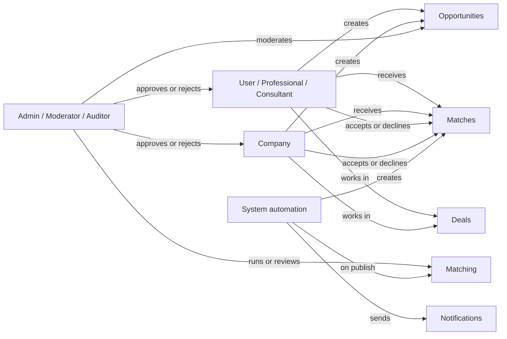

# Actors

### What this page is

This page lists everyone who uses or affects PMTwin: individual users, companies, admins, and automatic system actions.

### Why it matters

Knowing who can do what helps you read workflows, permissions, and admin screens without guessing.

### What you can do here

- Compare **individual** vs **company** accounts.
- See **admin** role boundaries.
- Understand what the **system** does automatically (for example after you publish an opportunity).

### Step-by-step actions

1. Read **Users** and **Companies** if you build or test end-user flows.
2. Read **Admin roles** if you work on governance or the admin portal.
3. Read **System** for matching and notifications behavior.

### What happens next

Use this with [user-workflow.md](workflow/user-workflow.md) for journeys, or [admin-portal.md](admin-portal.md) for operator tasks.

### Tips

- Technical column names (for example config keys) are accurate for developers; you can skim them if you only need the story.

---

## 1. Users (individuals)

People register as individuals. They are usually **professionals** or **consultants**.

| Topic | Details |
|-------|---------|
| **Stored as** | User records with id and email. |
| **Roles** | Professional or consultant (see app config). |
| **Account status** | Pending until approved, then active; can be suspended, rejected, or asked for clarification. |
| **Verification** | Levels such as unverified vs professionally verified (see config). |
| **Profile** | Name, specializations, certifications, years of experience, sectors, skills, payment preferences, and similar fields. |

**What they can do**

- Register, log in, manage profile, reset password.
- Create and manage opportunities (need, offer, or hybrid).
- View matches, accept or decline.
- Join deals from confirmed matches, negotiate, track milestones.
- View and sign contracts linked to deals.
- Use pipeline, dashboard, notifications, and discovery pages.
- Cannot open admin areas unless their account also has an admin-type role.

### What happens next

After registration, many accounts stay **pending** until an admin approves them in vetting.

---

## 2. Companies

Organizations register as **companies**. They live in a separate company store but behave like users for most product features.

| Topic | Details |
|-------|---------|
| **Stored as** | Company records with id and email. |
| **Linked login** | Often a user with a company-owner-style role uses the same email to sign in. |
| **Status** | Same broad lifecycle as users (pending → active, and so on). |
| **Profile** | Company name, registration details, classifications, experience, capacity, and related fields. |

**What they can do**

- Same core features as individuals: opportunities, matches, deals, contracts, pipeline.
- Sign-in checks both user and company records for the email you enter.
- Matching treats normalized users and companies as possible partners for opportunities.

### What happens next

Once active, a company can publish opportunities and receive matches like any other party.

---

## 3. Admin roles

Admins are **users** with special roles. Route guards only allow these users into admin screens.

| Role | Typical scope |
|------|----------------|
| **Platform admin** | Full access: dashboard, users, vetting, opportunities, matching, deals, contracts, consortium tools, health, audit, reports, settings, skills, subscriptions, collaboration models. |
| **Moderator** | User and content work, limited settings (per product rules). |
| **Auditor** | Read-focused: audit trails and reports. |

**POC default:** If no admin exists at first load, a demo admin user may be created so you can test (see project setup notes).

**What they can do**

- Approve, reject, suspend, or activate accounts in vetting.
- Review and moderate opportunities.
- Run or inspect matching from admin tools; review match records.
- Open deals and contracts for support.
- Use health, audit, reports, and configuration where allowed.

### What happens next

Admin actions usually create notifications and audit entries so you can trace what changed.

---

## 4. System (automation)

The **system** is not a person. It runs rules when something happens—for example when an opportunity is published.

| Area | What happens |
|------|----------------|
| **Matching** | After publish, matching runs for that opportunity, scores candidates, creates **match** records, and can notify participants. |
| **Notifications** | In-app messages for matches, account decisions, and other events. |
| **Audit** | Important actions can write audit log lines. |
| **First load** | Seed data loads, demo data merges, light migrations run so stored data stays consistent. |

There are no background schedulers in the POC: work runs when you trigger it (publish, admin tools, and similar).

### What happens next

After publish, users see new items on the **Matches** screen and may get alerts.

### Tips

- Admin “run matching” can behave differently from publish-triggered matching (see admin and implementation docs).

---

## Actor interaction overview

---

## Related documentation

- [Data model](data-model.md) — Shapes of user, company, opportunity, match, deal, and contract.
- [User workflow](workflow/user-workflow.md) — Registration through opportunities.
- [Admin portal](admin-portal.md) — Admin features and screens.
