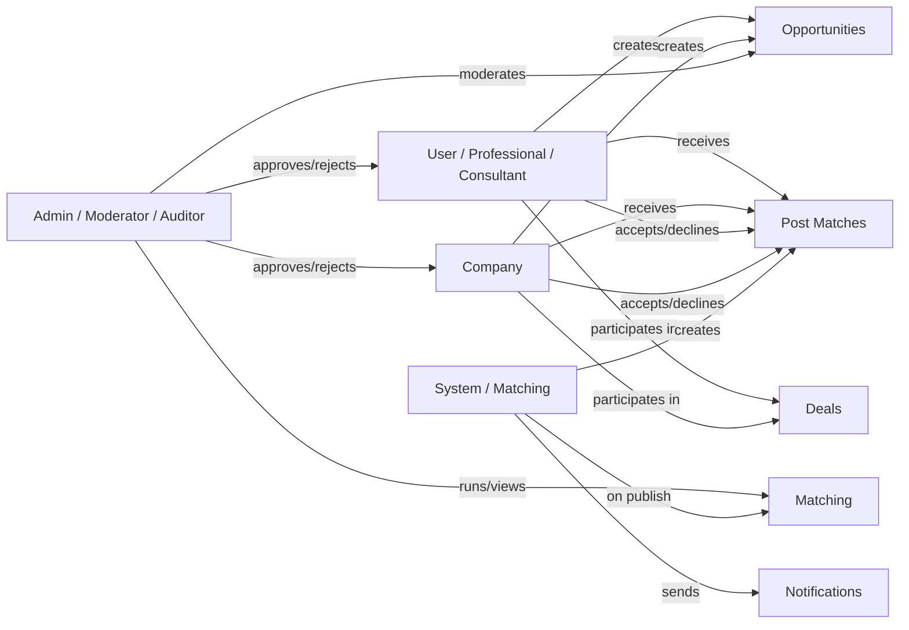

# Actors

This document describes all actors in the PMTwin platform: users, companies, admin roles, and system automation.

---

## 1. Users (Individuals)

Users are individuals who register and use the platform. They can have **professional** or **consultant** roles.

| Attribute | Description |
|-----------|-------------|
| **Entity** | Stored in `pmtwin_users`; identified by `id`, `email`. |
| **Roles** | `CONFIG.ROLES.PROFESSIONAL`, `CONFIG.ROLES.CONSULTANT`. |
| **Status** | `pending`, `active`, `suspended`, `rejected`, `clarification_requested` (CONFIG.USER_STATUS). |
| **Verification** | `unverified`, `professional_verified`, `consultant_verified` (CONFIG.VERIFICATION_STATUS). |
| **Profile** | Type `professional` or similar; name, specializations, certifications, yearsExperience, sectors, skills, preferredPaymentModes, etc. |

**Capabilities:**

- Register, login, manage profile, change password (forgot/reset).
- Create and manage opportunities (request/offer/hybrid).
- View matches (post_matches), accept/decline.
- Create deals from confirmed matches; participate in negotiations; manage milestones.
- View and sign contracts linked to deals.
- Use pipeline (opportunities, applications, matches), find page, dashboard, messages, notifications.
- Cannot access admin routes unless they also have an admin role.

---

## 2. Companies

Companies are organizations that register and use the platform. They are stored in **`pmtwin_companies`** (separate from users). Company **accounts** may be linked to a user with role `company_owner` (e.g. same email used for login).

| Attribute | Description |
|-----------|-------------|
| **Entity** | Stored in `pmtwin_companies`; identified by `id`, `email`. |
| **Roles (for linked user)** | `CONFIG.ROLES.COMPANY_OWNER`, `COMPANY_ADMIN`, `COMPANY_MEMBER`. |
| **Status** | Same lifecycle as user (pending, active, suspended, rejected). |
| **Profile** | Type `company`; name, crNumber, classifications, financialCapacity, experience, etc. |

**Capabilities:**

- Same as users from a feature perspective: opportunities, matches, deals, contracts, pipeline.
- Login can be by user (email/password) or company (email/password); auth checks both `users` and `companies` by email.
- Matching normalizes both users and companies (e.g. `normalizeUsersForMatching`, `normalizeCompaniesForMatching`) so they can be candidates for opportunities.

---

## 3. Admin Roles

Admin roles are assigned to **users** (in `user.role`). Only users with these roles can access admin routes (enforced by auth-guard and `authService.canAccessAdmin()`).

| Role | Config Key | Description |
|------|------------|-------------|
| **Platform Admin** | `CONFIG.ROLES.ADMIN` | Full system access: dashboard, users, vetting, opportunities, matching, deals, contracts, consortium, health, audit, reports, settings, skills, subscriptions, collaboration models. |
| **Moderator** | `CONFIG.ROLES.MODERATOR` | User management, content moderation, limited settings (as per BRD). |
| **Auditor** | `CONFIG.ROLES.AUDITOR` | Read-only access to audit trails and reports. |

**Default admin (POC):** If no admin exists at init, app-init creates a default user: `admin@pmtwin.com` / `admin123`, then sets status to active.

**Capabilities (Admin):**

- Approve/reject/suspend/activate users (vetting).
- View and moderate opportunities; close/delete.
- Run and inspect matching (admin-matching); view matches and post_matches.
- View/manage deals and contracts; consortium replacement flows.
- View health, audit log, reports; manage system settings, subscription plans, skills, collaboration models.

---

## 4. System (Automation & Matching Engine)

The **system** acts as an automated actor. It does not have a user account; it performs actions based on rules and triggers.

| Component | Responsibility |
|-----------|----------------|
| **Matching engine** | When an opportunity is set to `published`, `matching-service.persistPostMatches(opportunityId)` runs. It detects model (one_way, two_way, consortium, circular), calls matching-models (findOffersForNeed, findBarterMatches, findConsortiumCandidates, findCircularExchanges), creates **post_match** records, and calls `notifyPostMatch()` for each. |
| **Notifications** | System creates notifications (e.g. `match_found`, `account_approved`, `account_rejected`) via `data-service.createNotification()`. |
| **Audit** | Important actions (e.g. match_created, user status changes) create audit log entries via `data-service.createAuditLog()`. |
| **Data init** | On first load or seed version change, data-service loads JSON seed, merges demo data, runs migrations, normalizes users/companies. |

No scheduled jobs or background workers exist in the POC; all automation is trigger-based (e.g. on publish or on explicit admin “Run matching”).

---

## Actor Interaction Overview

---

## Related Documentation

- [Data Model](data-model.md) — User/Company/Opportunity/Match/Deal/Contract structures.
- [User Workflow](workflow/user-workflow.md) — Registration, login, profile, opportunities.
- [Admin Portal](admin-portal.md) — Admin features and controls.
