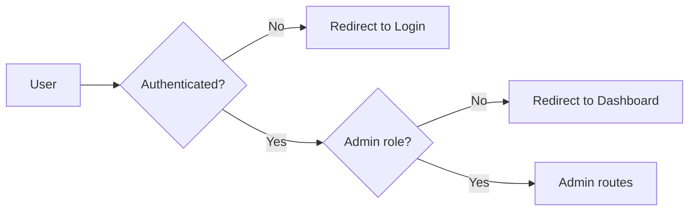

# Admin Portal

Documentation of the admin area: access control, pages, features, and what admins can see and do. Based on existing code and BRD only.

---

## 1. Access Control

- **Auth guard:** Routes under `/admin` (and admin sub-routes) are protected by `authGuard.protect(handler, [CONFIG.ROLES.ADMIN, MODERATOR, AUDITOR])` (or equivalent). Unauthenticated users → redirect to login; authenticated non-admin → redirect to dashboard.
- **Checks:** `authService.canAccessAdmin()`, `authService.isAdmin()` (or role check) used in app-init and layout to show admin sidebar and allow access.
- **Roles:** Platform Admin (full), Moderator (user management, content moderation, limited settings), Auditor (read-only audit and reports). Actual permission differences per feature may vary in code; BRD defines the intent.

---

## 2. Admin Routes and Pages

All under `POC/pages/` and `POC/features/` with corresponding route registration in app-init.

| Route | Page | Feature script | Description |
|-------|------|----------------|--------------|
| `/admin` | admin-dashboard | admin-dashboard.js | Dashboard: metrics, pending approvals, recent activity, quick actions. |
| `/admin/users` | admin-users | admin-users.js | User list: filter by status/role, search; approve/reject/suspend/activate; view detail. |
| `/admin/users/:id` | admin-user-detail | admin-user-detail.js | User detail: profile, opportunities, applications, audit. |
| `/admin/people` | (admin-people) | — | People (may alias users or extend to companies). |
| `/admin/vetting` | admin-vetting | admin-vetting.js | Pending users/companies; quick approve/reject. |
| `/admin/opportunities` | admin-opportunities | admin-opportunities.js | All opportunities; filter by status/model; view, close, delete. |
| `/admin/matching` | admin-matching | admin-matching.js | Run matching for a selected published opportunity; view results (matches/post_matches). |
| `/admin/deals` | admin-deals | admin-deals.js | List all deals; filter; link to deal detail. |
| `/admin/deals/:id` | (deal-detail or admin deal detail) | deal-detail.js | Deal detail (shared or admin-specific view). |
| `/admin/contracts` | admin-contracts | admin-contracts.js | List all contracts; view detail. |
| `/admin/consortium` | admin-consortium | admin-consortium.js | Consortium deals; replacement candidates, replace member flow. |
| `/admin/health` | admin-health | admin-health.js | System health (e.g. storage, seed version). |
| `/admin/audit` | admin-audit | admin-audit.js | Audit log; filter by user, action, entity, date. |
| `/admin/reports` | admin-reports | admin-reports.js | Reports (e.g. offers by site, offers by opportunity). |
| `/admin/settings` | admin-settings | admin-settings.js | System settings (e.g. matchingThreshold, autoNotifyThreshold, sessionDuration). |
| `/admin/skills` | admin-skills | admin-skills.js | Skill canonical / taxonomy management. |
| `/admin/subscriptions` | admin-subscriptions | admin-subscriptions.js | Subscription plans and assignments. |
| `/admin/collaboration-models` | admin-collaboration-models | admin-collaboration-models.js | Collaboration model config. |

---

## 3. Features by Area

### 3.1 Dashboard

- **Metrics:** Total users, pending approval count, total opportunities, total applications (from data-service).
- **Recent activity:** Last N audit entries or notifications (implementation-dependent).
- **Pending approvals:** List of pending users with quick approve/reject (link to vetting or user detail).
- **Quick actions:** Links to users, opportunities, audit, settings.

### 3.2 User Management

- **List:** getUsers() (and optionally getCompanies()); display with status, role, email, name.
- **Filters:** Status (pending, active, suspended, rejected), role, search (email/name).
- **Actions:** Approve (status → active), Reject (status → rejected), Suspend (status → suspended), Activate (status → active); send notifications where implemented.
- **User detail:** getUserById(id); show profile, registration date, opportunities created, applications, related audit logs. Edit user (future/partial).

### 3.3 Vetting

- **Purpose:** Central place for pending users (and possibly companies).
- **Actions:** Same as user management (approve/reject); may request clarification (status clarification_requested).
- **Notification:** User receives account_approved / account_rejected.

### 3.4 Opportunity Moderation

- **List:** getOpportunities(); filter by status, model type, search title/description.
- **Actions:** View (detail), Close (status → closed), Delete (deleteOpportunity). Edit (future).
- **No automatic re-matching** on edit; if opportunity is republished, persistPostMatches runs again.

### 3.5 Matching

- **Run matching:** Select a **published** opportunity from dropdown/list; click “Run matching”. Calls matchingService.findMatchesForPost(opportunityId, options) (and optionally model selector: one_way, two_way, consortium, circular). Results displayed (matches list with scores, breakdown, type).
- **View existing:** Can show post_matches for the opportunity or globally (implementation-dependent).
- **No “persist” button in UI for run:** Admin run typically only returns in-memory results; persistPostMatches is triggered by **publish**, not by admin run. (If admin has a “Save matches” that calls createPostMatch for each result, that would be an extra feature.)

### 3.6 Deals and Contracts

- **Deals:** List getDeals(); filter by status, matchType; open deal detail. No direct “create deal” from admin unless implemented.
- **Contracts:** List getContracts(); view detail; link to deal.

### 3.7 Consortium

- **Replacement:** For consortium deals, when a participant is dropped, admin (or lead) can open replacement flow: findReplacementCandidatesForRole(leadNeedId, missingRole, { excludeUserIds }). Show candidates; on select, create replacement post_match and update deal (roleSlots/participants) as implemented.
- **Stages:** Replacement allowed only in CONFIG.MATCHING.CONSORTIUM_REPLACEMENT_ALLOWED_STAGES; MAX_REPLACEMENT_ATTEMPTS respected.

### 3.8 Health

- **Checks:** Seed version, storage keys present, maybe counts (users, opportunities). No backend health check in POC (no server).

### 3.9 Audit

- **List:** getAuditLog() or equivalent; chronological list.
- **Filters:** User, action, entity type, date range, search in details.
- **Display:** userId, action, entityType, entityId, timestamp, details.

### 3.10 Reports

- **Examples (from API):** offers-by-site (applications grouped by opportunity location), offers-by-opportunity (application count per opportunity). Rendered in admin-reports feature.
- **Other reports:** As implemented (e.g. matching stats, deal pipeline).

### 3.11 Settings

- **System settings:** Stored in pmtwin_system_settings. Keys may include matchingThreshold, autoNotifyThreshold, sessionDuration. Load/save via api-service or storage.
- **Subscription plans:** CRUD on subscription plans; assign subscription to entity (user/company) with status, startsAt, endsAt.

### 3.12 Skills and Collaboration Models

- **Skills:** Manage skill canonical list (pmtwin_skill_canonical_override or lookups); used by matching and opportunity forms.
- **Collaboration models:** Config or content for collaboration model options (project, service, advisory, consortium).

---

## 4. What Admin Cannot Do (POC)

- **No backend:** All actions go through data-service/localStorage; no server-side enforcement or scheduled jobs.
- **No bulk export:** Bulk user export, bulk opportunity export may be future.
- **No automated moderation queue:** Flagged content queue and assignment to moderators are BRD future.
- **No role-specific UI hiding:** Moderator vs Admin may see same menu; permission checks may be partial.
- **No “persist matches” from admin run:** Unless explicitly added, admin “Run matching” only shows results; persist happens on publish.

---

## 5. Default Admin (POC)

- On first load, if no user with role admin exists, app-init creates a default admin: email `admin@pmtwin.com`, password `admin123`, then sets status to active. Used for local/demo only.

---

## Related Documentation

- [Actors](actors.md) — Admin roles.
- [Implementation Status](implementation-status.md) — Per-module status.
- [Gaps and Missing](gaps-and-missing.md) — Admin gaps.
- [BRD Admin Portal](../BRD/07_Admin_Portal_Specifications.md) — Original spec.
