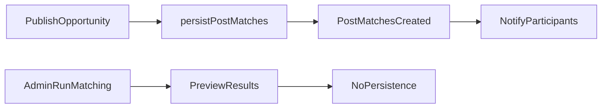
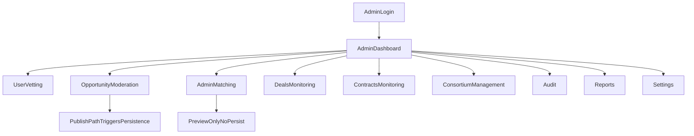

# PMTwin admin portal journey (production-level)

### What this page is

Implementation-aligned **admin operations** guide for product, engineering, and QA: permissions, screens, and step flows.

### Why it matters

It is the longest admin narrative in `/docs` and tracks what is **partial** or **missing**.

### What you can do here

- Read the **permission matrix** before debating role design.
- Follow numbered sections for vetting, opportunities, matching, deals, contracts, audit.

### Step-by-step actions

1. Skim **Overview** and **Role permission matrix**.
2. Open the section for your task (users, vetting, matching, and so on).

### What happens next

Cross-check routes in [admin-portal.md](admin-portal.md) and code-level gaps in [gaps-and-missing.md](gaps-and-missing.md).

### Tips

- POC uses client-side storage; admin actions are not backed by a remote authority layer.

---

**Legend:** ✅ Implemented · ⚠️ Partial · ❌ Missing

---

## 1. Overview

The admin portal governs account trust, opportunity quality, matching oversight, and lifecycle visibility (matches, deals, contracts, audit, reports, settings).

Admin operates within a POC architecture:

- Client-side app
- `data-service` persistence to localStorage
- No backend authority layer

---

## 2. Role Permission Matrix

| Capability | Admin | Moderator | Auditor | Notes |
|---|---|---|---|---|
| Access admin routes | ✅ | ✅ | ✅ | Route-level access exists for all three roles |
| Approve/reject/suspend users | ✅ | ✅ | ⚠️ | Auditor should be read-only by intent, but strict enforcement is partial |
| Opportunity moderation (close/delete) | ✅ | ✅ | ⚠️ | Auditor should not mutate by policy; UI/guard split is partial |
| Run admin matching preview | ✅ | ✅ | ⚠️ | Auditor access may exist depending on route gating |
| Persist matches from admin run | ❌ | ❌ | ❌ | Not implemented |
| View deals/contracts | ✅ | ✅ | ✅ | Visibility present |
| Edit system settings | ✅ | ⚠️ | ❌ | Fine-grained enforcement not consistently strict |
| Audit log access | ✅ | ✅ | ✅ | Auditor-target feature |
| Reports access | ✅ | ✅ | ✅ | Auditor-target feature |
| Bulk actions (users/opps) | ❌ | ❌ | ❌ | Not implemented |

Implementation summary:

- ✅ Role identities are implemented.
- ⚠️ Strict RBAC at action granularity is incomplete.

---

## 3. Admin Login and Access Control

- **Route:** `/login` then `/admin`
- **Feature scripts:** `auth-service.js`, `auth-guard.js`, `admin-dashboard.js`

### Step Flow

1. **Admin Action:** Enter email/password and login.
2. **System Action:** Validate account and role, restore/create session, evaluate admin route permission.
3. **Result:** Admin shell and menu become available for authorized users.

Implementation:

- ✅ Admin route protection exists.
- ⚠️ Permission depth by role is partial.

---

## 4. Dashboard Operations

- **Route:** `/admin`
- **Feature script:** `admin-dashboard.js`

### What admin sees

- User metrics
- Pending approvals
- Opportunity/application activity
- Quick actions to core admin pages

### Step Flow

1. **Admin Action:** Open dashboard.
2. **System Action:** Aggregate counts and recent admin-relevant activity from stored entities.
3. **Result:** Snapshot view for triage and navigation.

Implementation:

- ✅ Dashboard exists and is operational.
- ⚠️ Trend analytics and historical depth are limited.

---

## 5. User Management and Vetting

- **Routes:** `/admin/users`, `/admin/users/:id`, `/admin/vetting`
- **Feature scripts:** `admin-users.js`, `admin-user-detail.js`, `admin-vetting.js`

## 5.1 Core Actions

| Action | Account Transition | Status |
|---|---|---|
| Approve | `pending -> active` | ✅ |
| Reject | `pending -> rejected` | ✅ |
| Suspend | `active -> suspended` | ✅ |
| Reactivate | `suspended -> active` | ✅ |
| Clarification request | `pending -> clarification_requested` | ⚠️ |

## 5.2 Step Flow

1. **Admin Action:** Filter pending/target users and open profile details.
2. **System Action:** Load user/company entity, status, and related context.
3. **Result:** Decision-ready vetting context.
4. **Admin Action:** Approve/reject/suspend/activate.
5. **System Action:** Update status, create notification, write audit log.
6. **Result:** Status reflected in admin list and user experience.

Implementation:

- ✅ Vetting decision cycle implemented.
- ✅ Notification + audit entries for major account decisions.
- ⚠️ Clarification/resubmission journey may vary by UX path.

---

## 6. Opportunity Moderation

- **Route:** `/admin/opportunities`
- **Feature script:** `admin-opportunities.js`

### Core actions

- View opportunity details
- Filter/search opportunities
- Close opportunity
- Delete opportunity

### Step Flow

1. **Admin Action:** Open opportunities list and apply filters.
2. **System Action:** Return opportunity records with current statuses/models.
3. **Result:** Moderation queue/list rendered.
4. **Admin Action:** Close or delete selected opportunity.
5. **System Action:** Persist status update or delete.
6. **Result:** Opportunity removed or transitioned.

Implementation:

- ✅ Moderation actions implemented.
- ⚠️ Deletion can leave orphan references in related entities (no strict referential integrity).

---

## 7. Matching Operations (Admin)

- **Route:** `/admin/matching`
- **Feature script:** `admin-matching.js`

## 7.1 Two Matching Paths (Critical Difference)

| Path | Trigger | Persist `post_matches` | Notification | Status |
|---|---|---|---|---|
| Publish-driven matching | Opportunity publish | ✅ | ✅ | ✅ Implemented |
| Admin run matching | Manual run from admin page | ❌ | ❌ | ⚠️ Preview only |

## 7.2 Step Flow

1. **Admin Action:** Select published opportunity and click run matching.
2. **System Action:** Execute matching logic and return scored in-memory results.
3. **Result:** Admin sees candidate/match preview and quality insight.

Implementation:

- ✅ Manual run for inspection exists.
- ❌ Persist-from-admin-run is not implemented.

---

## 8. Deals Monitoring

- **Route:** `/admin/deals`
- **Feature script:** `admin-deals.js`

### Deal lifecycle tracked

`negotiating -> draft -> review -> signing -> active -> execution -> delivery -> completed -> closed`

### Step Flow

1. **Admin Action:** Open deals page and filter by status/match type.
2. **System Action:** Load deals and lifecycle metadata.
3. **Result:** Admin sees pipeline health and stage distribution.
4. **Admin Action:** Open deal detail for diagnosis/escalation context.
5. **System Action:** Fetch participant, milestone, and linkage details.
6. **Result:** Operational monitoring without direct negotiation ownership.

Implementation:

- ✅ Deal visibility and status tracking implemented.
- ⚠️ Advanced intervention controls are partial.

---

## 9. Contracts Monitoring

- **Route:** `/admin/contracts`
- **Feature script:** `admin-contracts.js`

### Contract statuses tracked

`pending`, `active`, `completed`, `terminated`

### Step Flow

1. **Admin Action:** Open contracts list and filter by status.
2. **System Action:** Load contract records and linked deal context.
3. **Result:** Signature/completion monitoring context displayed.
4. **Admin Action:** Inspect contract details where available.
5. **System Action:** Return party signatures and terms snapshot.
6. **Result:** Visibility into legal lifecycle progression.

Implementation:

- ✅ Contract monitoring implemented.
- ⚠️ Full legal/e-signature workflow integrations are missing.

---

## 10. Consortium Management (Improved UX Flow)

- **Route:** `/admin/consortium`
- **Feature script:** `admin-consortium.js`

## 10.1 How admin detects missing role

Admin identifies gaps from:

- Consortium deal participants/role slots
- Dropped member or unfilled required role
- Stage eligibility for replacement (configured allowed stages)

## 10.2 Replacement UX behavior

1. **Admin Action:** Open consortium deal and select missing role.
2. **System Action:** Run replacement candidate discovery for role (excluding existing participants).
3. **Result:** Ranked candidate list shown in replacement UI.
4. **Admin Action:** Select replacement candidate.
5. **System Action:** Create replacement match context and update deal participants/role mapping (flow-dependent).
6. **Result:** Consortium continues with updated composition.

Implementation:

- ✅ Replacement candidate search path exists.
- ⚠️ Strict cap/stage enforcement consistency depends on flow and UI wiring.

---

## 11. Audit and Reports

## 11.1 Audit

- **Route:** `/admin/audit`
- **Feature script:** `admin-audit.js`

### Step Flow

1. **Admin Action:** Open audit page and apply filters.
2. **System Action:** Query audit entries by action/entity/user/date.
3. **Result:** Timeline of operational actions for traceability.

## 11.2 Reports

- **Route:** `/admin/reports`
- **Feature script:** `admin-reports.js`

### Common outputs

- Offers/applications by opportunity
- Operational summaries and platform insights

### Step Flow

1. **Admin Action:** Open reports and select report view/filter.
2. **System Action:** Aggregate relevant stored records.
3. **Result:** Decision-support reporting view.

Implementation:

- ✅ Audit and report surfaces implemented.
- ⚠️ Enterprise BI/export depth is limited.

---

## 12. Settings and Configuration

- **Route:** `/admin/settings`
- **Feature script:** `admin-settings.js`

Related admin configuration pages:

- `/admin/skills` -> `admin-skills.js`
- `/admin/subscriptions` -> `admin-subscriptions.js`

### Step Flow

1. **Admin Action:** Edit matching/system parameters (for example thresholds).
2. **System Action:** Persist settings object in storage layer.
3. **Result:** Updated runtime configuration available to client-side behavior.

Implementation:

- ✅ Settings update and persistence exists.
- ⚠️ No backend approval/versioning/governance controls.

---

## 13. Notification Flow (Admin vs User View)

## 13.1 Trigger Map

| Trigger | Recipient | What admin sees | What user sees | Status |
|---|---|---|---|---|
| Account approved/rejected/suspended | Affected user/company | Action reflected in admin list/audit | Notification in notifications page | ✅ |
| Match created on publish | Match participants | Opportunity/matching context updates | Match notification and match list entry | ✅ |
| Application status change | Applicant | Status in admin/user views | Application status notification | ✅ |
| Admin run matching preview | No participant notification by default | Preview results only | No new notification | ⚠️ |

## 13.2 Flow Summary

1. **Admin Action:** Perform moderation/vetting or trigger publish context indirectly.
2. **System Action:** Create notification entities for user-facing events.
3. **Result:** User receives in-app notification; admin sees state/audit updates.

---

## 14. What Admin Cannot Do (Current Implementation)

- ❌ Enforce server-side policy through backend (no backend layer).
- ❌ Persist matches directly from admin matching run.
- ❌ Execute built-in bulk user/opportunity governance actions.
- ⚠️ Rely on strict RBAC at action granularity across all pages.
- ❌ Use enterprise-grade compliance controls (immutable logs, signed workflow, policy engine).

---

## 15. Full Admin Scenario (End-to-End)

Scenario: from new registration to monitored contract lifecycle.

1. **User registers** (`pending`).
2. **Admin Action:** Open `/admin/vetting` and approve account.
3. **System Action:** Update status `pending -> active`, send approval notification, create audit record.
4. **Result:** User can access full portal.

5. **User publishes opportunity**.
6. **System Action:** `persistPostMatches` runs, `post_matches` created, participants notified.
7. **Result:** Matches appear in user-side match views.

8. **Participants confirm match** and create deal.
9. **System Action:** Deal enters lifecycle and later moves to signing/contract creation.
10. **Result:** Contract record appears in `/admin/contracts`.

11. **Admin Action:** Monitor `/admin/deals` and `/admin/contracts` for stalled stages or anomalies.
12. **System Action:** Update statuses as users progress milestones/signatures.
13. **Result:** Admin has operational visibility from onboarding through completion.

Implementation:

- ✅ All major visibility and governance checkpoints exist.
- ⚠️ Some enforcement is process-driven rather than backend-enforced.

---

## 16. Admin Control Flow Diagram

---

## 17. QA Checklist (Actionable)

1. Verify vetting status transitions and corresponding notifications.
2. Verify admin matching does not create persisted `post_matches`.
3. Verify publish-triggered matching does create persisted `post_matches`.
4. Verify deal/contract pages reflect expected lifecycle states.
5. Verify consortium replacement candidate list appears with expected exclusions.
6. Verify audit entries exist for core admin actions.
7. Verify role behavior differences and document any unexpected mutation access.

---

## 18. Summary

- ✅ Admin portal is functionally usable for POC governance.
- ✅ Core flows (vetting, moderation, monitoring, audit/reporting) are in place.
- ⚠️ Production readiness depends on backend enforcement, strict RBAC, and stronger persistence/governance controls.
