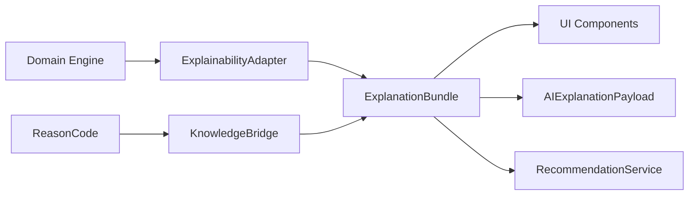

# ADR-201: Explainability Foundation

| Field | Value |
|-------|-------|
| **Status** | Accepted |
| **Version** | 1.0 |
| **Date** | 9 July 2026 |
| **Depends on** | ADR-100 (Architecture Freeze v1.0), ADR-101 (Backend Domain Ownership) |
| **Authority chain** | ADR-100 → ADR-101 → ADR-201 → Explainability Sprints E1–E9 |
| **Package** | `@pm-twin/explainability` |

---

## Context

PM-Twin engines (profile completeness, readiness scoring, matching, negotiation, commercial approval, contract execution, dashboard signals, analytics) each produce domain-specific outputs today. Without a shared explainability contract:

- UI surfaces invent ad-hoc message shapes per screen
- AI assistants receive raw engine internals instead of a stable, auditable payload
- Cross-engine recommendations cannot be ranked or correlated
- Knowledge Registry hints cannot be resolved consistently from reason identifiers

Sprint **E0** establishes the **architecture-only foundation**: canonical types, reason codes, adapter interfaces, AI serialization contract, and contract tests. No UI, no adapter implementations, and no changes to existing engine business logic.

---

## Decision

Introduce `@pm-twin/explainability` as the **single canonical contract** for all explainability data in PM-Twin.

**Rules:**

1. All user-facing explanations, AI payloads, and recommendation cards MUST be derived from `ExplanationBundle`.
2. All machine-readable explanation identifiers MUST use the `ReasonCode` vocabulary defined in this package — never free-form strings.
3. Engine-specific logic remains in existing packages (`collaboration-models`, `matching`, `web/`, etc.). Engines MAY continue internal representations but MUST map to `ExplanationBundle` at adapter boundaries (E1+).
4. AI consumers MUST ingest `AIExplanationPayload` / `ExplanationBundle` only — never raw readiness results, match scores, or negotiation internals.
5. Knowledge enrichment resolves through `KnowledgeBridge` (interface only in E0).

---

## Architecture

```
┌─────────────────────────────────────────────────────────────────────┐
│  Presentation (E7+) — web/ UI components                            │
│  Renders ExplanationBundle fields only                              │
└───────────────────────────────┬─────────────────────────────────────┘
                                │ reads
┌───────────────────────────────▼─────────────────────────────────────┐
│  @pm-twin/explainability — canonical contract (E0)                    │
│  ExplanationBundle │ ReasonCode │ ExplainabilityAdapter │ AI payload │
└───────────────┬───────────────────────────────┬───────────────────────┘
                │ implements (E1–E6)            │ resolves (E8)
┌───────────────▼───────────────┐   ┌───────────▼───────────────────────┐
│  Engine adapters               │   │  KnowledgeBridge implementation    │
│  Profile, Vetting, Opportunity │   │  Knowledge Registry + compliance   │
│  Matching, Negotiation, etc.   │   │  hints, lifecycle guidance         │
└───────────────┬───────────────┘   └───────────────────────────────────┘
                │ maps from
┌───────────────▼─────────────────────────────────────────────────────┐
│  Existing engines (unchanged in E0)                                   │
│  readiness-engine │ matching engine │ negotiation │ contract FSM     │
└─────────────────────────────────────────────────────────────────────┘
```

---

## Data flow

1. **Input** — Domain engine evaluates entity state (unchanged in E0).
2. **Adapt** — `ExplainabilityAdapter<TInput>.buildExplanation()` maps engine output → `ExplanationBundle` (E1+).
3. **Enrich** — Optional `KnowledgeBridge` resolves educational/compliance/lifecycle hints by `ReasonCode` (E8).
4. **Recommend** — `RecommendationService` aggregates cross-engine `Recommendation[]` (E6).
5. **Serialize** — `toAIExplanationPayload()` produces versioned JSON for AI consumers (E9).
6. **Render** — UI reads bundle fields; no direct engine imports in components (E7).



---

## Canonical types

| Type | Purpose |
|------|---------|
| `ExplanationBundle` | Top-level explainability payload per entity/engine |
| `Recommendation` | Actionable next step with impact estimate |
| `ScoreBreakdownEntry` | Weighted score decomposition |
| `TimelineEvent` | Chronological explainability events |
| `BlockingFactor` | Hard blockers with resolution hints |
| `ExplanationReason` | Human-readable reason with canonical code |
| `StrengthWeaknessEntry` | Positive/negative factor summary |
| `Health` | `excellent` \| `good` \| `warning` \| `critical` |
| `EngineId` | Source engine identifier |

---

## Adapter model

```typescript
interface ExplainabilityAdapter<TInput> {
  buildExplanation(input: TInput): ExplanationBundle
  buildRecommendations(input: TInput): readonly Recommendation[]
  buildBreakdown(input: TInput): readonly ScoreBreakdownEntry[]
  buildTimeline(input: TInput): readonly TimelineEvent[]
}
```

**Extension rules:**

- One adapter per bounded context; adapters live outside `@pm-twin/explainability` (typically `web/src/services/explainability/` or future `server/` modules).
- Adapters MUST NOT mutate engine state.
- Adapters MUST populate `metadata.generatedAt`, `metadata.engineVersion`, and `engine` on every bundle.
- New reason codes require ADR amendment or E0 package version bump — no ad-hoc strings.
- Parameterized codes (e.g. `READINESS_MISSING_${fieldId}`) are allowed only within registered prefixes.

---

## Reason code domains

| Prefix | Domain | Example codes |
|--------|--------|---------------|
| `PROFILE_` | Profile completeness | `PROFILE_MISSING_PHONE`, `PROFILE_MISSING_SKILLS` |
| `DOCUMENT_` | Compliance documents | `DOCUMENT_CR_EXPIRED`, `DOCUMENT_VAT_MISSING` |
| `READINESS_` | Opportunity readiness | `READINESS_MISSING_BUDGET`, `READINESS_PUBLISH_BLOCKED` |
| `MATCH_` | Matching fit | `MATCH_SKILL_LOW`, `MATCH_LOCATION_LOW` |
| `NEGOTIATION_` | Negotiation friction | `NEGOTIATION_PRICE_GAP`, `NEGOTIATION_RESPONSE_DELAY` |
| `COMMERCIAL_` | Commercial gates | `COMMERCIAL_APPROVAL_PENDING` |
| `CONTRACT_` | Contract execution | `CONTRACT_SIGNATURE_PENDING` |
| `VETTING_` | Party vetting | `VETTING_BACKGROUND_PENDING` |
| `AGREEMENT_` | Commercial agreement | `AGREEMENT_TERMS_PENDING` |
| `DASHBOARD_` | Dashboard signals | `DASHBOARD_ACTION_REQUIRED` |
| `ANALYTICS_` | Analytics insights | `ANALYTICS_DATA_INSUFFICIENT` |

---

## Service interfaces (E0 — no implementations)

### RecommendationService

Future cross-engine recommendation aggregation for: Profile, Vetting, Opportunity, Matching, Negotiation, Agreement, Contract.

### KnowledgeBridge

Resolves Knowledge Registry content by `ReasonCode`:

- `resolveKnowledgeAnswer()`
- `resolveEducationalContent()`
- `resolveComplianceHints()`
- `resolveRiskHints()`
- `resolveLifecycleHints()`

---

## AI contract

- **Payload:** `AIExplanationPayload { version, bundle, serializedAt }`
- **Version:** `1.0.0` (`AI_EXPLANATION_PAYLOAD_VERSION`)
- **Rule:** AI pipelines consume `ExplanationBundle` only via `serializeExplanationBundle()` / `toAIExplanationPayload()`.
- **Validation:** `isExplanationBundle()` guards deserialization; invalid payloads throw.

---

## Future engine mapping (E1–E9)

| Sprint | Scope | Engine / surface |
|--------|-------|------------------|
| **E1** | Profile adapter | `ENGINE_ID.PROFILE` — see [ADR-201-E1](./ADR-201-E1-profile-adapter.md) |
| **E2** | Vetting adapter | `ENGINE_ID.VETTING` — see [ADR-201-E2](./ADR-201-E2-vetting-adapter.md) |
| **E3** | Opportunity + readiness adapter | `ENGINE_ID.OPPORTUNITY`, `ENGINE_ID.READINESS` — see [ADR-201-E3](./ADR-201-E3-opportunity-readiness-adapter.md) |
| **E4** | Matching adapter | `ENGINE_ID.MATCHING` — see [ADR-201-E4](./ADR-201-E4-matching-adapter.md) |
| **E5** | Negotiation adapter | `ENGINE_ID.NEGOTIATION` |
| **E6** | Agreement + contract + `RecommendationService` | `ENGINE_ID.AGREEMENT`, `ENGINE_ID.CONTRACT`, `ENGINE_ID.COMMERCIAL` |
| **E7** | UI components | Renders `ExplanationBundle` |
| **E8** | `KnowledgeBridge` implementation | Knowledge Registry integration |
| **E9** | AI gateway + observability | `AIExplanationPayload` ingestion, Dashboard + Analytics adapters |

**Mandatory:** E1–E9 MUST import from `@pm-twin/explainability` and MUST NOT redefine overlapping types locally.

---

## Relationship to existing readiness explainability

`@pm-twin/collaboration-models` contains readiness-specific explainability builders (`buildExplanations`, `buildBlockingReasons`, etc.) and `ReadinessReasonCode`. These remain **unchanged in E0**.

E3 will provide an adapter that maps `ReadinessResult` → `ExplanationBundle`, aligning `ReadinessReasonCode` values to the canonical `READINESS_*` prefix in this package.

---

## Consequences

### Positive

- Single contract for UI, AI, and cross-engine recommendations
- Reason codes become stable API identifiers for Knowledge Registry
- Contract tests prevent shape drift before implementations land

### Negative / deferred

- Temporary duplication between collaboration-models readiness types and this package until E3 adapter ships
- No runtime explainability until E1+ adapters are implemented

---

## Compliance notes

- Arabic RTL rendering is a UI concern (E7); bundle `summary` and `reasons[].message` must support bilingual content via `metadata.locale`.
- PDPL: `ExplanationBundle` must not embed PII beyond entity IDs already authorized in the calling context; adapters sanitize in E1+.
- VAT/commercial hints route through `COMMERCIAL_*` and `DOCUMENT_*` reason codes with KnowledgeBridge compliance resolution (E8).

---

## References

- `packages/explainability/` — canonical implementation
- `docs/runtime-ownership.md` — active runtime authority
- `packages/collaboration-models/src/readiness/` — existing readiness explainability (frozen for E0)
