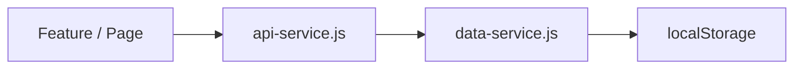

# API Structure

The POC has **no backend server**. All “API” behavior is implemented client-side via an abstraction layer that currently delegates to the data-service. This document describes that structure and the intended endpoint map for future backend integration.

---

## 1. Current Architecture



- **api-service.js** exposes `request(endpoint, options)` with method GET/POST/PUT/DELETE and optional `data`. It routes to `handleGet`, `handlePost`, `handlePut`, `handleDelete`, which **call data-service methods** (no network).
- **config.js** defines `CONFIG.API.BASE_URL: '/api/v1'` and `CONFIG.API.ENDPOINTS` for auth, users, opportunities, applications, matches, admin/*.
- When a real backend exists, the same `request()` can be replaced with `fetch(CONFIG.API.BASE_URL + endpoint, { method, headers: getAuthHeaders(), body: JSON.stringify(data) })` without changing feature code that uses apiService.request().

---

## 2. Endpoint Map (Designed for Future Backend)

Endpoints that are **routed** in api-service today (to data-service) or listed in CONFIG.API.ENDPOINTS.

### 2.1 Public / User

| Method | Endpoint | Current handler | Description |
|--------|----------|------------------|-------------|
| GET | `/users` | data-service.getUsers() | List users (admin or profile use) |
| GET | `/users/:id` | data-service.getUserById(id) | User by ID |
| POST | (auth) | auth-service (not via api-service) | Login/register handled by auth-service |
| POST | `/opportunities` | data-service.createOpportunity(data) | Create opportunity |
| GET | `/opportunities` | data-service.getOpportunities() | List opportunities |
| GET | `/opportunities/:id` | data-service.getOpportunityById(id) | Opportunity by ID |
| PUT | `/opportunities/:id` | data-service.updateOpportunity(id, data) | Update opportunity |
| DELETE | `/opportunities/:id` | data-service.deleteOpportunity(id) | Delete opportunity |
| POST | `/applications` | data-service.createApplication(data) | Create application |
| GET | (applications by opportunity) | data-service.getApplicationsByOpportunityId(id) | Applications for opportunity |

Auth (login, register, logout) uses **auth-service** and **data-service** directly in the POC; no api-service endpoint. Future: POST `/auth/login`, POST `/auth/register`, POST `/auth/logout`.

---

### 2.2 Admin

| Method | Endpoint | Current handler | Description |
|--------|----------|------------------|-------------|
| GET | `/admin/opportunities` | data-service.getOpportunities() | All opportunities |
| GET | `/admin/opportunities/:id` | data-service.getOpportunityById(id) | Opportunity by ID |
| GET | `/admin/opportunities/:id/applications` | data-service.getApplicationsByOpportunityId(id) | Applications for opportunity |
| PUT | `/admin/opportunities/:id` | data-service.updateOpportunity(id, data) | Update (e.g. close) |
| DELETE | `/admin/opportunities/:id` | data-service.deleteOpportunity(id) | Delete |
| GET | `/admin/users` | data-service.getUsers() | All users |
| GET | `/admin/users/:id` | data-service.getUserById(id) | User by ID |
| PUT | `/admin/users/:id` | data-service.updateUser(id, data) | Update user (e.g. status) |
| GET | `/admin/applications` | data-service.getApplications() | All applications |
| GET | `/admin/reports/offers-by-site` | Computed from applications + opportunities | Report: applications by site |
| GET | `/admin/reports/offers-by-opportunity` | Computed per opportunity | Report: application count per opportunity |
| GET | `/admin/settings` | storage.get(SYSTEM_SETTINGS) | System settings |
| PUT | `/admin/settings` | storage.set(SYSTEM_SETTINGS, data) | Save system settings |
| GET | `/admin/subscription-plans` | data-service.getSubscriptionPlans() | Subscription plans |
| POST | `/admin/subscription-plans` | data-service.createPlan(data) | Create plan |
| PUT | `/admin/subscription-plans/:id` | data-service.updatePlan(id, data) | Update plan |
| DELETE | `/admin/subscription-plans/:id` | data-service.deletePlan(id) | Delete plan |
| GET | `/admin/subscriptions` | data-service.getSubscriptions() | Subscriptions |
| POST | `/admin/subscriptions` | data-service.assignSubscription(...) | Assign subscription |
| PUT | `/admin/subscriptions/:id` | data-service.updateSubscription(id, data) | Update subscription |
| DELETE | `/admin/subscriptions/:id` | data-service.removeSubscription(id) | Remove subscription |

**Not in api-service (used directly from features):** Deals, contracts, post_matches, notifications, audit. These are accessed via **data-service** directly (e.g. data-service.getDeals(), getPostMatchesForUser()). For a future API, add endpoints such as GET/POST/PUT `/deals`, `/contracts`, `/matches` (post_matches), `/notifications`, `/audit`.

---

## 3. Auth Headers (Future)

api-service has `getAuthHeaders()` returning:

```javascript
{
  'Authorization': `Bearer ${sessionStorage.getItem('pmtwin_token')}`,
  'Content-Type': 'application/json'
}
```

Backend would validate the token and enforce role for admin routes.

---

## 4. What Does Not Exist

- No real HTTP server; no `/api/v1/*` responses.
- No auth endpoints in api-service (login/register in auth-service only).
- No dedicated endpoints for: matches (legacy), post_matches, deals, contracts, notifications, audit in api-service (features call data-service).
- No pagination, filtering, or sort query params in the abstraction (data-service returns full arrays).
- No file upload endpoints.
- No WebSocket or real-time API.

---

## 5. Recommendation for Backend

1. **Keep api-service.request()** as the single entry for feature code; swap implementation to fetch().
2. **Add CONFIG.API.ENDPOINTS** for deals, contracts, post_matches, notifications, audit when backend is built.
3. **Implement REST (or GraphQL)** for all entities in data-service; preserve same shapes (id, createdAt, etc.).
4. **Auth:** POST `/auth/login` (return token), POST `/auth/register`, POST `/auth/logout`; middleware to attach user to request and check admin role for `/admin/*`.

---

## Related Documentation

- [Overview](overview.md) — No backend, localStorage.
- [Data Model](data-model.md) — Entity shapes.
- [Gaps and Missing](gaps-and-missing.md) — No real API.
