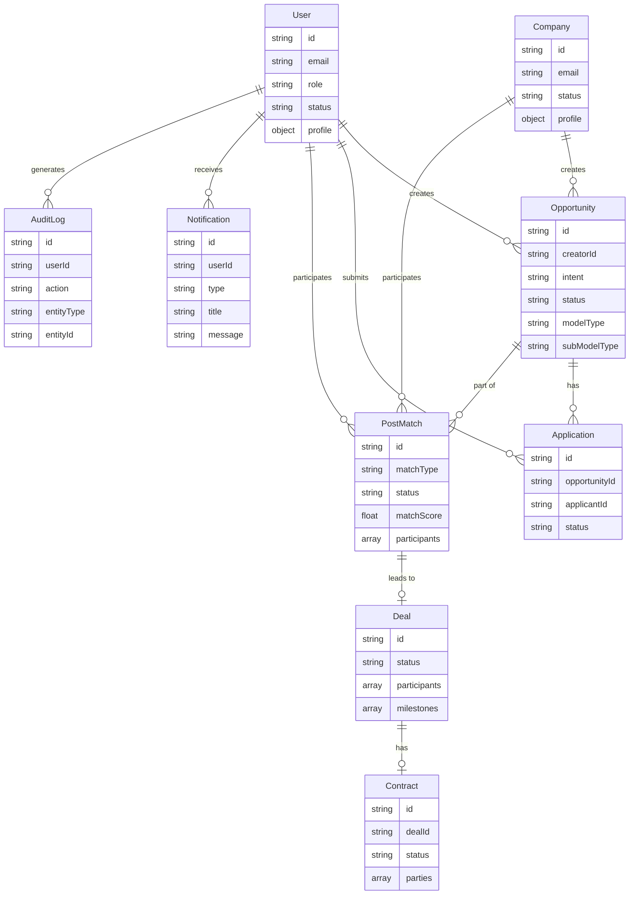

# Data model

### What this page is

Entities, **fields**, and **relationships** for PMTwin. Storage is **localStorage** keys from `CONFIG.STORAGE_KEYS` in the POC (not SQL).

### Why it matters

Engineers and integrators use it as the single schema reference.

### What you can do here

- Start from the ER diagram.
- Drill into each entity section for field lists.

### Step-by-step actions

1. Find the entity you are changing (User, Opportunity, PostMatch, Deal, Contract, and so on).
2. Check relationships before adding foreign-key-like ids.

### What happens next

Map keys to future tables using [database-schema.md](database-schema.md).

### Tips

- Legacy `pmtwin_matches` may still appear in older paths; prefer **post match** for new work.

---

## Entity relationship overview

---

## 1. Users

**Storage key:** `CONFIG.STORAGE_KEYS.USERS` (`pmtwin_users`)

| Field | Type | Description |
|-------|------|-------------|
| `id` | string | Unique identifier |
| `email` | string | Unique; used for login |
| `passwordHash` | string | POC: encoded password (not real hash) |
| `role` | string | One of CONFIG.ROLES (professional, consultant, company_owner, admin, moderator, auditor) |
| `status` | string | pending, active, suspended, rejected, clarification_requested |
| `profile` | object | type, name, specializations, certifications, yearsExperience, sectors, skills, preferredPaymentModes, verificationStatus, etc. |
| `createdAt`, `updatedAt` | string | ISO timestamps |

**Profile (professional):** type, name, specializations, certifications, yearsExperience, sectors, skills, professionalFields, primaryDomain, desiredBudgetMin/Max, etc.

---

## 2. Companies

**Storage key:** `CONFIG.STORAGE_KEYS.COMPANIES` (`pmtwin_companies`)

| Field | Type | Description |
|-------|------|-------------|
| `id` | string | Unique identifier |
| `email` | string | Unique; used for login |
| `passwordHash` | string | POC: encoded |
| `status` | string | Same as user status |
| `profile` | object | type: 'company', name, crNumber, classifications, financialCapacity, experience, etc. |
| `createdAt`, `updatedAt` | string | ISO timestamps |

---

## 3. Opportunities

**Storage key:** `CONFIG.STORAGE_KEYS.OPPORTUNITIES` (`pmtwin_opportunities`)

| Field | Type | Description |
|-------|------|-------------|
| `id` | string | Unique identifier |
| `title` | string | Opportunity title |
| `description` | string | Description |
| `creatorId` | string | User or company ID |
| `modelType` | string | project_based, strategic_partnership, resource_pooling, hiring, competition |
| `subModelType` | string | task_based, consortium, project_jv, spv, strategic_jv, etc. |
| `status` | string | draft, published, in_negotiation, contracted, in_execution, completed, closed, cancelled |
| `intent` | string | request (need), offer, hybrid |
| `collaborationModel` | string | project, service, advisory, consortium (wizard step) |
| `paymentModes` / `exchangeMode` | array/string | cash, barter, equity, profit_sharing, hybrid |
| `value_exchange` | object | accepted_modes, estimated_value, mode |
| `scope` | object | requiredSkills, offeredSkills, sectors, etc. |
| `attributes` | object | Model-specific (taskTitle, budgetRange, memberRoles, partnerRoles, etc.) |
| `exchangeData` | object | budgetRange, cashAmount, barterValue, etc. |
| `normalized` | object | Filled by post-preprocessor for matching (skills, budget, timeline, location) |
| `createdAt`, `updatedAt` | string | ISO timestamps |

**Relationships:** One creator (user or company) → many opportunities. Opportunities are referenced in applications, post_matches, and deals.

---

## 4. Applications

**Storage key:** `CONFIG.STORAGE_KEYS.APPLICATIONS` (`pmtwin_applications`)

| Field | Type | Description |
|-------|------|-------------|
| `id` | string | Unique identifier |
| `opportunityId` | string | FK to opportunity |
| `applicantId` | string | FK to user (or company) |
| `proposal` | string | Application text |
| `status` | string | pending, reviewing, shortlisted, in_negotiation, accepted, rejected, withdrawn |
| `createdAt`, `updatedAt` | string | ISO timestamps |

Additional related storage: application_requirements, application_deliverables, application_files, application_payment_terms (linked by application/opportunity).

**Relationships:** Opportunity 1:N Application; User/Company 1:N Application.

---

## 5. Matches (Legacy / Internal)

**Storage key:** `CONFIG.STORAGE_KEYS.MATCHES` (`pmtwin_matches`)

Used by the legacy opportunity-to-candidate matching path (findMatchesForOpportunity). Post-to-post matching uses **post_matches** instead.

| Field | Type | Description |
|-------|------|-------------|
| `id` | string | Unique identifier |
| `opportunityId` | string | FK to opportunity |
| `candidateId` | string | FK to user/company |
| `matchScore` | number | 0–1 |
| `criteria` | object | modelType, subModelType, skillMatch, sectorMatch, paymentCompatible, matchedAt |
| `notified` | boolean | Whether user was notified |
| `createdAt` | string | ISO timestamp |

---

## 6. Post Matches (User-Facing Matches)

**Storage key:** `CONFIG.STORAGE_KEYS.POST_MATCHES` (`pmtwin_post_matches`)

User-facing match records produced by post-to-post matching (one_way, two_way, consortium, circular).

| Field | Type | Description |
|-------|------|-------------|
| `id` | string | Unique identifier |
| `matchType` | string | one_way, two_way, consortium, circular |
| `status` | string | pending, accepted, declined, confirmed, expired |
| `matchScore` | number | 0–1 composite score |
| `participants` | array | { userId, opportunityId, role, participantStatus, respondedAt } — roles: need_owner, offer_provider, consortium_lead, consortium_member, chain_participant |
| `payload` | object | Type-specific: needOpportunityId/offerOpportunityId (one_way), sideA/sideB (two_way), leadNeedId/roles (consortium), cycle/links (circular) |
| `createdAt`, `updatedAt`, `expiresAt` | string | ISO timestamps |
| `isReplacement` | boolean | True if created for consortium replacement flow |
| `replacementDealId`, `replacementRole`, `replacementPayload` | string/object | Used when isReplacement is true |

**Relationships:** Many participants (users/companies) per post_match; post_match can lead to one deal.

---

## 7. Deals

**Storage key:** `CONFIG.STORAGE_KEYS.DEALS` (`pmtwin_deals`)

Post-match collaboration workflow: negotiation, milestones, delivery.

| Field | Type | Description |
|-------|------|-------------|
| `id` | string | Unique identifier |
| `matchId` | string | Optional; legacy match id |
| `applicationId` | string | Optional; if deal created from application |
| `opportunityId` | string | Primary opportunity (or first of opportunityIds) |
| `opportunityIds` | array | All linked opportunities (barter/consortium/circular may have multiple) |
| `matchType` | string | one_way, two_way, consortium, circular |
| `status` | string | negotiating, draft, review, signing, active, execution, delivery, completed, closed |
| `title` | string | Deal title |
| `participants` | array | { userId, role, approvalStatus, signedAt } |
| `roleSlots` | object/array | Consortium: map of userId → role or array of { userId, role } |
| `payload` | object | Copy of post_match payload or similar |
| `scope` | string | Scope description |
| `timeline` | object | start, end |
| `exchangeMode` | string | cash, barter, etc. |
| `valueTerms` | object | agreedValue, paymentSchedule |
| `deliverables` | string | Deliverables description |
| `milestones` | array | { id, title, description, dueDate, status, deliverables, submittedAt, approvedAt, approvedBy } — status: pending, in_progress, submitted, approved, rejected |
| `negotiationId` | string | Optional link to negotiation |
| `contractId` | string | Optional link to contract when in signing/active |
| `createdAt`, `updatedAt`, `completedAt`, `closedAt` | string | ISO timestamps |

**Relationships:** Deal can be created from post_match or application; deal 0..1 contract.

---

## 8. Contracts

**Storage key:** `CONFIG.STORAGE_KEYS.CONTRACTS` (`pmtwin_contracts`)

Legal layer; created/linked when deal reaches signing.

| Field | Type | Description |
|-------|------|-------------|
| `id` | string | Unique identifier |
| `dealId` | string | FK to deal |
| `opportunityId` | string | Optional |
| `applicationId` | string | Optional |
| `parties` | array | { userId, role, signedAt } |
| `scope` | string | Scope snapshot |
| `paymentMode` | string | cash, barter, etc. |
| `agreedValue` | number/object | Agreed value |
| `duration` | string | Duration description |
| `paymentSchedule` | string/object | Payment schedule |
| `equityVesting` | object | Optional |
| `profitShare` | object | Optional |
| `milestonesSnapshot` | array | Snapshot of milestones at signing |
| `status` | string | pending, active, completed, terminated |
| `signedAt` | string | When contract was signed |
| `createdAt`, `updatedAt` | string | ISO timestamps |

**Relationships:** Contract belongs to one deal (dealId); deal can have one contract.

---

## 9. Notifications

**Storage key:** `CONFIG.STORAGE_KEYS.NOTIFICATIONS` (`pmtwin_notifications`)

| Field | Type | Description |
|-------|------|-------------|
| `id` | string | Unique identifier |
| `userId` | string | Recipient |
| `type` | string | match_found, application_received, application_status_changed, account_approved, account_rejected, account_suspended, account_activated, match (for post_match) |
| `title` | string | Title |
| `message` | string | Body |
| `link` | string | Optional deep link (e.g. /matches/:id) |
| `read` | boolean | Read flag |
| `createdAt` | string | ISO timestamp |

---

## 10. Audit Log

**Storage key:** `CONFIG.STORAGE_KEYS.AUDIT` (`pmtwin_audit`)

| Field | Type | Description |
|-------|------|-------------|
| `id` | string | Unique identifier |
| `userId` | string | Actor (or 'system') |
| `action` | string | user_registered, opportunity_created, match_created, etc. |
| `entityType` | string | user, opportunity, application, match, etc. |
| `entityId` | string | Optional |
| `timestamp` | string | ISO timestamp |
| `details` | object | Arbitrary payload |

---

## 11. Other Storage Keys

- **Sessions:** `pmtwin_sessions` (seed only; live sessions in sessionStorage).
- **Connections / Messages:** `pmtwin_connections`, `pmtwin_messages`.
- **Negotiations:** `pmtwin_negotiations`.
- **Reviews:** `pmtwin_reviews`.
- **System settings:** `pmtwin_system_settings`.
- **Subscription plans / subscriptions:** `pmtwin_subscription_plans`, `pmtwin_subscriptions`.
- **Reset tokens:** `pmtwin_reset_tokens`.
- **Lookups / skill canonical:** `pmtwin_lookups_override`, `pmtwin_skill_canonical_override`.

---

## Relationships Summary

| From | To | Relationship |
|------|-----|--------------|
| User / Company | Opportunity | One-to-many (creatorId) |
| Opportunity | Application | One-to-many (opportunityId) |
| User / Company | Application | One-to-many (applicantId) |
| Opportunity | PostMatch | Many-to-many (via participants + payload) |
| User / Company | PostMatch | Many-to-many (participants) |
| PostMatch | Deal | One post_match can lead to one deal (user flow) |
| Application | Deal | One application can lead to one deal |
| Deal | Contract | One-to-one (contractId / dealId) |
| User / Company | Notification | One-to-many (userId) |
| User | AuditLog | One-to-many (userId) |

---

## Related Documentation

- [Database Schema](database-schema.md) — Storage keys and future DB notes.
- [Implementation Status](implementation-status.md) — Which entities are fully used.
- [BRD Data Models](../BRD/06_Data_Models.md) — Original BRD reference.
