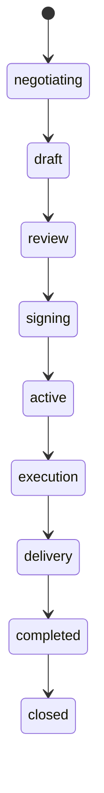
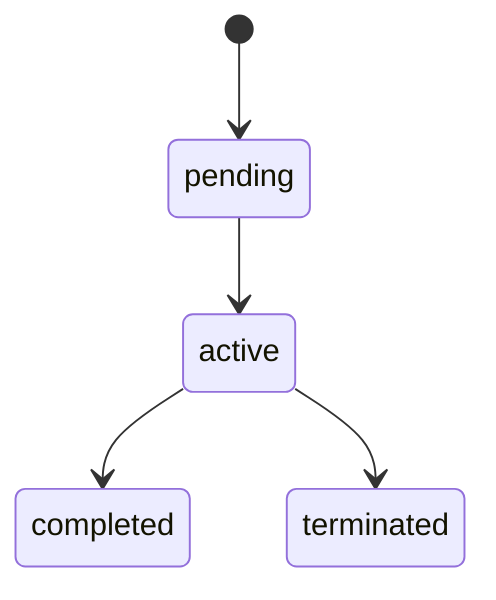
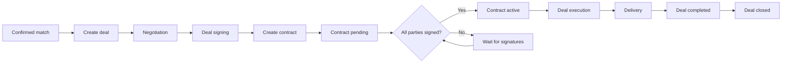
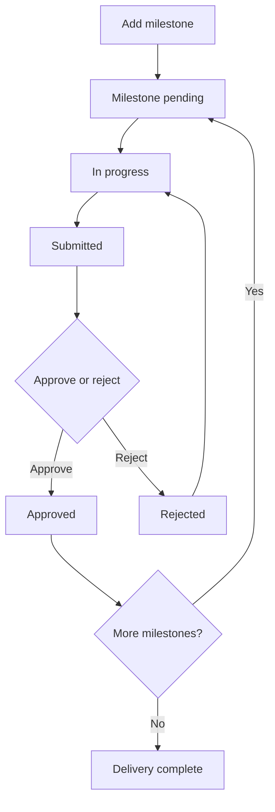

# PMTwin deal and contract flow

### What this page is

Diagrams for **deal stages**, **contract stages**, how they link, and the **milestone** loop during execution.

### Why it matters

Legal and delivery teams use this to see where signing sits relative to running work.

### What you can do here

- Compare deal states vs contract states.
- Walk the linkage from **confirmed match** to **closed deal**.

### Step-by-step actions

1. Read **Deal lifecycle** (states).
2. Read **Contract lifecycle** (states).
3. Follow **Deal → contract → execution** linkage.
4. Skim **Milestone sub-flow** for day-to-day delivery.

### What happens next

Open [workflow/deal-workflow.md](../workflow/deal-workflow.md) and [workflow/contract-workflow.md](../workflow/contract-workflow.md) for narrative detail.

### Tips

Signing happens in the **deal signing** stage; the contract stays **pending** until signatures are complete.

---

## Deal lifecycle

---

## Contract lifecycle

---

## Deal to contract to execution

---

## Milestone sub-flow

---

## Implementation notes

- ✅ Deal and contract records and statuses exist in the product.
- ⚠️ “All signed → contract active” can depend on which screen path you use—verify in UI.
- ❌ Full digital signature provider and server-side legal workflow are **not** in the POC.

### What happens next

Track operational gaps in [implementation-status.md](../implementation-status.md).
