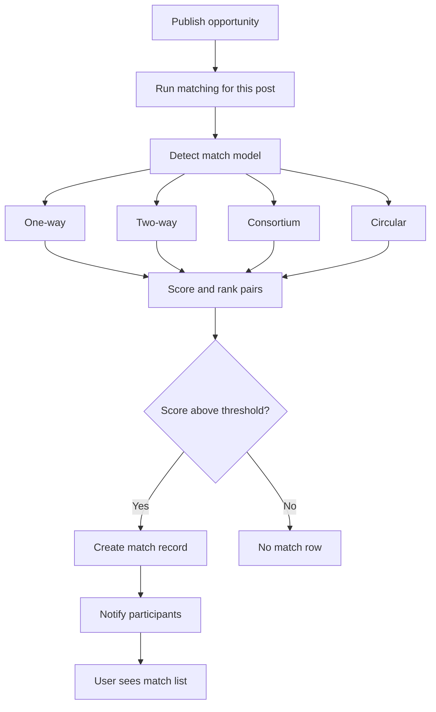
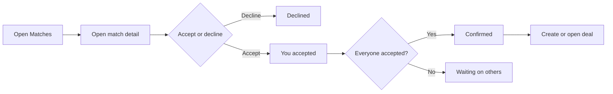

# PMTwin matching flow

### What this page is

Visual-only guide to **how matching runs** after you publish, how scores are used, and how you **respond** to a match.

### Why it matters

Support and QA use it to explain “why did / didn’t I get a match?”

### What you can do here

- Follow the top diagram from **Publish** to **Match list**.
- Follow the second diagram for **Accept / Decline**.
- Read the **weight table** as an illustration (exact numbers can change in config).

### Step-by-step actions

1. Read **Matching processing flow** for the automatic path.
2. Read **Match interaction flow** for what you click in the app.
3. Compare weights to [matching-workflow.md](../workflow/matching-workflow.md) if numbers differ in code.

### What happens next

After a match is **confirmed**, continue with [deal-contract-flow.md](deal-contract-flow.md).

### Tips

- If admin runs matching manually, behavior can differ from publish—see implementation notes at the bottom.

---

## Matching processing flow

---

## Match interaction flow

---

## Scoring weights (illustrative — POC)

| Factor | Example weight |
|--------|----------------|
| Skills / attribute overlap | 25% |
| Exchange compatibility | 20% |
| Value compatibility | 20% |
| Budget fit | 10% |
| Timeline fit | 10% |
| Location fit | 10% |
| Reputation | 5% |

### What happens next

Pairs below the configured threshold are skipped, so you may see **no** new row even when candidates exist.

### Tips

Treat percentages as a **mental model**, not a guarantee. Product tuning can change weights.

---

## Implementation notes

- ✅ All four matching models are implemented.
- ✅ Publish-triggered runs create match records and notifications.
- ⚠️ Expiry field exists; automatic expiry enforcement is partial.
- ⚠️ Admin run is often preview-first; persistence may differ from publish.
