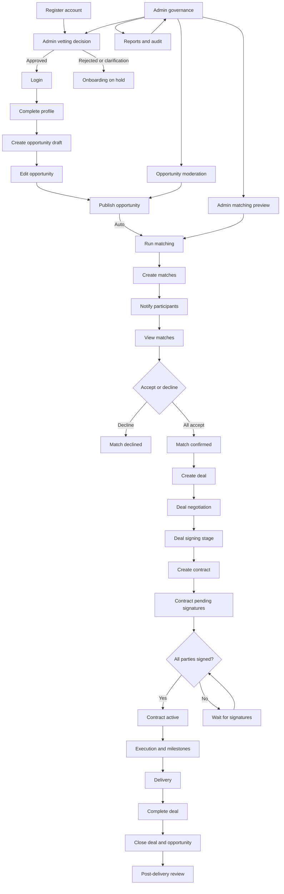

# PMTwin system flow

### What this page is

One diagram that shows the **full lifecycle**: signup, publish, matching, deal, contract, delivery, plus where **admin** fits in.

### Why it matters

Use it in decks and training when someone asks “how does everything connect?”

### What you can do here

- Trace your role (user vs admin) on the chart.
- See automatic steps after **Publish**.

### Step-by-step actions

1. Start at **Register** on the left.
2. Follow the arrows through **Publish** and **Matches**.
3. Continue through **Deal** and **Contract** to **Execution**.
4. Look at **Admin** loops for vetting and moderation.

### What happens next

Pair this with [full-user-journey.md](../full-user-journey.md) for written steps and status names.

### Tips

- “Auto” steps run in the browser app when you publish—there is no separate batch server in the POC.

---

### Notes

- ✅ Matching tied to **publish** is implemented for persistence.
- ⚠️ Admin matching is often **preview**; it may not persist matches the same way as publish.
- ❌ Central orchestration and scheduled jobs are not in the POC.

### What happens next

Read [matching-flow.md](matching-flow.md) for a closer view of matching only, or [deal-contract-flow.md](deal-contract-flow.md) for deal ↔ contract.
