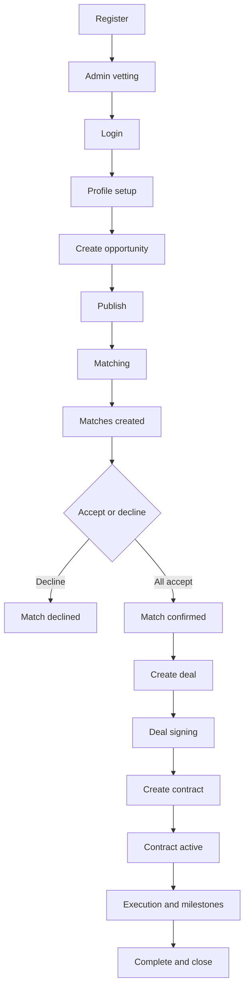
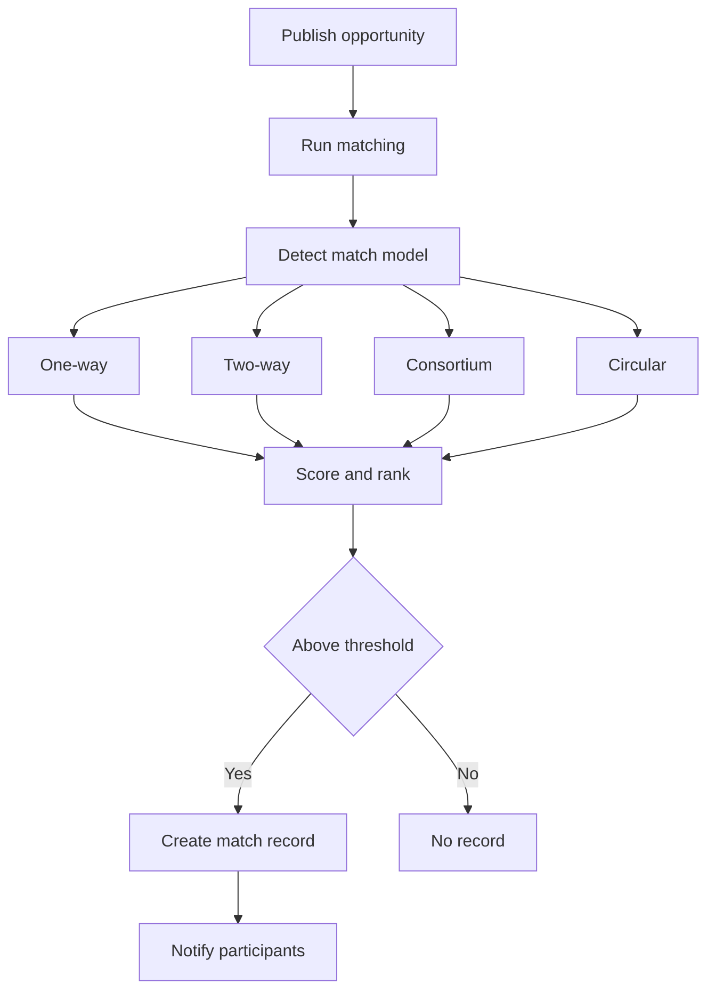
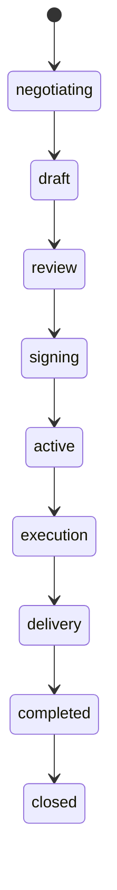
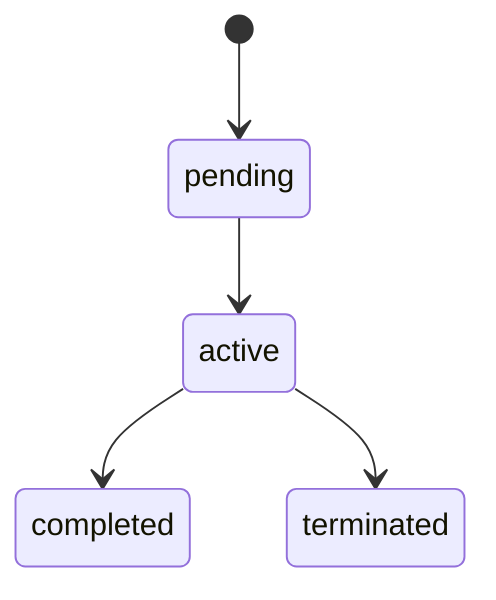

# PMTwin — Full user journey

### What this page is

End-to-end guide from first visit to closed work, aligned with **current product behavior** (not a marketing promise).

### Why it matters

Teams use this file to train users, write tests, and check that UX matches implementation.

### What you can do here

- Follow the golden path: register → publish → match → deal → contract → delivery.
- See **implementation markers**: ✅ done · ⚠️ partial · ❌ not in this POC.

### Step-by-step actions

1. Skim the lifecycle diagram below.
2. Jump to the phase you care about (registration, opportunities, matching, deals, and so on).
3. Use the status tables at the end as a quick reference.

### What happens next

After you understand the journey, open [journeys/user-journey.md](journeys/user-journey.md) for the same story in “user action / system action” form, or workflow files for deeper detail.

### Tips

- Words like `draft` or `published` are **status values** in the product— they are precise on purpose.

---

**Legend:** ✅ Implemented · ⚠️ Partial · ❌ Missing in this POC

---

## 1. System context

### What this section covers

The big picture: how one opportunity turns into delivery.

### Why it matters

Every screen fits somewhere on this chain.

### Step-by-step actions (conceptual)

1. Someone registers and (when required) gets approved.
2. They fill a profile and create an opportunity.
3. They **publish** so matching can run.
4. Matches appear; everyone must **accept** to continue.
5. A **deal** captures the collaboration; a **contract** formalizes it.
6. **Milestones** track execution until completion.

### What happens next

Details for each box are in the numbered sections below.

---

## 2. Registration (individual and company)

### What this section covers

How accounts are created and why they may sit in **pending** first.

### Step-by-step actions

**Individual**

1. Open **Register** and choose professional or consultant.
2. Fill identity and profile fields; submit.
3. The account is created with status **pending** until an admin approves or rejects.

**Company**

1. Choose the company path.
2. Enter company profile details; submit.
3. Company record is **pending** until vetted.

### What you see

- Wizard or multi-step form.
- Success message after submit.
- Limited access while **pending** (exact limits depend on screen).

### Implementation

- ✅ Individual and company registration.
- ⚠️ Clarification / resubmit UX can vary by path.
- ❌ Production-grade password hashing (use your own stack in production).

### What happens next

An admin reviews the account in **Vetting**. When approved, status becomes **active** and full features unlock.

---

## 3. Login

### Step-by-step actions

1. Open **Login**.
2. Enter email and password.
3. On success, you land on the dashboard (or return URL).

### What happens next

A session is stored for this browser until logout. Invalid credentials show an error.

### Implementation

- ✅ Login, logout, session restore.
- ⚠️ Blocking non-active accounts may differ by route.
- ❌ OAuth / social login.

---

## 4. Profile setup

### Why it matters

Better profiles improve match quality and trust.

### Step-by-step actions

1. Open **Profile** from the sidebar.
2. Add skills, certifications, years of experience, sectors, links, and anything else the form offers.
3. Save.

### What happens next

Matching and discovery use this data when scoring and ranking.

### Implementation

- ✅ Profile editing.
- ⚠️ Hard “complete profile before publish” is not enforced everywhere.

### Tips

- Aim for **10–15 concrete skills** instead of one vague line.

---

## 5. Creating an opportunity

### What this section covers

Drafting an opportunity before it goes live.

### Step-by-step actions

1. Open **Opportunities** → **Create**.
2. Enter title, description, location, dates as prompted.
3. Choose **intent**: need (`request`), offer (`offer`), or both (`hybrid`).
4. Pick collaboration **model** and sub-model; fill dynamic fields.
5. Set skills, sectors, exchange mode, budget, timeline.
6. Save as **draft** or continue to publish (next section).

### What happens next

While status is **draft**, matching does **not** run for this opportunity.

### Implementation

- ✅ Create flow and dynamic model fields.
- ✅ Draft save.
- ⚠️ Validation depth varies by field group.

---

## 5.2 Example: one-way opportunity

From product scenarios:

- **Need:** structural engineer for shop drawing review.
- **Offer:** structural review service.

**Expected:** after publish, one-way matching can propose candidate posts.

---

## 5.3 Two-way (barter) example

- Party A needs office space and offers consulting.
- Party B needs consulting and offers office space.

**Expected:** both directions must clear the score bar to create a two-way match.

---

## 5.4 Consortium example

- Lead opportunity lists roles (`memberRoles` / `partnerRoles`).
- The system looks for best offers per role.

---

## 5.5 Circular / hybrid example

- Several parties form a chain where each need is satisfied by another’s offer.
- Matches appear when the chain and score rules pass.

---

## 6. Publishing an opportunity

### Step-by-step actions

1. Open the opportunity review step (or edit screen).
2. Click **Publish** so status becomes **published**.

### What the system does

1. Saves the opportunity as published.
2. Runs matching for that opportunity.
3. Creates match records for qualifying pairs or groups.
4. Notifies participants when matches exist.

### What you see

- Confirmation that the opportunity is live.
- New rows on **Matches** (if any).
- Notifications for involved users.

### Implementation

- ✅ Publish-triggered matching.
- ⚠️ Publishing again can create **similar-looking duplicates** if content changed enough to change signatures.

### What happens next

Check **Matches** and **Notifications** within a short time.

---

## 7. Matching journey

### How matches show up

Open **Matches** list or a match **detail** page. Data comes from stored match records tied to your opportunities.

### Accept / decline

- One **decline** → match is **declined** for everyone.
- **Everyone accepts** → match becomes **confirmed** and can feed a deal.

### Match status (aggregate)

| Status | Meaning | Implementation |
|--------|---------|----------------|
| Pending | Waiting on responses | ✅ |
| Accepted | Per-person acceptance recorded | ✅ |
| Confirmed | All parties accepted | ✅ |
| Declined | Someone declined | ✅ |
| Expired | Time window passed | ⚠️ auto-expiry not fully enforced |

### Implementation

- ✅ All four match types.
- ✅ Notifications when matches are created.
- ⚠️ Expiry handling.

### What happens next

When status is **confirmed**, move to **Deals** (often a deal is created or linked automatically—see deal docs).

---

## 8. Deal creation and lifecycle

### Creation paths

- **A:** From a **confirmed** match.
- **B:** From an **accepted application** (where that flow exists).

Internal calls create a deal record and attach participants.

### Implementation

- ✅ Deal creation and pages.
- ⚠️ “Open deal from match” may differ by entry point.

### Lifecycle

Statuses used: `negotiating`, `draft`, `review`, `signing`, `active`, `execution`, `delivery`, `completed`, `closed`.

### What happens next

When the deal reaches **signing**, a **contract** is created or linked (next section).

---

## 9. Contract journey

### Step-by-step actions

1. Move the deal into **signing** (per your workflow).
2. Open the **contract** from the deal or **Contracts** list.
3. Each party completes signing steps shown to them.

### Activation rule

Target behavior: when **all required parties** have signed, the contract becomes **active**.

### Implementation

- ✅ Contract entity and core workflow.
- ⚠️ Automation may vary by UI path.
- ❌ Full third-party e-signature integration.

### What happens next

Execution runs under **milestones** on the deal while the contract is active.

---

## 10. Execution and completion

### Milestones

Stored on the deal. Typical states: `pending` → `in_progress` → `submitted` → `approved` or `rejected`.

### Delivery and completion

1. Work flows through milestones.
2. Delivery phase confirms outputs.
3. Deal moves to **completed**, then **closed** when appropriate.

### Reviews

Post-completion review or rating may exist and can feed future matching signals.

### Implementation

- ✅ Milestones and completion paths.
- ⚠️ Strict governance rules not enforced on every path.

---

## 11. Edge cases (practical)

| Situation | What happens | Implementation |
|-----------|----------------|----------------|
| **No matches** | Publish works; simply no qualifying candidates | ✅ |
| **Someone declines** | Match becomes declined | ✅ |
| **Duplicate-looking matches** | Re-publish or edits can create another row | ⚠️ partial dedupe |
| **Expired match** | Field may exist; auto-hide incomplete | ⚠️ |

### What happens next

Use notifications and list filters; refresh after actions if a screen looks stale.

---

## 12. What you see vs what the system does

| You see | Behind the scenes |
|---------|-------------------|
| Register success | Account stored as pending |
| Publish confirmation | Status published + matching run |
| New match cards | Match records + notifications |
| Accept / decline | Participant and aggregate status updated |
| Deal page | Deal and milestone records |
| Contract signing | Contract linked to deal; signatures tracked |

---

## 13. Status summary tables

### Opportunity

| Status |
|--------|
| `draft` |
| `published` |
| `in_negotiation` |
| `contracted` |
| `in_execution` |
| `completed` |
| `closed` |
| `cancelled` |

### Match (aggregate)

| Status |
|--------|
| `pending` |
| `accepted` |
| `confirmed` |
| `declined` |
| `expired` (⚠️) |

### Deal

| Status |
|--------|
| `negotiating` |
| `draft` |
| `review` |
| `signing` |
| `active` |
| `execution` |
| `delivery` |
| `completed` |
| `closed` |

### Contract

| Status |
|--------|
| `pending` |
| `active` |
| `completed` |
| `terminated` |

---

## 14. Implementation snapshot

- ✅ Core path from publish through deal and contract exists in the POC.
- ✅ All four matching models are implemented.
- ⚠️ Some rules are policy-level, not hard-enforced in code everywhere.
- ❌ Central server authority and production security are **out of scope** for this POC architecture.

### Tips

- For admin-specific steps, pair this file with [admin-user-journey.md](admin-user-journey.md) and [implementation-status.md](implementation-status.md).
