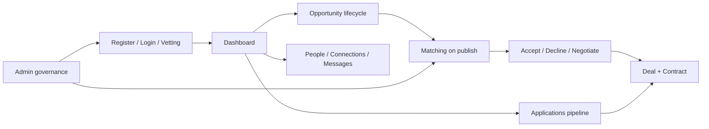

# Gaps and missing

### What this page is

Audit-style list of **gaps**: security, backend, matching, UX, admin, and data—nothing invented. Includes a **workflow overview** of how the POC works today (verified against code).

### Why it matters

Stakeholders use it to see **risk**, **severity**, and **how flows connect** in one place.

### What you can do here

- Read **Workflow overview** to understand end-to-end behavior.
- Triage by **severity** column in gap tables.
- Cross-link to [implementation-status.md](implementation-status.md) for “what exists.”

### Step-by-step actions

1. Read **Workflow overview** and **Security & auth**.
2. Open **[gap-solutions.md](gap-solutions.md)** for **proposed fixes** (plan before code).
3. Drill into matching, deals, or admin sections for your team.
4. Turn rows into tickets; owners estimate fix vs accept.

### Tips

- POC limits (local storage, no real email) are expected—call them out in client communications.
- Several gaps listed in older audits are **resolved** in code; see **Recently resolved** under Matching and Admin.

---

## Workflow overview (how it works)

All flows run client-side: features → `api-service` / `data-service` → `localStorage`. No HTTP server.

### 1. Registration, vetting, and activation

| Step | What happens | Key code |
|------|----------------|----------|
| Register | User or company created with `status: pending`; admin notified | `register.js`, `auth-service.register`, `data-service.createUser/createCompany` |
| Vetting | Admin approves, rejects, or requests clarification | `admin-vetting.js`, `vetting-actions.js` |
| Clarification | User uploads docs on Profile → resubmit → `status: pending` again | `profile.js`, `vetting-actions.resubmitAccountForReview` |
| Login | Email lookup: **users first**, then companies; rejected/suspended blocked; pending allowed read-only | `auth-service.login`, `getUserOrCompanyByEmail` |
| Pending mode | Banner + `isPendingApproval()` blocks some actions (publish, apply, pipeline drag) | `layout-service`, `pipeline.js`, `opportunity-detail.js` |

**State:** `pending` → `active` | `rejected` | `clarification_requested` → (resubmit) → `pending`

---

### 2. Opportunity lifecycle

| Step | What happens | Key code |
|------|----------------|----------|
| Create | Wizard → `createOpportunity` with `status: draft` | `opportunity-create.js`, `opportunity-service` |
| Edit | Partial update via `updateOpportunity` | `opportunity-create.js` (edit mode) |
| Publish | `updateOpportunity(id, { status: 'published' })` → async `persistPostMatches` | `data-service.updateOpportunity`, `matching-service.persistPostMatches` |
| Close / cancel | Status update only; linked matches/deals remain | `updateOpportunity` |
| Apply | Applicant creates `application` with `status: pending` | `opportunity-detail.js`, `createApplication` |

**State:** `draft` → `published` → `in_negotiation` → `contracted` → `in_execution` → `completed` → `closed` (or `cancelled`)

---

### 3. Matching engine (post-to-post only)

Legacy `pmtwin_matches` is removed from product paths. Canonical store: **`post_matches`**.

| Trigger | Behavior |
|---------|----------|
| Publish | `persistPostMatches` runs **every model** from `detectMatchingModel` (one_way, two_way, consortium) **plus** a separate circular pass |
| Admin Run report | Preview only — `findMatchesForPost` / preview run record; **no** `post_matches`, **no** notifications |
| Admin Save (one opp) | `persistPostMatches` with `source: admin_save` |
| Admin Save selected | `persistPreviewOpportunities(ids)` — bulk persist + audit |

**Per model:**

- **One-way:** Need ↔ published offers (or offer ↔ needs); score ≥ `POST_TO_POST_THRESHOLD` (0.50); top N kept.
- **Two-way (barter):** Same creator has need + offer; paired with another creator’s need + offer; both directions must pass threshold.
- **Consortium:** Lead need + `memberRoles` / `partnerRoles`; one best offer per role from distinct creators.
- **Circular:** Directed graph of creator edges; cycles length ≥ 3; only cycles **including the publishing creator** are persisted.

**After persist:** `createPostMatch` (dedupe keys) → `notifyPostMatch` → `matching_runs` record with counts, threshold, modelsRun, duration.

**User response:** Matches list → accept/decline per participant → all accepted → `confirmed`; any decline → `declined`.

---

### 4. Negotiation (match or application → deal)

Optional path between match confirmation and deal creation.

| Step | What happens | Key code |
|------|----------------|----------|
| Start | From confirmed match or accepted application | `startNegotiationFromMatch`, `startNegotiationFromApplication` |
| Counter / agree | Rounds while `open` or `counter_offered`; multi-party agree tracked | `negotiation-lifecycle.js`, `agreeNegotiation` |
| Create deal | Requires `negotiation.status === 'agreed'` | `createDealFromNegotiation`, `assertDealCreationSource` |

Deal can also be created from: **confirmed `post_match`** (`createDealFromMatch`) or **accepted application** (`createDealFromApplication`).

---

### 5. Deal and contract execution

| Step | What happens | Key code |
|------|----------------|----------|
| Create deal | `createDeal` + `assertDealCreationSource` enforces source rules | `data-service`, `deals.js` helper |
| Milestones | Live on deal: pending → submitted → approved/rejected | `updateDealMilestone`, `deal-detail.js` |
| Signing | Deal → `signing` → `createContract` (snapshot of milestones) | `createContract` |
| Sign party | `signContractParty` or `updateContract` sets `signedAt` | `contract-detail.js`, `deal-detail.js` |
| All signed | **Automatic:** contract → `active`, deal → `active`, notifications + audit | `data-service.updateContract` (lines ~2875–2939) |
| Complete | Contract/deal/opportunity status progression; reviews on completion | `contract-detail.js`, `deal-rate` |

---

### 6. Applications and pipeline

| Step | What happens |
|------|----------------|
| Kanban | Pipeline tabs: opportunities, applications, matches |
| Review | Owner shortlists, accepts, rejects applications |
| Negotiation | Optional from accepted application |
| Deal | “Create deal” from accepted application on opportunity detail |

---

### 7. People, connections, messages

| Step | What happens | Key code |
|------|----------------|----------|
| Discover | `/people`, `/find` | `people.js`, `find` feature |
| Connect | `createConnection` → pending → accept/reject | `data-service` connection methods |
| Message | Thread per accepted connection; `createMessage` | `messages.js` |

Demo seed includes connections and messages; real-time and attachments are not implemented.

---

### 8. Notifications

Business events (match, vetting, contract signed, etc.) call `createNotification`. User opens `/notifications`; click marks read via `markNotificationRead`. Layout shows unread badge count.

---

### 9. Admin governance

| Area | Capability |
|------|------------|
| Vetting | Approve / reject / clarification (`admin.vetting`) |
| Users & opportunities | List, detail, status updates |
| Matching | Run preview, save per opp, **save selected** (bulk), matching runs history |
| Deals, contracts, consortium | List, replacement candidates |
| Audit, reports, settings, skills, subscriptions, site content | Read/write per `hasAdminCapability` |
| Auditor | Read-only for persist actions; matching preview allowed |

---

## Recently resolved (no longer open gaps)

| Item | Resolution |
|------|------------|
| Multi-model publish routing | `persistPostMatches` loops all models from `detectMatchingModel` + circular pass |
| Admin bulk selected-results save | `persistPreviewOpportunities` + UI “Save selected opportunities” |
| Matching run metadata | `matching_runs` stores modelsRun, threshold, weightsProfile, counts, topScores, durationMs |
| Contract all-parties-signed → active | `updateContract` / `signContractParty` auto-activates contract and linked deal |
| Clarification resubmit | Profile “Submit for review” → `resubmitAccountForReview` → back to `pending` |
| Negotiation workflow doc | [workflow/negotiation-workflow.md](workflow/negotiation-workflow.md) added |

**Open gaps with proposed fixes (not implemented yet):** see [gap-solutions.md](gap-solutions.md) — GAP-P01 through GAP-P12.

---

## 1. Security & auth

| Gap | Severity | Description |
|-----|----------|-------------|
| **Password storage** | High | Passwords are encoded (POC), not hashed. Not safe for production. |
| **Session persistence** | Medium | Session in sessionStorage/localStorage (Remember Me); no refresh token or server-side session. |
| **Pending user enforcement** | Low | Central `assertCanMutate` + data-service guards (**Done** — GAP-P01); UI banner remains |
| **Login precedence (user vs company)** | Low | Account type on login form (**Done** — GAP-P02) |
| **Social login** | Low | CONFIG.AUTH.SOCIAL_LOGIN_ENABLED: false; OAuth not implemented. |
| **Rate limiting / brute force** | Medium | No rate limiting on login or forgot-password. |
| **CSRF / XSS** | Medium | No explicit CSRF tokens; user-generated content should be sanitized. |

---

## 2. Backend & Persistence

| Gap | Severity | Description |
|-----|----------|-------------|
| **No backend server** | High | All data in localStorage; no API server, no DB. Cannot scale or multi-device. |
| **No real API** | High | api-service delegates to data-service; no REST/GraphQL for mobile or external clients. |
| **No server-side validation** | High | All validation is client-side; easy to bypass. |
| **No file storage** | Medium | Documents/attachments referenced by URL, path, or base64 in profile; no blob storage service. |
| **No email sending** | High | Forgot/reset password “sends” token but no actual email; notifications are in-app only. |
| **No scheduled jobs** | Medium | No cron/jobs for: post_match expiry, negotiation expiry, reminder notifications, cleanup. |

---

## 3. Matching Engine

**Resolved:** Legacy person-to-opportunity matching (`pmtwin_matches`) is **deprecated and removed from UI, publish, and seed merge**. The only operational model is **post-to-post** → `post_matches`.

| Gap | Severity | Description |
|-----|----------|-------------|
| **Duplicate-looking post_matches** | Low | Strong dedupe keys exist; edge cases may still appear if opportunities are re-published with overlapping scores. |
| **Circular only for publishing creator** | Low | persistPostMatches only persists circular cycles that include the publishing opportunity’s creator; other cycles are computed but not stored. |
| **Expiry is lazy / often unset** | Low | `getPostMatches()` expires pending records when read if `expiresAt` is set, but most generated records have **no default expiresAt** and there is no scheduled expiry job. |
| **Admin preview vs persist confusion** | Low | Run report is preview-only; Save / Save selected persist. UX copy exists but operators must understand the distinction. |
| **Scoring profile mismatch risk** | Low | Product docs mention a 40/30/15/10/5 profile, while live config uses skill/exchange/value/budget/timeline/location/reputation weights. |

---

## 4. Deals, Contracts & Negotiation

| Gap | Severity | Description |
|-----|----------|-------------|
| **Negotiation workflow documentation** | — | **Resolved** — see [workflow/negotiation-workflow.md](workflow/negotiation-workflow.md). |
| **Deal from match accept timing** | Low | Start Deal requires confirmed `post_match` (or agreed negotiation / accepted application); UX copy while participants are still pending could be clearer. |
| **Document signing** | High | No e-signature integration; `signedAt` is a timestamp only. |
| **Milestone approval workflow** | Medium | Milestone submit/approve stored; strict role rules (e.g. only creator approves) may be partial. |
| **Deal/contract versioning** | Low | No version history for deal or contract amendments. |
| **Negotiation expiry** | Low | Lazy expiry on read via `expireStaleNegotiations` (**Done** — GAP-P04) |

---

## 5. Notifications & Comms

| Gap | Severity | Description |
|-----|----------|-------------|
| **No push/email** | High | Notifications only in-app; no email or push. |
| **Mark read coverage** | Low | `markNotificationRead` used on notifications page and some navigations; not guaranteed on every deep-link entry path. |
| **Messages** | Medium | messages page and storage exist; no real-time, attachments, or rich threading. |
| **Connections** | Low | create/accept/reject + notifications (**Done** — GAP-P12); discover UX may still be partial |

---

## 6. Admin

| Gap | Severity | Description |
|-----|----------|-------------|
| **Auditor read-only** | Low | `_assertNotAuditorWrite` on data mutators; vetting + UI guard (**Done** — GAP-P10) |
| **Moderator vs Admin UI split** | Low | Capability route guards + skills write hide (**Done** — GAP-P11) |
| **Bulk user actions** | Low | No bulk approve/reject/suspend or bulk export (BRD future). |
| **Content moderation queue** | Low | No “flagged” queue or assignment to moderators. |

---

## 7. Company & Profiles

| Gap | Severity | Description |
|-----|----------|-------------|
| **Company members** | Medium | No invite member, assign company role (owner/admin/member). |
| **Profile completeness enforcement** | Low | Publish blocked below 70% via `assertProfileReadyForPublish` (**Done** — GAP-P05) |
| **Verification workflow** | Medium | Verification status stored; no full “submit for verification” + admin review pipeline beyond vetting. |

---

## 8. Applications

| Gap | Severity | Description |
|-----|----------|-------------|
| **Application sub-entities UI** | Low | application_requirements, deliverables, files, payment_terms have storage and demo data; full create/edit in UI may be partial. |
| **Application → deal vs negotiation** | Low | **Discuss terms** / **Accept & create deal** labels with tooltips (**Done** — GAP-P06) |

---

## 9. Data & Integrity

| Gap | Severity | Description |
|-----|----------|-------------|
| **No referential integrity** | Medium | Deleting a user/opportunity does not cascade or soft-delete related matches/deals; can leave orphaned refs. |
| **No backup/export** | Medium | No user-triggered export or backup of localStorage. |
| **Seed overwrite** | Low | Re-seed on version change clears data; no “merge only” option for production. |
| **Pagination** | Low | Lists (users, opportunities, matches) load all; no server-side pagination. |

---

## 10. UX & Edge Cases

| Gap | Severity | Description |
|-----|----------|-------------|
| **Offline** | Low | No offline support or service worker. |
| **Loading/error states** | Low | Some pages may not show loading or consistent error messages. |
| **Empty states** | Low | Empty lists may not have clear “no matches yet” / “create first opportunity” messaging. |

---

## 11. Broken or Weak Flows (Summary)

1. **Forgot password:** Token created but no real email; user cannot reset without manual link/token.
2. **Deal from match:** Start Deal requires a **confirmed** `post_match`, **agreed negotiation**, or **accepted application** — enforced in `assertDealCreationSource`.
3. **Contract signing:** All-parties-signed → active is **automated** in `data-service.updateContract` (not UI-only).
4. **Company login vs user login:** Same form; **user record wins** if email exists in both `pmtwin_users` and `pmtwin_companies`.
5. **Pending approval:** User can browse but many write actions should be disabled; enforcement is **partial** (banner + selected guards).
6. **Re-publish:** Editing and re-publishing runs `persistPostMatches` again; dedupe limits duplicate `post_matches`.
7. **Expired matches:** Expiry enforced lazily on read when `expiresAt` is set; generated matches usually omit `expiresAt`.
8. **Negotiation optional path:** Users may accept match → start deal directly, or open negotiation first; both valid but UX may not guide choice.

---

## Related Documentation

- [Gap solutions](gap-solutions.md) — **Proposed fixes before implementation** (GAP-P01–P12).
- [Implementation Status](implementation-status.md) — Per-module ✅/⚠️/❌.
- [Full Workflows](modules/full-workflows.md) — Business-readable end-to-end map.
- [Matching Workflow](workflow/matching-workflow.md) — Publish trigger and models.
- [Negotiation Workflow](workflow/negotiation-workflow.md) — Match/application → agreed terms → deal.
- [Deal Workflow](workflow/deal-workflow.md) — Deal states and milestones.
- [Contract Workflow](workflow/contract-workflow.md) — Signing and activation.
- [Scenarios](scenarios.md) — Success and failure scenarios.
- [Admin Portal](admin-portal.md) — Admin capabilities.
