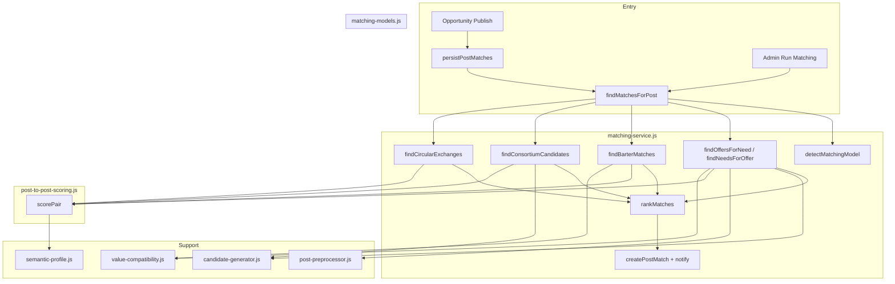

# Matching engine

### What this page is

Deep dive into **models**, **scoring**, **ranking**, and **components** in the matching layer. Matches what the POC implements.

### Why it matters

Engineers debugging scores or tiers start here, with [matching-workflow.md](workflow/matching-workflow.md) for user-visible flow.

### What you can do here

- Read the architecture diagram.
- Look up weight keys and thresholds in config.
- Compare one-way vs barter vs consortium vs circular sections.

### Step-by-step actions

1. Skim **Architecture overview**.
2. Open the model section you are changing.
3. Verify against `matching-service` / `matching-models` in code.

### What happens next

When you change weights, update user-facing docs ([diagrams/matching-flow.md](diagrams/matching-flow.md)) if percentages shift.

### Tips

- “Top / good / possible” tiers are UI-facing labels—keep them aligned with `rankMatches`.

---

## Architecture overview

---

## 1. Entry Points

| Entry | When | What runs |
|-------|------|-----------|
| **persistPostMatches(opportunityId)** | `data-service.updateOpportunity(id, { status: 'published' })` | Loads opportunity; runs findMatchesForPost(opportunityId, {}); then findMatchesForPost(..., { model: 'circular' }); creates post_match per result; notifies participants. |
| **findMatchesForPost(opportunityId, options)** | Admin matching UI or persistPostMatches | Detects model or uses options.model; calls one of findOffersForNeed, findNeedsForOffer, findBarterMatches, findConsortiumCandidates, findCircularExchanges; rankMatches(); returns { model, matches }. |
| **findMatchesForOpportunity(opportunityId)** | Legacy path | User-to-opportunity matching (all active users scored against opportunity); creates legacy **matches** (pmtwin_matches), not post_matches. |
| **findOpportunitiesForCandidate(candidateId, options)** | Candidate-centric | All published opportunities scored for one candidate; returns list of { opportunity, matchScore, criteria }; no post_match creation. |

---

## 2. Matching Models (Post-to-Post)

### 2.1 One-Way

- **Need → Offers:** `findOffersForNeed(needPostId)`. Need = opportunity with `intent === 'request'`. Candidate offers = published opportunities with `intent === 'offer'`. Candidate generator filters by budget, location, timeline, category; then each candidate is scored with `postToPostScoring.scorePair(need, offer, needNorm, offerNorm, needProfile, offerProfile)`. Results with score >= POST_TO_POST_THRESHOLD (0.50) are kept; top N (default 20) returned.
- **Offer → Needs:** `findNeedsForOffer(offerPostId)`. Same logic with roles reversed; candidate generator has `getCandidatesForOffer(offerPost, needPosts, options)`.

**Payload (post_match):** needOpportunityId, offerOpportunityId, breakdown, valueAnalysis (oneWayValueFit when valueCompatibility is used).

### 2.2 Two-Way (Barter)

- **findBarterMatches(opportunityId):** The **creator** of the given opportunity must have both a **need** and an **offer** (two published opportunities). Other creators who also have need+offer are considered. For each pair (A, B): score A’s offer → B’s need and B’s offer → A’s need; both must be >= POST_TO_POST_THRESHOLD. Pair score = (scoreAtoB + scoreBtoA) / 2. Value equivalence text and optional barterValueEquivalence (valueCompatibility) are computed.
- **Payload:** sideA (userId, needId, offerId), sideB (userId, needId, offerId), scoreAtoB, scoreBtoA, valueEquivalence, valueAnalysis.equivalence.

### 2.3 Consortium

- **findConsortiumCandidates(leadNeedId):** Lead opportunity must have `attributes.memberRoles` or `attributes.partnerRoles` (or subModelType === 'consortium'). For each role, a synthetic need is built (lead + role as skill); candidate generator returns offers; best offer **per role** (one creator per role) is selected; usedCreatorIds ensures no duplicate creator across roles. Aggregate score = average of role scores. Optional consortiumValueBalance (valueCompatibility).
- **Payload:** leadNeedId, roles: [{ role, opportunityId, userId, score }], valueAnalysis.consortiumBalance.

### 2.4 Circular

- **findCircularExchanges(options):** Builds directed graph: nodes = creatorIds; edge I → J if some offer from J satisfies some need from I (score >= threshold). Enumerates cycles of length >= minCycleLength (default 3), up to depth 6. Each cycle scored by average edge score; optional circularValueBalance. Returns list of { matchScore, cycle, suggestedPartners, linkScores, valueAnalysis }.
- **Payload (post_match):** cycle (creatorIds), links (fromCreatorId, toCreatorId, offerId, needId, score), chainBalance.

---

## 3. Scoring System (Post-to-Post)

**Module:** `post-to-post-scoring.js` — `scorePair(needPost, offerPost, normalizedNeed, normalizedOffer, semanticNeed, semanticOffer)`.

**Weights (CONFIG.MATCHING.WEIGHTS):**

| Factor | Weight | Description |
|--------|--------|-------------|
| SKILL_MATCH / ATTRIBUTE_OVERLAP | 0.25 | Jaccard-like overlap of skills/categories (semantic expanded if provided). |
| EXCHANGE_COMPATIBILITY | 0.20 | valueCompatibility.exchangeCompatibility(need, offer) or mode match. |
| VALUE_COMPATIBILITY | 0.20 | valueCompatibility.valueCompatibility(need, offer) or 0.5. |
| BUDGET_FIT | 0.10 | Overlap of need vs offer budget ranges. |
| TIMELINE | 0.10 | Overlap of need deadline/period vs offer availability. |
| LOCATION | 0.10 | Remote = 1; same = 1; KSA vs other = 0.5. |
| REPUTATION | 0.05 | offerNorm.reputation (0–1) or 0.5. |

**Labels per factor:** Match (score >= 1), Partial (>= 0.25), No Match (< 0.25).  
**Threshold:** POST_TO_POST_THRESHOLD = 0.50 (CONFIG.MATCHING).  
**Output:** { score (rounded to 3 decimals), breakdown, labels }.

---

## 4. Ranking (After Raw Matches)

**matching-service.rankMatches(matches, model):**

- For each match: valueFit from valueAnalysis (strong if equivalenceScore >= 0.7 or valueFit === 'strong'); coverageRatio from valueAnalysis; repScore and timelineScore from breakdown.
- **compositeRank** = 0.50 * matchScore + 0.30 * min(coverageRatio, 1) + 0.10 * repScore + 0.10 * timelineScore.
- **recommendation.tier:** `top` (matchScore >= 0.85 and valueFit strong), `good` (matchScore >= 0.70), else `possible`.
- **recommendation.reason** and **actionRequired** set by tier.
- Results sorted by compositeRank (or matchScore) descending.

---

## 5. Supporting Components

| Component | Role |
|-----------|------|
| **post-preprocessor.js** | extractAndNormalize(opportunity, canonical) → normalized { skills, budget, timeline, location, modelType, subModelType, categories }; loadSkillCanonical(BASE_PATH) for skill normalization. |
| **candidate-generator.js** | getCandidates(needPost, offerPosts, options): filter offers by budgetCompatible, locationCompatible, timelineOverlap, categoryOverlap; cap at CANDIDATE_MAX (200). getCandidatesForOffer for offer→needs. |
| **semantic-profile.js** | buildSemanticProfile(normalized, opportunity, canonical) → expanded skills/categories for scoring (expandedSkillsOrCategories). |
| **value-compatibility.js** | oneWayValueFit(need, offer), exchangeCompatibility(need, offer), valueCompatibility(need, offer), barterValueEquivalence(sideA, sideB), consortiumValueBalance(leadNeed, partnerOffers), circularValueBalance(cycle, edgeScores), getNormalized(post). Uses value-normalizer and value-estimator. |
| **value-normalizer.js / value-estimator.js** | Normalize and estimate SAR values for compatibility and equivalence. |

---

## 6. Configuration Summary

| Key | Default | Description |
|-----|---------|-------------|
| MIN_THRESHOLD | 0.70 | Legacy opportunity–candidate matching (not post-to-post). |
| AUTO_NOTIFY_THRESHOLD | 0.80 | Legacy: auto-notify when match score >= this. |
| POST_TO_POST_THRESHOLD | 0.50 | Minimum score for post-to-post match to be created. |
| CANDIDATE_MAX | 200 | Max candidates before scoring (candidate generator). |
| WEIGHTS | (see above) | Post-to-post weighted score. |
| VALUE_RISK_FACTORS | cash 1.0, barter 0.75, ... | Value normalizer risk factors. |
| CONSORTIUM_MIN_PARTICIPANTS | 2 | Min participants for consortium. |
| CONSORTIUM_REPLACEMENT_ALLOWED_STAGES | negotiating, draft, review, signing, active, execution | Deal stages when consortium replacement is allowed. |
| MAX_REPLACEMENT_ATTEMPTS | 5 | Cap on replacement attempts. |

---

## 7. Missing or Partial Logic (Honest Gaps)

- **Deduplication across runs:** persistPostMatches uses _postMatchSignature to avoid duplicate post_matches for the same (type, participants, payload keys). Re-publishing the same opportunity can still create new matches if the set of candidates or scores changes; duplicate detection is by signature, not by “already matched these two opportunities.”
- **Expiry of post_matches:** expiresAt is stored but no automated job marks status as expired or hides expired matches from UI.
- **Legacy match vs post_match:** Two systems coexist; pipeline and some UI may still refer to legacy matches (pmtwin_matches) for opportunity–candidate; post_matches are the primary user-facing matches.
- **Circular on publish:** Only cycles that **include the publishing opportunity’s creator** are persisted; global circular discovery is run but filtered by creator inclusion.
- **Replacement candidates:** findReplacementCandidatesForRole is implemented; UI and admin flows for “replace member” may be partial (see implementation-status and gaps-and-missing).

---

## Related Documentation

- [Matching Workflow](workflow/matching-workflow.md) — When matching runs and user actions.
- [Data Model](data-model.md) — PostMatch and Match entities.
- [Implementation Status](implementation-status.md) — What is implemented vs partial.
- [POC Matching Docs](../POC/docs/) — matching-one-way.md, matching-barter.md, matching-consortium.md, matching-circular.md.
