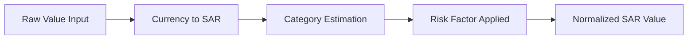
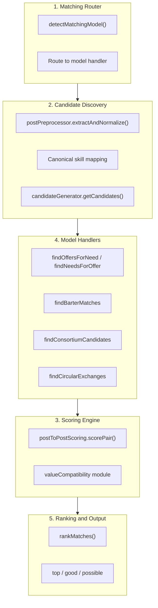
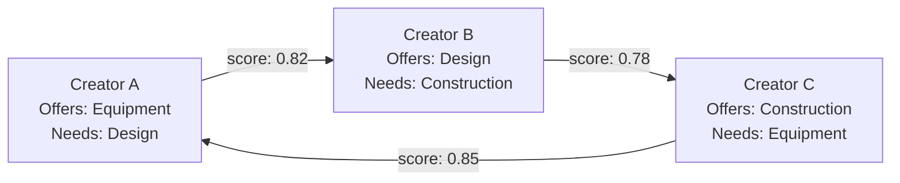
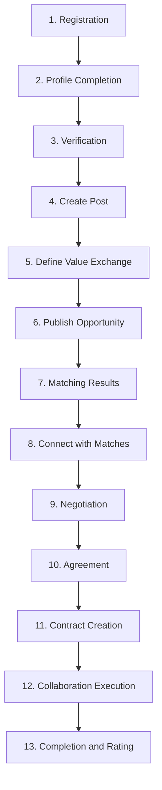
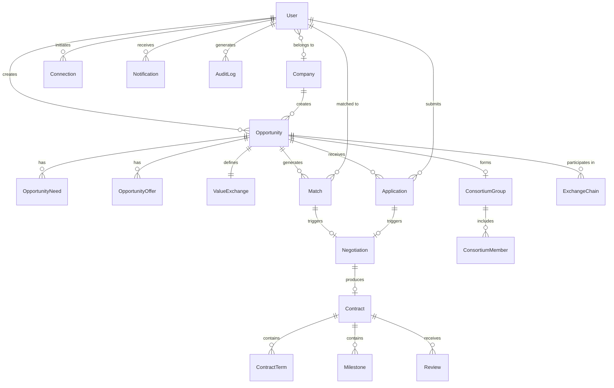
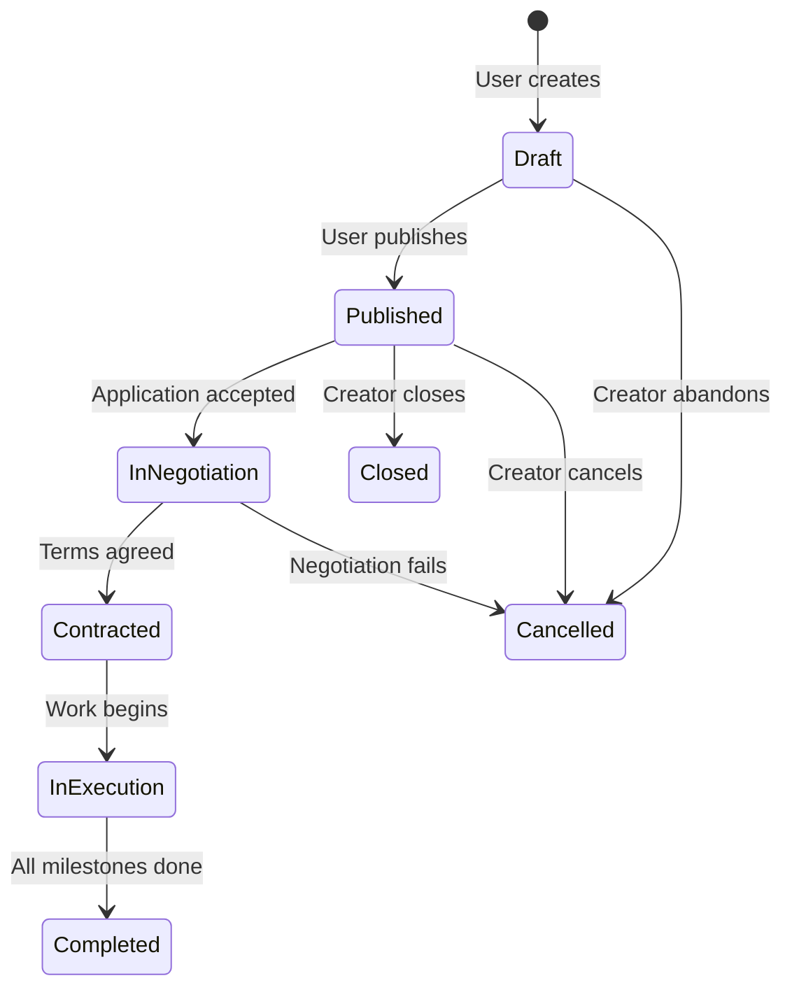

# Complete system workflow — PMTwin collaboration marketplace

### What this page is

End-to-end **architecture + workflow** narrative: Need–Offer model, matching, value exchange, user and admin paths, and pointers into the POC.

### Why it matters

It is the “single long read” for architects onboarding to PMTwin.

### What you can do here

- Use the table of contents to jump.
- Cross-link to [full-workflows.md](full-workflows.md) for route-level journeys.

### Step-by-step actions

1. Read **Platform overview**.
2. Deep dive the section that matches your initiative (matching, admin, data).

### What happens next

Implement against [implementation-status.md](../implementation-status.md) and track gaps in [gaps-and-missing.md](../gaps-and-missing.md).

### Tips

- Keep diagrams in sync when algorithms change.

---

This document describes the complete system workflow for the PMTwin collaboration marketplace: a bidirectional semantic marketplace that connects companies, professionals, and consultants through a Need–Offer collaboration model. It consolidates opportunity creation, matching engine, value exchange logic, user workflows, admin workflows, database design, and matching algorithms with references to the existing POC implementation.

---

## Table of Contents

1. [Platform Overview](#1-platform-overview)
2. [Opportunity Model (Four Layers)](#2-opportunity-model-four-layers)
3. [Value Exchange Modes](#3-value-exchange-modes)
4. [Matching Engine Architecture](#4-matching-engine-architecture)
5. [Matching Models (Algorithms)](#5-matching-models-algorithms)
6. [User Workflow (Full Journey)](#6-user-workflow-full-journey)
7. [Admin Workflow](#7-admin-workflow)
8. [Database Schema](#8-database-schema)
9. [Opportunity Lifecycle](#9-opportunity-lifecycle)
10. [Reference: Key POC Files](#10-reference-key-poc-files)

---

## 1. Platform Overview

**PMTwin** is a bidirectional semantic marketplace where:

- **Actors**: Companies, Professionals, and Consultants create posts representing **Need**, **Offer**, or **Hybrid** (Need + Offer).
- **Matching**: The system matches them using four matching models (one-way, two-way barter, consortium, circular exchange).
- **Value exchange**: Supports Cash, Equity, Profit Share, Barter, and Hybrid modes; all values are normalized to SAR for cross-mode comparison.

The platform operates at scale to support thousands of opportunities and complex collaboration relationships. The POC implementation uses browser `localStorage` via `dataService`; the schema and workflows are designed to be portable to a relational or document database.

---

## 2. Opportunity Model (Four Layers)

Every opportunity is composed of four layers. In the POC, they are stored primarily in `POC/data/opportunities.json`, with `scope`, `exchangeData`, and `attributes` holding the layer data.

### Layer 1: NEED

Describes what the creator is looking for.

| Concept | POC Field(s) | Description |
|--------|---------------|-------------|
| **Role needed** | `attributes.jobTitle`, `attributes.memberRoles[].role` | Job title or consortium role (e.g. financial partner, construction company). |
| **Skills required** | `scope.requiredSkills[]` | Canonical skill IDs or labels; used for matching. |
| **Experience level** | `attributes.requiredExperience` | Required seniority or years. |
| **Deliverables** | `attributes.scopeDivision`, `attributes.submissionRequirements` | What must be delivered. |
| **Timeline** | `attributes.startDate`, `attributes.endDate`, `attributes.contractDuration` | Start, end, or duration. |
| **Location** | `locationCountry`, `locationRegion`, `locationCity`, `locationDistrict`, `location` | Full path and components for location fit. |

Extraction and normalization for matching are done in `POC/src/services/matching/post-preprocessor.js` (`extractAndNormalize`, `extractTimeline`, `normalizeLocation`).

### Layer 2: OFFER

Describes what the creator is providing.

| Concept | POC Field(s) | Description |
|--------|---------------|-------------|
| **Offer type** | `modelType`, `subModelType` | Service, capital, equipment, resources (e.g. task_based, consortium, resource_sharing). |
| **Availability** | `attributes.workMode`, `attributes.format` | When and how (remote, hybrid, frequency). |
| **Capacity** | `attributes.quantityNeeded`, `attributes.participantsNeeded` | Volume or number of participants. |
| **Contribution description** | `description`, `attributes.resourceTitle` | Free text and structured title. |
| **Offered skills** | `scope.offeredSkills[]` | Skills the offer fulfils; used for skill overlap in matching. |

### Layer 3: VALUE

Defines how value is exchanged; stored in `exchangeData` and `exchangeMode`.

| Concept | POC Field(s) | Description |
|--------|---------------|-------------|
| **Exchange mode** | `exchangeMode` | `cash`, `equity`, `profit_sharing`, `barter`, `hybrid`. |
| **Value offered / expected** | Computed by `value-estimator.js` | Becomes `normalized.totalOffered`, `normalized.totalExpected`. |
| **Estimated value (SAR)** | `estimateValueSar()` in `matching-models.js` | Single comparable number for matching. |
| **Currency** | `exchangeData.currency` | Default SAR; converted in `value-normalizer.js`. |
| **Value unit** | From `exchangeData` | Money, hours, sqm, equipment days, etc. |
| **Equivalence ratio (barter)** | `valueEquivalenceText(oppA, oppB)` in `matching-models.js` | Human-readable barter equivalence. |

Value estimation and normalization are in `POC/src/services/value-exchange/` (`value-estimator.js`, `value-normalizer.js`).

### Layer 4: MATCHING MODEL

The applicable matching model(s) are **auto-detected** by `matchingService.detectMatchingModel(opportunity)` in `POC/src/services/matching/matching-service.js`. The method returns an array of applicable models: `one_way`, `two_way`, `consortium`. Circular exchange is invoked explicitly via `options.model === 'circular'` in `findMatchesForPost`.

**Model selection logic:**

| Condition | Resulting model(s) |
|-----------|--------------------|
| `intent === 'request'` and not barter | `one_way` (Need → Offer) |
| `intent === 'offer'` and not barter | `one_way` (Offer → Need) |
| `exchangeMode === 'barter'` (or barter in accepted_modes) | `two_way` added |
| `subModelType === 'consortium'` or `memberRoles` / `partnerRoles` present | `consortium` added |
| Explicit `options.model === 'circular'` | Circular exchange handler |
| `intent === 'hybrid'` | Both one-way and two-way runs; results merged |

**When each model is used:**

- **One-way**: Single-direction match (one Need post to Offer posts, or one Offer post to Need posts). Default for request/offer with cash/equity/profit_sharing/hybrid.
- **Two-way (barter)**: Creator has both a Need and an Offer; system finds another creator whose Offer satisfies the first’s Need and whose Need is satisfied by the first’s Offer.
- **Consortium (group)**: One lead Need defines multiple roles (e.g. financial partner, construction company, equipment supplier); system finds the best Offer per role and checks aggregate value balance.
- **Circular exchange**: Three or more creators form a cycle (A→B→C→A) where each party’s Offer satisfies the next party’s Need; system detects cycles and scores chain balance.

---

## 3. Value Exchange Modes

The system supports five exchange modes. Each has required parameters and a risk factor used when normalizing to a comparable value. Normalization is implemented in `POC/src/services/value-exchange/value-normalizer.js` (currency conversion, risk factors, `buildNormalized`).

### Cash

- **Parameters**: `exchangeData.cashAmount`, `budgetRange.min`, `budgetRange.max`, `cashPaymentTerms`, `cashMilestones`.
- **Risk factor**: **1.0** (baseline).
- **Normalization**: Amount converted to SAR via `CURRENCY_TO_SAR`; no risk discount.

### Equity

- **Parameters**: `equityPercentage`, `companyValuation`, `vestingPeriod`.
- **Estimated value**: `(percentage / 100) * companyValuation` (see `value-estimator.js`).
- **Risk factor**: **0.6** (illiquid, speculative).
- **Normalization**: Estimated value in SAR × 0.6 for risk-adjusted comparison.

### Profit Share

- **Parameters**: `profitSharePercentage`, `expectedProfit`, `contractDuration`.
- **Estimated value**: `(sharePct / 100) * expectedProfit`.
- **Risk factor**: **0.5** (dependent on future performance).
- **Normalization**: Estimated value in SAR × 0.5.

### Barter

- **Parameters**: `barterOffer`, `barterNeed`, `barterValue`.
- **Equivalence**: `valueEquivalenceText(oppA, oppB)` and `barterValueEquivalence()` in `value-compatibility.js`.
- **Risk factor**: **0.75** (subjective valuation).
- **Normalization**: `barterValue` or budget midpoint converted to SAR × 0.75.

### Hybrid

- **Parameters**: Itemized `exchangeData.valueItems[]` (categories: cash, equity, service, equipment, resource, knowledge, barter, profit_share).
- **Risk factor**: **0.8** (blended).
- **Normalization**: Each item normalized to SAR and risk-adjusted; `buildFromItemizedItems` in `value-estimator.js`; validation via `validateHybrid`.

### Value Normalization Pipeline

All modes are normalized to a comparable SAR-based metric for matching and value compatibility:

- **Currency to SAR**: Rates in `value-normalizer.js` (e.g. SAR=1, USD=3.75, EUR=4.10, GBP=4.75, AED=1.02, KWD=12.25, BHD=9.95, OMR=9.73, QAR=1.03, EGP=0.12, JOD=5.29).
- **Category estimation**: Per-mode logic in `value-estimator.js` (`estimateFromExchangeData`, `buildFromItemizedItems`).
- **Risk-adjusted value**: `riskAdjustedValue(valueItem, category)` using `RISK_FACTORS` in `value-normalizer.js`.

Output of `buildNormalized` includes `totalOffered`, `totalExpected`, `riskAdjustedOffered`, `riskAdjustedExpected`, and per-item breakdown. The **Value Compatibility Engine** in `value-compatibility.js` uses these to compute value fit, value gap, exchange-mode compatibility, barter equivalence, and multi-party balance (consortium and circular).

---

## 4. Matching Engine Architecture

The matching engine is implemented across `POC/src/services/matching/` (matching-service.js, matching-models.js, post-preprocessor.js, post-to-post-scoring.js) and `POC/src/services/value-exchange/value-compatibility.js`.

### High-level flow

### Step 1: Matching Router

- **Entry**: `matchingService.findMatchesForPost(opportunityId, options)` in `matching-service.js`.
- **Detection**: `detectMatchingModel(opportunity)` inspects `intent`, `exchangeMode`, `subModelType`, `attributes.memberRoles`, `attributes.partnerRoles`.
- **Routing**: If `options.model === 'circular'` → circular; if `options.model === 'consortium'` or `subModelType === 'consortium'` → consortium; if `options.model === 'two_way'` or `exchangeMode === 'barter'` → barter; if `intent === 'request'` → findOffersForNeed; if `intent === 'offer'` → findNeedsForOffer; if `intent === 'hybrid'` → one-way + two-way, then merge.

### Step 2: Candidate Discovery

- **Normalization**: `postPreprocessor.extractAndNormalize(opportunity, canonicalMap, creator)` builds normalized profile: skills, categories, budget, timeline, deadline, availability, location, reputation, intent, modelType, subModelType.
- **Canonical skills**: `skill-canonical.json` (synonyms, category expansion); `normalizeSkill()`, `normalizeLocation()`.
- **Budget / timeline**: `extractBudget()`, `extractTimeline()` from `exchangeData` and `attributes`.
- **Candidates**: Filtered by published status, different creator, and correct intent direction (Need vs Offer).

### Step 3: Value Compatibility Engine

In `value-compatibility.js` the engine calculates:

- **Value fit**: Ratio of offer value to need expected value; bands (e.g. 0.9–1.1 → 1.0, 0.7–1.3 → 0.8).
- **Value gap**: Difference and percentage between offered and expected.
- **Exchange mode compatibility**: Exact match 1.0; mode in accepted_modes 0.8; overlap 0.5 + 0.3 × (overlap / max size).
- **Barter equivalence**: `barterValueEquivalence()` — aCoversB, bCoversA, symmetry, equivalenceScore; suggests cash adjustments when gaps exist.
- **Multi-party balance**: `consortiumValueBalance()` (partner values vs lead expected, lead budget vs partner costs); `circularValueBalance()` (per-edge ratio, uniformity, chainBalanceScore).

### Step 4: Match Scoring (Post-to-Post)

Formula in `post-to-post-scoring.js` (`scorePair`):

| Factor | Weight | Logic |
|--------|--------|--------|
| Skill match | **25%** | Jaccard-like overlap of canonicalized skill sets; substring fallback. |
| Exchange compatibility | **20%** | Mode match (exact / accepted / overlap). |
| Value compatibility | **20%** | Ratio within tolerance bands. |
| Budget fit | **10%** | Overlap span of budget ranges. |
| Timeline fit | **10%** | Overlap of need period vs offer availability. |
| Location fit | **10%** | Remote=1.0, same city=1.0, same country=0.5. |
| Reputation | **5%** | Creator rating (0–1). |

**Threshold**: Matches with score ≥ **0.50** are kept (POST_THRESHOLD). Top N (default 20) returned per model.

### Step 5: Composite Ranking and Tiers

`matchingService.rankMatches(matches, model)` adds:

- **compositeRank** = `0.50 × matchScore + 0.30 × coverageRatio + 0.10 × reputationScore + 0.10 × timelineScore`
- **recommendation**: tier, reason, actionRequired
- **scoreBreakdown**: per-factor breakdown

**Tiers:**

- **top**: matchScore ≥ 0.85 and strong value fit.
- **good**: matchScore ≥ 0.70.
- **possible**: matchScore < 0.70.

Matches are sorted by `compositeRank` (or `matchScore` if compositeRank missing).

---

## 5. Matching Models (Algorithms)

### 5.1 One-Way Matching (Need → Offer, or Offer → Need)

**When used**: `intent === 'request'` (Need) or `intent === 'offer'` (Offer), and not barter-only.

**Workflow** (in `matching-models.js`: `findOffersForNeed`, `findNeedsForOffer`):

1. Load the Need (or Offer) post; ensure intent is request (or offer).
2. Get all published Offer (or Need) posts.
3. Load canonical skills; normalize need and offers via post-preprocessor.
4. Use candidate generator to filter candidates (skills, industry, collaboration model, location, availability).
5. For each candidate pair: `postToPostScoring.scorePair(need, offer, ...)`.
6. Keep matches with score ≥ 0.50.
7. Add `valueCompatibility.oneWayValueFit(need, offer)` (valueFit, coverageRatio, valueGap, riskAdjustedRatio).
8. Sort by score; return top N (default 20).

**Algorithm**: Pairwise scoring with weighted factors and value fit; no cycle or group structure.

### 5.2 Two-Way Dependency (Barter)

**When used**: `exchangeMode === 'barter'` or barter in accepted_modes; creator has both a Need and an Offer.

**Workflow** (`findBarterMatches` in `matching-models.js`):

1. For the source creator, identify their Need post and Offer post.
2. For each other creator who also has both a Need and an Offer:
   - `scoreAtoB` = how well source’s Offer satisfies target’s Need.
   - `scoreBtoA` = how well target’s Offer satisfies source’s Need.
3. Keep pairs where both scores ≥ threshold.
4. `pairScore = (scoreAtoB + scoreBtoA) / 2`.
5. Add `valueCompatibility.barterValueEquivalence(sideA, sideB)`:
   - `aCoversB` = min(offerA / expectB, 1), `bCoversA` = min(offerB / expectA, 1).
   - `symmetry` = min / max.
   - `equivalenceScore` = (symmetry + min(aCoversB, bCoversA)) / 2.
   - Suggests cash adjustments when gaps exist.

**Algorithm**: Symmetric pair matching with bidirectional score and value equivalence.

### 5.3 Group Formation (Consortium)

**When used**: Lead opportunity has `subModelType === 'consortium'` or `attributes.memberRoles` / `partnerRoles` (e.g. financial partner, construction company, equipment supplier).

**Workflow** (`findConsortiumCandidates` in `matching-models.js`):

1. Extract `memberRoles[]` (or partnerRoles) from the lead Need post.
2. If no roles: fallback to one-way with role "General".
3. For each role: build a synthetic need with that role as skill; find best Offer per role using one-way scoring.
4. Avoid reusing the same creator across roles.
5. Aggregate score = mean of per-role scores.
6. Add `valueCompatibility.consortiumValueBalance(leadNeed, partnerOffers)`:
   - Sum partner values vs lead expected value; sum lead budget vs partner costs.
   - `balanceScore` = min(totalPartnerValue/totalExpected, totalBudget/totalPartnerCost, 1).
   - Viable if budget ≥ 80% of cost and value ≥ 80% of expected.

**Algorithm**: Role-based one-way matching per slot plus aggregate value balance check.

### 5.4 Circular Exchange (Multi-Party Barter Chain)

**When used**: Explicit `options.model === 'circular'` when calling `findMatchesForPost`; system discovers cycles across 3+ creators.

**Workflow** (`findCircularExchanges` in `matching-models.js`):

1. Build directed graph: nodes = creators; edge I→J if some Offer from J satisfies some Need from I.
2. Run DFS to find cycles of length 3–6.
3. Deduplicate cycles by sorted creator set (chainHash).
4. For each cycle:
   - Average edge scores.
   - `valueCompatibility.circularValueBalance(cycle, edgeScores)`:
     - Per-edge ratio = offeredValue / expectedValue.
     - uniformity = minRatio / maxRatio.
     - chainBalanceScore = uniformity × min(avgRatio, 1).
     - Viable if uniformity > 0.6 and avgRatio > 0.7.

**How circular chains are detected**: Graph construction from all published Need/Offer posts; DFS cycle detection; filter by minimum cycle length 3 and maximum 6; deduplicate by sorted set of creator IDs.

---

## 6. User Workflow (Full Journey)

End-to-end user journey from registration to completion and rating:

### Step 1 — Registration

- **Implementation**: `POC/features/register/register.js`; `authService.register`, `authService.registerCompany`.
- User chooses account type: **Company** or **Individual** (Professional / Consultant).
- Companies: name, registration number, industry, employee count.
- Individuals: name, email, phone, specialization.
- OTP verification step; status set to `pending` for vetting.

### Step 2 — Profile Completion

- **Implementation**: `POC/features/profile/profile.js`; `dataService.updateUser` / `updateCompany`.
- Skills, sectors, certifications, experience, preferred payment modes (cash, barter, equity, profit_sharing, hybrid).
- Social links, avatar, location.
- Companies: financial capacity, services, company type.

### Step 3 — Verification

- **Implementation**: Admin vetting in `POC/features/admin-vetting/admin-vetting.js`; `dataService.updateUser`, `updateCompany`.
- Status flow: `pending` → `active` / `rejected` / `clarification_requested`.
- Admin reviews documents (CR, licenses, certifications). Companies and consultants typically require verification before posting; professionals may browse in read-only mode while pending.

### Step 4 — Create Post

- **Implementation**: `POC/features/opportunity-create/opportunity-create.js`; `dataService.createOpportunity`, `opportunityFormService`, `valueEstimator`.
- Multi-step wizard: Model Selection → Scope → Exchange → Location → Review.
- Model types: project_based, strategic_partnership, resource_pooling, hiring, competition.
- Sub-models: consortium, bulk_purchasing, mentorship, resource_sharing, etc.
- Intent: **request** (Need), **offer** (Offer), **hybrid** (both).

### Step 5 — Define Value Exchange

- Same wizard; exchange step. User selects mode (cash/equity/profit_sharing/barter/hybrid).
- Cash: budget range, payment terms, milestones.
- Equity: percentage, valuation, vesting.
- Barter: what you offer, what you need, estimated value.
- Hybrid: itemized value items with categories.

### Step 6 — Publish Opportunity

- Status changes from `draft` to `published`.
- Triggers `matchingService.findMatchesForOpportunity()` (person-to-opportunity) and, for post-to-post, matching can be run from admin or on-demand; notifications created for matched candidates.

### Step 7 — Matching Results

- **Implementation**: `POC/features/dashboard/dashboard.js`; `matchingService.findOpportunitiesForCandidate`, `calculateMatchScore`.
- Dashboard shows recommended matches with scores and breakdown (skill, value, timeline, location). Tiered results: top / good / possible.

### Step 8 — Connect with Matches

- User sends connection request; views match profile and opportunity details.
- **Implementation**: Connections in `dataService`; status `pending` → `accepted` / `rejected`.

### Step 9 — Negotiation

- Initiated from application or match. Rounds of counter-offers.
- Status: `open` → `counter_offered` → `agreed` / `failed` / `expired`.
- Terms: scope, payment, timeline, milestones (stored in negotiation rounds).

### Step 10 — Agreement

- Both parties agree; negotiation status → `agreed`; `agreedTerms` captured.

### Step 11 — Contract Creation

- **Implementation**: `POC/features/contract-detail/contract-detail.js`; `dataService.getContractById`, `updateContract`.
- Contract generated from agreed terms: parties, scope, payment mode, milestones, duration. Status: `pending` → `active`.

### Step 12 — Collaboration Execution

- Milestones tracked: `pending` → `in_progress` → `completed`; value release per milestone.
- Opportunity status: `contracted` → `in_execution`.

### Step 13 — Completion and Rating

- All milestones completed; contract status → `completed`.
- Both parties submit reviews (1–5 rating + comment); stored in `reviews`; rating feeds into reputation for future matching.

---

## 7. Admin Workflow

Admin capabilities are implemented in `POC/features/admin-*` and are accessible to users with role `admin`, `moderator`, or `auditor` (see `POC/src/core/config.js` and auth guards).

### 7.1 User Verification

- **Implementation**: `POC/features/admin-vetting/admin-vetting.js`.
- Queue of pending users (professionals, consultants, companies). View profile and documents.
- Actions: **Approve** (→ active), **Reject** (→ rejected), **Request Clarification** (→ clarification_requested).
- Audit log entry created for each action.

### 7.2 Opportunity Moderation

- **Implementation**: Admin opportunities feature (`POC/pages/admin-opportunities/index.html`).
- Review all posted opportunities; approve, reject, or flag suspicious posts.
- Filter by status, model type, exchange mode.

### 7.3 Matching Oversight

- **Implementation**: `POC/features/admin-matching/admin-matching.js`; `matchingService.findMatchesForPost`, `dataService.getOpportunities`.
- Run matching for any published opportunity; view reports for one-way, two-way, consortium, circular.
- See score breakdowns and value compatibility; adjust matching weights via CONFIG; resolve conflicts between competing matches.

### 7.4 Value Validation

- Detect unrealistic barter values via risk-adjusted normalization (`value-normalizer.js`, `value-compatibility.js`).
- Verify equity claims against company valuation (equity percentage × valuation).
- Flag value gaps exceeding thresholds (value-compatibility bands).
- Review hybrid deal compositions (`valueItems`, `validateHybrid` in value-estimator).

### 7.5 Consortium Management

- Approve or monitor large collaboration groups formed by consortium matching.
- Monitor role fulfillment across consortium members; track consortium value balance (partner values vs lead budget, lead budget vs partner costs) using `consortiumValueBalance` logic.

### 7.6 Circular Exchange Monitoring

- View detected barter chains (3–6 participants) from `findCircularExchanges`.
- Validate chain balance (uniformity > 0.6, avgRatio > 0.7 per `circularValueBalance`).
- Flag imbalanced chains for manual review.

### 7.7 Analytics Dashboard

- **Implementation**: `POC/pages/admin-reports/index.html`.
- Metrics: total opportunities by status, model type, exchange mode; successful matches and conversion rates; average value exchange; collaboration success rate (completed contracts / total); user growth and verification rates.

---

## 8. Database Schema

Current POC storage is browser `localStorage` via `dataService` (`POC/src/core/data/data-service.js`). The schema below reflects the entity relationships as implemented in the POC data files (`POC/data/*.json`) and is designed to be portable to a relational or document database.

### Entity relationship diagram

### Tables

**users**

- id, email, passwordHash, role, status, isPublic, companyId (FK → companies), profile (JSON), createdAt, updatedAt

**companies**

- id, email, passwordHash, role, status, isPublic, profile (JSON), createdAt, updatedAt

**opportunities**

- id, title, description, creatorId (FK → users/companies), modelType, subModelType, intent, collaborationModel, status, location fields (location, locationCountry, locationRegion, locationCity, locationDistrict, latitude, longitude), exchangeMode, paymentModes (JSON), scope (JSON), exchangeData (JSON), attributes (JSON), normalized (JSON), createdAt, updatedAt

**opportunity_needs** (extracted from scope + attributes for query performance)

- id, opportunityId (FK), roleNeeded, skillsRequired (JSON), experienceLevel, deliverables, timeline, location

**opportunity_offers** (extracted from scope + attributes)

- id, opportunityId (FK), offerType, availability, capacity, contributionDescription, offeredSkills (JSON)

**value_exchange** (extracted from exchangeData)

- id, opportunityId (FK), exchangeMode, currency, cashAmount, budgetMin, budgetMax, paymentTerms, equityPercentage, companyValuation, vestingPeriod, profitSharePercentage, expectedProfit, barterOffer, barterNeed, barterValue, valueItems (JSON), normalizedOffered, normalizedExpected, riskAdjustedOffered, riskAdjustedExpected

**applications**

- id, opportunityId (FK), applicantId (FK → users/companies), status, coverLetter, attachments (JSON), responses (JSON), createdAt, updatedAt

**matches**

- id, opportunityId (FK), candidateId (FK → users/companies), matchScore, criteria (JSON), notified, model (one_way/two_way/consortium/circular), createdAt

**consortium_groups**

- id, leadOpportunityId (FK), status, aggregateScore, totalValue, totalBudget, balanceScore, viable, createdAt

**consortium_members**

- id, consortiumGroupId (FK), opportunityId (FK), creatorId (FK), role, roleScore, valueContribution

**exchange_chains**

- id, chainHash (deduplicated sorted creator IDs), cycleLength, avgScore, uniformity, chainBalanceScore, viable, createdAt

**exchange_chain_edges**

- id, chainId (FK), fromCreatorId (FK), toCreatorId (FK), fromOpportunityId (FK), toOpportunityId (FK), edgeScore, valueRatio

**contracts**

- id, opportunityId (FK), applicationId (FK), negotiationId (FK), creatorId (FK), contractorId (FK), scope, paymentMode, duration, parties (JSON), agreedValue (JSON), status, signedAt, paymentSchedule (JSON), equityVesting (JSON), profitShare (JSON), createdAt, updatedAt

**contract_terms** (milestones and payment schedule)

- id, contractId (FK), termType (milestone/payment/equity_vesting/profit_share), title, deliverables, dueDate, valueRelease, status

**reviews**

- id, contractId (FK), reviewerId (FK), revieweeId (FK), rating, comment, createdAt, updatedAt

**connections**

- id, fromUserId (FK), toUserId (FK), status, createdAt, updatedAt

**notifications**

- id, userId (FK), type, title, message, link, read, createdAt

**audit_logs**

- id, userId (FK), action, entityType, entityId, details (JSON), ipAddress, timestamp

### Relationships summary

- **User/Company** create **Opportunities** (creatorId). User may belong to one **Company** (companyId).
- **Opportunity** has optional extracted **opportunity_needs** and **opportunity_offers**; one **value_exchange** (logical; can remain embedded in opportunity in POC).
- **Opportunity** receives **Applications** from **User/Company** (applicantId).
- **Opportunity** generates **Matches** to **User/Company** (candidateId); match has optional **model** (one_way/two_way/consortium/circular).
- **Application** or **Match** can trigger **Negotiation**; **Negotiation** produces **Contract**.
- **Contract** has **contract_terms** (milestones, payment, equity_vesting, profit_share) and **reviews**.
- **Opportunity** can form **ConsortiumGroup** with **consortium_members**; can participate in **ExchangeChain** with **exchange_chain_edges**.
- **User** has **connections**, **notifications**, and **audit_logs**.

### Migration from localStorage

To move to a relational database:

1. Introduce canonical **people** table or unified **accounts** (users + companies) if creatorId/applicantId/candidateId must reference one table.
2. Create tables above; keep JSON columns for profile, scope, exchangeData, attributes, parties, criteria, details where flexibility is needed.
3. Backfill **opportunity_needs**, **opportunity_offers**, **value_exchange** from existing opportunities (or keep embedded and add views).
4. Add **exchange_chains** and **exchange_chain_edges** when circular/consortium results are persisted.
5. Replace `dataService` read/write with API calls to the new database while keeping the same entity shapes where possible.

---

## 9. Opportunity Lifecycle

State machine for an opportunity:

Status values in the POC: `draft`, `published`, `in_negotiation`, `contracted`, `in_execution`, `completed`, `closed`, `cancelled` (see `CONFIG` and `data-service.js`).

---

## 10. Reference: Key POC Files

| Domain | Files |
|--------|--------|
| **Matching engine** | `POC/src/services/matching/matching-service.js`, `matching-models.js`, `post-preprocessor.js`, `post-to-post-scoring.js` |
| **Value exchange** | `POC/src/services/value-exchange/value-compatibility.js`, `value-estimator.js`, `value-normalizer.js` |
| **Data & storage** | `POC/src/core/data/data-service.js`, `POC/data/*.json` |
| **Config & auth** | `POC/src/core/config/config.js`, `POC/src/core/auth/auth-service.js` |
| **User flows** | `POC/features/register/`, `profile/`, `opportunity-create/`, `opportunity-detail/`, `dashboard/`, `contract-detail/` |
| **Admin flows** | `POC/features/admin-vetting/`, `admin-matching/`, `admin-opportunities/`, `admin-reports/` |
| **Documentation** | `BRD/08_Business_Requirements_Document.md`, `BRD/full-workflows.md`, `docs/modules/matching-system.md`, `docs/modules/opportunity-creation.md`, `docs/modules/application.md`, `docs/modules/contract-and-execution.md`, `docs/modules/registration.md`, `docs/modules/authentication.md` |

This document consolidates and extends the above into a single **complete system workflow** for the PMTwin collaboration marketplace.
