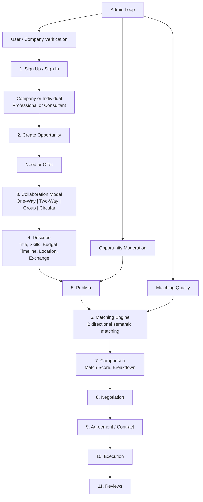
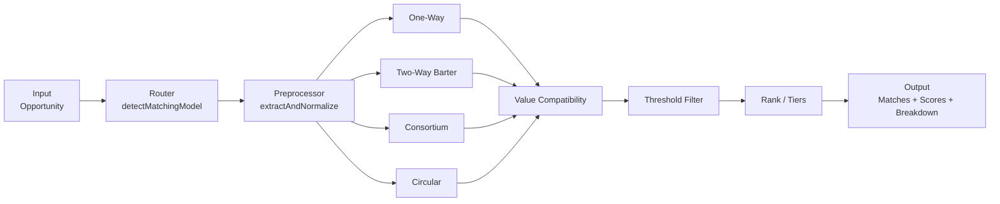

# Full System Workflow Design — Need/Offer Collaboration Marketplace

This document implements the complete product architecture and operational workflow for the PMTwin-style Need/Offer collaboration marketplace. It covers full platform workflow, matching engine architecture, matching algorithm (including weight variants), value exchange logic, admin workflow, example opportunity structures, database design, and test flow validation.

**Related:** [complete-system-workflow.md](complete-system-workflow.md), [BRD/08_Business_Requirements_Document.md](../../BRD/08_Business_Requirements_Document.md), [BRD/full-workflows.md](../../BRD/full-workflows.md).

---

## Table of Contents

1. [Full Platform Workflow](#1-full-platform-workflow)
2. [Matching Engine Architecture](#2-matching-engine-architecture)
3. [Matching Algorithm](#3-matching-algorithm)
4. [Value Exchange Logic](#4-value-exchange-logic)
5. [Admin System Workflow](#5-admin-system-workflow)
6. [Example Opportunity Structures](#6-example-opportunity-structures)
7. [Database Design (Tables)](#7-database-design-tables)
8. [Test Flow Validation](#8-test-flow-validation)

---

## 1. Full Platform Workflow

### 1.1 Actor Map

| Actor | Description |
|-------|--------------|
| **Guest** | Unauthenticated visitor; can view home, find, and auth entry points. |
| **Company** | Construction companies, developers, equipment suppliers, investors. Creates Need/Offer opportunities, manages applications and contracts. |
| **Individual — Professional** | Registered professional; creates or applies to opportunities, participates in matching and contracts. |
| **Individual — Consultant / SME** | Consultant or small/medium enterprise; same as professional with consultant role. |
| **Admin** | Platform moderators, verification team, matching oversight. Roles: admin, moderator, auditor (see [config.js](../../POC/src/core/config/config.js)). |

### 1.2 Core Flow (High Level)

1. **Sign up / Sign in** — User selects Company or Individual; individuals choose Professional or Consultant.
2. **Create Opportunity** — User selects Need or Offer.
3. **Select Collaboration Model** — One-Way, Two-Way Dependency (Barter), Group Formation (Consortium), or Circular Exchange.
4. **Describe Opportunity** — Title, description, skills, budget or rate, timeline, location, value exchange mode.
5. **Matching Engine** — Bidirectional semantic matching between Need and Offer posts.
6. **Comparison** — User sees match score, skill overlap, budget compatibility, timeline fit, location fit.
7. **Negotiation** — Price, equity, profit share, milestones, timeline.
8. **Agreement** — Digital agreement or smart contract (per BRD: handoff procedure in current phase).
9. **Execution** — Project collaboration begins.
10. **Reviews** — Users rate each other.

Detailed steps align with [BRD/full-workflows.md](../../BRD/full-workflows.md) (Workflows 1–8) and [complete-system-workflow.md](complete-system-workflow.md) (User Workflow Sections 6.1–6.13).

### 1.3 End-to-End Workflow Diagram



---

## 2. Matching Engine Architecture

### 2.1 Entry Points

- **Post-to-post:** `matchingService.findMatchesForPost(opportunityId, options)` — [POC/src/services/matching/matching-service.js](../../POC/src/services/matching/matching-service.js).
- **Person-to-opportunity:** `matchingService.findMatchesForOpportunity(opportunityId)` and `findOpportunitiesForCandidate(candidateId)` for candidate discovery.

### 2.2 Router

`detectMatchingModel(opportunity)` plus `options.model`:

- `options.model === 'circular'` → Circular exchange.
- `options.model === 'consortium'` or opportunity `subModelType === 'consortium'` or `memberRoles` / `partnerRoles` → Consortium.
- `options.model === 'two_way'` or `exchangeMode === 'barter'` → Two-Way Barter.
- `intent === 'request'` → One-Way (Need → Offers).
- `intent === 'offer'` → One-Way (Offer → Needs).
- `intent === 'hybrid'` → One-Way + Two-Way merged.

See [docs/modules/matching-system.md](../../POC/docs/reports/../docs/modules/matching-system.md) for routing details.

### 2.3 Pipeline

1. **Trigger** — Publish/update or admin run or discovery request.
2. **Post preprocessor** — Normalize skills, budget, timeline, location ([post-preprocessor.js](../../POC/src/services/matching/post-preprocessor.js)).
3. **Candidate discovery** — Filter by intent (Need vs Offer), status published, different creator.
4. **Per-model scoring** — One-Way / Two-Way / Consortium / Circular ([matching-models.js](../../POC/src/services/matching/matching-models.js)).
5. **Value compatibility** — One-way fit, barter equivalence, consortium/circular balance ([value-compatibility.js](../../POC/src/services/value-exchange/value-compatibility.js)).
6. **Threshold filter** — Keep matches ≥ POST_TO_POST_THRESHOLD (default 0.50).
7. **Ranking / tiers** — `rankMatches()` adds compositeRank, recommendation tier, scoreBreakdown.
8. **Output** — Stored matches, optional notifications.

### 2.4 Architecture Diagram



---

## 3. Matching Algorithm

### 3.1 Current Implementation

Scoring is in [post-to-post-scoring.js](../../POC/src/services/matching/post-to-post-scoring.js) (`scorePair`). Weights are read from `CONFIG.MATCHING.WEIGHTS`:

| Factor | Weight | Logic |
|--------|--------|--------|
| Skill match (attribute overlap) | **25%** | Jaccard-like overlap of canonicalized skills; substring fallback. |
| Exchange compatibility | **20%** | Mode match (exact / accepted_modes / overlap). |
| Value compatibility | **20%** | Offer/need value ratio within tolerance bands. |
| Budget fit | **10%** | Overlap of budget ranges. |
| Timeline fit | **10%** | Overlap of need period vs offer availability. |
| Location fit | **10%** | Remote = 1; same location = 1; same region = 0.5. |
| Reputation | **5%** | Creator rating 0–1. |

- **Threshold:** Matches with score ≥ **0.50** (POST_TO_POST_THRESHOLD) are kept.
- **Output:** Score in [0, 1]; UI can display as **Match Score %** = score × 100.

### 3.2 Design Variant (Product-Spec Weights)

Requested product weights:

- **Attribute Overlap (Skills):** 40%
- **Budget Compatibility:** 30%
- **Timeline Compatibility:** 15%
- **Location Compatibility:** 10%
- **Reputation Score:** 5%

This variant does not include separate “exchange” or “value” factors; budget carries the primary value signal.

**Weight alignment:** To adopt 40/30/15/10/5, add a configurable weight profile (e.g. `CONFIG.MATCHING.WEIGHTS_DESIGN`) and in `post-to-post-scoring.js` use:

- `ATTRIBUTE_OVERLAP = 0.40`
- `BUDGET_FIT = 0.30`
- `TIMELINE = 0.15`
- `LOCATION = 0.10`
- `REPUTATION = 0.05`

Set exchange compatibility and value compatibility to 0, or merge their logic into the single “budget/value” factor at 30%. The current implementation supports config-driven weights via `CONFIG.MATCHING.WEIGHTS`.

### 3.3 Final Match Score

- Engine uses **0–1** internally.
- **Match Score percentage** = score × 100 (e.g. 0.72 → 72%).

---

## 4. Value Exchange Logic

### 4.1 Five Modes

| Mode | Description |
|------|-------------|
| **Cash** | Standard payment; milestones supported (exchangeData.budgetRange, cashAmount, cashMilestones). |
| **Equity** | Ownership stake for contribution (percentage, valuation, vesting). |
| **Profit Sharing** | Revenue share without ownership. |
| **Barter** | Direct service or resource exchange; value estimated in SAR for comparison. |
| **Hybrid** | Combination of cash, equity, and barter (valueItems, validateHybrid). |

### 4.2 Where It Lives

- **Opportunity:** `exchangeMode`, `value_exchange` (mode, accepted_modes, estimated_value), `exchangeData` (budgetRange, currency, cashAmount, barterValue, etc.).
- **Normalization:** [value-estimator.js](../../POC/src/services/value-exchange/value-estimator.js), [value-normalizer.js](../../POC/src/services/value-exchange/value-normalizer.js) produce normalized SAR for comparison.

### 4.3 In Matching

[value-compatibility.js](../../POC/src/services/value-exchange/value-compatibility.js):

- **Exchange mode compatibility** — Fuzzy match using mode and accepted_modes (1.0 exact, 0.8 in accepted, 0.5+ overlap).
- **Value compatibility** — Offer/need value ratio; bands (e.g. 0.9–1.1 → 1.0).
- **One-way value fit** — valueFit, coverageRatio, valueGap, riskAdjustedRatio for Need vs single Offer.
- **Barter equivalence** — aCoversB, bCoversA, symmetry, equivalenceScore; suggests cash adjustments.
- **Consortium balance** — consortiumValueBalance(leadNeed, partnerOffers); balanceScore, viable.
- **Circular chain balance** — circularValueBalance(cycle, edgeScores); uniformity, chainBalanceScore.

---

## 5. Admin System Workflow

### 5.1 Responsibilities

| Capability | Admin action | Route / feature |
|------------|--------------|-----------------|
| **User verification** | Approve / Reject / Request clarification | `/admin/vetting`, [admin-vetting](../../POC/features/admin-vetting) |
| **Company validation** | Review company docs, approve/reject | `/admin/vetting`, [admin-user-detail](../../POC/features/admin-user-detail) |
| **Opportunity moderation** | Review, approve, reject, flag | `/admin/opportunities`, [admin-opportunities](../../POC/features/admin-opportunities) |
| **Barter value verification** | Check risk-adjusted values, flag gaps | Value logic in value-compatibility; review in admin-matching / reports |
| **Fraud detection** | Monitor anomalies, audit trail | [admin-audit](../../POC/features/admin-audit), [admin-reports](../../POC/features/admin-reports) |
| **Matching quality monitoring** | Run matching, view scores, adjust thresholds | `/admin/matching`, [admin-matching](../../POC/features/admin-matching) |

### 5.2 Dashboard

- **Implementation:** [admin-dashboard](../../POC/features/admin-dashboard), [admin-reports](../../POC/features/admin-reports).
- **Metrics:** Active opportunities, successful matches, collaboration model usage, value exchange analytics.
- **BRD:** FR-21–FR-24, NFR-5–NFR-6 ([08_Business_Requirements_Document.md](../../BRD/08_Business_Requirements_Document.md)).

---

## 6. Example Opportunity Structures

Structures use POC field names so they can be used in [POC/data/opportunities.json](../../POC/data/opportunities.json) or simulation data.

### 6.1 Need (One-Way)

```json
{
  "id": "need-structural-001",
  "title": "Need: Structural engineer for shop drawing review",
  "description": "We need a structural engineer for shop drawing review. Budget: 10K SAR.",
  "creatorId": "user-company-001",
  "intent": "request",
  "status": "published",
  "modelType": "project_based",
  "subModelType": "task_based",
  "location": "Riyadh, Saudi Arabia",
  "locationCountry": "sa",
  "locationRegion": "riyadh",
  "exchangeMode": "cash",
  "scope": {
    "requiredSkills": ["Structural Engineering", "Structural Review", "Shop Drawing"],
    "sectors": ["Construction"]
  },
  "exchangeData": {
    "exchangeMode": "cash",
    "currency": "SAR",
    "budgetRange": { "min": 10000, "max": 10000, "currency": "SAR" }
  },
  "attributes": {
    "startDate": "2026-04-01",
    "endDate": "2026-06-30",
    "locationRequirement": "Hybrid"
  }
}
```

### 6.2 Offer (One-Way)

```json
{
  "id": "offer-structural-001",
  "title": "Offer: Structural engineering services",
  "description": "I offer structural engineering services. Rate: 8K–12K SAR.",
  "creatorId": "user-pro-001",
  "intent": "offer",
  "status": "published",
  "modelType": "project_based",
  "subModelType": "task_based",
  "location": "Riyadh, Saudi Arabia",
  "locationCountry": "sa",
  "locationRegion": "riyadh",
  "exchangeMode": "cash",
  "scope": {
    "offeredSkills": ["Structural Engineering", "Structural Design", "Structural Review"],
    "sectors": ["Construction"]
  },
  "exchangeData": {
    "exchangeMode": "cash",
    "currency": "SAR",
    "budgetRange": { "min": 8000, "max": 12000, "currency": "SAR" }
  },
  "attributes": {
    "availability": { "start": "2026-03-01", "end": "2026-12-31" },
    "locationRequirement": "Hybrid"
  }
}
```

### 6.3 Two-Way Barter (Pair)

**Creator A:** Need = engineering; Offer = office space.

**Creator B:** Need = office space; Offer = engineering.

- Need A: `intent: "request"`, `scope.requiredSkills: ["Engineering Consulting"]`, `exchangeMode: "barter"`.
- Offer A: `intent: "offer"`, `scope.offeredSkills: ["Office Space", "Co-working"]`, `exchangeMode: "barter"`.
- Need B: `intent: "request"`, `scope.requiredSkills: ["Office Space"]`, `exchangeMode: "barter"`.
- Offer B: `intent: "offer"`, `scope.offeredSkills: ["Engineering Consulting"]`, `exchangeMode: "barter"`.

Each opportunity includes `value_exchange.estimated_value` (SAR) or `exchangeData.barterValue` for value compatibility.

### 6.4 Group (Consortium)

One Need with multiple roles; each role matched to a distinct Offer.

```json
{
  "id": "need-highway-001",
  "title": "Need: Highway project — financial, construction, equipment partners",
  "intent": "request",
  "status": "published",
  "subModelType": "consortium",
  "scope": { "requiredSkills": ["Infrastructure Development", "Highway"], "sectors": ["Infrastructure"] },
  "attributes": {
    "memberRoles": [
      { "role": "Financial partner", "scope": "Equity or debt" },
      { "role": "Construction partner", "scope": "Civil works" },
      { "role": "Equipment provider", "scope": "Heavy equipment" }
    ]
  },
  "exchangeData": { "currency": "SAR", "budgetRange": { "min": 5000000, "max": 15000000, "currency": "SAR" } }
}
```

Standalone Offer posts from other creators with `offeredSkills` aligned to each role (e.g. "Financial Investment", "General Contracting", "Heavy Equipment") fill the consortium.

### 6.5 Circular Exchange (Chain)

Three creators; each has one Need and one Offer. Chain: A needs what B offers, B needs what C offers, C needs what A offers.

- **A:** Need: excavator; Offer: office space.
- **B:** Need: accounting; Offer: excavator.
- **C:** Need: office space; Offer: accounting.

Each node is two opportunities (one request, one offer) per creator; graph edges: creator I → J when some Offer from J satisfies some Need from I. Cycle: A → B → C → A.

---

## 7. Database Design (Tables)

Logical schema aligned with POC storage and portable to an RDBMS.

| Table | Key fields | POC mapping |
|-------|------------|-------------|
| **users** | id, email, role, status, companyId, profile (JSON), createdAt | [POC/data/users.json](../../POC/data/users.json), data-service users |
| **companies** | id, name, registrationNumber, status, profile (JSON), createdAt | [POC/data/companies.json](../../POC/data/companies.json) |
| **profiles** | Extended attributes (skills, sectors, certifications, experience); can be JSON on users/companies or separate table | Embedded in user/company profile |
| **opportunities** | id, creatorId, intent, status, modelType, subModelType, title, description, scope (JSON), exchangeData (JSON), value_exchange (JSON), attributes (JSON), location fields, timestamps | [POC/data/opportunities.json](../../POC/data/opportunities.json) |
| **needs / offers** | Logical views: filter opportunities by intent = 'request' or 'offer'; optional separate tables in RDBMS | Same store, intent filter |
| **value_exchange** | Optional normalized table; in POC embedded in opportunity (exchangeData, value_exchange) | Embedded |
| **matches** | id, opportunityId, candidateId or matchedOpportunityId, model, matchScore, breakdown (JSON), createdAt | [POC/data/matches.json](../../POC/data/matches.json) |
| **match_scores** | Part of matches payload (breakdown) or separate row per criterion | In matches.criteria / breakdown |
| **negotiations** | id, opportunityId, applicationId, parties, rounds, status, agreedTerms (JSON) | data-service negotiations if present |
| **contracts** | id, opportunityId, applicationId, parties, status, terms, milestones | [POC/data/contracts.json](../../POC/data/contracts.json) |
| **transactions** | id, contractId, type, amount, currency, status | Future; out of scope per BRD |

---

## 8. Test Flow Validation

### 8.1 Need vs Offer Matching

- **Trigger:** Publish a Need → run `findMatchesForPost(needId)`.
- **Process:** Engine finds published Offers, scores pairs, filters by threshold, ranks.
- **Expected output:** List of (Offer, matchScore, breakdown). At least one Offer with overlapping skills and compatible budget in top results.
- **Validation:** Match score ≥ threshold; attributeOverlap and budgetFit > 0 for top match.

### 8.2 Barter Matching Validation

- **Trigger:** Creator with both Need and Offer; run two-way barter (`findBarterMatches(opportunityId)`).
- **Process:** Find other creators with both Need and Offer; score A→B and B→A; keep pairs with both ≥ threshold.
- **Expected output:** Pairs with matchScore, scoreAtoB, scoreBtoA, valueEquivalence or valueAnalysis.equivalence.
- **Validation:** Only pairs where both directions ≥ threshold; value equivalence or balance suggested.

### 8.3 Consortium Group Formation

- **Trigger:** Publish Need with `memberRoles`; run `findConsortiumCandidates(leadNeedId)`.
- **Process:** Decompose by role; find best Offer per role (distinct creators); aggregate score and value balance.
- **Expected output:** One aggregate match with suggestedPartners (one per role), breakdown by role, optional consortiumBalance.
- **Validation:** One suggested group per role; distinct creators; aggregate score; optional value balance check.

### 8.4 Circular Exchange Chain Solving

- **Trigger:** Run `findCircularExchanges()` or `findMatchesForPost(id, { model: 'circular' })` on dataset containing at least one cycle.
- **Process:** Build directed graph (creators, edges where Offer satisfies Need); DFS for cycles length 3–6; deduplicate; score and chain balance.
- **Expected output:** At least one cycle with cycle (creator IDs), matchScore, linkScores, suggestedPartners, optional chainBalance.
- **Validation:** Cycle length ≥ 3; chain closes (A→…→A); link scores and optional chain balance reported.

---

## Artifacts and References

| Item | Location |
|------|----------|
| This design doc | [docs/modules/full-system-workflow-design.md](full-system-workflow-design.md) |
| Example opportunity structures | Section 6 above |
| 40-opportunity test dataset | [POC/data/demo-40-opportunities.json](../../POC/data/demo-40-opportunities.json); creator IDs in [POC/data/demo-users.json](../../POC/data/demo-users.json) and [POC/data/demo-companies.json](../../POC/data/demo-companies.json) |
| Demo companies | [POC/data/demo-companies.json](../../POC/data/demo-companies.json) |
| Demo user credentials list | [POC/docs/DEMO_CREDENTIALS.md](../../POC/docs/DEMO_CREDENTIALS.md) |
| Example matching outputs | [POC/docs/demo-matching-outputs.md](../../POC/docs/demo-matching-outputs.md) |
| Test flow validation | Section 8 above |
| Complete system workflow (extended) | [docs/modules/complete-system-workflow.md](complete-system-workflow.md) |
