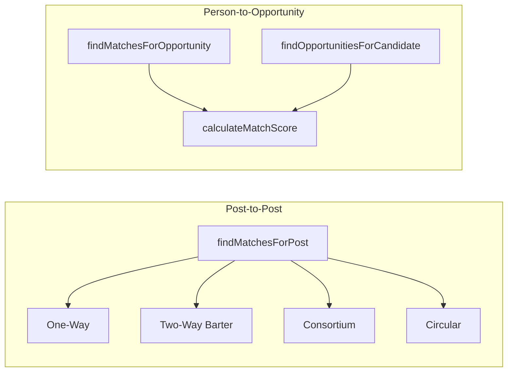

# Matching system

### What this page is

Explains **both** matching layers, every **match type**, scoring, and **one example per type** with inputs and expected behavior.

### Why it matters

It bridges product language and the matching service entry points.

### What you can do here

- Compare post-to-post vs legacy layers in the overview table.
- Walk examples before reading source.

### Step-by-step actions

1. Read **Overview**.
2. Open the model section you tune (one-way, barter, and so on).

### What happens next

Use [matching-engine.md](../matching-engine.md) for function-level detail and [matching-workflow.md](../workflow/matching-workflow.md) for persistence.

### Tips

**Related docs:** [MATCHING_FLOW.md](../../POC/docs/simulation/MATCHING_FLOW.md) (simulation reference), [MATCHING_READINESS_REPORT.md](../../POC/docs/reports/MATCHING_READINESS_REPORT.md).

---

## Overview

The system has two matching layers:

| Layer | Purpose | Entry point | Implementation |
|-------|---------|-------------|----------------|
| **Post-to-post** | Match Need posts to Offer posts (exchange models) | `matchingService.findMatchesForPost(opportunityId, options)` | [matching-models.js](../../POC/src/services/matching/matching-models.js) |
| **Person-to-opportunity** | Score candidates for an opportunity (or opportunities for a candidate) | `matchingService.findMatchesForOpportunity(opportunityId)` / `findOpportunitiesForCandidate(candidateId)` | [matching-service.js](../../POC/src/services/matching/matching-service.js) |



---

## Routing (post-to-post)

`findMatchesForPost(opportunityId, options)` chooses the model in this order:

1. `options.model === 'circular'` → **Circular** (`findCircularExchanges`)
2. `options.model === 'consortium'` or opportunity `subModelType === 'consortium'` → **Consortium** (`findConsortiumCandidates`)
3. `options.model === 'two_way'` or opportunity `exchangeMode === 'barter'` (with intent request or offer) → **Two-Way Barter** (`findBarterMatches`)
4. `intent === 'request'` → **One-Way** (`findOffersForNeed`)
5. Otherwise → `{ model: 'one_way', matches: [] }`

---

## Post-to-post matching types

### 1. One-Way (Need → Offers)

**Trigger:** Need post (`intent === 'request'`). No barter/consortium/circular option.

**Behavior:** Find published Offer posts that satisfy the need. Each offer is scored; results above threshold are returned, sorted by score.

**Input example:**

- Need post: title e.g. "Barter need: Engineering Consulting"; `intent: 'request'`; `scope.requiredSkills: ['Engineering Consulting', 'Design Review']`; `sectors: ['Construction', 'Engineering']`.
- Published Offer posts from other creators with overlapping `offeredSkills` / sectors.

**Output shape:**

```json
{
  "model": "one_way",
  "matches": [
    {
      "matchScore": 0.72,
      "breakdown": {
        "attributeOverlap": 0.8,
        "budgetFit": 0.7,
        "timelineFit": 0.5,
        "locationFit": 1,
        "reputation": 0.5
      },
      "labels": { "attributeOverlap": "Partial", "budgetFit": "Partial", "timelineFit": "Partial", "locationFit": "Match", "reputation": "Partial" },
      "suggestedPartners": [{ "opportunityId": "opp-xxx", "creatorId": "user-pro-006" }],
      "matchedOpportunity": { "id": "opp-xxx", "title": "...", "creatorId": "user-pro-006", ... }
    }
  ]
}
```

**Reference:** Need/Offer pairs are seeded in [add-matching-data.js](../../POC/scripts/add-matching-data.js) and in `POC/data/opportunities.json`. One-way runs for any Need when no barter/consortium/circular path is taken.

---

### 2. Two-Way (Barter)

**Trigger:** Creator has **both** a Need and an Offer; `options.model === 'two_way'` or opportunity `exchangeMode === 'barter'`.

**Behavior:** Find other creators where Offer_A satisfies Need_B and Offer_B satisfies Need_A. Both directions must score above threshold.

**Input example:**

- **Creator A (user-pro-005):** Need "Engineering Consulting", Offer "Construction Materials".
- **Creator B (user-pro-006):** Need "Construction Materials", Offer "Engineering Consulting".

**Output shape:**

```json
{
  "model": "two_way",
  "matches": [
    {
      "matchScore": 0.78,
      "breakdown": { "scoreAtoB": 0.82, "scoreBtoA": 0.74 },
      "valueEquivalence": "~1.0 × (Barter offer: Engineering Consulting)",
      "suggestedPartners": [
        { "opportunityId": "<need-B-id>", "creatorId": "user-pro-006" },
        { "opportunityId": "<offer-B-id>", "creatorId": "user-pro-006" }
      ],
      "matchedNeed": { "id": "...", "creatorId": "user-pro-006", ... },
      "matchedOffer": { "id": "...", "creatorId": "user-pro-006", ... }
    }
  ]
}
```

**Reference:** Barter pair is seeded in [add-matching-data.js](../../POC/scripts/add-matching-data.js) (user-pro-005 and user-pro-006).

---

### 3. Consortium (group formation)

**Trigger:** Lead Need has `attributes.memberRoles` or `attributes.partnerRoles`, or `options.model === 'consortium'` or `subModelType === 'consortium'`.

**Behavior:** Decompose the lead need by role. For each role, find the best matching Offer from a **distinct** creator. One creator per role. Returns one aggregate match with `suggestedPartners` (one per role) and a breakdown by role.

**Input example:**

- Lead Need: e.g. NEOM Bay infrastructure; `subModelType: 'consortium'`; `attributes.memberRoles`: e.g. `[{ "role": "Marine Works Contractor", "scope": "..." }, { "role": "Utilities Contractor", "scope": "..." }]`.
- Or simulation: "Financial partner", "Construction expertise" (see [simulation/opportunities.json](../../POC/data/simulation/opportunities.json)).

**Output shape:**

```json
{
  "model": "consortium",
  "matches": [
    {
      "matchScore": 0.68,
      "breakdown": { "Marine Works Contractor": 0.72, "Utilities Contractor": 0.64 },
      "suggestedPartners": [
        { "opportunityId": "opp-yyy", "creatorId": "user-company-003", "role": "Marine Works Contractor" },
        { "opportunityId": "opp-zzz", "creatorId": "user-company-004", "role": "Utilities Contractor" }
      ]
    }
  ],
  "roles": ["Marine Works Contractor", "Utilities Contractor"]
}
```

**Reference:** Consortium lead needs in [opportunities.json](../../POC/data/opportunities.json) (NEOM example with `memberRoles`) and in simulation data.

---

### 4. Circular exchange

**Trigger:** `options.model === 'circular'`.

**Behavior:** Build a directed graph: nodes = creators; edge I→J if some Offer from J satisfies some Need from I. Find cycles of length ≥ `minCycleLength` (default 3), e.g. A→B→C→A.

**Input example:**

- **user-pro-002:** Need "Project Management", Offer "Structural Analysis".
- **user-pro-003:** Need "Structural Analysis", Offer "Project Management".
- **user-pro-004:** Need "Project Management", Offer "Structural Analysis".

Cycle: 002→003→004→002 (Offer of 003 satisfies Need of 002; Offer of 004 satisfies Need of 003; Offer of 002 satisfies Need of 004).

**Output shape:**

```json
{
  "model": "circular",
  "matches": [
    {
      "matchScore": 0.71,
      "cycle": ["user-pro-002", "user-pro-003", "user-pro-004"],
      "suggestedPartners": [
        { "opportunityId": "<offer-003-id>", "creatorId": "user-pro-003" },
        { "opportunityId": "<offer-004-id>", "creatorId": "user-pro-004" },
        { "opportunityId": "<offer-002-id>", "creatorId": "user-pro-002" }
      ]
    }
  ]
}
```

**Reference:** Circular need/offer sets for user-pro-002, user-pro-003, user-pro-004 are seeded in [add-matching-data.js](../../POC/scripts/add-matching-data.js).

---

## Post-to-post scoring

Implemented in [post-to-post-scoring.js](../../POC/src/services/matching/post-to-post-scoring.js). Weights (from [config.js](../../POC/src/core/config/config.js)):

| Factor | Weight |
|--------|--------|
| Attribute Overlap (skills/categories) | 40% |
| Budget Fit | 30% |
| Timeline | 15% |
| Location | 10% |
| Reputation | 5% |

- **Threshold:** `CONFIG.MATCHING.POST_TO_POST_THRESHOLD` (default **0.50**). Pairs below this are filtered out.
- **Labels per factor:** Match (≥1), Partial (≥0.25), No Match (&lt;0.25).
- Candidate generation (budget, location, timeline, category) is in [candidate-generator.js](../../POC/src/services/matching/candidate-generator.js).

---

## Person-to-opportunity matching (candidate scoring)

**Entry points:**

- `matchingService.findMatchesForOpportunity(opportunityId)` — find candidates for an opportunity.
- `matchingService.findOpportunitiesForCandidate(candidateId, options)` — find opportunities for a candidate (e.g. dashboard).

**Logic:** [matching-service.js](../../POC/src/services/matching/matching-service.js): `calculateMatchScore(opportunity, candidate)` plus model-specific methods.

### Model types (from config)

| Model | Config key | Sub-models (examples) |
|-------|------------|------------------------|
| Project-based | `project_based` | task_based, consortium, project_jv, spv |
| Strategic Partnership | `strategic_partnership` | strategic_jv, strategic_alliance, mentorship |
| Resource Pooling | `resource_pooling` | bulk_purchasing, equipment_sharing, resource_sharing |
| Hiring | `hiring` | professional_hiring, consultant_hiring |
| Competition | `competition` | competition_rfp |

### Scoring components

- **Scope (generic):** skills (up to 50), sectors (15), certifications (15), payment compatibility (10). Max 90 from scope when all present.
- **Model-specific block:** up to 100 points (e.g. task_based: skills, experience, budget, location, availability; consortium/project_jv: roles, financial capacity, geography; spv: financial capacity, sector, experience; strategic: alignment, contributions, capital; resource pooling: resource type, quantity, timeline; hiring: qualifications, experience, skills; competition: eligibility, experience).
- **Past performance:** up to 20 points (acceptance rate on applications for that model type).
- **Normalization:** total / max possible → score in 0–1.
- **Thresholds:** `MIN_THRESHOLD` **0.70** (candidate appears in results), `AUTO_NOTIFY_THRESHOLD` **0.80** (auto-notify candidate).

### Example (person-to-opportunity match)

**Input:** Opportunity `opp-002` (e.g. structural engineering project); candidate `user-pro-001` (professional with Structural Design, SAP2000, ETABS, 15 years experience, PMP and PE, Riyadh).

**Output:** A match record as stored in [matches.json](../../POC/data/matches.json):

```json
{
  "id": "match-001",
  "opportunityId": "opp-002",
  "candidateId": "user-pro-001",
  "matchScore": 0.92,
  "criteria": {
    "modelType": "project_based",
    "subModelType": "task_based",
    "skillMatch": { "matched": ["Structural Design", "SAP2000", "ETABS"], "score": 0.95 },
    "sectorMatch": true,
    "paymentCompatible": true,
    "matchedAt": "2026-01-12T10:00:00.000Z"
  },
  "matchReasons": [
    { "factor": "Skills Match", "score": 0.95, "details": "Strong match on Structural Design, SAP2000, ETABS" },
    { "factor": "Experience Level", "score": 0.9, "details": "15 years experience exceeds 10 year requirement" },
    { "factor": "Location", "score": 0.9, "details": "Based in Riyadh, on-site available" },
    { "factor": "Certifications", "score": 0.95, "details": "PMP and PE certifications match requirements" }
  ],
  "notified": true,
  "createdAt": "2026-01-12T10:00:00.000Z"
}
```

**Reference:** [matches.json](../../POC/data/matches.json) (e.g. match-001).

---

## Data structures (minimal)

### Opportunity (for matching)

- **Required for post-to-post:** `id`, `title`, `creatorId`, `intent` (`'request'` | `'offer'`), `status` (`'published'` for candidates), `scope` (`requiredSkills` / `offeredSkills`, `sectors`), `exchangeData` (e.g. `budgetRange`, `cashAmount`, or barter fields), `attributes` (e.g. `memberRoles`, `partnerRoles`, `startDate`, `applicationDeadline`, `locationRequirement`), `exchangeMode`, `subModelType`.
- **Optional:** `normalized` (preprocessor output), `location`, `modelType`, `paymentModes`.

### Match (person-to-opportunity)

- `id`, `opportunityId`, `candidateId` (or `userId`), `matchScore` (0–1), `criteria` (object with modelType, subModelType, skillMatch, sectorMatch, paymentCompatible, etc.), `notified`, `createdAt`.

### Post-to-post result

- `model`: `'one_way'` | `'two_way'` | `'consortium'` | `'circular'`.
- `matches`: array of objects with `matchScore`, `breakdown`, `suggestedPartners`; type-specific fields (`matchedOpportunity`, `matchedNeed`/`matchedOffer`, `valueEquivalence`, `cycle`, `roles`) as described above.
