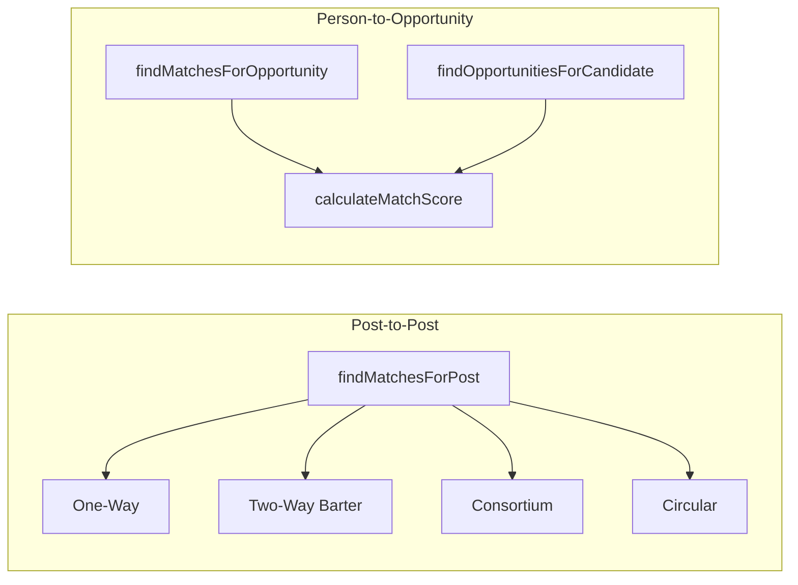

# Matching system

### What this page is

Explains **both** matching layers, every **match type**, scoring, and **one example per type** with inputs and expected behavior.

### Why it matters

It bridges product language and the matching service entry points.

### What you can do here

- Compare post-to-post vs legacy layers in the overview table.
- Walk examples before reading source.

### Step-by-step actions

1. Read **Overview**.
2. Open the model section you tune (one-way, barter, and so on).

### What happens next

Use [matching-engine.md](../matching-engine.md) for function-level detail and [matching-workflow.md](../workflow/matching-workflow.md) for persistence.

### Tips

**Related docs:** [MATCHING_FLOW.md](../../POC/docs/simulation/MATCHING_FLOW.md) (simulation reference), [MATCHING_READINESS_REPORT.md](../../POC/docs/reports/MATCHING_READINESS_REPORT.md).

---

## Overview

The system has two matching layers:

| Layer | Purpose | Entry point | Implementation |
|-------|---------|-------------|----------------|
| **Post-to-post** | Match Need posts to Offer posts (exchange models) | `matchingService.findMatchesForPost(opportunityId, options)` | [matching-models.js](../../POC/src/services/matching/matching-models.js) |
| **Person-to-opportunity** | Score candidates for an opportunity (or opportunities for a candidate) | `matchingService.findMatchesForOpportunity(opportunityId)` / `findOpportunitiesForCandidate(candidateId)` | [matching-service.js](../../POC/src/services/matching/matching-service.js) |


```mermaid
flowchart LR
    subgraph postToPost [Post-to-Post]
        findPost[findMatchesForPost]
        findPost --> oneWay[One-Way]
        findPost --> twoWay[Two-Way Barter]
        findPost --> consortium[Consortium]
        findPost --> circular[Circular]
    end
    subgraph personToOpp [Person-to-Opportunity]
        findOpp[findMatchesForOpportunity]
        findCand[findOpportunitiesForCandidate]
        findOpp --> score[calculateMatchScore]
        findCand --> score
    end
```

## Current implementation flow

1. A user creates or edits an opportunity. The opportunity stores its intent (`request`, `offer`, or `hybrid`), collaboration model, payment/value exchange data, location/timeline, and matching attributes.
2. When the opportunity status becomes `published`, `data-service.updateOpportunity()` triggers matching in the background.
3. Two matching paths can run:
   - **Post-to-post matching** creates user-facing `post_matches`. This is the primary matching flow for Need/Offer exchange.
   - **Legacy person-to-opportunity matching** creates `matches`. This is still used by parts of the pipeline and opportunity-match UI.
4. `matchingService.persistPostMatches(opportunityId)` calls `findMatchesForPost()` for the published post, converts returned results into `post_match` records, deduplicates them, creates a matching-run record, writes audit logs, and notifies participants.
5. `persistPostMatches()` also runs a circular scan and persists only cycles that include the published opportunity creator.
6. Users see post matches on `/matches`, open `/matches/:id`, then accept or decline. If any participant declines, the match is declined. If all participants accept, the match becomes confirmed and can become a draft deal.
7. Admin Matching Center runs a report over current published posts. The report itself is a preview; the per-opportunity **Save** action calls `persistPostMatches(opportunityId)` for a published opportunity and creates saved matches/notifications.

```mermaid
flowchart TD
  Draft[Create or edit opportunity] --> Publish[Status = published]
  Publish --> Legacy[Legacy candidate matching: matches]
  Publish --> Persist[persistPostMatches]
  Persist --> Route[findMatchesForPost]
  Route --> P2P[One-way / barter / consortium]
  Persist --> Circular[Circular scan for creator cycles]
  P2P --> Store[createPostMatch + dedupe]
  Circular --> Store
  Store --> Notify[Notify participants]
  Notify --> UserMatches[/matches]
  UserMatches --> Respond[Accept or decline]
  Respond --> Confirmed[Confirmed when all accept]
  Confirmed --> Deal[Draft deal workspace]
```

---

## Routing (post-to-post)

`findMatchesForPost(opportunityId, options)` chooses the model in this order:

1. `options.model === 'circular'` → **Circular** (`findCircularExchanges`)
2. `options.model === 'consortium'` or opportunity `subModelType === 'consortium'` → **Consortium** (`findConsortiumCandidates`)
3. `options.model === 'two_way'` or opportunity `exchangeMode === 'barter'` (with intent request or offer) → **Two-Way Barter** (`findBarterMatches`)
4. `intent === 'request'` → **One-Way** (`findOffersForNeed`)
5. Otherwise → `{ model: 'one_way', matches: [] }`

---

## Post-to-post matching types

### 1. One-Way (Need → Offers)

**Trigger:** Need post (`intent === 'request'`). No barter/consortium/circular option.

**Behavior:** Find published Offer posts that satisfy the need. Each offer is scored; results above threshold are returned, sorted by score.

**Input example:**

- Need post: title e.g. "Barter need: Engineering Consulting"; `intent: 'request'`; `scope.requiredSkills: ['Engineering Consulting', 'Design Review']`; `sectors: ['Construction', 'Engineering']`.
- Published Offer posts from other creators with overlapping `offeredSkills` / sectors.

**Output shape:**

```json
{
  "model": "one_way",
  "matches": [
    {
      "matchScore": 0.72,
      "breakdown": {
        "attributeOverlap": 0.8,
        "budgetFit": 0.7,
        "timelineFit": 0.5,
        "locationFit": 1,
        "reputation": 0.5
      },
      "labels": { "attributeOverlap": "Partial", "budgetFit": "Partial", "timelineFit": "Partial", "locationFit": "Match", "reputation": "Partial" },
      "suggestedPartners": [{ "opportunityId": "opp-xxx", "creatorId": "user-pro-006" }],
      "matchedOpportunity": { "id": "opp-xxx", "title": "...", "creatorId": "user-pro-006", ... }
    }
  ]
}
```

**Reference:** Need/Offer pairs are seeded in [add-matching-data.js](../../POC/scripts/add-matching-data.js) and in `POC/data/opportunities.json`. One-way runs for any Need when no barter/consortium/circular path is taken.

---

### 2. Two-Way (Barter)

**Trigger:** Creator has **both** a Need and an Offer; `options.model === 'two_way'` or opportunity `exchangeMode === 'barter'`.

**Behavior:** Find other creators where Offer_A satisfies Need_B and Offer_B satisfies Need_A. Both directions must score above threshold.

**Input example:**

- **Creator A (user-pro-005):** Need "Engineering Consulting", Offer "Construction Materials".
- **Creator B (user-pro-006):** Need "Construction Materials", Offer "Engineering Consulting".

**Output shape:**

```json
{
  "model": "two_way",
  "matches": [
    {
      "matchScore": 0.78,
      "breakdown": { "scoreAtoB": 0.82, "scoreBtoA": 0.74 },
      "valueEquivalence": "~1.0 × (Barter offer: Engineering Consulting)",
      "suggestedPartners": [
        { "opportunityId": "<need-B-id>", "creatorId": "user-pro-006" },
        { "opportunityId": "<offer-B-id>", "creatorId": "user-pro-006" }
      ],
      "matchedNeed": { "id": "...", "creatorId": "user-pro-006", ... },
      "matchedOffer": { "id": "...", "creatorId": "user-pro-006", ... }
    }
  ]
}
```

**Reference:** Barter pair is seeded in [add-matching-data.js](../../POC/scripts/add-matching-data.js) (user-pro-005 and user-pro-006).

---

### 3. Consortium (group formation)

**Trigger:** Lead Need has `attributes.memberRoles` or `attributes.partnerRoles`, or `options.model === 'consortium'` or `subModelType === 'consortium'`.

**Behavior:** Decompose the lead need by role. For each role, find the best matching Offer from a **distinct** creator. One creator per role. Returns one aggregate match with `suggestedPartners` (one per role) and a breakdown by role.

**Input example:**

- Lead Need: e.g. NEOM Bay infrastructure; `subModelType: 'consortium'`; `attributes.memberRoles`: e.g. `[{ "role": "Marine Works Contractor", "scope": "..." }, { "role": "Utilities Contractor", "scope": "..." }]`.
- Or simulation: "Financial partner", "Construction expertise" (see [simulation/opportunities.json](../../POC/data/simulation/opportunities.json)).

**Output shape:**

```json
{
  "model": "consortium",
  "matches": [
    {
      "matchScore": 0.68,
      "breakdown": { "Marine Works Contractor": 0.72, "Utilities Contractor": 0.64 },
      "suggestedPartners": [
        { "opportunityId": "opp-yyy", "creatorId": "user-company-003", "role": "Marine Works Contractor" },
        { "opportunityId": "opp-zzz", "creatorId": "user-company-004", "role": "Utilities Contractor" }
      ]
    }
  ],
  "roles": ["Marine Works Contractor", "Utilities Contractor"]
}
```

**Reference:** Consortium lead needs in [opportunities.json](../../POC/data/opportunities.json) (NEOM example with `memberRoles`) and in simulation data.

---

### 4. Circular exchange

**Trigger:** `options.model === 'circular'`.

**Behavior:** Build a directed graph: nodes = creators; edge I→J if some Offer from J satisfies some Need from I. Find cycles of length ≥ `minCycleLength` (default 3), e.g. A→B→C→A.

**Input example:**

- **user-pro-002:** Need "Project Management", Offer "Structural Analysis".
- **user-pro-003:** Need "Structural Analysis", Offer "Project Management".
- **user-pro-004:** Need "Project Management", Offer "Structural Analysis".

Cycle: 002→003→004→002 (Offer of 003 satisfies Need of 002; Offer of 004 satisfies Need of 003; Offer of 002 satisfies Need of 004).

**Output shape:**

```json
{
  "model": "circular",
  "matches": [
    {
      "matchScore": 0.71,
      "cycle": ["user-pro-002", "user-pro-003", "user-pro-004"],
      "suggestedPartners": [
        { "opportunityId": "<offer-003-id>", "creatorId": "user-pro-003" },
        { "opportunityId": "<offer-004-id>", "creatorId": "user-pro-004" },
        { "opportunityId": "<offer-002-id>", "creatorId": "user-pro-002" }
      ]
    }
  ]
}
```

**Reference:** Circular need/offer sets for user-pro-002, user-pro-003, user-pro-004 are seeded in [add-matching-data.js](../../POC/scripts/add-matching-data.js).

---

## Post-to-post scoring

Implemented in [post-to-post-scoring.js](../../POC/src/services/matching/post-to-post-scoring.js). Current live weights (from [config.js](../../POC/src/core/config/config.js)):

| Factor | Weight |
|--------|--------|
| Skill / Attribute Overlap | 25% |
| Exchange Compatibility | 20% |
| Value Compatibility | 20% |
| Budget Fit | 10% |
| Timeline | 10% |
| Location | 10% |
| Reputation | 5% |

- **Threshold:** `CONFIG.MATCHING.POST_TO_POST_THRESHOLD` (default **0.50**). Pairs below this are filtered out.
- **Labels per factor:** Match (≥1), Partial (≥0.25), No Match (&lt;0.25).
- Candidate generation (budget, location, timeline, category) is in [candidate-generator.js](../../POC/src/services/matching/candidate-generator.js).
- **Product-spec variant:** A disabled `WEIGHTS_DESIGN` profile exists in config for Attribute 40%, Budget 30%, Timeline 15%, Location 10%, Reputation 5%. It is not the current default unless enabled in config.

---

## Person-to-opportunity matching (candidate scoring)

**Entry points:**

- `matchingService.findMatchesForOpportunity(opportunityId)` — find candidates for an opportunity.
- `matchingService.findOpportunitiesForCandidate(candidateId, options)` — find opportunities for a candidate (e.g. dashboard).

**Logic:** [matching-service.js](../../POC/src/services/matching/matching-service.js): `calculateMatchScore(opportunity, candidate)` plus model-specific methods.

### Model types (from config)

| Model | Config key | Sub-models (examples) |
|-------|------------|------------------------|
| Project-based | `project_based` | task_based, consortium, project_jv, spv |
| Strategic Partnership | `strategic_partnership` | strategic_jv, strategic_alliance, mentorship |
| Resource Pooling | `resource_pooling` | bulk_purchasing, equipment_sharing, resource_sharing |
| Hiring | `hiring` | professional_hiring, consultant_hiring |
| Competition | `competition` | competition_rfp |

### Scoring components

- **Scope (generic):** skills (up to 50), sectors (15), certifications (15), payment compatibility (10). Max 90 from scope when all present.
- **Model-specific block:** up to 100 points (e.g. task_based: skills, experience, budget, location, availability; consortium/project_jv: roles, financial capacity, geography; spv: financial capacity, sector, experience; strategic: alignment, contributions, capital; resource pooling: resource type, quantity, timeline; hiring: qualifications, experience, skills; competition: eligibility, experience).
- **Past performance:** up to 20 points (acceptance rate on applications for that model type).
- **Normalization:** total / max possible → score in 0–1.
- **Thresholds:** `MIN_THRESHOLD` **0.70** (candidate appears in results), `AUTO_NOTIFY_THRESHOLD` **0.80** (auto-notify candidate).

### Example (person-to-opportunity match)

**Input:** Opportunity `opp-002` (e.g. structural engineering project); candidate `user-pro-001` (professional with Structural Design, SAP2000, ETABS, 15 years experience, PMP and PE, Riyadh).

**Output:** A match record as stored in [matches.json](../../POC/data/matches.json):

```json
{
  "id": "match-001",
  "opportunityId": "opp-002",
  "candidateId": "user-pro-001",
  "matchScore": 0.92,
  "criteria": {
    "modelType": "project_based",
    "subModelType": "task_based",
    "skillMatch": { "matched": ["Structural Design", "SAP2000", "ETABS"], "score": 0.95 },
    "sectorMatch": true,
    "paymentCompatible": true,
    "matchedAt": "2026-01-12T10:00:00.000Z"
  },
  "matchReasons": [
    { "factor": "Skills Match", "score": 0.95, "details": "Strong match on Structural Design, SAP2000, ETABS" },
    { "factor": "Experience Level", "score": 0.9, "details": "15 years experience exceeds 10 year requirement" },
    { "factor": "Location", "score": 0.9, "details": "Based in Riyadh, on-site available" },
    { "factor": "Certifications", "score": 0.95, "details": "PMP and PE certifications match requirements" }
  ],
  "notified": true,
  "createdAt": "2026-01-12T10:00:00.000Z"
}
```

**Reference:** [matches.json](../../POC/data/matches.json) (e.g. match-001).

---

## Data structures (minimal)

### Opportunity (for matching)

- **Required for post-to-post:** `id`, `title`, `creatorId`, `intent` (`'request'` | `'offer'`), `status` (`'published'` for candidates), `scope` (`requiredSkills` / `offeredSkills`, `sectors`), `exchangeData` (e.g. `budgetRange`, `cashAmount`, or barter fields), `attributes` (e.g. `memberRoles`, `partnerRoles`, `startDate`, `applicationDeadline`, `locationRequirement`), `exchangeMode`, `subModelType`.
- **Optional:** `normalized` (preprocessor output), `location`, `modelType`, `paymentModes`.

### Match (person-to-opportunity)

- `id`, `opportunityId`, `candidateId` (or `userId`), `matchScore` (0–1), `criteria` (object with modelType, subModelType, skillMatch, sectorMatch, paymentCompatible, etc.), `notified`, `createdAt`.

### Post-to-post result

- `model`: `'one_way'` | `'two_way'` | `'consortium'` | `'circular'`.
- `matches`: array of objects with `matchScore`, `breakdown`, `suggestedPartners`; type-specific fields (`matchedOpportunity`, `matchedNeed`/`matchedOffer`, `valueEquivalence`, `cycle`, `roles`) as described above.

---

## Current gaps and how to fix them

| Gap | Impact | How to fix |
|-----|--------|------------|
| **Two match systems still coexist (`matches` and `post_matches`).** | Users and reports can see two kinds of "match" with different fields and lifecycle rules. | Make `post_matches` the canonical user-facing match entity. Keep `matches` only as "candidate recommendations" or migrate it behind an adapter. Update pipeline/reports to label the two concepts clearly. |
| **`findMatchesForPost()` uses route precedence, not the full `detectMatchingModel()` list.** | A post that qualifies for more than one model can have only the first matching route persisted, plus circular. Example: consortium can win before barter. | In `persistPostMatches()`, call `detectMatchingModel(opportunity)` and run each returned model explicitly, then run circular. Keep `options.model` for admin/debug single-model runs. |
| **Two-way payload can miss the current creator's paired need/offer id.** | Dedupe and deal payloads are weaker because `sideA.needId` or `sideA.offerId` can be `null`. | In `persistPostMatches()` hydrate the creator's full need+offer pair before building `sideA`, the same way `findBarterMatches()` does. |
| **Circular results do not persist `needId` and `offerId` in `linkScores`.** | Circular match detail cannot reliably show what each participant gives/receives, and circular deal creation can fail because no opportunity ids are available. | In `matching-models.findCircularExchanges()`, include `needId: detail.need.id` and `offerId: detail.offer.id` in each link score. Add a circular match-detail/deal test. |
| **Match detail attempts deal creation after an accept even when not all participants accepted yet.** | The helper correctly rejects non-confirmed matches, so the first accept can log an error instead of showing a clean "waiting for others" state. | Move `dataService.createDealFromMatch(updated)` inside the `updated.status === CONFIRMED` branch in `match-detail.js`. Show a pending participant state until confirmation. |
| **Admin report and persistence are separate.** | "Run report" previews results; saving is per opportunity only. There is no bulk save or "save exactly these previewed results" action. | Add a selected-results save flow: store preview run metadata, let admin select rows, then persist selected result ids/model with an explicit run id. |
| **Expiry is lazy and often unset.** | `getPostMatches()` can expire pending matches when read, but most generated post matches have `expiresAt: null`, and there is no scheduled expiry job. | Set a default expiry when creating post matches, add an app-load/server scheduled sweep, and filter expired records in all user/admin lists. |
| **Matching run history is minimal.** | `matching_runs` records only opportunity, model, and timestamp, so analytics cannot explain why a run changed. | Store threshold, weights profile, candidate counts, result counts, created/skipped duplicate counts, top scores, and actor/source (`publish`, `admin_save`, `scheduled`). |
| **Scoring profile is split between product spec and implementation.** | Docs/product may expect 40/30/15/10/5 scoring, while live config uses 25/20/20/10/10/10/5 with exchange/value factors. | Choose one default profile or expose named profiles in Admin Settings. Persist the profile name on `matching_runs` and show it in Admin Matching. |
| **Matching depends on normalized opportunity fields.** | Missing `normalized`, skills, roles, budget, location, or value fields reduce or block matching. | Normalize on create/update/publish, add a "matching readiness" validation before publish, and keep the opportunity audit report in CI/demo QA. |
| **Legacy person-to-opportunity matching scores active users only.** | Companies can be creators in post-to-post matching, but the legacy candidate matcher can miss company candidates. | Either include active companies in `findMatchesForOpportunity()` or retire the legacy path from user-facing recommendations. |
| **No production backend/job runner yet.** | Local storage is fine for the POC but cannot enforce uniqueness, scheduled expiry, concurrent matching runs, or cross-device results. | Move match creation to a backend service with database constraints, transactional persistence, scheduled jobs, and server-side validation. |

### Suggested fix order

1. Fix correctness bugs first: circular link ids, confirmed-only deal creation, and two-way side hydration.
2. Then align model execution: use `detectMatchingModel()` for publish persistence and keep admin single-model preview explicit.
3. Then clean the product surface: decide the canonical match entity, clarify legacy recommendations, and update pipeline/report labels.
4. Then harden operations: default expiry, richer `matching_runs`, admin selected-results save, and backend uniqueness/jobs.
