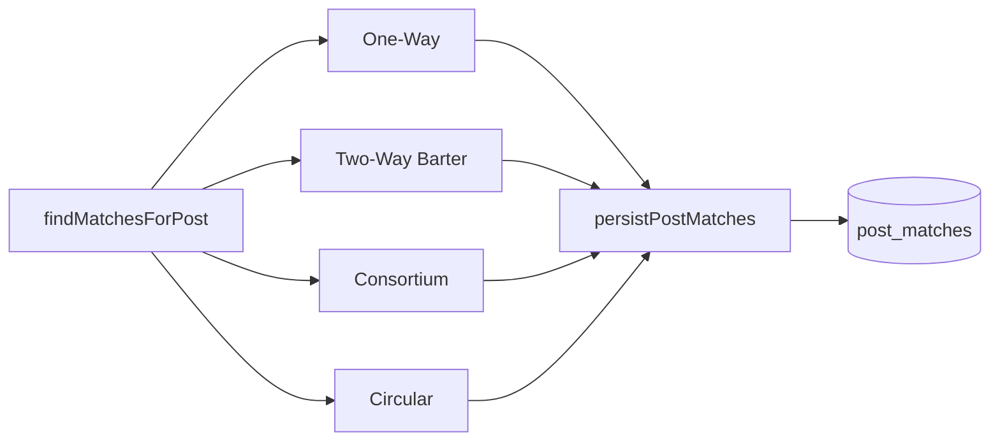

# Matching system

### What this page is

Explains the **post-to-post matching system** (the only operational matching model), every **match type**, scoring, and **one example per type** with inputs and expected behavior.

### Why it matters

It bridges product language and the matching service entry points.

### What you can do here

- See how Need/Offer posts are matched into `post_matches`.
- Walk examples before reading source.

### Step-by-step actions

1. Read **Overview**.
2. Open the model section you tune (one-way, barter, and so on).

### What happens next

Use [matching-engine.md](../matching-engine.md) for function-level detail and [matching-workflow.md](../workflow/matching-workflow.md) for persistence.

### Tips

**Related docs:** [MATCHING_FLOW.md](../../POC/docs/simulation/MATCHING_FLOW.md) (simulation reference), [MATCHING_READINESS_REPORT.md](../../POC/docs/reports/MATCHING_READINESS_REPORT.md).

---

## Overview

**Official matching system:** Post-to-post matching only. Published Need and Offer **opportunities** are scored and persisted as **`post_matches`** (`CONFIG.STORAGE_KEYS.POST_MATCHES`). Users see these on `/matches`, `/pipeline` (Matches tab), and the dashboard.

| Concept | Storage key | Role |
|---------|-------------|------|
| **`post_matches`** | `pmtwin_post_matches` | **Canonical** user-facing match entity (one-way, barter, consortium, circular). |
| **`pmtwin_matches`** | `pmtwin_matches` | **Deprecated / not user-facing.** Legacy person-to-opportunity records; not loaded from seed when `LEGACY_PERSON_OPPORTUNITY_ENABLED` is false. UI and publish flows do not read or write this store. |

| Entry point | Purpose | Implementation |
|-------------|---------|----------------|
| `matchingService.findMatchesForPost(opportunityId, options)` | Score published posts by model | [matching-models.js](../../POC/src/services/matching/matching-models.js) |
| `matchingService.persistPostMatches(opportunityId, options)` | Create deduped `post_matches`, notify, audit | [matching-service.js](../../POC/src/services/matching/matching-service.js) |


```mermaid
flowchart LR
    findPost[findMatchesForPost]
    findPost --> oneWay[One-Way]
    findPost --> twoWay[Two-Way Barter]
    findPost --> consortium[Consortium]
    findPost --> circular[Circular]
    persist[persistPostMatches]
    oneWay --> persist
    twoWay --> persist
    consortium --> persist
    circular --> persist
    persist --> store[(post_matches)]
```

## Current implementation flow

1. A user creates or edits an opportunity. The opportunity stores its intent (`request`, `offer`, or `hybrid`), collaboration model, payment/value exchange data, location/timeline, and matching attributes.
2. When the opportunity status becomes `published`, `data-service.updateOpportunity()` triggers matching in the background.
3. **Post-to-post matching** is the only active flow: publish and admin Save call `persistPostMatches()`, which creates user-facing `post_matches`. Legacy person-to-opportunity matching is **removed from UI and publish** (`LEGACY_PERSON_OPPORTUNITY_ENABLED = false`; `findMatchesForOpportunity` is not called on publish).
4. `matchingService.persistPostMatches(opportunityId)` calls `findMatchesForPost()` for the published post, converts returned results into `post_match` records, deduplicates them, creates a matching-run record, writes audit logs, and notifies participants.
5. `persistPostMatches()` also runs a circular scan and persists only cycles that include the published opportunity creator.
6. Users see post matches on `/matches`, open `/matches/:id`, then accept or decline. If any participant declines, the match is declined. If all participants accept, the match becomes confirmed and can become a draft deal.
7. Admin Matching Center runs a report over current published posts. The report itself is a preview; the per-opportunity **Save** action calls `persistPostMatches(opportunityId)` for a published opportunity and creates saved matches/notifications.

```mermaid
flowchart TD
  Draft[Create or edit opportunity] --> Publish[Status = published]
  Publish --> Persist[persistPostMatches]
  Persist --> Route[findMatchesForPost]
  Route --> P2P[One-way / barter / consortium]
  Persist --> Circular[Circular scan for creator cycles]
  P2P --> Store[createPostMatch + dedupe]
  Circular --> Store
  Store --> Notify[Notify participants]
  Notify --> UserMatches[/matches]
  UserMatches --> Respond[Accept or decline]
  Respond --> Confirmed[Confirmed when all accept]
  Confirmed --> Deal[Draft deal workspace]
```

---

## Routing (post-to-post)

`findMatchesForPost(opportunityId, options)` chooses the model in this order:

1. `options.model === 'circular'` → **Circular** (`findCircularExchanges`)
2. `options.model === 'consortium'` or opportunity `subModelType === 'consortium'` → **Consortium** (`findConsortiumCandidates`)
3. `options.model === 'two_way'` or opportunity `exchangeMode === 'barter'` (with intent request or offer) → **Two-Way Barter** (`findBarterMatches`)
4. `intent === 'request'` → **One-Way** (`findOffersForNeed`)
5. Otherwise → `{ model: 'one_way', matches: [] }`

---

## Post-to-post matching types

### 1. One-Way (Need → Offers)

**Trigger:** Need post (`intent === 'request'`). No barter/consortium/circular option.

**Behavior:** Find published Offer posts that satisfy the need. Each offer is scored; results above threshold are returned, sorted by score.

**Input example:**

- Need post: title e.g. "Barter need: Engineering Consulting"; `intent: 'request'`; `scope.requiredSkills: ['Engineering Consulting', 'Design Review']`; `sectors: ['Construction', 'Engineering']`.
- Published Offer posts from other creators with overlapping `offeredSkills` / sectors.

**Output shape:**

```json
{
  "model": "one_way",
  "matches": [
    {
      "matchScore": 0.72,
      "breakdown": {
        "attributeOverlap": 0.8,
        "budgetFit": 0.7,
        "timelineFit": 0.5,
        "locationFit": 1,
        "reputation": 0.5
      },
      "labels": { "attributeOverlap": "Partial", "budgetFit": "Partial", "timelineFit": "Partial", "locationFit": "Match", "reputation": "Partial" },
      "suggestedPartners": [{ "opportunityId": "opp-xxx", "creatorId": "user-pro-006" }],
      "matchedOpportunity": { "id": "opp-xxx", "title": "...", "creatorId": "user-pro-006", ... }
    }
  ]
}
```

**Reference:** Need/Offer pairs are seeded in [add-matching-data.js](../../POC/scripts/add-matching-data.js) and in `POC/data/opportunities.json`. One-way runs for any Need when no barter/consortium/circular path is taken.

---

### 2. Two-Way (Barter)

**Trigger:** Creator has **both** a Need and an Offer; `options.model === 'two_way'` or opportunity `exchangeMode === 'barter'`.

**Behavior:** Find other creators where Offer_A satisfies Need_B and Offer_B satisfies Need_A. Both directions must score above threshold.

**Input example:**

- **Creator A (user-pro-005):** Need "Engineering Consulting", Offer "Construction Materials".
- **Creator B (user-pro-006):** Need "Construction Materials", Offer "Engineering Consulting".

**Output shape:**

```json
{
  "model": "two_way",
  "matches": [
    {
      "matchScore": 0.78,
      "breakdown": { "scoreAtoB": 0.82, "scoreBtoA": 0.74 },
      "valueEquivalence": "~1.0 × (Barter offer: Engineering Consulting)",
      "suggestedPartners": [
        { "opportunityId": "<need-B-id>", "creatorId": "user-pro-006" },
        { "opportunityId": "<offer-B-id>", "creatorId": "user-pro-006" }
      ],
      "matchedNeed": { "id": "...", "creatorId": "user-pro-006", ... },
      "matchedOffer": { "id": "...", "creatorId": "user-pro-006", ... }
    }
  ]
}
```

**Reference:** Barter pair is seeded in [add-matching-data.js](../../POC/scripts/add-matching-data.js) (user-pro-005 and user-pro-006).

---

### 3. Consortium (group formation)

**Trigger:** Lead Need has `attributes.memberRoles` or `attributes.partnerRoles`, or `options.model === 'consortium'` or `subModelType === 'consortium'`.

**Behavior:** Decompose the lead need by role. For each role, find the best matching Offer from a **distinct** creator. One creator per role. Returns one aggregate match with `suggestedPartners` (one per role) and a breakdown by role.

**Input example:**

- Lead Need: e.g. NEOM Bay infrastructure; `subModelType: 'consortium'`; `attributes.memberRoles`: e.g. `[{ "role": "Marine Works Contractor", "scope": "..." }, { "role": "Utilities Contractor", "scope": "..." }]`.
- Or simulation: "Financial partner", "Construction expertise" (see [simulation/opportunities.json](../../POC/data/simulation/opportunities.json)).

**Output shape:**

```json
{
  "model": "consortium",
  "matches": [
    {
      "matchScore": 0.68,
      "breakdown": { "Marine Works Contractor": 0.72, "Utilities Contractor": 0.64 },
      "suggestedPartners": [
        { "opportunityId": "opp-yyy", "creatorId": "user-company-003", "role": "Marine Works Contractor" },
        { "opportunityId": "opp-zzz", "creatorId": "user-company-004", "role": "Utilities Contractor" }
      ]
    }
  ],
  "roles": ["Marine Works Contractor", "Utilities Contractor"]
}
```

**Reference:** Consortium lead needs in [opportunities.json](../../POC/data/opportunities.json) (NEOM example with `memberRoles`) and in simulation data.

---

### 4. Circular exchange

**Trigger:** `options.model === 'circular'`.

**Behavior:** Build a directed graph: nodes = creators; edge I→J if some Offer from J satisfies some Need from I. Find cycles of length ≥ `minCycleLength` (default 3), e.g. A→B→C→A.

**Input example:**

- **user-pro-002:** Need "Project Management", Offer "Structural Analysis".
- **user-pro-003:** Need "Structural Analysis", Offer "Project Management".
- **user-pro-004:** Need "Project Management", Offer "Structural Analysis".

Cycle: 002→003→004→002 (Offer of 003 satisfies Need of 002; Offer of 004 satisfies Need of 003; Offer of 002 satisfies Need of 004).

**Output shape:**

```json
{
  "model": "circular",
  "matches": [
    {
      "matchScore": 0.71,
      "cycle": ["user-pro-002", "user-pro-003", "user-pro-004"],
      "suggestedPartners": [
        { "opportunityId": "<offer-003-id>", "creatorId": "user-pro-003" },
        { "opportunityId": "<offer-004-id>", "creatorId": "user-pro-004" },
        { "opportunityId": "<offer-002-id>", "creatorId": "user-pro-002" }
      ]
    }
  ]
}
```

**Reference:** Circular need/offer sets for user-pro-002, user-pro-003, user-pro-004 are seeded in [add-matching-data.js](../../POC/scripts/add-matching-data.js).

---

## Post-to-post scoring

Implemented in [post-to-post-scoring.js](../../POC/src/services/matching/post-to-post-scoring.js). Current live weights (from [config.js](../../POC/src/core/config/config.js)):

| Factor | Weight |
|--------|--------|
| Skill / Attribute Overlap | 25% |
| Exchange Compatibility | 20% |
| Value Compatibility | 20% |
| Budget Fit | 10% |
| Timeline | 10% |
| Location | 10% |
| Reputation | 5% |

**Location policy (active runtime `@pm-twin/matching`):** Location is a **soft score only** — never a hard candidate reject. Coverage hierarchy: Remote / Nationwide (Saudi Arabia service area) / GCC regional / Same city / Same country (different city) / Different GCC country. Primary city is a preference under business coverage.

**Diagnostics:** All matching models (`one_way`, `two_way`, `consortium`, `circular`) return per-candidate diagnostics (pass/fail checks, location tier, final score, reject reason). Summaries are stored on matching-run audit (publish + circular) and shown on Admin → Matching.

- **Threshold:** `CONFIG.MATCHING.POST_TO_POST_THRESHOLD` (default **0.50**). Pairs below this are filtered out.
- **Labels per factor:** Match (≥1), Partial (≥0.25), No Match (&lt;0.25).
- Candidate generation (budget, timeline, category, hard role/skills) is in `@pm-twin/matching` candidate-generator. **Location is not a hard filter** — it contributes to `locationFit` scoring only.
- **Product-spec variant:** A disabled `WEIGHTS_DESIGN` profile exists in config for Attribute 40%, Budget 30%, Timeline 15%, Location 10%, Reputation 5%. It is not the current default unless enabled in config.

---

## Deprecated / removed: Legacy person-to-opportunity matching

This path is **not** part of the current operational model. It matched an opportunity to a **person** (`candidateId`) and stored rows in **`pmtwin_matches`** (`matches.json` / `demo-matches.json` seed).

| Item | Status |
|------|--------|
| `LEGACY_PERSON_OPPORTUNITY_ENABLED` | `false` in [config.js](../../POC/src/core/config/config.js) |
| Publish flow | Does **not** call `findMatchesForOpportunity` or `createMatch` |
| UI (dashboard, pipeline, `/matches`) | Uses **`getPostMatches*`** only; does not read `pmtwin_matches` |
| Seed | `matches.json` / `demo-matches.json` are not merged into localStorage when legacy is off; demo data uses **`demo-post-matches.json`** |
| API surface | `findMatchesForOpportunity`, `findOpportunitiesForCandidate`, `getMatches`, `createMatch` remain as **deprecated no-ops** for migration/tests only |

For historical scoring detail (project_based, hiring, etc.), see git history or archived notes; do not build new features on this path.

---

## Data structures (minimal)

### Opportunity (for matching)

- **Required for post-to-post:** `id`, `title`, `creatorId`, `intent` (`'request'` | `'offer'`), `status` (`'published'` for candidates), `scope` (`requiredSkills` / `offeredSkills`, `sectors`), `exchangeData` (e.g. `budgetRange`, `cashAmount`, or barter fields), `attributes` (e.g. `memberRoles`, `partnerRoles`, `startDate`, `applicationDeadline`, `locationRequirement`), `exchangeMode`, `subModelType`.
- **Optional:** `normalized` (preprocessor output), `location`, `modelType`, `paymentModes`.

### Post_match (canonical)

- `id`, `matchType` (`one_way` \| `two_way` \| `consortium` \| `circular`), `status`, `matchScore`, `participants[]`, `payload` (model-specific), `expiresAt`, `createdAt`, `updatedAt`.

### Post-to-post result (engine output before persist)

- `model`: `'one_way'` | `'two_way'` | `'consortium'` | `'circular'`.
- `matches`: array of objects with `matchScore`, `breakdown`, `suggestedPartners`; type-specific fields (`matchedOpportunity`, `matchedNeed`/`matchedOffer`, `valueEquivalence`, `cycle`, `roles`) as described above.

---

## Current gaps and how to fix them

| Gap | Impact | How to fix |
|-----|--------|------------|
| **`findMatchesForPost()` uses route precedence, not the full `detectMatchingModel()` list.** | A post that qualifies for more than one model can have only the first matching route persisted, plus circular. Example: consortium can win before barter. | In `persistPostMatches()`, call `detectMatchingModel(opportunity)` and run each returned model explicitly, then run circular. Keep `options.model` for admin/debug single-model runs. |
| **Admin report and persistence are separate.** | **Run report** is preview-only (in-memory). **Save** on a published opportunity row calls `persistPostMatches` and writes `post_matches`. There is no bulk save of selected preview rows. | Add a selected-results save flow: store preview run metadata, let admin select rows, then persist with an explicit run id. |
| **TTL expiry is lazy and often unset.** *(partially addressed)* | `getPostMatches()` can expire pending matches when read, but most generated post matches have `expiresAt: null`, and there is no scheduled expiry job. **Event-driven expiry is now complete:** closing or archiving an opportunity expires its open matches and notifies both participants with `match_expired` ([`expire-matches-on-opportunity-withdrawn.ts`](../../web/src/domain/matching/expire-matches-on-opportunity-withdrawn.ts)). The remaining gap is *time-based* TTL only. | Set a default expiry when creating post matches, add an app-load/server scheduled sweep, and filter expired records in all user/admin lists. |
| **Matching run history is minimal.** | `matching_runs` records only opportunity, model, and timestamp, so analytics cannot explain why a run changed. | Store threshold, weights profile, candidate counts, result counts, created/skipped duplicate counts, top scores, and actor/source (`publish`, `admin_save`, `scheduled`). |
| **Scoring profile is split between product spec and implementation.** | Docs/product may expect 40/30/15/10/5 scoring, while live config uses 25/20/20/10/10/10/5 with exchange/value factors. | Choose one default profile or expose named profiles in Admin Settings. Persist the profile name on `matching_runs` and show it in Admin Matching. |
| **Matching depends on normalized opportunity fields.** | Missing `normalized`, skills, roles, budget, location, or value fields reduce or block matching. | Normalize on create/update/publish, add a "matching readiness" validation before publish, and keep the opportunity audit report in CI/demo QA. |
| **No production backend/job runner yet.** | Local storage is fine for the POC but cannot enforce uniqueness, scheduled expiry, concurrent matching runs, or cross-device results. | Move match creation to a backend service with database constraints, transactional persistence, scheduled jobs, and server-side validation. |

**Resolved (no longer gaps):** Dual match systems (`pmtwin_matches` vs `post_matches`) — `post_matches` is canonical; legacy matching is deprecated and removed from UI/publish/seed. Two-way `sideA`/`sideB` hydration and circular `needId`/`offerId` on links are enforced at persist. Deal creation from match detail requires **confirmed** status (Start Deal button).

### Suggested fix order

1. Align model execution: use `detectMatchingModel()` for publish persistence and keep admin single-model preview explicit.
2. Harden operations: default expiry on all new post_matches, richer `matching_runs`, admin selected-results save, and backend uniqueness/jobs.
