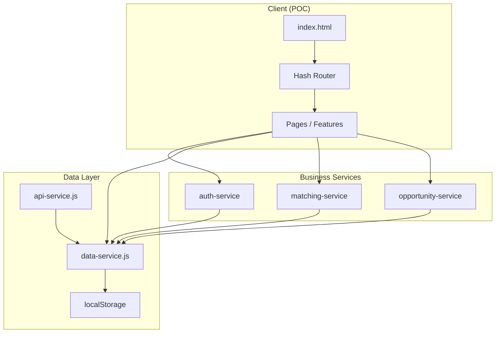

# PMTwin Platform — System Overview

## Purpose

PMTwin is a **construction collaboration platform** for Saudi Arabia and the GCC region. It enables:

- **Partnerships** between companies and professionals (project-based, strategic, resource pooling, hiring, competitions).
- **Matching** of needs and offers (one-way, two-way barter, consortium, circular exchange).
- **Post-match collaboration** via deals (negotiation, milestones, delivery) and contracts (legal layer).

The platform connects **companies** (owners, admins, members), **professionals**, and **consultants** through multiple business and collaboration models.

---

## Architecture Summary

- **Type**: Feature-based Multi-Page Application (MPA).
- **Stack**: HTML5, CSS3, Vanilla JavaScript (ES6+), Tailwind CSS.
- **Storage**: Browser **localStorage** (POC); no backend server. API service is structured for future `fetch()` integration.
- **Routing**: Hash-based (`#/path`); route params (e.g. `:id`) passed to page handlers.

---

## Key Features

| Area | Description |
|------|-------------|
| **Auth** | Register (individual/company), login, logout, forgot/reset password; session in sessionStorage; role-based access (admin, moderator, auditor). |
| **Profiles** | User and company profiles; professional/consultant/company types; skills, sectors, verification status. |
| **Opportunities** | Create/edit opportunities with intent (request/offer/hybrid), collaboration model, payment modes; unified status lifecycle (draft → published → in_negotiation → contracted → in_execution → completed → closed/cancelled). |
| **Matching** | Post-to-post matching: one-way (need↔offer), two-way (barter), consortium (roles), circular (cycles). Runs on opportunity publish; results stored as **post_matches**; notifications sent. |
| **Matches UI** | User-facing list and detail of post_matches; accept/decline; filter by type (one_way, two_way, consortium, circular). |
| **Deals** | Post-match collaboration: participants, milestones, value terms, status flow (negotiating → draft → review → signing → active → execution → delivery → completed → closed). |
| **Contracts** | Legal layer; linked to deals; parties, scope, payment mode, agreed value, milestones snapshot. |
| **Pipeline** | Kanban-style view: My Opportunities, My Applications, Matches; publish draft, manage applications. |
| **Admin** | Dashboard, users, vetting, opportunities, matching, deals, contracts, consortium, health, audit, reports, settings, skills, subscriptions, collaboration models. |

---

## Entry Point and Layout

- **Entry**: `POC/index.html` loads `POC/src/core/init/app-init.js` as module.
- **Layouts**:
  - **Public**: Top nav + full-width main (home, login, register, find, workflow, collaboration wizard, knowledge base).
  - **Portal** (authenticated): Sidebar + main content card; admin area uses same layout with admin routes.
- **Base path**: Detected from `document.baseURI` / `location.pathname`; used for loading pages, scripts, and data.

---

## Data Flow (POC)

1. **Init**: `data-service.initializeFromJSON()` loads seed JSON from `POC/data/`, merges demo data, runs migrations (deal/contract lifecycle, opportunity unified workflow), normalizes users/companies for matching.
2. **CRUD**: All entities (users, companies, opportunities, applications, matches, post_matches, deals, contracts, notifications, audit) read/write via `data-service` → `storage-service` → localStorage.
3. **Publish**: When an opportunity is updated to `status: 'published'`, `matching-service.persistPostMatches(opportunityId)` runs: finds matches (one_way/two_way/consortium/circular), creates post_match records, notifies participants.

---

## Conventions

- **IDs**: Generated via `data-service.generateId()` (e.g. UUID-like).
- **Timestamps**: ISO strings (`createdAt`, `updatedAt`).
- **Config**: Centralized in `POC/src/core/config/config.js` (roles, statuses, matching weights, storage keys, routes, API endpoints).

---

## Related Documentation

- [Actors](actors.md)
- [Data Model](data-model.md)
- [Workflows](workflow/user-workflow.md)
- [Matching Engine](matching-engine.md)
- [Admin Portal](admin-portal.md)
- [Implementation Status](implementation-status.md)
- [Gaps and Missing](gaps-and-missing.md)
