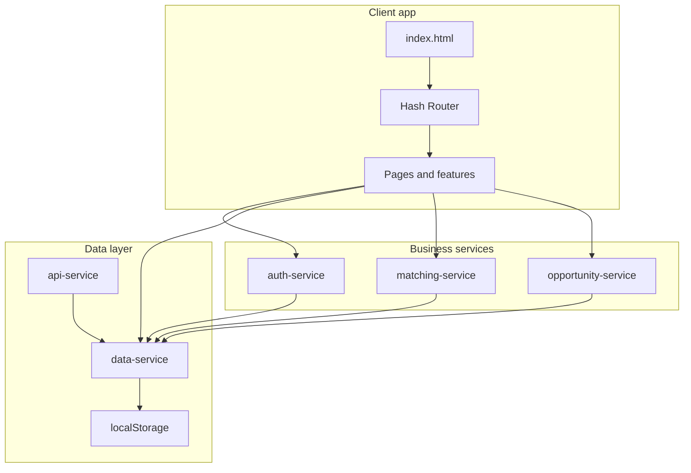

# PMTwin Platform — Overview

### What this page is

This page explains what PMTwin is, what you can do with it, and how the pieces fit together.

### Why it matters

Use it as a map before you dive into journeys, workflows, or technical details elsewhere in the docs.

### What you can do here

- Understand the main business path: opportunity → match → deal → contract → delivery.
- See how the app is built (pages, data, services) at a high level.
- Follow links to deeper topics (actors, data model, matching, admin).

### Step-by-step actions

1. Read **Purpose** and **Key features** below.
2. Skim the architecture diagram if you need a mental model.
3. Open **Related documentation** for the area you care about.

### What happens next

After this overview, open [full-user-journey.md](full-user-journey.md) or [journeys/user-journey.md](journeys/user-journey.md) for a walkthrough, or [workflow/user-workflow.md](workflow/user-workflow.md) for step detail.

### Tips

- PMTwin today runs as a browser-based proof-of-concept: data stays in the browser unless you integrate a real API later.

---

## Purpose

PMTwin is a **construction collaboration platform** for Saudi Arabia and the GCC. It helps:

- **Partnerships** between companies and professionals (project work, strategy, resource pooling, hiring, competitions).
- **Matching** of needs and offers (one-way, two-way barter, consortium, circular exchange).
- **Collaboration after a match** through **deals** (negotiation, milestones, delivery) and **contracts** (legal snapshot).

Companies, professionals, and consultants all use the same core ideas: post an **opportunity**, get **matches**, agree, then run the work in a **deal** and **contract**.

---

## Architecture summary

- **Type:** Feature-based multi-page app (MPA).
- **Stack:** HTML, CSS, JavaScript (ES6+), Tailwind CSS.
- **Storage:** Browser **localStorage** in the POC; the API layer is ready for future server calls.
- **Routing:** Hash routes (for example `#/path`); IDs in the URL for detail pages.

---

## Key features

| Area | What it does for users |
|------|-------------------------|
| **Sign-in** | Register (individual or company), log in, reset password; session stored for the browser; admin/moderator/auditor roles where configured. |
| **Profiles** | User and company profiles; professional/consultant/company types; skills, sectors, verification state. |
| **Opportunities** | Create and edit opportunities (need, offer, or hybrid); collaboration model and payment modes; status moves from draft through published, negotiation, execution, and closed states. |
| **Matching** | After publish, the app pairs opportunities (one-way, barter, consortium, circular); results show up as **matches**; people get notifications. |
| **Matches** | List and detail screens; accept or decline; filter by match type. |
| **Deals** | After a match is confirmed, parties work in a deal: participants, milestones, value, status from negotiation through signing and execution. |
| **Contracts** | Legal layer tied to deals: parties, scope, payment, value, milestone snapshot. |
| **Pipeline** | Board views for your opportunities, applications, and related work. |
| **Admin** | Dashboard, users, vetting, opportunities, matching, deals, contracts, health, audit, reports, settings, skills, subscriptions, collaboration models. |

---

## Entry point and layout

- **Entry:** `POC/index.html` loads the app bootstrap module.
- **Layouts:** Public pages (home, login, register, and others) use a top nav; signed-in users get a **sidebar** plus main content; admin uses the same pattern on admin routes.
- **Paths:** The app figures out the base path from the browser so it can load pages and data correctly.

---

## Data flow (how updates travel)

1. **Startup:** Seed data loads from JSON, demo data merges in, and light migrations run so deals, contracts, and opportunities stay consistent.
2. **Day to day:** Creating or editing users, companies, opportunities, applications, matches, deals, contracts, and notifications all go through the data layer and then **localStorage**.
3. **Publish:** When an opportunity becomes **published**, matching runs for that opportunity, match records are saved, and participants can get notifications.

### What happens next

When you change data in the UI, it is saved locally in this POC. For production you would connect the same flows to your API.

### Tips

- IDs and timestamps follow shared conventions so exports and future APIs stay predictable.

---

## Conventions

- **IDs:** Generated when records are created.
- **Timestamps:** Stored as ISO date-time strings (`createdAt`, `updatedAt`).
- **Configuration:** Roles, statuses, matching settings, routes, and storage keys live in the central config module.

---

## Related documentation

- [Actors](actors.md)
- [Data model](data-model.md)
- [User workflow](workflow/user-workflow.md)
- [Matching engine](matching-engine.md)
- [Admin portal](admin-portal.md)
- [Implementation status](implementation-status.md)
- [Gaps and missing](gaps-and-missing.md)
