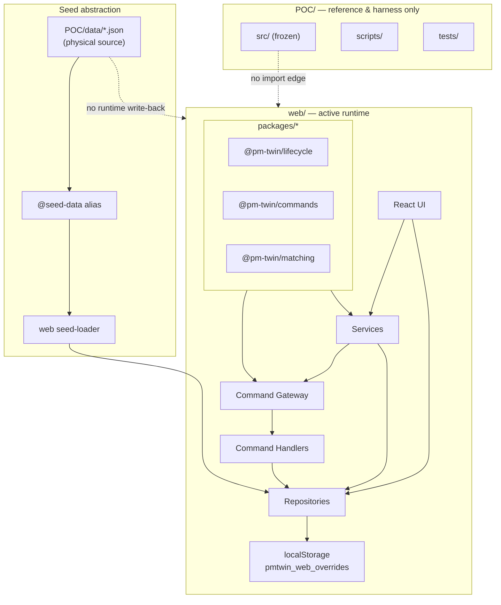

# Runtime Ownership

**Status:** Active (Phase 10.3)  
**Last updated:** June 2026

This document defines which parts of the repository own product runtime behavior after the Phase 10.2 seed abstraction (`@seed-data`).

---

## Summary

| Path | Role | May add product behavior? |
|------|------|---------------------------|
| `web/` | **Active runtime** — React SPA, command gateway, repositories, UI | **Yes** |
| `packages/` | **Shared business logic** — lifecycle, commands, matching | **Yes** (pure logic only) |
| `POC/data/` | **Physical seed source** (immutable JSON at runtime) | Seed content only |
| `POC/src/` | **Legacy reference runtime** (frozen) | **No** |
| `POC/scripts/` | Seed generation, simulation harness, data maintenance | Harness/seed only |
| `POC/tests/` | Regression suite against legacy runtime | Tests only |

---

## Active runtime: `web/`

The web application is the sole active product runtime.

- **Entry:** `web/` Vite dev server / production build
- **Persistence:** browser `localStorage` key `pmtwin_web_overrides` (+ `pmtwin_web_session` for auth)
- **Read path:** bundled seed JSON via `@seed-data` → `seed-loader.ts` → repositories
- **Write path:** command gateway → handlers → repositories → `pmtwin_web_overrides`

All new product features, lifecycle transitions, matching orchestration, and UI flows must be implemented here (or in `packages/` and consumed here).

See [architecture/runtime-boundaries.md](architecture/runtime-boundaries.md) for detailed boundaries.

---

## Shared logic: `packages/`

| Package | Authority |
|---------|-----------|
| `@pm-twin/lifecycle` | Canonical status vocabulary and FSM (source of truth) |
| `@pm-twin/commands` | Command DTO contracts |
| `@pm-twin/matching` | Matching engine (pure scoring/discovery) |

Rules:

- Packages contain **pure functions** — no DOM, no storage, no I/O.
- Web executes commands and persists results; packages define rules and types only.

---

## Seed ownership

```
POC/data/*.json          (physical files — unchanged location for now)
        │
        ▼  build-time alias
@seed-data/*.json
        │
        ▼
web/src/infrastructure/seed/seed-loader.ts
        │
        ▼
web/src/repositories/*
        │
        ▼  merge at read time
localStorage: pmtwin_web_overrides
        │
        ▼
web UI / API modules
```

- **`@seed-data`** is the neutral import alias in web code (Phase 10.2). It currently resolves to `POC/data/` at build time.
- Seed JSON is **immutable at runtime** — web never writes back to disk or to POC localStorage keys.
- Normalization of legacy field names happens in `web/src/domain/normalized/` on read.

Physical relocation to `packages/seed-data/` is planned for a future phase; behavior and content stay the same until then.

---

## Command gateway ownership

All lifecycle mutations for core entities flow through:

```
UI / service
    → DefaultCommandGateway (web/src/commands/)
    → Entity command handler
    → Repository.create | .update | .append
    → pmtwin_web_overrides
```

| Entity | Command types (examples) | Handler |
|--------|--------------------------|---------|
| Opportunity | `TransitionOpportunityStatus` | `OpportunityCommandHandler` |
| Application | `SubmitApplication`, `AcceptApplication`, … | `ApplicationCommandHandler` |
| PostMatch | `DiscoverPostMatch`, `AcceptPostMatch`, … | `PostMatchCommandHandler` |
| Negotiation | `StartNegotiationFromPostMatch`, … | `NegotiationCommandHandler` |
| Deal | `CreateDealFromPostMatch`, `TransitionDealStatus`, … | `DealCommandHandler` |
| Contract | `CreateContractFromDeal`, `SignContract`, … | `ContractCommandHandler` |

Wiring: `web/src/commands/application-command-gateway.ts`

Direct repository updates are allowed only for **non-lifecycle fields** (e.g. profile patches via `opportunitiesApi.update` with lifecycle guard).

---

## Allowed web write paths

| Path | Storage key | Notes |
|------|-------------|-------|
| Command handlers | `pmtwin_web_overrides` | Preferred for lifecycle entities |
| `lifecycle-orchestrator` | `pmtwin_web_overrides` | Sync side-effects (deal → opportunity) |
| `matching-service` | `pmtwin_web_overrides` + audit append | Discover commands + run audit |
| `notification-service` | `pmtwin_web_overrides` | Notifications |
| `auth-service` | `pmtwin_web_session` | Session only |
| Deprecated `data-store.ts` | delegates to repositories | Migrate callers to `@/api/*` |

No web write path touches `POC/` files or POC `localStorage` keys (`pmtwin_*` in the legacy app).

---

## POC freeze rules

`POC/` is **not** the active runtime. It remains as:

- Reference implementation (historical behavior)
- Physical seed dataset (`POC/data/`)
- Data scripts and simulation harness (`POC/scripts/`)
- Regression test suite (`POC/tests/`)

### Allowed changes in `POC/`

| Area | Allowed |
|------|---------|
| `POC/data/*.json` | Seed content updates, demo datasets, relationship fixes |
| `POC/scripts/` | Seed generation, consolidation, simulation, validation |
| `POC/tests/` | Regression tests, harness fixes |
| `POC/docs/` | Reference documentation |
| Bug fixes to keep regression suite green | Minimal, no new product surface |

### Forbidden changes in `POC/`

| Area | Forbidden |
|------|-----------|
| `POC/src/**` new business logic | New features, workflows, or product behavior |
| `POC/src/**` new lifecycle logic | Status transitions, FSM rules (use `@pm-twin/lifecycle` in web/packages) |
| `POC/src/**` new matching logic | Scoring, model routing (use `@pm-twin/matching` in web/packages) |
| Importing from `web/` | Cross-runtime coupling |
| New runtime dependency from `web/` → `POC/src` | Use `@seed-data` + packages instead |

### Where new work goes

| Need | Implement in |
|------|--------------|
| New UI / page | `web/src/pages/`, `web/src/components/` |
| New lifecycle transition | `@pm-twin/lifecycle` + web command handler |
| New command | `@pm-twin/commands` + web handler + gateway routing |
| New matching behavior | `@pm-twin/matching` + `web/src/services/matching-service.ts` |
| New persistence field | web repository + `Overrides` type |
| Seed data change | `POC/data/` (physical source until extraction) |

---

## Architecture diagram



---

## Enforcement

Automated guard: `web/src/infrastructure/seed/runtime-ownership.guard.test.ts`

- Fails if `web/src` contains `@poc-data` imports, `POC/src` references, or POC runtime module imports.

Cursor rule: `.cursor/rules/pm-twin-architecture.mdc`

---

## Related documentation

- [architecture/runtime-boundaries.md](architecture/runtime-boundaries.md) — import matrix and write-path detail
- [adr/ADR-105-domain-event-catalog.md](adr/ADR-105-domain-event-catalog.md) — domain event catalog (Backend Foundation)
- [implementation-status.md](implementation-status.md) — feature checklist (refresh separately)
- Phase 10.1 audit — runtime dependency inventory (conversation / internal audit)

---

## Phase history

| Phase | Outcome |
|-------|---------|
| 10.1 | Confirmed zero web → POC JavaScript runtime dependency |
| 10.2 | Renamed `@poc-data` → `@seed-data`; physical seed still `POC/data/` |
| 10.3 | Documented ownership and POC freeze (this file) |
| 10.4+ | Seed extraction (`packages/seed-data/`), backend API (see recommendation below) |
