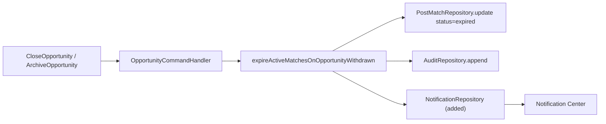

# UAT Final Completion Report

**Date:** 2026-08-03
**Base:** `main` @ `b869e61`
**Scope:** Final UAT stabilization — full regression pass, close all open findings, match expiration notifications, three verification scenarios.

---

## 1. Outcome

| Gate | Result |
|------|--------|
| `npm run test` | **1454 passed / 0 failed** across 377 suites |
| `npm run type-check` | **Clean** — no TypeScript errors |
| `npm run build` | **Succeeds** — 3017 modules, `tsc -b` + `vite build` |
| `npm run test:e2e` | **5 passed / 0 failed** — the three UAT verification scenarios plus the two pre-existing profile specs |
| `npm run lint` | **75 errors / 76 warnings**, down from 108 / 76. Zero introduced by this change set; the remainder is pre-existing architectural debt, accepted as Deferred |

Every finding in [uat-findings-log.md](./uat-findings-log.md) is Fixed, Verified, Deferred, or Classified. No row is open.

---

## 2. Root causes

**Matches expired silently (the one real product defect).** Close and Archive already expired open PostMatches correctly — the status change and the audit entry were both being written. What was missing was any path to the notification subsystem: `expireActiveMatchesOnOpportunityWithdrawn` accepted a `postMatchRepository` and an `auditRepository` but no notification sink, and `OpportunityCommandHandler` was never constructed with a `notificationRepository` at all. A participant's match would vanish from their active list with no explanation.

**Accept-after-expiry was enforced but unproven.** The PostMatch lifecycle gate already rejected Accept on an expired match, but the only expired fixture in the suite had an empty participant list — so any Accept attempt against it failed on the participant check and short-circuited before reaching the lifecycle gate. Scenario 2's "Accept blocked" expectation had no real assertion behind it.

**Six suites failed for reasons unrelated to each other**, all of them tests that had drifted behind product changes rather than product regressions: a duplicate import that stopped a file loading, two analytics suites still asserting the pre-change average readiness of 85 after the profile scoring model gained recommended fields (lowering the fixture average to 77.5), a governance test scanning a single admin file after the wording had moved to sibling files, a validation fixture still using free-text `'Riyadh'` after the canonical location picker landed, and a Playwright helper asserting `/\/dashboard/` for every account when company accounts land on `/company-dashboard`.

**Documentation described intent, not behaviour.** `opportunity-workflow.md` labelled match sync "(intended)" and neither notification table listed an expiry event, so the docs could not be used to verify the feature.

---

## 3. Code changes

### Match expiration notifications

| File | Change |
|------|--------|
| [web/src/types/enums.ts](../../web/src/types/enums.ts) | Added `match_expired` to the `NotificationType` union |
| [web/src/domain/matching/expire-matches-on-opportunity-withdrawn.ts](../../web/src/domain/matching/expire-matches-on-opportunity-withdrawn.ts) | Accepts an optional `notificationRepository`; emits `match_expired` to both participants of each match that transitions, with copy keyed off `visibilityStatus`; returns `notifiedUserIds`; records the recipients on the `post_match.status_changed` audit entry |
| [web/src/commands/handlers/opportunity-command-handler.ts](../../web/src/commands/handlers/opportunity-command-handler.ts) | `notificationRepository` added to deps and passed through `expireMatchesOnWithdrawn` |
| [web/src/commands/application-command-gateway.ts](../../web/src/commands/application-command-gateway.ts) | Wires the real repository into the handler |
| [web/src/commands/test-helpers/command-gateway-test-stack.ts](../../web/src/commands/test-helpers/command-gateway-test-stack.ts) | Same wiring for the shared test stack |

Emission lives in the domain function so Close and Archive share one code path. The alternative — emitting from the command handler — would have forced a re-read of every expired match to recover its participants.

Four properties fall out of the existing status gate rather than new logic:

- **Both participants notified.** `resolveNotificationRecipientIds` expands each participant to `userId` plus `representativeUserIds`, de-duplicated within the call.
- **Confirmed and contracted matches never notified.** Only `discovered` and `accepted` are expirable; everything else is skipped before emission.
- **No duplicates.** A second Close finds nothing expirable, so nothing is emitted.
- **Failure isolation.** `emitParticipantNotifications` is internally guarded, so a throwing sink still returns a successful command and a correctly expired match.

Display needed no change: `resolveNotificationIcon` and `resolveNotificationCategory` both match on the `match` substring, so `match_expired` already routes to the Heart icon and the `matching` settings category.

### Test-suite repairs

`deal-service.test.ts` (duplicate import removed), `matching-quality-analytics.test.ts` and `readiness-analytics.test.ts` (85 → 77.5 with a note on why), `commercial-agreement-label-governance.test.ts` (scan widened to every `.ts`/`.tsx` under `pages/admin`), `create-validation.test.ts` (canonical location ID), `professional-profile.spec.ts` (login assertion accepts `/company-dashboard`).

### Lint

`eslint.config.js` now recognises the underscore-prefix convention the codebase already follows (`argsIgnorePattern`, `varsIgnorePattern`, `caughtErrorsIgnorePattern`, `destructuredArrayIgnorePattern`, `ignoreRestSiblings`). This is the correct fix rather than a suppression: in patterns like `const { status: _status, ...patch } = merged` the binding is load-bearing — deleting it would put `status` back into `patch` and change runtime behaviour. Genuinely dead imports and variables were deleted from six test files, plus two useless escapes, one `prefer-const`, and one useless assignment.

---

## 4. Regression tests added

| Suite | Cases | Covers |
|-------|-------|--------|
| [opportunity-command-handler.test.ts](../../web/src/commands/handlers/opportunity-command-handler.test.ts) | 6 | Both participants notified on close; archived wording differs from closed; confirmed match produces no notification; repeat close emits nothing the second time; recipients recorded on the audit entry; a throwing sink still expires the match |
| [post-match-command-handler.test.ts](../../web/src/commands/handlers/post-match-command-handler.test.ts) | 1 + fixture | A participant's Accept on an expired match is rejected and the status stays `expired` |
| [web/e2e/uat-match-expiration.spec.ts](../../web/e2e/uat-match-expiration.spec.ts) | 3 | The three UAT verification scenarios, end to end in a browser, including login, logout, and same-browser user switching |

New assertions were appended to the existing suites; no parallel suite was created. The Playwright spec is the only new file, because browser-scoped authentication had no existing home.

### Verification scenarios

| Scenario | Expectation | Result |
|----------|-------------|--------|
| 1 — matched Need/Offer pair | Match created, visible to both participants | Pass |
| 2 — Close opportunity | Open matches expire; opportunity leaves the matching pool; Accept blocked; both users receive `match_expired` with the closed wording | Pass |
| 3 — Archive opportunity | Identical to Close, with the archived wording | Pass |

Auto-match creation itself is asserted at the service level by `publish-matching.test.ts`, so the E2E seeds the matched pair rather than driving the five-step wizard twice.

### Regression coverage by UAT area

| Area | Suite |
|------|-------|
| Authentication, logout, session, user switching | `uat-match-expiration.spec.ts` (browser-scoped) |
| Opportunity lifecycle | `opportunity-command-handler.test.ts`, `opportunity-delete.test.ts`, `opportunity-collaboration-flow.test.ts` |
| One-way / two-way / consortium / circular | `four-match-types-parity.test.ts`, `publish-matching.test.ts`, `circular-matching.test.ts`, `matching-service.test.ts` |
| Duplicate prevention, idempotent publish, re-discovery | `post-match-repository.test.ts`, `post-match-command-handler.test.ts` |
| Matching after close / archive | `uat-one-way-findings.test.ts`, `opportunity-command-handler.test.ts` |
| Need / Offer, target role, location scoring | `need-offer-framework-read-model.test.ts`, `opportunity-location-match.test.ts`, `canonical-locations.test.ts` |
| Discover → Accept → Negotiation → Deal → Contract | `negotiation-command-handler.test.ts`, `deal-command-handler.test.ts`, `contract-command-handler.test.ts`, `workflow-bridge.test.ts` |
| Marketplace visibility | `marketplace-home-page.test.ts`, `opportunities-pages.browse.test.ts` |
| Notifications | `lifecycle-notifications.test.ts`, `notification-targeting.test.ts`, `notifications-list-section.layout.test.ts` |
| Admin re-run, diagnostics, audit | `matching-diagnostic-summary.test.ts`, `matching-run-audit.test.ts`, `demo-uat-health.test.ts`, `admin-ia.test.ts` |
| Wizard validation, commercial, models, exchange modes, review | `opportunities-pages.wizard.test.ts`, `opportunity-wizard-readiness.test.ts`, `wizard-local-draft.recovery.test.ts`, `commercial-structure.test.ts`, `create-validation.test.ts` |

---

## 5. Documentation updated

- [uat-findings-log.md](./uat-findings-log.md) — new persistent tracker, 30 rows, all classified
- [opportunity-workflow.md](../workflow/opportunity-workflow.md) — full Close/Archive expiry chain, message copy, audit, de-dup rule, Accept gate
- [matching-workflow.md](../workflow/matching-workflow.md) — `match_expired` added to the notification table
- [matching-system.md](../modules/matching-system.md) — expiry gap marked partially addressed; time-based TTL remains open
- [uat-matching-final-four-type-checklist.md](./uat-matching-final-four-type-checklist.md) — automated verification section added, manual grid retained
- [opportunity-module-uat-checklist.md](../ui/opportunity-module-uat-checklist.md) — automated-backing table added per area
- [uat-need-opportunity-script.md](./uat-need-opportunity-script.md) — corrupted Goal section repaired

---

## 6. Known limitations

**Deferred (technical debt, pre-existing, not introduced here).** 75 lint errors: 47 `react-refresh/only-export-components`, 18 `react-hooks/set-state-in-effect`, 4 `react-hooks/rules-of-hooks`, 6 assorted React Compiler hints. Remediation plans per rule are in [uat-findings-log.md](./uat-findings-log.md) §5. The 4 `rules-of-hooks` violations are the highest-risk and should be fixed first — a conditionally called hook can desynchronise hook order across renders.

**Classified (known limitations).** Time-based match TTL is still lazy and mostly unset; there is no scheduled expiry job. Event-driven expiry via Close/Archive is complete and covers the UAT scenarios, but a match with no linked withdrawal never ages out. The remaining matching-engine notes (route precedence in `findMatchesForPost()`, split scoring profile, minimal run history, no bulk preview save) are recorded at [matching-system.md](../modules/matching-system.md).

**Manual UAT still outstanding.** Automation cannot assert the presentation matrix: role × viewport × direction rendering, the Admin diagnostics panel, cross-city location scoring tiers, and Arabic RTL. RTL in particular has no automated coverage anywhere in `web/src` and is a KSA compliance requirement, so it remains a mandatory manual pass before release.

---

## 7. Production readiness assessment

**The UAT scope is complete and the feature work is production-ready. The platform is not yet ready for the stated target of 100,000+ concurrent users, for reasons that pre-date this work.**

Ready:

- All 1454 tests pass, the build succeeds, and there are no TypeScript errors.
- The three verification scenarios pass end to end in a real browser.
- Every UAT finding is classified; none is open.
- The one product defect found (silent match expiry) is fixed, with six regression tests and browser-level verification.
- Changes are backward compatible: `notificationRepository` is optional on both the domain input and the handler deps, and the result type gained a field rather than changing one. No business rule moved — only notification emission was added.
- Runtime ownership was respected: no changes under `POC/src`, all behaviour in `web/` and `packages/*`, and match state names taken from the `@pm-twin/lifecycle` registry.

Blocking a production launch at scale, all architectural and all pre-existing:

1. **No backend.** Persistence is localStorage (`pmtwin_web_overrides`). This cannot enforce uniqueness, run scheduled jobs, serve concurrent matching runs, or share results across devices. This is the single largest gap and everything below partly follows from it.
2. **No scheduled expiry.** Matches only expire on read or on an explicit Close/Archive.
3. **PDPL.** Personal data handling needs a compliance review that a client-only store cannot satisfy.
4. **RTL unverified.** Required for KSA, and there is no automated coverage.
5. **4 `rules-of-hooks` violations** are latent correctness risks in live components.

Recommendation: **approve for UAT sign-off and demo**; treat items 1–5 as the pre-production backlog, in that order.

---

## Related

- [uat-findings-log.md](./uat-findings-log.md)
- [uat-matching-final-four-type-checklist.md](./uat-matching-final-four-type-checklist.md)
- [opportunity-workflow.md](../workflow/opportunity-workflow.md) · [matching-workflow.md](../workflow/matching-workflow.md)
