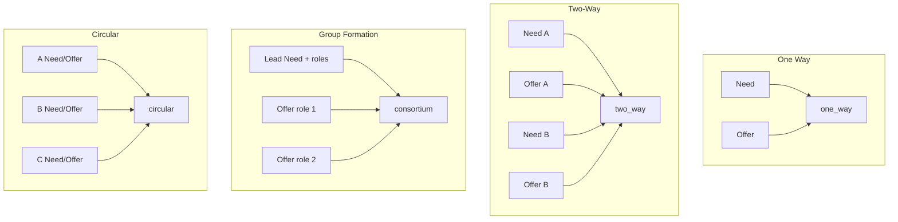

# UAT Matching — Four Types (Index)

One script file per matching type, each with **full Create Opportunity Steps 1–5** and **every field** filled (same detail level as Need/Offer field reference scripts).  
Matching structure is **auto-derived** from collaboration model — do not pick it manually.

**Runtime:** UAT · Password `Pmtwin@2026`  
After both/all posts are **published**, matching runs automatically. Check Matching workspace + bell: **New match found**.

| Match type (UI) | Engine key | Posts | Script (all fields · Steps 1–5) |
|-----------------|------------|-------|----------------------------------|
| One Way Matching | `one_way` | 2 | [uat-matching-one-way-script.md](./uat-matching-one-way-script.md) |
| Two-Way Dependency | `two_way` | 4 | [uat-matching-two-way-script.md](./uat-matching-two-way-script.md) |
| Group Formation | `consortium` | 3 | [uat-matching-group-script.md](./uat-matching-group-script.md) |
| Circular Exchange | `circular` | 6 | [uat-matching-circular-script.md](./uat-matching-circular-script.md) |

---

## Shared rules

1. Same party cannot match to itself — always use **different accounts**.
2. Dates: `2026-08-01` or later (past dates fail validation).
3. Skills Expert → years **≥ 5**. Intermediate with 3 years is fine.
4. Work packages need **skills** + **deadline**.
5. Confirm path: every participant **Accept** → match `confirmed` → opportunities → `matched`.
6. Fill **every field** listed under each step (including recommended readiness fields: preferred partner, attachments, compliance, milestones, commercial).

---

## Wizard map (all types — field groups)

| Step | Screen | Fields to fill |
|------|--------|----------------|
| 1 | Opportunity | Intent · Title · Short description · Category · Target role · Primary location · Service area · Start · Deadline · Availability end |
| 2 | Collaboration | Main model · Sub-model · Matching structure (auto) · Model-specific details (task / alliance / consortium / resource) |
| 3 | Scope & Work | Skills · Services · Preferred partner · Experience · Certifications · Team size · Min qualifications · Resources (+ capacity for Offer) · Work package · Tasks · Package deliverables · Opportunity deliverables · Milestones · Timeline & location · Documents & compliance |
| 4 | Commercial Structure | Exchange enable (Cash and/or Barter) · Component fields · Payment schedule (cash) · Constraints · VAT `15% VAT exclusive` |
| 5 | Review & Publish | Summary check · Readiness drawer · Save Draft / Publish |

### Collaboration cue per type

| Type | Main model | Sub-model | Commercial |
|------|------------|-----------|------------|
| One Way | Cash Subcontracting | Task-Based Engagement | Cash |
| Two-Way | Service Exchange / Barter | Long-Term Strategic Alliance | Barter |
| Group | Joint Venture | Consortium | Cash (hybrid OK) |
| Circle | Resource Sharing | Resource Sharing & Exchange | Barter |

---

## Side-by-side summary

| | One Way | Two-Way | Group | Circle |
|--|---------|---------|-------|--------|
| Parties | 2 | 2 (each Need+Offer) | 1 lead + N partners | ≥ 3 |
| Posts minimum | 2 | 4 | 1 Need + N Offers | 6 |
| Match key | `one_way` | `two_way` | `consortium` | `circular` |
| Confirm | Both Accept | Both Accept | All Accept | All Accept |

---

## Related

- [manual-need-offer-readiness-matching-scripts.md](./manual-need-offer-readiness-matching-scripts.md) — readiness + one-way happy path
- [uat-need-opportunity-script.md](./uat-need-opportunity-script.md) — Need field reference
- [uat-offer-opportunity-script.md](./uat-offer-opportunity-script.md) — Offer field reference
- [matching-workflow.md](../workflow/matching-workflow.md)
- [matching-system.md](../modules/matching-system.md)
- Demo credentials: `POC/docs/DEMO_CREDENTIALS.md`
