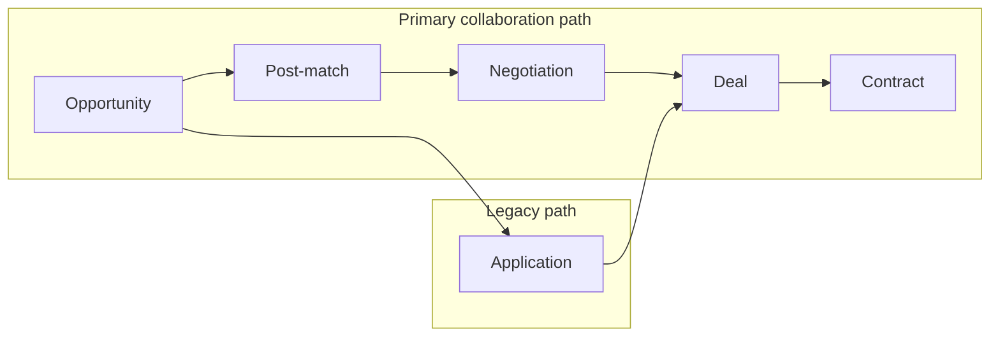

# PM-Twin UI Audit v2.0

| Field | Value |
|-------|-------|
| Phase | 1 — UI Audit & Inventory (no redesign) |
| Date | 29 June 2026 |
| Scope | `web/src/components/*`, `web/src/pages/*`, `web/src/layouts/*` (layouts live under `components/layout/`), `web/src/index.css`, navigation config |
| Out of scope | `packages/*`, `web/src/domain/*`, `web/src/commands/*`, `web/src/services/*`, `web/src/repositories/*`, business logic |
| Design target (future) | 45% Linear · 30% Stripe · 15% Vercel · 10% Apple Motion — premium B2B SaaS |

---

## 1. Executive summary

PM-Twin’s active runtime (`web/`) already sits on a modern foundation: **Tailwind CSS v4**, **shadcn/ui** primitives, **Plus Jakarta Sans**, a tokenized light/dark theme, and a collapsible **sidebar + sticky header** shell shared by workspace and admin. Core marketplace flows (opportunities → matches → negotiation → deals → contracts) are navigable end-to-end with consistent page headers, cards, and status badges on the collaboration path.

The UI is **functionally complete** for MVP demos but **not yet premium SaaS-grade**. Gaps cluster in four areas:

1. **Visual system maturity** — duplicated primitives, mixed card/stat patterns, admin tables that lack enterprise density (sort, filter, pagination, row actions).
2. **Flow polish** — negotiation, messages, map, and several admin screens are placeholders or stub copy.
3. **State coverage** — loading skeletons exist only on route guards; most lists lack empty states, error states, and optimistic feedback patterns.
4. **KSA readiness** — no Arabic RTL, Hijri dates, or explicit VAT presentation (documented ADR gaps, not UI defects per se).

Phase 1 confirms: **no redesign was started**; this document is inventory and recommendation only.

---

## 2. Current UI strengths

| Area | Observation |
|------|-------------|
| **Design tokens** | `web/src/index.css` defines oklch-based semantic colors, radius scale, sidebar tokens, dark mode, and `prefers-reduced-motion` overrides. |
| **Component library** | 22 shadcn/ui primitives under `web/src/components/ui/` (button, card, table, dialog, tabs, sidebar, command, etc.). |
| **App shell** | `AppShell` combines `SidebarProvider`, skip link, sticky blurred header, breadcrumbs, page-enter motion (`framer-motion`), and `ContentContainer` max-width. |
| **Navigation** | Centralized in `web/src/config/navigation.ts` with workspace groups, admin groups, command palette actions, and route labels for breadcrumbs. |
| **Page primitives** | `PageHeader`, `EmptyState`, `StatCard`, `StatusBadge` in `page-primitives.tsx` give a reusable page rhythm. |
| **Collaboration UX** | Readiness family (`ReadinessCard`, score ring, status badge, publish alert) is cohesive. Opportunity detail uses `CollaborationFlowStrip`, `RelatedMatchesPanel`, and action buttons wired to UI actions. |
| **Accessibility basics** | Skip-to-content link, `aria-label` on icon buttons (search, notifications, user menu, sidebar triggers), `sr-only` dialog titles in command menu, decorative icons marked `aria-hidden`. |
| **Theme** | Light / dark / system via `UserMenu` and `next-themes`. |
| **Command palette** | Linear-style `Ctrl+K` search via `CommandMenu` + `cmdk`. |
| **Pipeline** | Kanban-style `PipelineBoard` with drag-and-drop stage changes for opportunities and legacy applications. |

---

## 3. Current UI weaknesses

| Category | Weakness |
|----------|----------|
| **Consistency** | Dashboard page reimplements `StatCard` and page hero instead of shared `PageHeader` / `StatCard`. |
| **Duplication** | `MatchTypeBadge`, `getInitials`, `formatRelativeTime`, and two `StatusBadge` entry points (see §6). |
| **Admin depth** | Many admin routes render `PageHeader` + placeholder card or bare `AdminTablePage` with no filters, export, or row actions. |
| **Tables** | Single table pattern: full-width card, no sticky header, no column alignment rules, no empty-row component, no loading state. |
| **Forms** | Opportunity wizard is long inline form; apply wizard is inline stepped card — no shared `FormField` / wizard shell / validation summary pattern. |
| **Empty & loading** | `EmptyState` used only on deals/contracts; most lists show blank grids or inline `<p>` for not-found. `Skeleton` only on auth guards. |
| **Mobile** | Public layout hides nav links below `md`; no hamburger sheet. Workspace relies on sidebar sheet (shadcn sidebar mobile behavior). |
| **Localization** | English-only, LTR-only; `@fontsource-variable/inter` in `package.json` is unused (Jakarta is active). |
| **Motion** | Marketing uses motion; workspace is light (page fade). No shared motion tokens for lists, modals, or panel transitions. |
| **Premium density** | Deal/contract/match detail pages expose raw IDs and label/value paragraphs — inspector-style, not executive summary layouts. |
| **Hardcoded UI data** | Sidebar message/notification badges (`3`, `5`), admin demo metrics (`78%`, `12 users`), messages threads are static mock arrays. |

---

## 4. Page inventory

### 4.1 Public ( `PublicLayout` )

| Route | Page component | UI maturity |
|-------|----------------|-------------|
| `/` | `HomePage` | **High** — marketing hero, motion, feature grids |
| `/find` | `FindPage` | **Medium** — search/marketing surface |
| `/workflow` | `WorkflowPage` | **Medium** — explanatory content |
| `/knowledge-base` | `KnowledgeBasePage` | **Medium** |
| `/collaboration-wizard` | `CollaborationWizardPage` | **Medium** |
| `/collaboration-models` | `CollaborationModelsPage` | **Medium** |
| `/login` | `LoginPage` | **High** — split layout, demo credentials, labeled form |
| `/register` | `RegisterPage` | **Medium–High** |
| `/forgot-password` | `ForgotPasswordPage` | **Medium** |
| `/reset-password` | `ResetPasswordPage` | **Medium** |

### 4.2 Workspace ( `ProtectedRoute` + `AppShell` )

| Route | Page component | UI maturity |
|-------|----------------|-------------|
| `/dashboard`, `/company-dashboard` | `DashboardPage` | **Medium** — custom layout, not using `PageHeader` |
| `/opportunities` | `OpportunitiesPage` | **Medium–High** — card grid, search/filter |
| `/opportunities/map` | `OpportunityMapPage` | **Low** — map placeholder |
| `/opportunities/create` | `OpportunityCreatePage` | **Medium** — multi-step wizard inline |
| `/opportunities/:id/edit` | `OpportunityEditPage` | **Medium** — shared wizard |
| `/opportunities/:id` | `OpportunityDetailPage` | **High** — richest workspace page |
| `/pipeline`, `/pipeline/:tab` | `PipelinePage` | **Medium–High** — tabs + kanban |
| `/matches` | `MatchesPage` | **Medium** — card list |
| `/matches/:id` | `MatchDetailPage` | **High** — stats, actions, negotiation block |
| `/negotiations/:id` | `NegotiationDetailPage` | **Low** — placeholder discussion panel |
| `/deals` | `DealsPage` | **Medium** — cards + `EmptyState` |
| `/deals/:id` | `DealDetailPage` | **Medium–High** — 3-column inspector layout |
| `/deals/:id/rate` | `DealRatePage` | **Low** — stub rating form |
| `/contracts` | `ContractsPage` | **Medium** — mirrors deals list |
| `/contracts/:id` | `ContractDetailPage` | **Medium–High** — mirrors deal detail |
| `/people` | `PeoplePage` | **Medium** — search input non-functional (no filter wire) |
| `/people/:id` | `PersonProfilePage` | **Medium** — basic profile cards |
| `/messages`, `/messages/:id` | `MessagesPage` | **Low** — mock threads |
| `/notifications` | `NotificationsPage` | **Medium** — list, no empty state |
| `/profile` | `ProfilePage` | **Medium** — profile + readiness sidebar |
| `/settings` | `SettingsPage` | **Low** — password fields only |
| `/access-denied` | `AccessDeniedPage` | **Medium** — guard fallback |

### 4.3 Admin ( `AdminRouteGuard` + shared `AppShell` )

| Route | Page component | UI maturity |
|-------|----------------|-------------|
| `/admin` | `AdminDashboardPage` | **High** — KPI grids, readiness/matching analytics |
| `/admin/reports` | `AdminReportsPage` | **Low** — demo stat cards |
| `/admin/health` | `AdminHealthPage` | **Low** — static service rows |
| `/admin/users`, `/admin/people` | `AdminUsersPage` | **Medium** — table only |
| `/admin/users/:id`, `/admin/people/:id` | `AdminUserDetailPage` | **Low** — placeholder inspector |
| `/admin/vetting` | `AdminVettingPage` | **Medium** — queue table |
| `/admin/opportunities` | `AdminOpportunitiesPage` | **Medium** — capped at 20 rows |
| `/admin/matching` | `AdminMatchingPage` | **Medium–High** — run action + audit tables |
| `/admin/negotiations` | `AdminNegotiationsPage` | **Medium** — table |
| `/admin/negotiations/:id` | `AdminNegotiationDetailPage` | **Low** — header only |
| `/admin/disputes` | `AdminDisputesPage` | **Low** — seed placeholder row |
| `/admin/deals` | `AdminDealsPage` | **Medium** — raw status strings in table |
| `/admin/deals/:id` | `DealDetailPage` (reused) | **Medium–High** |
| `/admin/contracts` | `AdminContractsPage` | **Low** — placeholder |
| `/admin/contracts/:id` | `ContractDetailPage` (reused) | **Medium–High** |
| `/admin/consortium` | `AdminConsortiumPage` | **Medium** |
| `/admin/audit` | `AdminAuditPage` | **Medium** |
| `/admin/settings` | `AdminSettingsPage` | **Low** — placeholder |
| `/admin/skills` | `AdminSkillsPage` | **Low** — header only |
| `/admin/collaboration-models` | `AdminCollaborationModelsPage` | **Low** — header only |
| `/admin/site-content` | `AdminSiteContentPage` | **Low** — header only |
| `/admin/subscriptions` | `AdminSubscriptionsPage` | **Low** — static demo rows |

**Page file map (10 files):**

- `web/src/pages/dashboard-page.tsx`
- `web/src/pages/admin/admin-pages.tsx` (all admin exports)
- `web/src/pages/workspace/opportunities-pages.tsx`
- `web/src/pages/workspace/opportunity-detail-page.tsx`
- `web/src/pages/workspace/pipeline-pages.tsx`
- `web/src/pages/workspace/deals-pages.tsx`
- `web/src/pages/workspace/contracts-pages.tsx`
- `web/src/pages/workspace/people-pages.tsx`
- `web/src/pages/public/marketing-pages.tsx`
- `web/src/pages/public/auth-pages.tsx`

---

## 5. Component inventory

### 5.1 Layout (`web/src/components/layout/`)

| Component | Role |
|-----------|------|
| `app-shell.tsx` | Root authenticated layout, motion wrapper, skip link |
| `app-sidebar.tsx` | Collapsible nav, user chip, admin switcher |
| `app-header.tsx` | Sidebar triggers, breadcrumbs (desktop), search, notifications, user menu |
| `content-container.tsx` | Max-width page padding (`max-w-7xl`) |
| `page-breadcrumbs.tsx` | Segment-based crumbs from `routeLabels` |
| `command-menu.tsx` | Global command palette dialog |
| `notification-center.tsx` | Popover feed with mark-read |
| `user-menu.tsx` | Avatar dropdown, theme, profile links |
| `public-layout.tsx` | Marketing header/footer shell |

### 5.2 Shared primitives (`web/src/components/shared/`)

| Component | Role |
|-----------|------|
| `page-primitives.tsx` | `PageHeader`, `EmptyState`, `StatCard`, `StatusBadge` (display) |
| `StatusBadge.tsx` | Lifecycle-aware wrapper → delegates to `page-primitives` |

### 5.3 Domain UI (`web/src/components/{opportunity,deal,negotiation,contract,pipeline,readiness,auth}/`)

| Folder | Components |
|--------|------------|
| `opportunity/` | `opportunity-summary-card`, `apply-wizard`, `applications-panel`, `collaboration-flow-strip`, `related-matches-panel` |
| `deal/` | `deal-stage-actions`, `create-contract-button` |
| `negotiation/` | `start-negotiation-button`, `agree-negotiation-button`, `cancel-negotiation-button`, `create-deal-button` |
| `contract/` | `sign-contract-button`, `complete-contract-button`, `terminate-contract-button` |
| `pipeline/` | `pipeline-board` (kanban) |
| `readiness/` | `readiness-card`, `readiness-list`, `readiness-score-ring`, `readiness-status-badge`, `profile-readiness-card`, `opportunity-readiness-card`, `publish-readiness-alert`, display/rules modules |
| `auth/` | `protected-route`, `admin-route-guard` |

### 5.4 UI kit (`web/src/components/ui/` — 22 files)

`avatar`, `badge`, `breadcrumb`, `button`, `card`, `command`, `dialog`, `dropdown-menu`, `input`, `input-group`, `label`, `popover`, `scroll-area`, `select`, `separator`, `sheet`, `sidebar`, `skeleton`, `sonner`, `table`, `tabs`, `textarea`, `tooltip`

**Note:** `sheet.tsx` and `dialog.tsx` exist but are not used directly in pages — only via `command.tsx` / sidebar internals.

### 5.5 Inline page-local components

| Location | Component | Should be shared? |
|----------|-----------|-------------------|
| `admin-pages.tsx` | `AdminTablePage` | **Yes** — candidate for `components/shared/data-table.tsx` |
| `pipeline-pages.tsx` | `MatchTypeBadge` | **Yes** |
| `related-matches-panel.tsx` | `MatchTypeBadge` (duplicate) | **Yes** |
| `deals-pages.tsx` | `DealDetailNavLink` | **Maybe** — pair with contract variant |
| `contracts-pages.tsx` | `ContractDetailNavLink` | **Maybe** |
| `dashboard-page.tsx` | Local `StatCard` | **Yes** — use `page-primitives` |

---

## 6. Duplicate components

| Duplication | Locations | Risk |
|-------------|-----------|------|
| **`StatCard`** | `page-primitives.tsx` (div-based) vs `dashboard-page.tsx` (Card-based) | Visual drift between dashboard and admin KPIs |
| **`MatchTypeBadge`** | `pipeline-pages.tsx` + `related-matches-panel.tsx` | Identical styles object copied; label logic may diverge |
| **`StatusBadge`** | `page-primitives.tsx` (entity-aware display) vs `shared/StatusBadge.tsx` (lifecycle `toCanonical` wrapper) | Two import paths; most pages import from `page-primitives` directly |
| **`getInitials`** | `app-sidebar.tsx`, `user-menu.tsx` | Low risk, easy util extraction |
| **`formatRelativeTime`** | `lib/format.ts` vs local copy in `notification-center.tsx` | Time strings may format differently |
| **`DealDetailNavLink` / `ContractDetailNavLink`** | `deals-pages.tsx`, `contracts-pages.tsx` | Nearly identical fallback/link button pattern |
| **Detail page layout** | `DealDetailPage`, `ContractDetailPage`, `MatchDetailPage` | Repeated 2+1 column card grid, linked-records card, action sidebar |
| **Match list cards** | `MatchesPage`, `PipelinePage` matches tab, `OpportunitiesPage` cards | Same hover card pattern without shared `EntityCard` |
| **Readiness vs workflow badges** | `ReadinessStatusBadge` vs `StatusBadge` | Intentional separation but similar visual language — document when to use each |

---

## 7. Design inconsistencies

| Topic | Examples |
|-------|----------|
| **Page titles** | Most pages use `PageHeader`; `DashboardPage` uses inline `<section>` with manual typography |
| **Card borders** | Mix of `border-border/60`, `border-border/80`, tone-colored readiness borders |
| **Status colors** | `StatusBadge` uses hardcoded Tailwind palette; `ReadinessStatusBadge` and `MatchTypeBadge` use separate tone maps |
| **Badge components** | `ui/badge` (shadcn) for role chips; custom spans for workflow/readiness/match type |
| **Not-found UX** | `EmptyState` (deals/contracts) vs plain `<p className="text-muted-foreground">` (opportunity, match, person) |
| **Admin status display** | `AdminDealsPage` shows raw `d.status` string; other admin tables use `StatusBadge` |
| **Import aliases** | `table.tsx` imports `src/lib/utils`; other files use `@/lib/utils` |
| **Font dependencies** | `plus-jakarta-sans` loaded; `inter` in package.json unused |
| **Navigation badges** | Static numbers in `navigation.ts` not tied to `notificationsApi` / messages |
| **Breadcrumb home** | Always links to `/dashboard` even for admin routes |
| **Legacy vocabulary in filters** | Opportunities filter offers `in_negotiation` label while canonical registry prefers `negotiating` |

---

## 8. UX flow issues



| Flow | Issue |
|------|-------|
| **Opportunity → Match** | Strong on detail page (`RelatedMatchesPanel`); list/map views do not surface match density |
| **Match → Negotiation** | Actions exist on match detail; negotiation detail page is a stub — users hit a dead-end UX after "Open negotiation" |
| **Negotiation → Deal** | Buttons duplicated in header and sidebar on negotiation page; no visual round/timeline |
| **Deal → Contract** | Clear on deal detail; contract parties shown as plain text lines |
| **Pipeline vs Matches** | Two entry points (`/pipeline` tab vs `/matches`) with overlapping card UIs — cognitive overlap |
| **Applications** | Marked legacy in pipeline tab but still prominent in opportunity detail (`ApplicationsPanel`, `ApplyWizard`) |
| **People search** | Input on `PeoplePage` does not filter — breaks user expectation |
| **Messages** | Mock data; no link from deal/contract participants to thread |
| **Publish flow** | Readiness alerts work; success highlight scroll is good; wizard publish step could better preview readiness |
| **Admin oversight** | Admin reuses user deal/contract detail — good DRY, but no admin-specific annotations (audit, force actions) |
| **Pending approval** | Banner on opportunity detail; not global — user may miss restriction on match actions until click |

---

## 9. Admin UI issues

| Issue | Detail |
|-------|--------|
| **Stub pages** | Skills, collaboration models, site content, negotiation detail, settings — header only or placeholder card |
| **Table-centric design** | `AdminTablePage` is the default for 10+ screens; no unified data-table with toolbar |
| **No bulk actions** | Vetting, users, opportunities — no multi-select, approve/reject, export |
| **Demo metrics** | Reports page shows hardcoded `12` users and `78%` match rate |
| **Health monitor** | All services always show `active` badge — not credible for ops |
| **Deal/contract admin lists** | Contracts admin is empty seed message; deals omit `StatusBadge` |
| **User detail** | Single placeholder card — no tabs for documents, activity, vetting decisions |
| **Matching page** | Best admin screen — action button + audit trail; still lacks run progress UI beyond button disabled state |
| **Shared shell** | Admin uses same sidebar width and content density as workspace — no admin-dense mode |
| **Breadcrumbs** | Admin segment labels work; home crumb still points to workspace dashboard |

---

## 10. User workspace issues

| Issue | Detail |
|-------|--------|
| **Dashboard** | Does not surface pipeline shortcuts, recent matches, or readiness summary — only three stat cards |
| **Opportunity list** | No pagination (hard slice 24), no empty state when filter returns zero |
| **Map** | Placeholder undermines geo browse promise |
| **Negotiation workspace** | Critical gap — no terms sheet, proposal history, or participant panel |
| **Deal/contract detail** | Inspector-style raw IDs exposed to business users |
| **Rating** | `DealRatePage` is non-functional stub |
| **Profile/settings** | Minimal — no notification prefs, language, company profile sections |
| **Notifications page** | Hardcoded `seed-user-001` in one code path vs auth-aware in popover |
| **Company dashboard** | Same component as individual dashboard — only sidebar label changes |

---

## 11. Table and form issues

### Tables

| Issue | Where |
|-------|-------|
| No column sort | All admin tables |
| No pagination | Admin opportunities capped with `.slice(0, 20)` in code |
| No row hover actions | Admin tables — only first-column link when `rowLink` set |
| No filter/search in table toolbar | All admin list pages |
| No sticky header on scroll | `Table` wrapper scrolls horizontally only |
| No row selection | Vetting queue — cannot approve from list |
| Inconsistent cell content | Mix of strings and React nodes (`StatusBadge` inline) |
| Empty data pattern | Placeholder row `['—', 'No pending users', '—']` instead of `EmptyState` |

### Forms

| Issue | Where |
|-------|-------|
| No shared field component | Auth, settings, opportunity wizard, apply wizard |
| Inline validation only via toast | Publish, apply, post-match actions |
| Wizard progress | Opportunity create uses step labels array but limited step indicator UI |
| Select accessibility | shadcn `Select` used correctly with `Label` on auth; opportunity wizard inconsistent labeling |
| Password settings | No confirm field, no strength hint |
| CSV skill entry | Comma-separated text inputs — error-prone for KSA bilingual skills |
| No autosave indicator | Opportunity draft edit |
| Deal rate form | Submit button with no bound state |

---

## 12. Accessibility issues

| Severity | Issue |
|----------|-------|
| **High** | No RTL / `dir="rtl"` / Arabic typography path (KSA requirement) |
| **Medium** | Notification unread dot is `aria-hidden` — screen readers rely on button `aria-label` (acceptable if label always includes count) |
| **Medium** | Kanban drag cards lack keyboard alternative — drag-only stage changes |
| **Medium** | `MatchTypeBadge` / custom status spans are not `<status>` roles — color-only distinction for some states |
| **Medium** | Public site: no mobile nav menu — links unreachable below `md` without direct URL |
| **Low** | Account type toggle on login uses `<button>` without `aria-pressed` |
| **Low** | Breadcrumb hidden on shallow routes — good; mobile breadcrumbs duplicate desktop |
| **Low** | Focus management on command dialog close not audited |
| **Positive** | Skip link, reduced-motion CSS, labeled icon buttons, `Label`+`Input` on auth forms |

---

## 13. Responsive issues

| Breakpoint behavior | Issue |
|---------------------|-------|
| **Public header** | Nav hidden `< md`; no sheet/drawer alternative |
| **Sidebar** | shadcn sidebar provides mobile sheet — **good** |
| **Header search** | Full search bar hidden `< md`; icon-only fallback **good** |
| **Breadcrumbs** | Shown below header on mobile only (`app-shell`); desktop in header — intentional split |
| **Grids** | Opportunities `md:2 xl:3`, deals `md:2` — reasonable |
| **Pipeline kanban** | Horizontal scroll on small screens — needs audit for touch drag |
| **Messages** | `lg:grid-cols-3` — thread list collapses; usable |
| **Tables** | `overflow-x-auto` on table container — horizontal scroll on mobile, no card fallback |
| **Detail pages** | `lg:grid-cols-3` stacks — action cards move below content on mobile (acceptable) |
| **Touch targets** | Buttons generally `size-sm` / `icon-sm` — some may be below 44px on mobile |

---

## 14. Recommended redesign priorities

Aligned to target aesthetic (Linear clarity, Stripe polish, Vercel restraint, Apple motion subtlety). **Ordered for Phase 2+ planning — not implemented in Phase 1.**

| Priority | Initiative | Rationale |
|----------|------------|-----------|
| **P0** | **Design system consolidation** | Unify `StatCard`, `MatchTypeBadge`, `StatusBadge` imports; extract `DataTable`, `EntityCard`, `DetailLayout`, `WizardShell` |
| **P0** | **Negotiation workspace** | Biggest user-facing gap in primary flow |
| **P1** | **Admin data tables** | Stripe-like dense tables with toolbar, sort, filter, pagination, row actions |
| **P1** | **Empty / loading / error states** | Apply `EmptyState` + `Skeleton` patterns across all list pages |
| **P1** | **Dashboard v2** | Use `PageHeader`, readiness snapshot, recent activity, pipeline CTA |
| **P2** | **Deal & contract executive views** | Replace raw ID blocks with summary header, timeline, participant chips |
| **P2** | **Form system** | Shared labeled fields, validation summary, step indicator component |
| **P2** | **Messages & notifications** | Real thread layout, empty states, badge sync with API counts |
| **P3** | **Admin stub completion** | Settings, skills, site content, user detail, negotiation admin |
| **P3** | **Public mobile nav** | Sheet menu for marketing pages |
| **P3** | **Map experience** | Or hide route until service integrated |
| **P4** | **RTL / Arabic / Hijri** | Parallel track for KSA launch — layout mirroring, font stack |
| **P4** | **VAT display** | Presentation-only wrappers on financial fields (per ADR-104) |

---

## 15. Suggested phased migration plan

### Phase 2 — Foundation (design tokens + primitives)

- Document token extensions in `index.css` (spacing rhythm, elevation scale, motion durations).
- Consolidate duplicates into `components/shared/`.
- Introduce `DataTable`, `EntityCard`, `DetailPageLayout`, `WizardStepper` (UI-only).
- Normalize `DashboardPage` on shared primitives.
- **Exit criteria:** No new duplicate badge/stat components; dashboard + one admin table migrated.

### Phase 3 — Workspace collaboration surfaces

- Redesign negotiation detail (timeline, terms panel, proposal composer).
- Polish match detail and opportunity detail action bars (single action hierarchy).
- Add empty/loading states to opportunities, matches, people, notifications.
- **Exit criteria:** Primary flow visually coherent opportunity → contract.

### Phase 4 — Admin premium tables & stubs

- Migrate `AdminTablePage` consumers to `DataTable`.
- Build vetting queue actions, user detail tabs, matching run progress.
- Replace demo metrics with real analytics or labeled placeholders.
- **Exit criteria:** All admin list pages use shared table; stubs either built or hidden behind flags.

### Phase 5 — Forms, messages, marketing polish

- Auth/settings form upgrades; opportunity wizard stepper UX.
- Messages inbox; notification badge wiring.
- Public layout mobile nav; marketing motion tokens.
- **Exit criteria:** Responsive pass on all routes; no mock-only primary nav items.

### Phase 6 — KSA & accessibility hardening

- RTL layout pass on shell, tables, forms.
- Hijri date option on `formatDate` display layer.
- VAT line items on deal/contract commercial sections.
- Keyboard alternatives for pipeline DnD.
- **Exit criteria:** Compliance ADR presentation requirements met in UI layer.

---

## Appendix A — Layout & style files

| Path | Purpose |
|------|---------|
| `web/src/index.css` | Tailwind v4 theme, tokens, base styles |
| `web/src/components/layout/*` | Shell composition (no `web/src/layouts/` directory) |
| `web/src/config/navigation.ts` | Nav structure, badges, route labels |

There is no `web/src/styles/` directory — styling is colocated in `index.css` and Tailwind classes.

## Appendix B — Verification (Phase 1)

Commands run from `web/` (root `package.json` has no `type-check` / `test` scripts):

```bash
npm run type-check   # tsc -b — PASS
npm test             # node scripts/run-command-tests.mjs — PASS (535 tests, 0 failures)
```

## Appendix C — Phase 1 confirmations

| Check | Status |
|-------|--------|
| Redesign started | **No** |
| New product components introduced | **No** |
| Business logic changed | **No** |
| Restricted paths modified | **No** (`domain`, `commands`, `services`, `repositories`, `packages` untouched) |
| Deliverable created | `docs/ui/PM-TWIN-UI-AUDIT-V2.md` |

---

*End of Phase 1 audit. Await approval before Phase 2.*
