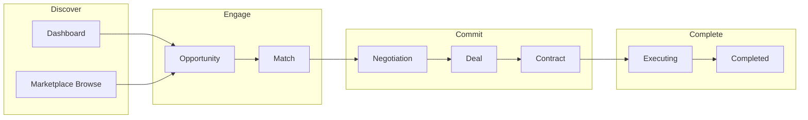

# PM-Twin UPX-1.6 — Product Experience Blueprint

| Field | Value |
|-------|-------|
| Phase | UPX-1.6 — Product Experience Blueprint |
| Status | **Specification** (no implementation) |
| Authority chain | UPX-1 Audit → [UPX-1.5 Enterprise UX Architecture](./PM-TWIN-UPX-1.5-ENTERPRISE-UX-ARCHITECTURE.md) → This document |
| Audience | Product, design, engineering, stakeholders |
| Date | July 2026 |

---

## Document purpose

This blueprint defines **what PM-Twin should feel like** before any UPX implementation sprint begins. It translates architecture (UPX-1.5) into product intent: personality, journeys, philosophies, and rules that every screen must express.

**This document does not authorize code changes.** Implementation follows scoped UPX phases with UI-only diffs.

---

# Product Vision

## Mission

PM-Twin is a **premium Enterprise SaaS collaboration platform** for the construction industry in Saudi Arabia and the wider GCC. It connects project managers, consultants, contractors, and companies through a governed marketplace-to-execution workflow — from opportunity discovery through matching, negotiation, deal, and contract completion.

The product must feel **modern, calm, professional, and trustworthy** — the digital equivalent of a well-run project office, not a back-office system.

## What we are building

A **collaboration command center** where users always know:

1. **What needs their attention right now**
2. **Where they are in the collaboration journey**
3. **What single action moves work forward**

## What we are not building

| Anti-pattern | Why we reject it |
|--------------|------------------|
| **ERP** | Users are not posting journal entries; they are advancing collaborations |
| **Excel** | Dense grids without narrative context destroy trust |
| **Admin dashboard** | Operators are a persona, not the product soul |
| **CRUD application** | Create/read/update/delete is infrastructure, not experience |

## Reference aesthetic (intent, not imitation)

| Reference | What we borrow |
|-----------|----------------|
| **Linear** | Focused density, one primary action, crisp hierarchy, fast keyboard paths |
| **Notion** | Progressive disclosure, calm whitespace, content blocks that breathe |
| **Stripe Dashboard** | Trust through precision — metrics that mean something, not decoration |
| **Atlassian** | Entity-linked workflows, activity timelines, cross-object navigation |
| **Monday.com** | Visual workflow status without carnival color; boards as orientation, not reporting |

## Strategic outcome

Users describe PM-Twin as: *"I always know what to do next."*

Not: *"I found the data somewhere in the system."*

---

# Product Personality

PM-Twin's personality is the emotional signature across every touchpoint.

## Core traits

| Trait | Expression in product |
|-------|---------------------|
| **Confident** | Clear recommendations, explicit lifecycle states, no ambiguous "pending" without context |
| **Focused** | One primary action per surface; attention queue before browse lists |
| **Fast** | Perceived speed via skeleton loading, optimistic UI feedback, keyboard shortcuts |
| **Professional** | Restrained typography, semantic color, no playful illustrations in workspace |
| **Minimal** | Remove chrome before removing content; every element earns its place |
| **Human** | Plain language, Saudi construction context, names and relationships over IDs |
| **Collaborative** | Multi-party visibility, participant rails, shared timelines |
| **Enterprise** | Audit trails, role clarity, VAT transparency, PDPL respect |

## Tone of voice

| Context | Tone | Example |
|---------|------|---------|
| Dashboard attention | Direct, urgent but calm | "Review new match — Al-Rashid Tower fit-out" |
| Marketplace browse | Exploratory, inviting | "Explore opportunities in Riyadh" |
| Lifecycle success | Affirming, brief | "Contract signed. Execution can begin." |
| Errors | Honest, recoverable | "We couldn't load negotiations. Try again." |
| Empty states | Guiding, never blaming | "No deals yet — accept a match to start." |
| Admin | Operational, precise | "3 users awaiting vetting" |

## Emotional register

```
Calm ──────────────────────────────► Urgent
         ↑ PM-Twin lives here
         (purposeful urgency, not alarm)

Sparse ──────────────────────────────► Dense
         ↑ Comfortable enterprise
         (not consumer-empty, not terminal-full)
```

## Personality anti-patterns

- **Alarmist** — red banners for non-blocking states
- **Cheerful consumer** — emoji, confetti, gamification badges
- **Bureaucratic** — form-number references, internal codes in primary UI
- **Passive** — walls of readonly data with no recommended action
- **Cryptic** — lifecycle jargon without plain-language parallel

---

# Experience Principles

Fifteen principles govern every authenticated page. These extend UPX-1.5 architectural principles with product intent.

### EP-1 — Attention before inventory

Show what needs action before showing what exists. Dashboard and detail pages lead with `PmActionHub`, not raw lists.

### EP-2 — One primary action

Every page, card, and hub item offers exactly one default (primary) forward action. Secondary paths and destructive actions defer to outline buttons or overflow menus.

### EP-3 — Entity first

Users scan **status → name → context → metadata → actions**. The entity identity is always the visual anchor.

### EP-4 — Context before actions

Users must understand *where they are in the journey* (`PmLifecycleMap`) before we ask them to act.

### EP-5 — Readable before dense

Default to comfortable enterprise density. Compact mode is an operator opt-in, not the default.

### EP-6 — Progressive disclosure

Advanced fields, technical IDs, audit metadata, and legal boilerplate live in disclosure sections or inspector rails — collapsed by default.

### EP-7 — Never overwhelm

If a surface would exceed governed limits (cards, buttons, badges, metrics), split into sections or route to a child view — never cram.

### EP-8 — Reduce cognitive load

One mental model per page: Browse *or* Decide *or* Orient *or* Configure. Never mix reporting with action on the same fold.

### EP-9 — Workspace and marketplace are moods, not layouts

"My Workspace" and "Marketplace" change language, defaults, and available actions — never grid structure, component choice, or density.

### EP-10 — Fail gracefully, recover obviously

Empty, loading, and error states are designed experiences with prescribed copy branches and recovery CTAs. Never a blank canvas.

### EP-11 — Trust through transparency

Financial fields show VAT (15%) explicitly. Status names are canonical lifecycle terms with plain-language descriptions available.

### EP-12 — Collaboration is multi-party

Surfaces show *who* is involved before *what* was agreed. Participant rails are first-class, not footnotes.

### EP-13 — Motion serves orientation

Animation confirms state change and draws attention to new items — never decorates or delays.

### EP-14 — Keyboard-first, touch-equal

Power users navigate without a mouse. Mobile users get parity via card fallbacks and 44px touch targets.

### EP-15 — Arabic and RTL are native

Arabic is not a translation layer. Layout, copy, dates, and numerals policy are designed for RTL from the start.

---

# User Experience Blueprint

## Platform mental model

```
┌─────────────────────────────────────────────────────────────┐
│                     MY WORKSPACE                            │
│  Command center — what needs me, what I own, what's next    │
├─────────────────────────────────────────────────────────────┤
│                     MARKETPLACE                             │
│  Discovery — explore people, companies, opportunities       │
├─────────────────────────────────────────────────────────────┤
│                     COLLABORATION FLOW                      │
│  Opportunity → Match → Negotiation → Deal → Contract → Done   │
├─────────────────────────────────────────────────────────────┤
│                     COMMUNICATION                           │
│  Notifications + Messages (shared, cross-cutting)           │
└─────────────────────────────────────────────────────────────┘
```

## Personas

| Persona | Primary goal | Primary surfaces |
|---------|--------------|------------------|
| **Company** | Source talent/partners, publish needs, close contracts | Dashboard, opportunities, matches, deals |
| **Professional** | Find work, respond to matches, negotiate terms | Dashboard, marketplace, matches, profile |
| **Administrator** | Operate platform, vet users, run matching, audit | Admin command center, queues, health |

---

# Journey Maps

## Company journey — login to completed contract

```
Login
  → Dashboard (My Workspace)
      "What needs attention" — drafts to publish, matches to review
  → Post Opportunity (wizard)
      Need/offer framework, readiness score, publish
  → Browse Matches (My Matches)
      Review discovered matches, scores, compatibility
  → Match Detail
      Accept match → confirm collaboration intent
  → Negotiation Detail
      Review terms, counter, agree
  → Deal Detail
      Review commercial terms, move to signing
  → Contract Detail
      Review scope, milestones, sign
  → Contract Active / Completed
      Execution phase; rate collaboration (future)
```

**Emotional arc:** Orient → Publish → Evaluate → Commit → Agree → Formalize → Complete

**Key moments of truth:**

| Moment | Experience requirement |
|--------|------------------------|
| First login | Dashboard explains workspace in <10 seconds |
| First publish | Readiness score guides completeness before publish |
| First match | Score explanation builds trust in matching |
| First negotiation | Timeline shows round history clearly |
| First signature | Contract summary is scannable; VAT explicit |

---

## Professional journey — login to completed contract

```
Login
  → Dashboard (My Workspace)
      Recommended matches, profile readiness prompt
  → Marketplace Browse
      Explore opportunities, filter by sector/location
  → Opportunity Detail
      Assess fit, apply or express interest
  → Match Detail (when matched)
      Accept, decline with reason, or negotiate
  → Negotiation Detail
      Counter terms, agree
  → Deal Detail
      Review and sign
  → Contract Detail
      Sign, track milestones
  → Completed
      Portfolio update, future recommendations
```

**Emotional arc:** Discover → Assess → Engage → Negotiate → Commit → Deliver

**Key moments of truth:**

| Moment | Experience requirement |
|--------|------------------------|
| Profile incomplete | Readiness card on dashboard, not blocking modal |
| Marketplace browse | Opportunities feel curated, not a job board dump |
| Application submitted | Clear status in pipeline, not silence |
| Match received | Action hub item with score context |
| Terms agreed | Plain summary before legal detail |

---

## Administrator journey — login to platform operation

```
Login (elevated role)
  → Admin Command Center
      Platform health, matching quality, vetting queue
  → Vetting Queue
      Review pending registrations, approve/reject
  → Matching Operations
      Run matching, review recent runs and scores
  → Entity Oversight (browse)
      Users, opportunities, negotiations, audit log
  → Entity Detail (when needed)
      Readonly account view, dispute context
  → Settings / Configuration
      Platform stubs, skills taxonomy (future)
```

**Emotional arc:** Assess health → Clear queues → Verify quality → Audit → Configure

**Key moments of truth:**

| Moment | Experience requirement |
|--------|------------------------|
| Admin entry | Clearly labeled Admin context — never confused with user workspace |
| Vetting decision | User profile summary scannable in <30 seconds |
| Matching run | Results explainable, not black-box |
| Audit review | Actor, action, timestamp — no hunting |

---

## Journey diagram (all personas — collaboration spine)



---

# Browse Philosophy

Browse is **discovery and comparison**, not data entry. Users arrive to answer: *"What exists that matters to me?"*

## Opportunities

**Feel:** Curated project board, not a classifieds dump.

| Aspect | Philosophy |
|--------|--------------|
| Default view | Card grid with ownership tabs (Marketplace / Mine / Company) |
| Card content | Title, location, need/offer type, status, readiness, primary action |
| Filtering | Ownership scope, status, search, active chips — never hidden in menus |
| Sorting | Relevance default; date and readiness as secondary |
| Empty | First-run guides to create; filtered offers clear-filters CTA |
| Marketplace mood | "Explore", "Available", discovery copy |
| Workspace mood | "My", "Draft", "Needs publish" copy |

**Not:** Spreadsheet of opportunities. **Not:** Infinite scroll without pagination on workspace views.

## Matches

**Feel:** Intelligent recommendations, not a contact list.

| Aspect | Philosophy |
|--------|--------------|
| Default view | My Matches — scored, actionable cards |
| Card content | Match score (with explanation), match type, counterparty, status, one action |
| Tabs | My Matches (active) / Recommended / Marketplace (preview until data exists) |
| Emotional tone | "This fit was calculated for you" — confidence, not mystery |
| Empty | Route to opportunities or profile readiness |

**Not:** Raw database rows. **Not:** Scores without explanation tooltip.

## People

**Feel:** Professional directory, not social network.

| Aspect | Philosophy |
|--------|--------------|
| Default view | Card list with avatar, name, role, sector, location |
| Scope | Professionals vs Companies filter |
| Discovery | Search + sector + entity type; no aggressive "connect" patterns |
| Profile click | Public profile — skills, experience, readiness, not activity feed |
| Privacy | PDPL-respecting — only public profile fields visible |

**Not:** LinkedIn clone. **Not:** Messaging-first discovery.

## Negotiations

**Feel:** Active conversations with momentum, not archived threads.

| Aspect | Philosophy |
|--------|--------------|
| Default view | Card grid — status-forward, "active" and "countered" visually distinct |
| Card content | Title, parties, round count, last updated, status badge |
| Sorting | Needs-action first, then recency |
| Empty | Route to matches — "Negotiations begin after a match is accepted" |
| Tone | Professional urgency — "Awaiting your response" not "URGENT!!!" |

**Not:** Email inbox metaphor. **Not:** Table without context.

## Deals & contracts (browse)

**Feel:** Execution pipeline, not accounting ledger.

| Aspect | Philosophy |
|--------|--------------|
| Default view | Table — homogeneous columns, comfortable density |
| Columns | Title, status, updated — max 4 visible before mobile card fallback |
| Tone | "My active agreements" not "Transaction records" |
| Empty | First-run CTA to matches or deals upstream |

---

# Detail Philosophy

Detail is **decision support**, not document storage. Users arrive to answer: *"What is this, where is it, what should I do?"*

## Guidance model (mandatory order)

```
1. Identity     — What is this entity?
2. Position     — Where am I in the lifecycle?
3. Recommendation — What is the single best next step?
4. Context      — Who is involved? What is linked?
5. Depth        — Terms, requirements, technical detail (disclosed)
6. History      — What happened? (timeline)
```

## Information visibility

| Tier | Visible by default | Examples |
|------|-------------------|----------|
| **T1 — Essential** | Always above fold | Title, status, primary action, lifecycle map |
| **T2 — Contextual** | Always on page, may scroll | Summary, participants, recommended action hub |
| **T3 — Operational** | First screen or one scroll | Commercial terms, requirements, related matches |
| **T4 — Advanced** | Collapsed disclosure | Technical IDs, framework metadata, audit fields |
| **T5 — Historical** | Timeline section | Round history, status changes, activity |

## When to collapse

Collapse (disclosure) when content is:

- **Technical** — IDs, internal codes, API-derived metadata
- **Verbose** — Legal clauses, full requirement lists >5 items
- **Historical** — Superseded versions, expired matches
- **Secondary** — Attachments placeholder, export options
- **Rarely needed** — Less than 20% of sessions access it

Keep expanded when content is:

- **Decision-critical** — Terms being negotiated, signature blockers
- **Status-defining** — Current lifecycle step, participant roles
- **Action-enabling** — The one thing user must read to click primary CTA

## Detail emotional tone

- **Calm authority** — the page knows the state and recommends action
- **No wall of fields** — readonly forms are sectioned, not dumped
- **Inspector for action** — mutations live in right rail, not scattered buttons
- **Timeline for trust** — activity log proves the platform tracked the journey

---

# Dashboard Philosophy

> **Dashboard is not reporting. Dashboard is a command center.**

## What belongs on the dashboard

| Belongs | Does not belong |
|---------|-----------------|
| What needs attention now (action hub) | Historical analytics charts |
| Linked KPI strip (5 counts max) | Full browse lists |
| Active workflow summary (≤5 items) | Export/download tools |
| Blocked items needing decision | Admin platform metrics |
| Top recommendations (≤3) | Configuration settings |
| Recent notifications (≤5) | Detailed audit logs |
| Single next-action prompt | Duplicate CTAs from nav |

## Dashboard hierarchy (fixed order)

```
1. Greeting + hero metric (readiness OR active workflow count)
2. Primary + secondary page actions (Post opportunity / Open pipeline)
3. KPI strip — linked to filtered browse pages
4. Action hub — max 5 items needing response
5. Active workflows — negotiations, deals in progress
6. Blocked — declined/expired/stalled items
7. Recommendations — top marketplace matches
8. Notifications digest (sidebar or section)
```

## Dashboard emotional intent

User opens dashboard and within **5 seconds** can answer:

- *"Do I need to do something right now?"*
- *"How much is in flight?"*
- *"Where do I go next?"*

## Pipeline (/pipeline) relationship

Pipeline is a **power-user workflow board** — kanban orientation for opportunities, matches, and applications. It is a dashboard *variant*, not a separate product. It shares dashboard philosophy: attention and stage, not reporting.

## Admin dashboard (/admin)

Same command center philosophy with **platform health** metrics:

- Vetting queue depth
- Matching quality indicators
- Recent audit entries
- Quick actions: run matching, review vetting, open audit

Not: user analytics vanity charts.

---

# Information Density

## Comfortable density definition

**Comfortable enterprise density** = a user can scan a surface in **≤3 seconds** and identify: status, name, and primary action.

## Hard limits (product level)

| Element | Maximum | Rationale |
|---------|---------|-----------|
| Cards per browse page (visible) | **12** per page (paginated) | Prevents scroll fatigue |
| Cards per dashboard section | **5** | Command center, not inventory |
| Primary buttons per surface | **1** | Decision clarity |
| Secondary buttons per surface | **1** | + overflow for rest |
| Visible buttons per card | **3** (incl. overflow trigger) | Touch and cognitive limit |
| Badges in page header | **4** | Status noise threshold |
| KPI / metric cells per strip | **5** | Stripe-dashboard parity |
| Stat grid columns | **3** | Scan without grid lock |
| Table visible columns | **6** | Excel threshold |
| Hierarchy depth | **3** levels | Page → section → disclosure |
| Action hub items | **5** | Attention budget |
| Timeline events (initial) | **50** | Performance + relevance |
| Metadata lines per card subtitle | **3** | Card scan limit |
| Filter chips visible | **8** before "clear all" prominence | Filter overwhelm |

## Density modes

| Mode | When | Audience |
|------|------|----------|
| **Comfortable** (default) | All workspace browse, detail, dashboard | All users |
| **Compact** | Admin tables, audit logs | Operators opt-in |
| **Never dense** | Marketing, onboarding, first-run | — |

---

# Interaction Philosophy

## Scrolling

- **Page scroll** is the default — no nested scroll traps except table body and board columns
- Sticky: app header + optional inspector header — never double-sticky (header + toolbar)
- Scroll reveals sections; critical actions remain reachable via page header or action hub
- Infinite scroll: **not used** on workspace browse — pagination preserves orientation

## Searching

| Search type | Behavior |
|-------------|----------|
| **Global** (header) | Cross-entity command palette; groups by type; min 2 chars |
| **Page-local** | Filters current browse set; 300ms debounce; instant on clear |
| **Detail** | No page search — navigate via workflow links |

Search results answer *"find the entity"* not *"find the field inside the entity."*

## Filtering

- Filters are **visible affordances** — tabs, selects, chips — not hidden "advanced" drawers unless >3 controls on mobile
- Active filters always show as **removable chips**
- "Clear all" when ≥2 chips active
- Filters reset pagination to page 1
- Ownership scope (Marketplace / Mine / Company) is a **first-class tab**, not buried

## Sorting

- Tables: column header sort with aria announcement
- Cards: sort via toolbar dropdown (recency, status, score) — max 3 options
- Default sort: **needs-action first**, then recency

## Bulk actions

- **Future capability** — not MVP dashboard clutter
- When introduced: selection mode replaces toolbar; one primary bulk action; rest in overflow
- Bulk never on detail pages

## Empty states

Three branches — never conflate:

| Branch | User mind-set | Experience |
|--------|---------------|------------|
| **First-run** | "I'm new here" | Warm illustration optional; clear CTA to first value action |
| **Filtered empty** | "My filters are too tight" | "No results" + clear filters |
| **Error** | "Something broke" | Retry + support path |

Empty states **guide**, never blame ("You have no data" → "No deals yet — accept a match to start").

## Loading

- **Skeleton** over spinners for lists and cards
- Header and toolbar render immediately; results area skeletons
- Perceived performance target: interactive shell **<200ms**; content **<1s** on good connection
- No full-page blocking loader except initial app shell auth

## Error handling

| Severity | Pattern |
|----------|---------|
| **Recoverable** | Inline error card with retry in place |
| **Permission** | `EntityAccessDenied` with back navigation |
| **Not found** | Empty state with link to browse parent |
| **Form validation** | Field-level inline; form banner for submit failure |
| **Destructive failure** | Toast + unchanged state; never silent fail |

Errors are **honest and brief** — no error codes in primary UI.

---

# Visual Philosophy

## Emotion

Visual design evokes **quiet confidence**:

- Muted surfaces, semantic accents only for status and primary actions
- Entity tones (`opportunity`, `match`, `deal`, etc.) via header gradient — subtle, not categorical rainbow
- Success is green; warning is amber; danger is red — never decorative palette sprawl
- White space signals premium — crowding signals cheap SaaS

## Spacing

- Generous section gaps (`pm-section-gap`) between major blocks
- Card interiors breathe (`pm-card-padding`)
- Toolbar separated from results by consistent gap
- **Rule:** If unsure, add space — density is added intentionally, not by default

## Motion

| Use motion | Do not use motion |
|------------|-------------------|
| Page enter (subtle fade/slide) | Bouncing elements |
| List item add/remove | Parallax scrolling |
| Toast enter/exit | Decorative background animation |
| Skeleton pulse | Loading spinners on large areas |
| Drawer/sheet open | Auto-playing carousels |

All motion respects `prefers-reduced-motion`. No essential information in motion-only cues.

## Animations

- Duration: **150–250ms** for UI feedback; **300ms** max for layout transitions
- Easing: ease-out for enter, ease-in for exit
- Stagger: max **50ms** between list items — subtle, not theatrical
- Marketing pages may use richer motion; authenticated workspace stays restrained

## Icons

- **Lucide** library only — consistent stroke weight
- Icons **annotate**, never replace labels on primary actions
- Entity icons consistent in nav, cards, and empty states
- Decorative icons: `aria-hidden`
- Icon-only buttons: require `aria-label`

## Illustrations

| Context | Policy |
|---------|--------|
| Authenticated empty states | Optional simple line illustration — max 1 per first-run empty |
| Dashboard | No illustrations — data and action |
| Marketing | Allowed — construction-abstract, not clip art |
| Error states | Icon only, not illustration |
| Onboarding | Future — step illustrations allowed |

**Never:** Cartoon characters, emoji-as-icons, stock photo heroes in workspace.

## Cards

- **Rounded-2xl**, subtle elevation (`pm-shadow-card`)
- Interactive cards: hover lift on desktop only
- One primary action per card footer
- Status badge position consistent per entity type
- Cards are **identity surfaces** — title is always a link to detail

## Tables

- Tables are **comparison instruments**, not default browse
- Comfortable row height default; compact admin-only
- Sticky header on scroll
- Mobile: **always** card fallback — no horizontal scroll tables on phone
- Row click → detail; row actions → secondary only

---

# Content Philosophy

## Writing principles

1. **Plain language first** — lifecycle terms paired with human description where needed
2. **Active voice** — "Review match" not "Match is to be reviewed"
3. **Specific** — "3 negotiations need your response" not "You have items"
4. **Saudi context** — SAR, VAT, cities, sectors without stereotyping
5. **Brevity** — headlines ≤8 words; descriptions ≤25 words
6. **No internal jargon** — command names, repository terms, seed references never in UI

## Content hierarchy

```
Label (overline)     →  Marketplace / My Workspace / Admin
Title (h1)           →  Page subject
Description          →  One sentence purpose
Metric               →  Single hero number
Body                 →  Section content
Caption              →  Meta, timestamps
```

## Entity naming

- Use **display titles** from entity display helpers — not raw IDs in headlines
- IDs available in disclosure / copy-to-clipboard — not primary label
- People: name + role; Companies: company name + sector

## Legal and financial content

- VAT (15%) labeled on all financial fields
- Currency: **SAR** explicit
- Contract clauses: summary in main column; full text in disclosure
- PDPL: data handling referenced in settings; minimal data on public profiles

---

# Microcopy Philosophy

## Button labels

| Pattern | Example | Avoid |
|---------|---------|-------|
| Verb + object | "Review match", "Publish opportunity" | "Submit", "OK", "Continue" (without context) |
| Forward lifecycle | "Move to signing" | "Update status" |
| Recovery | "Try again", "Clear filters" | "Click here" |

## Status labels

- Use **canonical lifecycle names** from `@pm-twin/lifecycle`
- Badge text: title case, ≤2 words where possible
- Tooltip: plain-language explanation ("Discovered — waiting for your response")

## Notifications

- Structure: **What happened** + **entity name** + **implicit action**
- Example: "New match for Riyadh Tower fit-out — review compatibility"
- Not: "Match ID mat_0042 created"

## Empty state copy formula

```
[What is empty] + [Why it might be empty] + [What to do next]
```

Example: "No negotiations yet. Negotiations begin after you accept a match. Review your matches."

## Confirmation dialogs

- Title: action as question — "Sign this contract?"
- Body: consequence in one sentence — "This activates the agreement for all parties."
- Primary: confirm verb — "Sign contract"
- Secondary: "Cancel" — never "No"

## Admin microcopy

- Operational tone — no marketing language
- Queue labels: "In queue", "Awaiting review"
- Audit: "{Actor} {action} {entity} at {time}"

---

# Enterprise UX Rules

Consolidated rules for authenticated product. Full limits in [UPX-1.5](./PM-TWIN-UPX-1.5-ENTERPRISE-UX-ARCHITECTURE.md).

## Structural rules

1. Every page uses `PmPage` + `PmPageHeader` inside `AppShell`
2. Browse pages use `PmBrowseToolbar` in `toolbar` slot
3. Detail pages use `PmDetailLayout` for workflow entities
4. One `h1` per page
5. No parallel button/badge/empty-state systems

## Action rules

6. Max 1 primary button per surface
7. No duplicate CTA in header and inspector
8. Destructive actions require confirmation dialog
9. Overflow for >2 actions per surface

## Data presentation rules

10. Tables only for homogeneous compare lists
11. Cards mandatory for identity-rich browse
12. Scores always have explanation affordance
13. Financial fields show VAT
14. Lifecycle status via `PmWorkflowBadge` only

## Navigation rules

15. Breadcrumbs reflect workspace / marketplace / admin context
16. Access denied returns to entity browse route
17. Dashboard KPIs link to filtered browse — not dead numbers

## Governance rules

18. No raw colors outside tokens
19. No shadcn primitives in page files
20. PR checklist required for archetype compliance

---

# Product Identity Rules

From [PM-TWIN-PRODUCT-IDENTITY.md](./PM-TWIN-PRODUCT-IDENTITY.md) — experience expression layer.

## Domain language

| Domain | Label | Verbs | Nouns |
|--------|-------|-------|-------|
| **My Workspace** | "My Workspace" | My, Review, Respond, Sign, Publish | My opportunities, my matches, my deals |
| **Marketplace** | "Marketplace" | Explore, Discover, Browse, Find | Available, recommended, latest |
| **Admin** | "Admin" | Review, Approve, Run, Audit | Queue, platform, operators |

## Ownership badges (opportunities)

Display order on cards: **Ownership → Need/Offer → Status → Action**

| Badge | Meaning |
|-------|---------|
| Marketplace | Published by others |
| Mine | Created by signed-in user |
| Company | Same org, different creator |

## Match views

| Tab | Language | State |
|-----|----------|-------|
| My Matches | "Assigned to you" | Active |
| Recommended | "Top fits for you" | Active |
| Marketplace Matches | "Explore all matches" | Preview until dataset exists |

## Navigation identity

- Sidebar groups: **My Workspace**, **Marketplace**, **Communication**, **Admin** (guarded)
- Pipeline retained for power users — not primary nav label
- Route state (`domain`, `ownershipScope`, `matchView`) sets presentation defaults without URL changes

## Visual identity per domain

| Domain | Header tone | Copy register |
|--------|-------------|---------------|
| Workspace | Execution | Direct, owned, action-oriented |
| Marketplace | Discovery | Open, exploratory |
| Admin | Operational | Precise, neutral |

## Identity anti-patterns

- Mixing "My" and "Browse" on the same page header
- Marketplace language on workspace dashboard
- Hiding ownership scope — user must always know whose data they see

---

# Accessibility

## Keyboard first

| Area | Requirement |
|------|-------------|
| Focus order | Sidebar → header → page → toolbar → main → inspector |
| Skip link | "Skip to main content" on every page |
| Shortcuts | `/` focuses global search; `?` opens shortcut help (future) |
| Modals | Focus trap; Escape closes; return focus on close |
| Tables | Sortable headers keyboard operable |

## Screen readers

- One `h1` per page; logical heading order
- `aria-live="polite"` on filter result count changes
- Table captions or `aria-label`
- Icon-only buttons labeled
- Status never color-only — badge includes text
- Timeline events as list with accessible labels

## RTL

- Logical CSS properties throughout
- Directional icons flip; symmetric icons do not
- Breadcrumb order mirrors
- Page header accent on `start` edge

## Arabic

- All authenticated strings in i18n keys (`ar`, `en`)
- Body line-height +2% for Arabic scripts
- Hijri date preferred with Gregorian secondary
- Western Arabic numerals (0–9) for IDs/currency unless user preference adds Eastern Arabic numerals
- QA gate: every template tested in `ar` + RTL before release

## Mobile

- Touch targets ≥ **44×44px**
- Tables → card list fallback
- Page actions stack full-width
- Filters in sheet when >3 controls
- No hover-only affordances

## Compliance targets

- WCAG 2.1 **AA** minimum
- axe CI: **0 critical** violations on authenticated templates
- PDPL: minimal PII on public surfaces; consent in registration

---

# Success Metrics

## Experience outcomes (qualitative)

| Metric | Target | Method |
|--------|--------|--------|
| "I know what to do next" | ≥80% agree | User survey |
| Time to first action after login | ≤30 seconds | Session analytics |
| Browse → detail task completion | −15% vs baseline | Usability study |
| Empty state CTA click-through | ≥25% first-run | Analytics |

## Consistency outcomes (quantitative)

| Metric | Baseline (UPX-1) | Target |
|--------|------------------|--------|
| Design consistency score | 58/100 | **≥85/100** |
| Browse template adoption | 2/8 | **8/8** |
| Detail layout adoption | 5/8 | **8/8** |
| Primary button violations | Unknown | **0** |
| Governance violations | 0 | **0** |
| RTL template coverage | 0% | **100%** |
| Arabic string coverage | 0% | **100%** authenticated |

## Trust outcomes

| Metric | Target |
|--------|--------|
| Match score explanation views | ≥40% of match detail sessions |
| Error recovery success (retry) | ≥70% |
| Support tickets: "can't find X" | −30% post-UPX |

## Performance perception

| Metric | Target |
|--------|--------|
| Shell interactive | <200ms |
| Browse content visible | <1s (P75) |
| Skeleton perceived wait | <3s before error state |

---

# Future Evolution Strategy

## Near-term (UPX 2–3)

| Initiative | Experience impact |
|------------|-------------------|
| Browse unification | All list pages feel identical |
| Detail layout completion | Profile and admin detail match workflow quality |
| Public/marketing convergence | Acquisition → product visual continuity |
| Auth shell unification | Login matches register quality |
| i18n + Arabic RTL | KSA-native product |

## Medium-term

| Initiative | Experience impact |
|------------|-------------------|
| Marketplace match browse | Enable preview tab with real cross-marketplace data |
| Map integration | Geo discovery for opportunities |
| Bulk actions | Operator efficiency without browse clutter |
| URL-persisted filters | Shareable filtered views |
| Shortcut system | Power-user keyboard map |
| Hijri-primary date mode | User preference |

## Long-term

| Initiative | Experience impact |
|------------|-------------------|
| Company workspace dashboard | Multi-user org orientation |
| Trending / analytics feeds | Marketplace vitality without dashboard bloat |
| In-app messaging (live) | Replace mock threads |
| Collaboration rating | Post-contract feedback loop |
| AI-assisted next action | Action hub suggestions (governed, explainable) |
| Dedicated `/discover` hub | Marketplace landing without backend split |

## Evolution principles

1. **Never add reporting to dashboard** — analytics get dedicated surfaces
2. **Never split design systems** — new features use existing archetypes
3. **Preview → active** — preview badges removed when data exists, not hidden
4. **Workspace+ for new roles** — new personas extend templates, not fork them
5. **Measure before redesign** — success metrics gate each UPX phase

---

# Appendix A — Page archetype quick reference

| Archetype | Question it answers | Primary emotion |
|-----------|---------------------|-----------------|
| Dashboard | What needs me? | Oriented urgency |
| Browse | What exists? | Curated discovery |
| Detail | What is this and what next? | Confident decision |
| Settings | How do I configure myself? | Calm control |
| Admin | How is the platform? | Operational clarity |

---

# Appendix B — Related documents

| Document | Role |
|----------|------|
| [UPX-1.5 Enterprise UX Architecture](./PM-TWIN-UPX-1.5-ENTERPRISE-UX-ARCHITECTURE.md) | Layout, components, governance limits |
| [PM-TWIN-UX-ARCHITECTURE-AUDIT.md](./PM-TWIN-UX-ARCHITECTURE-AUDIT.md) | UPX-1 audit findings |
| [PM-TWIN-DESIGN-LANGUAGE.md](./PM-TWIN-DESIGN-LANGUAGE.md) | Practitioner token reference |
| [PM-TWIN-PRODUCT-IDENTITY.md](./PM-TWIN-PRODUCT-IDENTITY.md) | Workspace vs marketplace language |
| [DESIGN-GOVERNANCE-BASELINE.md](../design/DESIGN-GOVERNANCE-BASELINE.md) | Enforcement |

---

# Document control

| Version | Date | Change |
|---------|------|--------|
| 1.0 | July 2026 | Initial UPX-1.6 Product Experience Blueprint |

**No implementation authorized by this document alone.**
