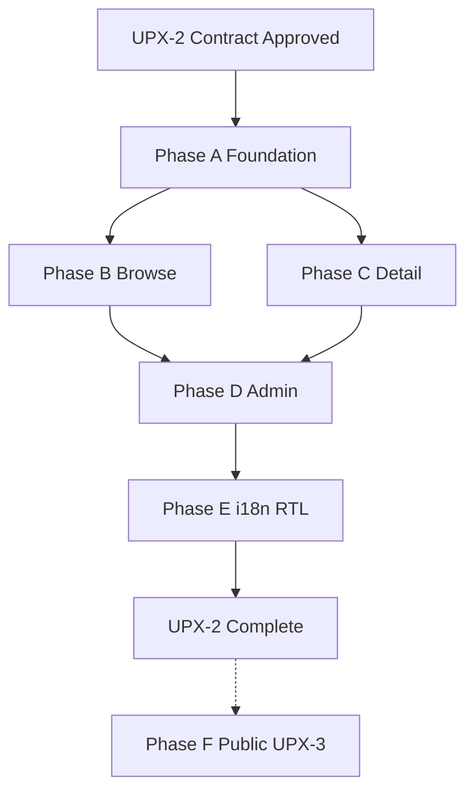

# PM-Twin UPX-2 — Implementation Contract

| Field | Value |
|-------|-------|
| Phase | UPX-2 — Implementation Contract |
| Status | **Governance** — authorizes UPX implementation upon approval |
| Type | Final pre-implementation contract |
| Authority chain | UPX-1 Audit → UPX-1.5 Architecture → UPX-1.6 Blueprint → **This document** |
| Audience | Engineering, design, product, reviewers |
| Date | July 2026 |

---

## 1. Contract purpose

This document is the **binding implementation contract** for the Unified Product Experience (UPX) program. It defines:

- What implementation **is authorized** to change
- What implementation **must never** change
- How work is **phased, reviewed, tested, and accepted**
- When a phase is **done**

**Upon approval of this contract**, scoped UPX implementation may begin. No UPX code work should start before this document is accepted.

This contract does **not** contain implementation code. It governs how implementation proceeds.

---

## 2. Authoritative references

| Document | Role |
|----------|------|
| [PM-TWIN-UX-ARCHITECTURE-AUDIT.md](./PM-TWIN-UX-ARCHITECTURE-AUDIT.md) | UPX-1 baseline (58/100 consistency) |
| [PM-TWIN-UPX-1.5-ENTERPRISE-UX-ARCHITECTURE.md](./PM-TWIN-UPX-1.5-ENTERPRISE-UX-ARCHITECTURE.md) | Layout, components, limits, templates |
| [PM-TWIN-UPX-1.6-PRODUCT-EXPERIENCE-BLUEPRINT.md](./PM-TWIN-UPX-1.6-PRODUCT-EXPERIENCE-BLUEPRINT.md) | Personality, journeys, philosophies |
| [PM-TWIN-DESIGN-LANGUAGE.md](./PM-TWIN-DESIGN-LANGUAGE.md) | Token and primitive usage |
| [PM-TWIN-PRODUCT-IDENTITY.md](./PM-TWIN-PRODUCT-IDENTITY.md) | Workspace vs marketplace language |
| [DESIGN-GOVERNANCE-BASELINE.md](../design/DESIGN-GOVERNANCE-BASELINE.md) | Enforcement rules |
| [runtime-ownership.md](../runtime-ownership.md) | `web/` authority, POC freeze |

**Conflict resolution:** UPX-1.6 (product intent) → UPX-1.5 (architecture) → DESIGN-LANGUAGE (tokens) → code. Product cannot override hard limits in UPX-1.5 without a documented exception (§12).

---

## 3. Immutable boundary (never change in UPX)

The following are **out of scope** for every UPX phase and PR. Violations **block merge**.

| Domain | Paths / systems | Reason |
|--------|-----------------|--------|
| **Business logic** | Command handlers, domain services | UPX is presentation-only |
| **Lifecycle** | `packages/lifecycle/`, manifest, state names | Canonical vocabulary |
| **Commands** | `packages/commands/`, command gateway contracts | API surface frozen |
| **Repositories** | `web/src/repositories/`, persistence | Data layer frozen |
| **APIs** | `web/src/api/` behavior | No new endpoints for UI polish |
| **Routing** | `web/src/routes.tsx`, route paths | URLs stable for users and tests |
| **Permissions / RBAC** | `domain/rbac/`, route guards logic | Security frozen |
| **Matching** | `packages/matching/`, matching-service | Engine frozen |
| **Seed data semantics** | `POC/data/` business meaning | Seed edits only when copy/labels require no logic change |
| **POC product logic** | `POC/src/` new features | Frozen per runtime ownership |

### Allowed presentation changes

| Allowed | Examples |
|---------|----------|
| Layout composition | `PmPage`, `PmDetailLayout`, toolbar slot |
| Component extraction | `PmWorkflowLinksCard`, `PmBrowsePage` wrapper |
| Copy / microcopy | Headers, empty states, button labels |
| CSS / tokens | Spacing, typography, elevation |
| UI-only filtering/sorting | Client-side search already on pages |
| Empty/loading/error UI | `resolveListEmptyState` branches |
| Accessibility attributes | `aria-*`, focus order, skip links |
| i18n key extraction | String externalization (Phase E) |
| Screenshot / test updates | Reflecting visual changes |

### Gray zone (requires exception)

| Change | Rule |
|--------|------|
| New props on domain components | Allowed if presentation-only, no behavior change |
| Moving filter state between parent/child | Allowed if same UX outcome, no new data sources |
| `product-identity.ts` copy defaults | Allowed; no route or permission changes |
| Feature flags for template swap | Allowed with ticket + removal date |

---

## 4. Implementation authorization

### 4.1 What this contract authorizes

Upon approval, the team may implement **UPX Phases A–E** (authenticated product) and prepare **UPX-3** (public convergence) as a separate program.

### 4.2 What this contract does not authorize

- Backend or API work
- New product features (messaging live, map geo, bulk actions) — track as post-UPX
- Routing restructure
- Lifecycle or command additions
- POC/src business logic

### 4.3 Success definition (program complete)

| Metric | Baseline | Target |
|--------|----------|--------|
| Design consistency score | 58/100 | **≥85/100** |
| Browse template adoption | 2/8 | **8/8** |
| Detail `PmDetailLayout` adoption | 5/8 | **8/8** |
| Toolbar placement patterns | 3 | **1** |
| `resolveListEmptyState` compliance | ~60% | **100%** browse pages |
| Primary button violations | — | **0** |
| `validate:design:strict` | 0 violations | **0** |
| Authenticated RTL template QA | 0% | **100%** |
| Arabic i18n coverage (authenticated) | 0% | **100%** |

---

## 5. Program structure

```
UPX-2 (this contract) — Authenticated product
├── Phase A — Foundation primitives
├── Phase B — Browse unification
├── Phase C — Detail completion
├── Phase D — Admin parity
└── Phase E — i18n / RTL / Arabic

UPX-3 (separate contract) — Public / marketing convergence
└── Phase F — Legacy POC → marketing tokens, auth shell
```

Phases are **sequential by default**. Phase B may start when Phase A merges. Phase E may run parallel sub-streams (i18n extraction vs RTL QA) after Phase D.

---

## 6. Phase specifications

### Phase A — Foundation primitives

| Field | Value |
|-------|-------|
| **ID** | `upx/phase-a-foundation` |
| **Priority** | P0 |
| **Risk** | Low |
| **Est. files** | ~12 |
| **Depends on** | Contract approval |

#### Deliverables

| # | Deliverable | Type |
|---|-------------|------|
| A1 | `PmBrowsePage` layout wrapper (composition only) | New component |
| A2 | `PmBrowseToolbar` documented alias / wrapper for toolbar slot | New component |
| A3 | `PmWorkflowLinksCard` extracted from 4 detail pages | New component |
| A4 | Standardize `EntityAccessDenied` `backHref` → entity browse routes | Page edits |
| A5 | Standardize action hub copy: "Recommended next step" everywhere | Copy |
| A6 | Export new primitives from `pm-layout-index` / `pm-index` | Index |
| A7 | Unit tests for new wrappers (render, slots) | Tests |
| A8 | Update DESIGN-LANGUAGE with `PmBrowsePage` reference | Docs |

#### Files in scope

```
web/src/components/layout/pm-browse-page.tsx          (new)
web/src/components/ui/pm-workflow-links-card.tsx      (new)
web/src/pages/workspace/pipeline-pages.tsx            (extract + backHref)
web/src/pages/workspace/deals-pages.tsx               (extract + backHref)
web/src/pages/workspace/contracts-pages.tsx           (extract + backHref)
web/src/pages/workspace/opportunity-detail-page.tsx   (copy only)
web/src/components/layout/pm-layout-index.ts
web/src/components/ui/pm-index.ts
docs/ui/PM-TWIN-DESIGN-LANGUAGE.md                    (append only)
```

#### Acceptance criteria

- [ ] All 4 workflow detail pages use `PmWorkflowLinksCard`
- [ ] Negotiation access denied `backHref` → `/negotiations` (not `/pipeline`)
- [ ] `PmBrowsePage` renders `PmPage` + toolbar slot + children with no data logic
- [ ] `npm run validate:design:strict` passes
- [ ] `npm run type-check` passes
- [ ] `npm test` passes
- [ ] No changes to `routes.tsx`, `packages/`, `repositories/`, command handlers

#### PR strategy

- **PR-A1:** A3 + A4 + A5 (workflow links + backHref + copy) — 1 PR
- **PR-A2:** A1 + A2 + A6 + A7 (browse template primitives) — 1 PR

---

### Phase B — Browse unification

| Field | Value |
|-------|-------|
| **ID** | `upx/phase-b-browse` |
| **Priority** | P1 |
| **Risk** | Medium (visual, many pages) |
| **Est. files** | ~25 |
| **Depends on** | Phase A merged |

#### Deliverables

| # | Deliverable | Pages |
|---|-------------|-------|
| B1 | Migrate to `PmBrowsePage` + toolbar in `toolbar` slot | Opportunities, Negotiations |
| B2 | Normalize toolbar placement | Deals, Contracts, People, Matches |
| B3 | `resolveListEmptyState` on Negotiations | `negotiations-pages.tsx` |
| B4 | Consistent pagination policy documentation in code comments | Browse pages |
| B5 | Mobile card fallback verification | Deals, Contracts (already); verify others |
| B6 | Section components: toolbar props cleanup | `people-list-section`, `matches-list-section` |

#### Files in scope

```
web/src/pages/workspace/opportunities-pages.tsx
web/src/pages/workspace/pipeline-pages.tsx          (negotiations + matches)
web/src/pages/workspace/deals-pages.tsx
web/src/pages/workspace/contracts-pages.tsx
web/src/pages/workspace/people-pages.tsx
web/src/components/collaboration/matches-list-section.tsx
web/src/components/user/people-list-section.tsx
web/src/components/user/notifications-list-section.tsx  (toolbar only if needed)
```

#### Acceptance criteria

- [ ] **8/8** browse routes use `PmPage` `toolbar` slot (not embedded-only toolbars)
- [ ] Opportunities + Negotiations wrapped in `PmBrowsePage`
- [ ] Negotiations uses `resolveListEmptyState` (first-run / filtered / error)
- [ ] No duplicate filter state binding in People (parent OR child owns state, not both)
- [ ] Screenshot or visual QA checklist completed per entity (opp, match, neg, deal, contract, people)
- [ ] Browse consistency score ≥70/100 on re-audit

#### PR strategy

- **PR-B1:** Opportunities browse — 1 PR
- **PR-B2:** Negotiations browse — 1 PR
- **PR-B3:** Deals + Contracts toolbar slot — 1 PR
- **PR-B4:** People + Matches toolbar — 1 PR

**Max 4 files per PR** where possible; never all browse pages in one PR.

---

### Phase C — Detail completion

| Field | Value |
|-------|-------|
| **ID** | `upx/phase-c-detail` |
| **Priority** | P2 |
| **Risk** | Low |
| **Est. files** | ~15 |
| **Depends on** | Phase A merged (B need not complete) |

#### Deliverables

| # | Deliverable | Pages |
|---|-------------|-------|
| C1 | `PmDetailLayout` for person profile | `PersonProfilePage` |
| C2 | `PmDetailLayout` for admin user detail | `AdminUserDetailPage` |
| C3 | Admin negotiation detail → governed coming-soon | `AdminNegotiationDetailPage` |
| C4 | Deal rate page → settings/wizard template | `DealRatePage` |
| C5 | Public profile: inspector rail for metadata | `public-profile-view.tsx` |
| C6 | Detail guidance order verified on all workflow details | Match, neg, deal, contract, opportunity |

#### Acceptance criteria

- [ ] **8/8** detail routes use `PmDetailLayout` OR documented exception with inspector-equivalent
- [ ] Person profile has identity header + main + optional rail
- [ ] Admin negotiation detail uses `PmEmptyState` coming-soon variant, not blank paragraph
- [ ] Deal rate uses `PmFormWizard` or `PmSettingsPage` pattern — not orphan single card
- [ ] Detail re-audit score ≥80/100 on workflow cluster

#### PR strategy

- **PR-C1:** Person profile detail layout
- **PR-C2:** Admin user detail + admin negotiation stub
- **PR-C3:** Deal rate template alignment

---

### Phase D — Admin parity

| Field | Value |
|-------|-------|
| **ID** | `upx/phase-d-admin` |
| **Priority** | P6 |
| **Risk** | Low |
| **Est. files** | ~8 |
| **Depends on** | Phase B recommended (shared browse patterns) |

#### Deliverables

| # | Deliverable |
|---|-------------|
| D1 | All admin pages: `label="Admin"` in header OR breadcrumb Admin context |
| D2 | Admin user detail, settings, negotiation detail: Admin label consistency |
| D3 | Placeholder pages: `PmTableEmpty` / `PmEmptyState` `coming-soon` variant |
| D4 | Consortium list: `getRowHref` or explicit "no detail" empty action |
| D5 | Admin vetting retains `label="Queue"` but breadcrumb shows Admin |
| D6 | Admin reports: label as preview/demo if hardcoded metrics remain |

#### Acceptance criteria

- [ ] 100% admin pages pass Admin context checklist (§9.2)
- [ ] Zero blank stub pages
- [ ] `validate:design:strict` passes

#### PR strategy

- **PR-D1:** Admin label + breadcrumb consistency (single PR, `admin-pages.tsx` focused)

---

### Phase E — i18n / RTL / Arabic

| Field | Value |
|-------|-------|
| **ID** | `upx/phase-e-i18n-rtl` |
| **Priority** | P7 |
| **Risk** | High (cross-cutting) |
| **Est. files** | ~40+ |
| **Depends on** | Phases A–D complete |

#### Deliverables

| # | Deliverable |
|---|-------------|
| E1 | i18n infrastructure for `web/` (if not present) or extend existing |
| E2 | Extract authenticated UI strings to `en` + `ar` keys |
| E3 | RTL layout QA on all page templates |
| E4 | Hijri date display component (presentation) |
| E5 | Arabic typography line-height adjustment per blueprint |
| E6 | Locale switcher in settings (presentation only) |
| E7 | RTL screenshot regression set |

#### Acceptance criteria

- [ ] 100% authenticated template strings in i18n keys
- [ ] Manual QA: Dashboard, Browse, Detail, Settings in `ar` + `dir=rtl`
- [ ] No hardcoded LTR physical properties in page files (`ml-`, `pl-`, `left-`, `right-`)
- [ ] Hijri shown as preferred with Gregorian secondary (per blueprint)
- [ ] axe: 0 critical on authenticated templates in both locales

#### PR strategy

- **PR-E1:** i18n infrastructure + extraction tooling
- **PR-E2–E5:** One archetype per PR (Browse strings, Detail strings, Dashboard, Admin, Settings)
- **PR-E6:** RTL fixes from QA findings
- **PR-E7:** Hijri date component

**Phase E is the only phase allowed to touch copy keys broadly.** Earlier phases use English strings that E will extract.

---

### Phase F — Public convergence (UPX-3)

| Field | Value |
|-------|-------|
| **ID** | `upx/phase-f-public` |
| **Program** | **UPX-3** — requires separate contract amendment |
| **Scope** | Public/marketing/auth pages |
| **Not authorized by UPX-2 alone** | See §4.2 |

Listed for continuity. Do not start Phase F under UPX-2 without UPX-3 contract.

---

## 7. Pull request contract

### 7.1 Branch naming

```
upx/phase-{a|b|c|d|e}-{short-description}
```

Examples: `upx/phase-a-workflow-links-card`, `upx/phase-b-negotiations-browse`

### 7.2 PR title format

```
upx({phase}): {imperative summary}
```

Examples: `upx(phase-a): extract PmWorkflowLinksCard`, `upx(phase-b): unify negotiations browse toolbar`

### 7.3 PR size limits

| Limit | Value |
|-------|-------|
| Max files changed | **15** per PR (excluding lockfiles) |
| Max lines changed | **800** per PR (excluding snapshots) |
| Max pages per PR | **2** page files |
| Max archetypes per PR | **1** |

Exceeding limits requires **PR exception** (§12).

### 7.4 Mandatory PR description sections

```markdown
## UPX phase
Phase {A|B|C|D|E} — {deliverable IDs e.g. A3, A4}

## Summary
{1–3 bullets: what changed visually}

## Out of scope confirmation
- [ ] No routing changes
- [ ] No lifecycle / commands / repositories / APIs / matching / permissions
- [ ] No business logic changes

## Archetype checklist
{Copy from §9 for affected archetype}

## Test plan
- [ ] npm run type-check
- [ ] npm test
- [ ] npm run validate:design:strict
- [ ] npm run build
- [ ] Manual: {routes tested}
- [ ] Screenshot: {if UI change}

## ADR / docs
{Link to UPX-1.5 section or N/A}
```

### 7.5 Review requirements

| PR type | Reviewers |
|---------|-----------|
| New primitive (Phase A) | 1 engineer + design spot-check |
| Browse migration | 1 engineer + visual QA |
| Detail layout | 1 engineer |
| Admin | 1 engineer |
| i18n/RTL | 1 engineer + Arabic QA |

### 7.6 Merge gates (CI)

All must pass before merge:

```bash
cd web
npm run lint
npm run type-check
npm test
npm run validate:design
npm run validate:design:strict
npm run build
```

---

## 8. Quality gates

### 8.1 Per-PR gates

| Gate | Command / check | Blocking |
|------|-----------------|----------|
| Lint | `npm run lint` | Yes |
| Types | `npm run type-check` | Yes |
| Unit tests | `npm test` | Yes |
| Design governance | `npm run validate:design:strict` | Yes |
| Build | `npm run build` | Yes |
| PR checklist | §9 completed in description | Yes |
| Immutable boundary | No forbidden paths in diff | Yes |

### 8.2 Per-phase gates

| Phase | Additional gate |
|-------|-----------------|
| A | New primitive tests exist |
| B | Browse re-audit ≥70 |
| C | Detail layout 8/8 |
| D | Admin checklist 100% |
| E | RTL QA sign-off + i18n coverage report |
| Program | Consistency score ≥85 |

### 8.3 Visual regression

| Phase | Requirement |
|-------|-------------|
| B, C | Before/after screenshots for changed routes in PR |
| E | RTL screenshot set in `docs/ui/qa/` or PR attachments |
| Optional future | Playwright visual snapshots (not required for UPX-2 start) |

---

## 9. Archetype checklists

Copy into every PR affecting that archetype.

### 9.1 Browse checklist

- [ ] `PmPage` + `PmPageHeader` with correct `label` (Marketplace / My Workspace / Admin)
- [ ] `tone` set for entity where applicable
- [ ] Toolbar in `PmPage` `toolbar` slot via `PmBrowseToolbar`
- [ ] `resolveListEmptyState` for first-run / filtered / error
- [ ] ≤1 primary button in page header
- [ ] Pagination or documented no-pagination reason
- [ ] Mobile: table → card fallback if table used
- [ ] `PmFilterChips` when filters active; clear all when ≥2 chips

### 9.2 Admin checklist

- [ ] Admin context in header `label` or breadcrumb
- [ ] Same primitives as workspace (no parallel system)
- [ ] Destructive actions not primary in header
- [ ] Readonly default on detail stubs

### 9.3 Detail checklist

- [ ] `PmPageHeader` with entity `tone`
- [ ] `PmDetailLayout` (main / inspector / timeline)
- [ ] Order: lifecycle map → action hub → workflow links → sections → timeline
- [ ] ≤1 primary in header; no duplicate CTA in inspector
- [ ] `EntityAccessDenied` `backHref` → entity browse route
- [ ] T4 content in `PmDisclosureSection`

### 9.4 Dashboard checklist

- [ ] Attention before inventory (action hub before long lists)
- [ ] KPI strip ≤5 cells
- [ ] Action hub ≤5 items
- [ ] No reporting charts / export tools

### 9.5 Settings checklist

- [ ] `PmPageHeader` minimal
- [ ] Form/wizard footer: ≤1 primary
- [ ] Cancel does not mutate state

---

## 10. File ownership matrix

| Path | UPX may modify | Notes |
|------|----------------|-------|
| `web/src/pages/**` | Yes | Primary migration surface |
| `web/src/components/ui/pm-*` | Yes | Primitives |
| `web/src/components/layout/pm-*` | Yes | Layout templates |
| `web/src/components/layout/workspace-dashboard-composition.tsx` | Yes | Dashboard |
| `web/src/components/data/pm-*` | Yes | Table presentation |
| `web/src/components/{opportunity,collaboration,user,pipeline,deal}/**` | Yes | Presentation only |
| `web/src/components/shared/pm-design-tokens.ts` | Re-export only | Prefer `@/tokens` |
| `web/src/tokens/**` | Yes | Token additions need DDS review |
| `web/src/styles/**` | Yes | No new legacy POC CSS in authenticated |
| `web/src/routes.tsx` | **No** | Immutable |
| `web/src/api/**` | **No** | Immutable |
| `web/src/repositories/**` | **No** | Immutable |
| `packages/**` | **No** | Immutable |
| `POC/src/**` | **No** | Frozen |
| `POC/data/**` | Rare | Copy-only JSON if needed |
| `pages/public/**` | UPX-3 only | Phase F |

---

## 11. Risk register

| ID | Risk | Likelihood | Impact | Mitigation |
|----|------|------------|--------|------------|
| R1 | Browse PRs too large, hard to review | Medium | High | PR size limits §7.3 |
| R2 | Accidental business logic in page refactor | Low | Critical | Immutable boundary CI check (manual review) |
| R3 | People page double filter state | Medium | Medium | Phase B explicit deliverable B6 |
| R4 | RTL regressions in Phase E | High | High | Dedicated QA pass; no RTL in A–D unless logical props |
| R5 | i18n extraction breaks tests | Medium | Medium | Phase E only; snapshot updates in same PR |
| R6 | Feature creep (map, live messages) | Medium | Medium | Post-UPX backlog; reject in PR review |
| R7 | Public page changes mixed into UPX-2 | Medium | Low | File ownership §10; reject public paths |
| R8 | Governance baseline growth | Low | Low | Exception process §12; time-box removals |
| R9 | `app-header.tsx` `hsl(var(--border))` shadow fails `validate:design:strict` | Medium | Low | Introduced in Phase A header refactor; **do not patch inside Phase B browse PRs** — fix in `upx(phase-a-hotfix)` via `shadow-[0_1px_0_0_var(--border)]` (see `pm-data-table.tsx`) |

### 11.1 Known issues (active)

| ID | Area | Symptom | Owner / remediation |
|----|------|---------|---------------------|
| KI-1 | `web/src/components/layout/app-header.tsx` (Phase A header layout) | `RGB_COLOR` on `shadow-[0_1px_0_0_hsl(var(--border)/0.4)]` — `npm run validate:design:strict` fails | **R9** — separate PR `upx(phase-a-hotfix): resolve app-header design violation`; not in Notifications / Phase B browse PRs |

---

## 12. Exception process

1. Open issue titled `UPX-EXCEPTION: {summary}`
2. State: phase, rule violated, rationale, removal plan
3. Product + engineering approve
4. Add entry to `docs/design/DESIGN-GOVERNANCE-BASELINE.md` if governance-related
5. Add baseline key to `scripts/design/design-governance-rules.mjs` if needed
6. Exception expires in **90 days** or next phase gate, whichever is sooner

**Emergency exception** (production broken): fix forward, document within 48 hours.

---

## 13. Rollback strategy

| Scenario | Action |
|----------|--------|
| Single PR regression | Revert PR; no feature flag required |
| Phase-wide issue | Revert phase branch merges in reverse order |
| Template wrapper bug | `PmBrowsePage` is thin wrapper — revert without data impact |
| i18n breakage | Revert E PR; English fallback must always work |

Feature flags for template swap are **optional** in Phase A only if staging validation requires it. Default: no flags; small PRs enable revert.

---

## 14. Definition of done

### 14.1 PR done

- All merge gates pass (§8.1)
- PR checklist complete (§7.4)
- Review approved
- No immutable boundary violations
- Test plan executed and recorded

### 14.2 Phase done

- All phase deliverables merged
- Phase acceptance criteria (§6) met
- Phase gate (§8.2) met
- Brief phase retrospective note in `docs/ui/UPX-PHASE-{X}-COMPLETE.md` (optional one-pager)

### 14.3 UPX-2 program done

- Phases A–E complete
- Program success metrics (§4.3) met
- Consistency re-audit ≥85/100
- UPX-2 completion recorded in document control below

---

## 15. Verification & audit schedule

| When | Activity |
|------|----------|
| After Phase A | Spot-check 4 detail pages for workflow links card |
| After Phase B | Browse consistency partial audit |
| After Phase C | Detail layout 8/8 count |
| After Phase D | Admin checklist audit |
| After Phase E | Full UPX re-audit vs UPX-1 baseline |
| Program end | Update UPX-1 audit scores; publish completion summary |

Re-audit method: same rubric as UPX-1 (layouts, headers, lists, empty states, buttons, badges, tables, cards, duplication, inconsistencies).

---

## 16. Post-UPX backlog (not in contract)

Track separately; do not implement under UPX-2 without new contract:

| Item | Reason deferred |
|------|-----------------|
| Live messaging | API + business logic |
| Map geo integration | API |
| Marketplace matches dataset | Matching + API |
| Bulk actions | New interaction model |
| URL-persisted filters | Routing/query contract |
| Playwright visual CI | Infrastructure |
| UPX-3 public convergence | Separate program |

---

## 17. Roles & responsibilities

| Role | Responsibility |
|------|----------------|
| **Implementing engineer** | Scoped PRs, checklists, CI green |
| **Reviewer** | Immutable boundary, PR size, archetype checklist |
| **Design** | Visual spot-check Phase B/C; RTL sign-off Phase E |
| **Product** | Exception approval; scope creep rejection |
| **QA** | Manual browse/detail routes; Arabic RTL pass |

---

## 18. Timeline estimate (indicative)

| Phase | Est. duration | Parallelism |
|-------|---------------|-------------|
| A | 3–5 days | — |
| B | 8–12 days | After A |
| C | 5–7 days | After A (parallel with B) |
| D | 2–4 days | After B recommended |
| E | 15–25 days | After D |
| **Total UPX-2** | **~6–10 weeks** | 1–2 engineers |

Estimates assume UI-only work, existing CI, no blockers. Phase E dominates.

---

## 19. Document control & approval

| Version | Date | Change |
|---------|------|--------|
| 1.0 | July 2026 | Initial UPX-2 Implementation Contract |

### Approval signatures

| Role | Name | Date | Status |
|------|------|------|--------|
| Product | | | Pending |
| Engineering | | | Pending |
| Design | | | Pending |

### Implementation start condition

> **Implementation of UPX Phase A may begin when this document is approved and merged to the main documentation branch.**

Until approval, only documentation PRs for UPX are authorized.

---

## Appendix A — Phase dependency graph



## Appendix B — Browse route migration tracker

| Route | Phase | Template target | Status |
|-------|-------|-----------------|--------|
| `/opportunities` | B | `PmBrowsePage` + card grid | Pending |
| `/matches` | B | `PmBrowsePage` + list section | Pending |
| `/negotiations` | B | `PmBrowsePage` + card grid | Pending |
| `/deals` | B | `PmBrowsePage` + `PmDataTable` | Pending |
| `/contracts` | B | `PmBrowsePage` + `PmDataTable` | Pending |
| `/people` | B | `PmBrowsePage` + list section | Pending |
| `/messages` | B | `PmBrowsePage` + `MessagesView` | Pending |
| `/notifications` | B | `PmBrowsePage` + list section | Pending |

## Appendix C — Detail route migration tracker

| Route | Phase | `PmDetailLayout` | Status |
|-------|-------|------------------|--------|
| `/opportunities/:id` | — | Yes | Done |
| `/matches/:id` | — | Yes | Done |
| `/negotiations/:id` | A | Yes (backHref fix) | Partial |
| `/deals/:id` | — | Yes | Done |
| `/contracts/:id` | — | Yes | Done |
| `/people/:id` | C | No → Yes | Pending |
| `/admin/users/:id` | C | No → Yes | Pending |
| `/admin/negotiations/:id` | C | Stub → coming-soon | Pending |

## Appendix D — Related documents

- [PM-TWIN-UPX-1.5-ENTERPRISE-UX-ARCHITECTURE.md](./PM-TWIN-UPX-1.5-ENTERPRISE-UX-ARCHITECTURE.md)
- [PM-TWIN-UPX-1.6-PRODUCT-EXPERIENCE-BLUEPRINT.md](./PM-TWIN-UPX-1.6-PRODUCT-EXPERIENCE-BLUEPRINT.md)
- [PM-TWIN-DESIGN-LANGUAGE.md](./PM-TWIN-DESIGN-LANGUAGE.md)
- [DESIGN-GOVERNANCE-BASELINE.md](../design/DESIGN-GOVERNANCE-BASELINE.md)

---

**This contract authorizes presentation-layer implementation only. The immutable boundary in §3 is non-negotiable for all UPX-2 work.**
