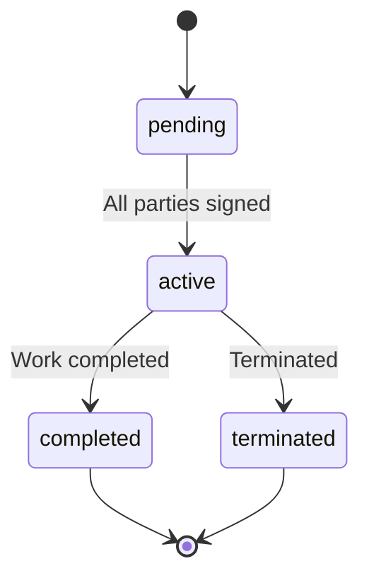

# Contract Workflow

Contracts represent the **legal layer** of a collaboration: parties, scope, payment terms, and (optionally) a snapshot of milestones at signing. They are linked to **deals** when the deal enters the signing phase.

---

## 1. Contract Lifecycle

**Status values (CONFIG.CONTRACT_STATUS):**  
`pending` | `active` | `completed` | `terminated`

---

## 2. When Contracts Are Created

Contracts are created when a **deal** moves to **signing**:

1. Deal status is updated to `signing` (e.g. from review, after “Create contract” action).
2. Backend/feature creates a contract via `data-service.createContract({ dealId, opportunityId, applicationId, parties, scope, paymentMode, agreedValue, duration, paymentSchedule, equityVesting, profitShare, milestonesSnapshot, status: 'pending' })`.
3. Deal is updated with `contractId` so the deal points to the contract.
4. **Parties** are copied from deal participants (userId, role, signedAt: null initially).

**Inputs:** dealId, parties (from deal), scope, paymentMode, agreedValue, duration, paymentSchedule, optional equityVesting/profitShare, milestonesSnapshot (copy of deal.milestones at signing).  
**Outputs:** New contract (id, dealId, status pending); deal.contractId set.

---

## 3. Signing Flow

1. Each party opens **Contract detail** (`/contracts/:id`) or contract section on deal page.
2. Contract shows: parties, scope, payment terms, milestones snapshot, status.
3. Party “Signs” (UI action): backend updates that party’s `signedAt` in contract.parties (via updateContract or a dedicated sign method if present).
4. When **all parties** have signed:
   - Contract status → `active`.
   - Deal status can be updated to `active` (if not already).
5. Notifications may be sent to parties on contract created and on all signed.

**Inputs:** contractId, userId (signer).  
**Outputs:** contract.parties[].signedAt updated; contract status → active when all signed.

---

## 4. Contract vs Deal Responsibilities

| Aspect | Deal | Contract |
|--------|------|----------|
| Execution | Live milestones, progress, delivery | — |
| Legal | — | Parties, scope, value, payment schedule, milestones **snapshot** |
| Status flow | negotiating → draft → review → signing → active → execution → delivery → completed → closed | pending → active → completed / terminated |
| Updates | Milestones updated as work progresses | Typically immutable after signing (amendments could be a future feature) |

---

## 5. Viewing Contracts

**User/Company:**

- **Contracts** list (`/contracts`): `data-service.getContractsByUserId(userId)` — contracts where user is in parties.
- **Contract detail** (`/contracts/:id`): `data-service.getContractById(id)`; show full contract and link to deal.

**Admin:**

- **Admin → Contracts**: list all contracts; filter by status, deal; view detail.

---

## 6. Migration Note (POC)

Data-service may run **migrateContractsToDealContractLifecycle**: contracts that have no dealId get a synthetic deal created so that the “deal + contract” model is consistent. This is a one-time migration on seed version upgrade.

---

## State Changes Summary

| Action | Contract | Deal |
|--------|----------|------|
| Create contract | created, status pending | status signing, contractId set |
| Party signs | party.signedAt set | — |
| All signed | status active | status active (if not already) |
| Deal completed | status completed (optional) | status completed → closed |
| Termination | status terminated | — |

---

## Related Documentation

- [Data Model](../data-model.md) — Contract entity.
- [Deal Workflow](deal-workflow.md) — Deal status and when contract is created.
- [POC Deal Lifecycle](../../POC/docs/deal-lifecycle.md) — Deal and contract link.
