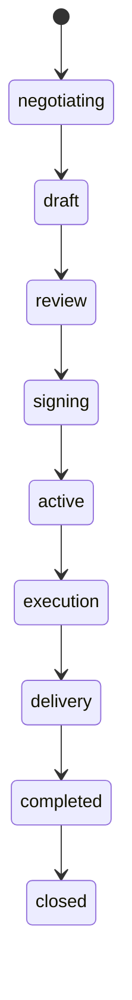

# Deal workflow

### What this page is

How **deals** are created after a match or application, how **status** moves from negotiation to closure, and how **milestones** and **contracts** connect.

### Why it matters

Deals are where day-to-day collaboration lives after the match screen.

### What you can do here

- Follow deal states in order.
- See how signing creates or links a contract.
- Read consortium replacement and rating notes.

### Step-by-step actions

1. Open **Create deal** paths (match vs application).
2. Track status transitions while negotiating.
3. Move into signing when the contract is ready.

### What happens next

When the contract is **active**, execution milestones apply ([contract-workflow.md](contract-workflow.md)).

### Tips

- The deal holds **live** milestones; the contract holds a **snapshot** at signing.

---

## 1. Deal status lifecycle

**Status values (CONFIG.DEAL_STATUS):**  
`negotiating` | `draft` | `review` | `signing` | `active` | `execution` | `delivery` | `completed` | `closed`

---

## 2. Create Deal (From Post Match or Application)

**From confirmed post_match:**

1. User opens **Match detail** for a **confirmed** post_match and clicks “Start deal” (or equivalent).
2. Frontend (or feature) builds deal payload: participants from post_match (userId, role), opportunityIds from payload (need/offer/lead/cycle), matchType, title, scope, exchangeMode, valueTerms (to be negotiated).
3. `data-service.createDeal(dealData)` → new deal with `status: 'negotiating'` or `'draft'`.
4. Optionally link back in UI (e.g. “Deal created” with link to deal detail); post_match has no formal dealId FK in schema.

**From application:**

1. When an application is accepted, a deal can be created with `applicationId`, `opportunityId`, participants (creator + applicant), status draft/negotiating.
2. Same `createDeal(dealData)`.

**Inputs:** participants, opportunityId(s), matchType, title, scope, timeline, exchangeMode, valueTerms, optional milestones, optional payload/roleSlots (consortium).  
**Outputs:** New deal (id, status, createdAt).

---

## 3. Deal Detail and Milestones

**Deal detail page** (`/deals/:id`):

1. Load deal: `data-service.getDealById(id)`.
2. Show: title, status, participants, scope, timeline, valueTerms, milestones list, progressUpdates, documents (if any).
3. **Milestones** are stored on the deal: array of { id, title, description, dueDate, status, deliverables, submittedAt, approvedAt, approvedBy }. Status: pending | in_progress | submitted | approved | rejected.
4. Actions (depending on role and status):
   - Update milestone (e.g. submit for approval): `data-service.updateDealMilestone(dealId, milestoneId, updates)`.
   - Add milestone: `data-service.addDealMilestone(dealId, milestoneData)`.
   - Update deal status (e.g. move to review, signing, execution): `data-service.updateDeal(dealId, { status })`.

**State transitions:**

- negotiating → draft: deal terms agreed, document in draft.
- draft → review: submitted for internal/legal review.
- review → signing: approved; contract created or linked; awaiting signatures.
- signing → active: all parties signed contract.
- active → execution: work started; milestones in progress.
- execution → delivery: final delivery phase.
- delivery → completed: all milestones and delivery done.
- completed → closed: formally closed (archived).

---

## 4. Contract Creation (Signing Phase)

When deal reaches **signing**:

1. A **contract** is created (or linked): `data-service.createContract({ dealId, opportunityId, applicationId, parties, scope, paymentMode, agreedValue, duration, paymentSchedule, milestonesSnapshot, status: 'pending' })`.
2. Deal is updated with `contractId`.
3. Parties sign (UI records signedAt on contract parties or deal participants).
4. When all signed, contract status → `active`; deal status → `active` (then later execution, etc.).

Contract holds the **legal snapshot** (parties, scope, value, milestonesSnapshot); the **deal** holds the live milestones and execution progress.

---

## 5. Consortium Replacement (Dropped Member)

For **consortium** deals, if a participant drops:

1. Admin or lead can use **Admin → Consortium** (or deal detail) to find **replacement candidates** for the missing role.
2. `matching-service.findReplacementCandidatesForRole(leadNeedId, missingRole, { excludeUserIds, topN })` returns scored candidates.
3. When a replacement is chosen, a **replacement post_match** can be created (isReplacement: true, replacementDealId, replacementRole) and the deal’s participants/roleSlots updated.
4. Replacement flow is subject to CONFIG.MATCHING.CONSORTIUM_REPLACEMENT_ALLOWED_STAGES and MAX_REPLACEMENT_ATTEMPTS.

---

## 6. Rate Deal (After Completion)

**Deal rate** (`/deals/:id/rate` or similar): User can leave a review/rating for the deal (stored in `pmtwin_reviews`). Implementation may link review to dealId and participant; used for reputation in matching (e.g. offerNorm.reputation).

---

## State Changes Summary

| Action | Deal status | Other |
|--------|------------|--------|
| Create deal | negotiating or draft | Deal record created |
| Submit for review | review | |
| Create contract, send for signing | signing | Contract created; deal.contractId set |
| All parties signed | active | Contract status active |
| Start work | execution | Milestones in progress |
| Complete delivery | completed | |
| Close | closed | completedAt/closedAt set |
| Milestone submit | — | milestone status submitted |
| Milestone approve | — | milestone status approved, approvedAt, approvedBy |

---

## Related Documentation

- [Data Model](../data-model.md) — Deal and Contract entities.
- [Contract Workflow](contract-workflow.md) — Contract lifecycle.
- [Matching Workflow](matching-workflow.md) — From match to deal.
- [POC Deal Lifecycle](../../POC/docs/deal-lifecycle.md) — Same lifecycle in POC docs.
