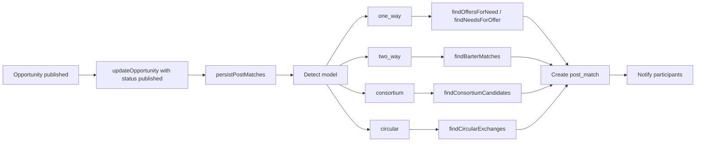

# Matching Workflow

How the matching engine runs, how post_matches are created, and how users see and respond to matches.

---

## 1. When Matching Runs

**Trigger:** When `data-service.updateOpportunity(id, { status: 'published' })` is called, the data-service (after saving) calls `matching-service.persistPostMatches(id)` (async).

**Manual trigger:** Admin can run matching from **Admin → Matching** for a selected published opportunity; same `findMatchesForPost` + create post_match + notify flow.

---

## 2. Model Detection

`matching-service.detectMatchingModel(opportunity)` returns a list of applicable models:

| Condition | Models added |
|-----------|----------------|
| intent === 'request' or 'hybrid' | one_way |
| intent === 'offer' or 'hybrid' | one_way (findNeedsForOffer) |
| exchangeMode or accepted_modes includes barter | two_way |
| memberRoles / partnerRoles length > 0 or subModelType === 'consortium' | consortium |

Circular is not auto-run from a single opportunity publish in the same way; `persistPostMatches` explicitly calls `findMatchesForPost(opportunityId, { model: 'circular' })` after one_way/two_way/consortium to add circular cycles that include the opportunity’s creator.

---

## 3. One-Way Matching Flow

**Need (request) → Offers:**

1. `findMatchesForPost(opportunityId)` with intent `request` → `findOffersForNeed(needPostId)`.
2. Load need opportunity; get all published **offer** opportunities (intent === 'offer').
3. **Candidate generator** filters offers by budget, location, timeline, category; caps at CANDIDATE_MAX (e.g. 200).
4. For each candidate offer, **post-to-post scoring** computes score (skills, exchange, value, budget, timeline, location, reputation) with CONFIG.MATCHING.WEIGHTS.
5. Pairs with score >= POST_TO_POST_THRESHOLD (0.50) are kept; ranked; top N (e.g. 20) returned.
6. **persistPostMatches** creates one post_match per result: matchType `one_way`, participants [need_owner, offer_provider], payload { needOpportunityId, offerOpportunityId, breakdown, valueAnalysis }.
7. **notifyPostMatch** sends notifications to both participants.

**Offer → Needs:** Same flow with `findNeedsForOffer(offerPostId)` when intent === 'offer'.

---

## 4. Two-Way (Barter) Matching Flow

1. `findBarterMatches(opportunityId)`: requires the **same creator** to have both a **need** and an **offer** (two opportunities).
2. Finds other creators who also have both need and offer.
3. For each pair (A need+offer, B need+offer): scores **A’s offer → B’s need** and **B’s offer → A’s need**; both must be >= threshold.
4. Pair score = average of the two directions; value equivalence text computed (e.g. "~1.1 × (Title)").
5. persistPostMatches creates post_match with matchType `two_way`, participants (need_owner + offer_provider for both sides), payload { sideA, sideB, scoreAtoB, scoreBtoA, valueEquivalence }.
6. Notify both parties.

---

## 5. Consortium Matching Flow

1. `findConsortiumCandidates(leadNeedId)`: lead opportunity must have **memberRoles** or **partnerRoles** (or subModelType consortium).
2. For each role, build a synthetic “need” (lead need + role as skill); find best **offer** per role from other creators (one offer per creator to avoid same party filling multiple roles).
3. Aggregate score across roles; one “match” per full consortium (lead + list of suggested partners with role and opportunityId).
4. persistPostMatches creates post_match with matchType `consortium`, participants [consortium_lead, consortium_member, ...], payload { leadNeedId, roles: [{ role, opportunityId, userId, score }], valueBalance }.
5. Notify lead and all suggested members.

---

## 6. Circular Matching Flow

1. `findCircularExchanges(options)`: builds a directed graph: nodes = creatorIds; edge I → J if some **offer** from J satisfies some **need** from I (score >= threshold).
2. Enumerates cycles of length >= 3 (minCycleLength) in the graph.
3. Each cycle becomes a match: matchScore = average edge score; payload { cycle, links (fromCreatorId, toCreatorId, offerId, needId, score), chainBalance }.
4. **persistPostMatches** runs circular separately; for each cycle that **includes the published opportunity’s creator**, creates a post_match with matchType `circular`, participants (chain_participant per creator), payload as above.
5. Notify all in the cycle.

---

## 7. User-Side: View and Respond to Matches

**Steps:**

1. User opens **Matches** (`/matches`). Page loads `data-service.getPostMatchesForUser(userId)`.
2. List shows post_matches (optionally filtered by type: one_way, two_way, consortium, circular); each card shows match type, score, other party/parties, and summary.
3. User opens **Match detail** (`/matches/:id`). Detail shows full payload, participants, value equivalence (barter), roles (consortium), or cycle (circular).
4. User **Accepts** or **Declines**: `data-service.updatePostMatchStatus(matchId, userId, 'accepted' | 'declined')`.
   - If any participant declines → post_match status → `declined`.
   - If all accept → post_match status → `confirmed`.
5. When **confirmed**, user can proceed to create a **Deal** (e.g. “Start deal” from match detail). Deal creation is in [Deal Workflow](deal-workflow.md).

**Inputs (user):** matchId, action (accept/decline).  
**Outputs:** post_match participants and status updated; optional redirect to deal creation.

---

## 8. Ranking and Tiers

After raw matches are returned, `matching-service.rankMatches(matches, model)` adds:

- **compositeRank:** weighted combination of matchScore, value coverage ratio, reputation, timeline (e.g. 0.5*matchScore + 0.3*coverage + 0.1*rep + 0.1*timeline).
- **recommendation:** tier (`top` | `good` | `possible`), reason, actionRequired (e.g. “Ready to contract” for top).
- **scoreBreakdown:** copy of breakdown for UI.

Matches are sorted by compositeRank (or matchScore) descending.

---

## State Changes Summary

| Event | Entity | Change |
|-------|--------|--------|
| Opportunity published | Opportunity | status = published |
| persistPostMatches | PostMatch | New records created (pending) |
| notifyPostMatch | Notification | New notifications for participants |
| User accepts | PostMatch | participantStatus = accepted for that user; if all accepted → status = confirmed |
| User declines | PostMatch | participantStatus = declined; status = declined |
| Deal created from match | Deal | New deal; post_match may be linked in UI (no FK on post_match to deal in schema) |

---

## Related Documentation

- [Matching Engine](../matching-engine.md) — Scoring, weights, value compatibility.
- [Opportunity Workflow](opportunity-workflow.md) — Publish trigger.
- [Deal Workflow](deal-workflow.md) — From confirmed match to deal.
