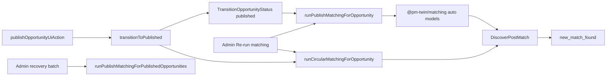

# Matching Workflow

> **Runtime authority:** Matching runs in `web/` via `@pm-twin/matching` + `DiscoverPostMatch` command handler. `POC/` matching services are legacy reference only.

### What this page is

When matching runs in the web runtime, how PostMatches are created, and how users / company reps respond.

### Why it matters

Publish is the primary trigger. Status sync (policy B) and notifications depend on discover / confirm paths working correctly.

---

## 1. When matching runs

```mermaid
flowchart LR
  PublishUI[publishOpportunityUiAction] --> Service[transitionToPublished]
  Service --> Trans[TransitionOpportunityStatus published]
  Trans --> Auto[runPublishMatchingForOpportunity]
  Auto --> Engine["@pm-twin/matching auto models"]
  Engine --> Discover[DiscoverPostMatch]
  Discover --> Notify[new_match_found]
  Service --> Circular[runCircularMatchingForOpportunity]
  Circular --> Discover
  AdminRerun[Admin Re-run matching] --> Auto
  AdminRerun --> Circular
  AdminBatch[Admin recovery batch] --> BatchPublish[runPublishMatchingForPublishedOpportunities]
```

| Trigger | Behavior |
|---------|----------|
| **Publish** (wizard, details, pipeline drop) | **Normal path.** Auto models (one_way / two_way / consortium) + circular pass. Creates PostMatches and `new_match_found` immediately. Same in Local, Demo, and UAT. |
| Direct `transitionOpportunityStatus(..., 'published')` / `publishOpportunity` | Same matching side effect after a successful publish command |
| Admin opportunity **Re-run matching** | Maintenance / recovery only — same as publish matching for that opportunity |
| Admin matching page **Re-run matching** / circular | Maintenance / recovery / backfill across published pool |
| Draft create / edit | No matching |
| Edit published without re-publish | No matching |

No manual admin step is required for the normal user workflow.

Canonical records are **PostMatch** entities (`postMatchRepository` / `pmtwin_web_overrides`).

---

## 2. Discover path

1. Engine scores published pool against the anchor post.
2. [`model-run-discover-adapter.ts`](../../web/src/services/matching/model-run-discover-adapter.ts) builds `DiscoverPostMatch` commands with participants (`userId`, `partyId`, `representativeUserIds`).
3. [`PostMatchCommandHandler.handleDiscover`](../../web/src/commands/handlers/post-match-command-handler.ts) persists PostMatch (`discovered`) and emits `new_match_found` to userId + representatives.
4. Strong-key dedupe skips active duplicates.

Publish matching writes a matching-run audit (`matching_run.publish`). Circular batch writes `matching_run.circular`.

---

## 3. Topologies

| Model | When |
|-------|------|
| one_way | Cash / complementary need↔offer |
| two_way | Barter sides (need+offer per party) |
| consortium | Lead need + role partners |
| circular | Separate pass (min cycle length 3) |

Same owner party need+offer pairs are filtered out at discover.

---

## 4. Accept / confirm

1. Participants (or **representatives** / active party) Accept / Decline via workflow actions.
2. When quorum is met → status `confirmed` → `match_confirmed` notification.
3. Lifecycle orchestrator advances linked opportunities `published` → `matched` (policy B).

Opportunity status does **not** change on discover alone.

---

## 5. After confirm

1. Start negotiation → opportunities → `negotiating`.
2. Agree negotiation → create commercial agreement → opportunities → `contracted`.
3. Continue with deal / contract workflows.

---

## 6. Notifications

| Event | Type |
|-------|------|
| Discover | `new_match_found` |
| Partial accept | `match_accepted` |
| Confirmed | `match_confirmed` |
| Decline | `match_declined` |
| Negotiation started | `negotiation_started` |
| Deal from match | `deal_created_from_match` |

Recipients: participant `userId` and `representativeUserIds` (never company id as human recipient).
