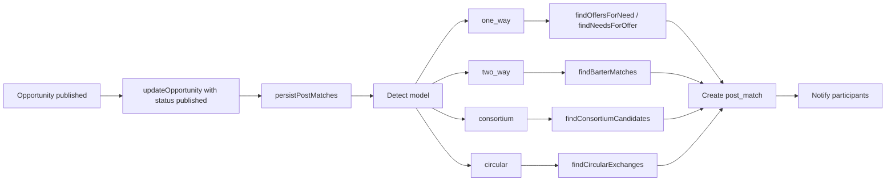

# Matching Workflow

### What this page is

Technical walkthrough of **when matching runs**, how **match records** are built for each model, and how users **accept or decline** on the Matches screens.

### Why it matters

Engineers and support use this file alongside [matching-engine.md](../matching-engine.md) to debug scores and thresholds.

### What you can do here

- Trace the publish trigger through to notifications.
- Compare one-way, two-way, consortium, and circular paths.
- Read the state-change table at the end.

### Step-by-step actions

1. Start with **When matching runs**.
2. Open the model section you investigate (sections 3–6).
3. Finish with **User-side: view and respond** for UX behavior.

### What happens next

After a match is **confirmed**, continue with [deal-workflow.md](deal-workflow.md) or optional [negotiation-workflow.md](negotiation-workflow.md).

### Tips

- **Canonical matches** are `post_matches` only (`pmtwin_matches` is deprecated; legacy person–opportunity matching is off unless `LEGACY_PERSON_OPPORTUNITY_ENABLED`).
- **Admin Run report** is preview-only; **Admin Save** and **publish** call `persistPostMatches` to create `post_matches`.
- **Match cards and actions** use `unified-match-view-model.js` — same labels on Matches list, Match detail, Pipeline, and Admin Matching Center.

---

## 1. When Matching Runs

```mermaid
flowchart LR
  Publish[Opportunity published] --> Trigger[updateOpportunity with status published]
  Trigger --> Persist[persistPostMatches]
  Persist --> Detect[Detect model]
  Detect --> One[one_way]
  Detect --> Two[two_way]
  Detect --> Cons[consortium]
  Detect --> Circ[circular]
  One --> Find[findOffersForNeed / findNeedsForOffer]
  Two --> Barter[findBarterMatches]
  Cons --> Consortium[findConsortiumCandidates]
  Circ --> Circular[findCircularExchanges]
  Find --> Create[Create post_match]
  Barter --> Create
  Consortium --> Create
  Circular --> Create
  Create --> Notify[Notify participants]
```

**Trigger:** When `data-service.updateOpportunity(id, { status: 'published' })` is called, the data-service (after saving) calls `matching-service.persistPostMatches(id)` (async).

**Manual/admin trigger (Admin Matching Center):**

| Action | Persists `post_matches` | Notifications |
|--------|-------------------------|---------------|
| **Run report** | No (preview / in-memory only) | No |
| **Save** on a published opportunity row | Yes (`persistPostMatches`) | Yes |

Publish (`status: published`) also calls `persistPostMatches` and does **not** create `pmtwin_matches` or call `findMatchesForOpportunity`.

---

## 2. Model Detection and Multi-Model Persist

`matching-service.detectMatchingModel(opportunity)` returns every applicable model for a published post:

| Condition | Models added |
|-----------|----------------|
| intent === 'request' or 'hybrid' | one_way |
| intent === 'offer' or 'hybrid' | one_way (findNeedsForOffer) |
| exchangeMode or accepted_modes includes barter | two_way |
| memberRoles / partnerRoles length > 0 or subModelType === 'consortium' | consortium |

**On publish and admin save**, `persistPostMatches()`:

1. Builds a model plan from `detectMatchingModel()` (excluding circular from the main list).
2. Runs **each** detected model via `findMatchesForPost(opportunityId, { model })` — no single-model precedence.
3. Runs a **separate circular pass** (`findMatchesForPost(..., { model: 'circular' })`) and persists only cycles that include the publishing creator.
4. Dedupes via `createPostMatch` strong keys + in-run seen set; writes a `matching_runs` record (`modelsRun`, threshold, counts, durationMs).

**Admin/debug only:** `findMatchesForPost(opportunityId, {})` without `persistPostMatches` still uses route precedence (single model) for preview runs — use **Run report** or explicit `options.model` for one-model debugging.

**Circular** is never returned from `detectMatchingModel()` alone; it is always the dedicated circular pass in step 3.

---

## 2b. Hard Constraints: exact profession filter

Before any pair is scored, `hard-constraints.passesPair()` (`POC/src/services/matching/hard-constraints.js`) applies mandatory gates. The first and strongest is the **profession/role gate**.

- **Where the role comes from:** `attributes.targetRole` (or `attributes.professionalRole`) on each opportunity, normalized into `normalized.role` by `post-preprocessor.js`. Aliases such as "Civil Engineering" → "Civil Engineer" are normalized for label consistency only.
- **Exact match required:** With `CONFIG.MATCHING.STRICT_ROLE_EXACT_MATCH` enabled (default), the need's role and the offer's role must be **identical** (case-insensitive after alias normalization). The related-profession compatibility matrix is disabled. An Architect need never matches a Civil Engineer or Interior Designer offer, even when they share skills like AutoCAD or BIM.
- **Skill overlap never overrides profession:** Core-skill and service-overlap checks run only **after** the role gate passes. A perfect skill match cannot rescue a profession mismatch.
- **Missing role is rejected:** With `CONFIG.MATCHING.STRICT_ROLE_REQUIRED` enabled (default), an opportunity without an explicit `targetRole` does not borrow its first skill as a role. The gate rejects it with `role_missing`, so role-less legacy posts produce no matches.

This gate runs in both the candidate generator (`candidate-generator.js`) and the model flows (`matching-models.js`), so cross-profession pairs are filtered out before scoring in every model.

**Verification:** `node scripts/audit-opportunities-matching.js` reports field readiness, per-opportunity model routing, and a role-safety scan asserting zero `one_way`/`two_way` matches across professions. `tests/hard-constraints.test.js` and `tests/opportunity-matching-coverage.test.js` cover the same guarantees.

---

## 3. One-Way Matching Flow

**Need (request) → Offers:**

1. `findMatchesForPost(opportunityId)` with intent `request` → `findOffersForNeed(needPostId)`.
2. Load need opportunity; get all published **offer** opportunities (intent === 'offer').
3. **Candidate generator** filters offers by budget, location, timeline, category; caps at CANDIDATE_MAX (e.g. 200).
4. For each candidate offer, **post-to-post scoring** computes score (skills, exchange, value, budget, timeline, location, reputation) with CONFIG.MATCHING.WEIGHTS.
5. Pairs with score >= POST_TO_POST_THRESHOLD (0.50) are kept; ranked; top N (e.g. 20) returned.
6. **persistPostMatches** creates one post_match per result: matchType `one_way`, participants [need_owner, offer_provider], payload { needOpportunityId, offerOpportunityId, breakdown, valueAnalysis }.
7. **notifyPostMatch** sends notifications to both participants.

**Offer → Needs:** Same flow with `findNeedsForOffer(offerPostId)` when intent === 'offer'.

---

## 4. Two-Way (Barter) Matching Flow

1. `findBarterMatches(opportunityId)`: requires the **same creator** to have both a **need** and an **offer** (two opportunities).
2. Finds other creators who also have both need and offer.
3. For each pair (A need+offer, B need+offer): scores **A’s offer → B’s need** and **B’s offer → A’s need**; both must be >= threshold.
4. Pair score = average of the two directions; value equivalence text computed (e.g. "~1.1 × (Title)").
5. persistPostMatches creates post_match with matchType `two_way`, participants (need_owner + offer_provider for both sides), payload { sideA, sideB, scoreAtoB, scoreBtoA, valueEquivalence }.
6. Notify both parties.

---

## 5. Consortium Matching Flow

1. `findConsortiumCandidates(leadNeedId)`: lead opportunity must have **memberRoles** or **partnerRoles** (or subModelType consortium).
2. For each role, build a synthetic “need” (lead need + role as skill); find best **offer** per role from other creators (one offer per creator to avoid same party filling multiple roles).
3. Aggregate score across roles; one “match” per full consortium (lead + list of suggested partners with role and opportunityId).
4. persistPostMatches creates post_match with matchType `consortium`, participants [consortium_lead, consortium_member, ...], payload { leadNeedId, roles: [{ role, opportunityId, userId, score }], valueBalance }.
5. Notify lead and all suggested members.

---

## 6. Circular Matching Flow

1. `findCircularExchanges(options)`: builds a directed graph: nodes = creatorIds; edge I → J if some **offer** from J satisfies some **need** from I (score >= threshold).
2. Enumerates cycles of length >= 3 (minCycleLength) in the graph.
3. Each cycle becomes a match: matchScore = average edge score; payload { cycle, links (fromCreatorId, toCreatorId, offerId, needId, score), chainBalance }.
4. **persistPostMatches** runs circular separately; for each cycle that **includes the published opportunity’s creator**, creates a post_match with matchType `circular`, participants (chain_participant per creator), payload as above.
5. Notify all in the cycle.

---

## 7. User-Side: View and Respond to Matches

**Unified view model:** List and detail pages build cards via `unified-match-view-model.js` (`buildUnifiedMatchViewModels` → `enrichUnifiedMatchViewModel`). Each card exposes:

- **Labels:** Need/Offer/Barter/Consortium/Circular; quality tier (Top/High/Medium/Low from score); status (“Pending Response”, “Waiting for Others”, “Confirmed”, etc.).
- **Actions** (`getAvailableActions`): View Details, Message, Accept, Decline, Start Negotiation / Continue Negotiation, Create Deal (from agreed negotiation), **Start Deal** (confirmed match only), Invite to Apply, replacement actions when eligible.
- **Next best action** hint for the current viewer.

**Steps:**

1. User opens **Matches** (`/matches`) or **Pipeline → Matches**. Page loads `data-service.getPostMatchesForUser(userId)` and renders unified match cards.
2. List can filter by type (one_way, two_way, consortium, circular) and status tab (pending, confirmed, etc.).
3. User opens **Match detail** (`/matches/:id`). Detail shows full payload, participants, value equivalence (barter), roles (consortium), or cycle (circular); negotiation and replacement sections when linked.
4. User **Accepts** or **Declines**: `data-service.updatePostMatchStatus(matchId, userId, 'accepted' | 'declined')`.
   - If any participant declines → post_match status → `declined`.
   - If all accept → post_match status → `confirmed`.
5. When **confirmed**, **Start Deal** is enabled (`unified-match-view-model`: `status === 'confirmed'` and no linked deal). `assertDealCreationSource` enforces the same rule in `data-service`. See [Deal Workflow](deal-workflow.md).
6. Optional: **Start Negotiation** before deal creation ([negotiation-workflow.md](negotiation-workflow.md)).

**Match expiry:** New pending `post_match` records get `expiresAt` from `getDefaultPostMatchExpiresAt` (default **14 days** from `CONFIG.MATCHING.DEFAULT_MATCH_EXPIRY_DAYS`). `expirePendingPostMatches()` runs on read; expired pending matches show as **Expired** and cannot be accepted.

**Inputs (user):** matchId, action (accept/decline/negotiate/start deal).  
**Outputs:** post_match participants and status updated; optional negotiation or deal creation.

---

## 8. Ranking and Tiers

After raw matches are returned, `matching-service.rankMatches(matches, model)` adds:

- **compositeRank:** weighted combination of matchScore, value coverage ratio, reputation, timeline (e.g. 0.5*matchScore + 0.3*coverage + 0.1*rep + 0.1*timeline).
- **recommendation:** tier (`top` | `good` | `possible`), reason, actionRequired (e.g. “Ready to contract” for top).
- **scoreBreakdown:** copy of breakdown for UI.

Matches are sorted by compositeRank (or matchScore) descending.

---

## State Changes Summary

| Event | Entity | Change |
|-------|--------|--------|
| Opportunity published | Opportunity | status = published |
| persistPostMatches | PostMatch | New records created (pending) |
| notifyPostMatch | Notification | New notifications for participants |
| User accepts | PostMatch | participantStatus = accepted for that user; if all accepted → status = confirmed |
| User declines | PostMatch | participantStatus = declined; status = declined |
| Pending match past expiresAt | PostMatch | status = expired (lazy sweep on read) |
| Deal created from match | Deal | New deal; UI links via `getDealByMatchId` / view model `dealId` |

---

## Implementation references

- `POC/src/services/matching/matching-service.js` — `persistPostMatches`, `detectMatchingModel`, `notifyPostMatch`
- `POC/src/services/matching/unified-match-view-model.js` — match cards, actions, status labels
- `POC/features/matches/matches.js`, `POC/features/match-detail/match-detail.js`, `POC/features/pipeline/pipeline.js`

---

## Related Documentation

- [Matching Engine](../matching-engine.md) — Scoring, weights, value compatibility.
- [Opportunity Workflow](opportunity-workflow.md) — Publish trigger.
- [Deal Workflow](deal-workflow.md) — From confirmed match to deal.
- [Gap solutions](../gap-solutions.md) — POC sprint status (multi-model persist, match expiry, Start Deal gating).
