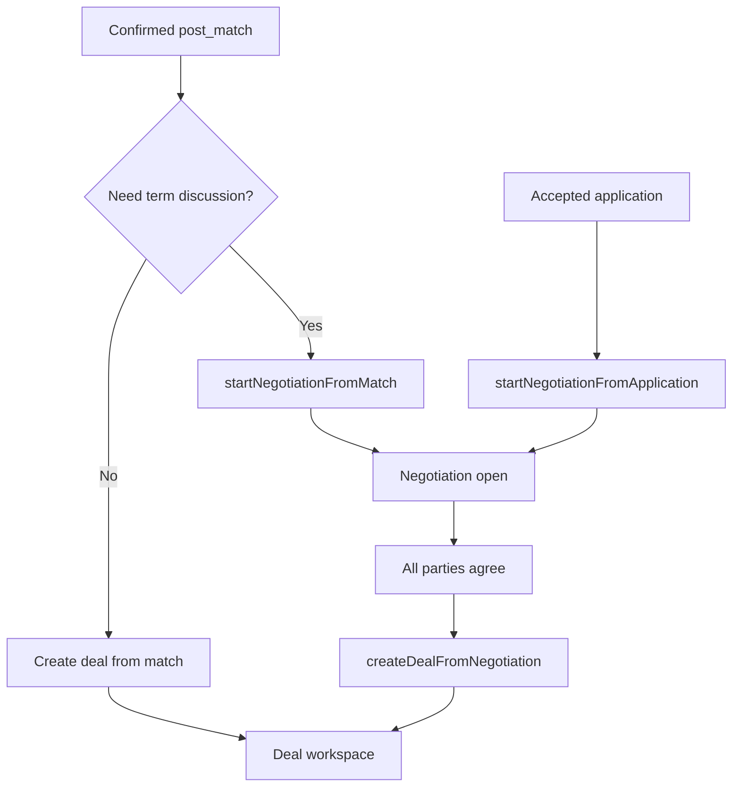
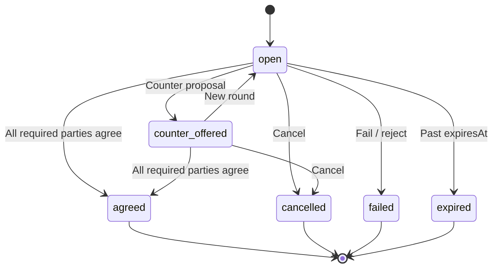

# Negotiation workflow

### What this page is

How **negotiations** start from a match or application, how parties **agree on terms**, and how a **deal** is created after agreement.

### Why it matters

Negotiation is the optional step between match confirmation and deal creation. It lets parties align on value, scope, and timeline before opening a deal workspace.

### What you can do here

- See when to negotiate vs go straight to a deal.
- Follow status transitions from open → agreed → deal.
- Trace implementation in `data-service` and match/application UI.

### Step-by-step actions

1. Read **When negotiation runs** to choose the right entry path.
2. Follow **Start → counter → agree** for the lifecycle.
3. Continue with [deal-workflow.md](deal-workflow.md) after terms are agreed.

### What happens next

After **agreed**, any participant can call **Create deal from negotiation**; then signing follows [contract-workflow.md](contract-workflow.md).

### Tips

- You can skip negotiation and create a deal directly from a **confirmed** match if terms are already clear.
- For applications, negotiation is recommended when proposal terms need discussion before a deal.

---

## 1. When negotiation runs

Negotiation is **optional**. Three paths into a deal exist:

| Path | Preconditions | Typical use |
|------|---------------|-------------|
| **Direct from match** | `post_match.status === confirmed` | Terms clear; skip negotiation |
| **Negotiation from match** | Participant on match; match exists | Discuss value, scope, timeline first |
| **From application** | Owner or applicant; application accepted or linked to match | Refine proposal before deal |

**Enforcement:** `assertDealCreationSource` requires `negotiation.status === 'agreed'` when creating a deal with `negotiationId`.

---

## 2. Negotiation status lifecycle

**Active statuses:** `open`, `counter_offered`  
**Terminal statuses:** `agreed`, `cancelled`, `failed`, `expired`

---

## 3. Start negotiation (from match)

**Trigger:** User clicks **Start negotiation** on Matches list, Match detail, or Pipeline.

**Steps:**

1. `data-service.startNegotiationFromMatch(matchId, actorUserId, options?)`
2. Validates actor is a **match participant**.
3. Returns existing active negotiation if one already exists for this match.
4. Resolves `opportunityId` from match payload (need/offer/lead/cycle context).
5. Creates negotiation: `status: open`, `parties` from match participants, `initialTerms` from application or default message.
6. Links negotiation to match/application/opportunity records.
7. If opportunity is `published`, updates to **`in_negotiation`**.
8. Notifies other parties; writes audit log `negotiation_started`.

**Inputs:** matchId, actorUserId, optional `{ opportunityId, applicationId, initialTerms }`  
**Outputs:** Negotiation record; notifications; opportunity may move to `in_negotiation`.

---

## 4. Start negotiation (from application)

**Trigger:** Owner or applicant starts negotiation from opportunity detail (accepted or in-review application).

**Steps:**

1. `data-service.startNegotiationFromApplication(applicationId, actorUserId)`
2. Only **owner** or **applicant** may start.
3. If application has `matchId`, delegates to `startNegotiationFromMatch`.
4. Otherwise creates negotiation with parties = owner + applicant and `initialTerms` from application proposal fields.

---

## 5. Counter offers and rounds

While negotiation is **active**:

1. A party submits a counter via `addNegotiationRound` (proposal terms in round payload).
2. Status may move to `counter_offered`.
3. Other parties review rounds on Match detail or negotiation UI.

**Gap (POC):** Full round-by-round UI may be minimal on some screens; core storage and service methods exist in `data-service`.

---

## 6. Agree on terms

**Trigger:** Participant clicks **Agree to terms** on Match detail (or equivalent).

**Steps:**

1. `data-service.agreeNegotiation(negotiationId, actorUserId, agreedTerms?)`
2. Records `participantAgreements` entry for this user.
3. If **not all required parties** have agreed → negotiation stays active; partial agreement stored.
4. When **all required parties** agreed:
   - Status → **`agreed`**
   - `finalAgreedSnapshot` built (immutable terms snapshot)
   - Notifications to other parties; audit log `negotiation_agreed`

**Multi-party:** Required participant IDs come from `negotiation.parties`. Each must agree before status becomes `agreed`.

---

## 7. Create deal from negotiation

**Trigger:** User clicks **Create deal** after negotiation is `agreed`.

**Steps:**

1. `data-service.createDealFromNegotiation(negotiationId, actorUserId)`
2. Validates `negotiation.status === 'agreed'`.
3. Builds deal from `finalAgreedSnapshot` / agreed terms and match/application context.
4. Sets deal `negotiationId`; may set `matchId` / `applicationId` / `opportunityId`.
5. Deal created with status `negotiating` or `draft` per payload.

Any match participant (or application owner/applicant per rules) may create the deal once terms are agreed.

---

## 8. Cancel or fail

- **Cancel:** Active negotiation → `cancelled` (via cancel handler on deal/match detail).
- **Fail:** Terminal `failed` when negotiation cannot continue (service-level or admin action).

Notifications and audit entries should accompany terminal transitions where implemented.

---

## 9. Application vs negotiation vs deal (product guide)

| Situation | Recommended path |
|-----------|------------------|
| Match confirmed, standard terms | Accept match → **Start deal** directly |
| Match confirmed, custom value/scope | Accept match → **Start negotiation** → agree → deal |
| Application accepted, simple hire | **Create deal from application** |
| Application accepted, terms to refine | **Start negotiation from application** → agree → deal |

---

## State changes summary

| Event | Negotiation | Opportunity | Deal |
|-------|-------------|-------------|------|
| Start from match | created, `open` | `published` → `in_negotiation` (if was published) | — |
| Partial agree | `participantAgreements` updated | — | — |
| All agree | `agreed`, snapshot stored | — | — |
| Create deal | — | may progress later | created with `negotiationId` |
| Cancel | `cancelled` | — | — |

---

## Implementation references

- `POC/src/core/data/data-service.js` — `startNegotiationFromMatch`, `startNegotiationFromApplication`, `agreeNegotiation`, `createDealFromNegotiation`
- `POC/src/services/matching/negotiation-lifecycle.js` — status labels, active/terminal checks, snapshot builder
- `POC/features/match-detail/match-detail.js` — negotiate, agree, create deal actions
- `POC/features/matches/matches.js` — list-level negotiate / deal shortcuts
- `POC/features/pipeline/pipeline.js` — start negotiation from pipeline match card
- `POC/features/opportunity-detail/opportunity-detail.js` — start negotiation from application

---

## Related documentation

- [Matching workflow](matching-workflow.md) — Match confirm before negotiation.
- [Deal workflow](deal-workflow.md) — Deal states after negotiation.
- [Gap solutions](../gap-solutions.md) — Proposed fixes for negotiation expiry and UX gaps (plan only; not yet implemented).
