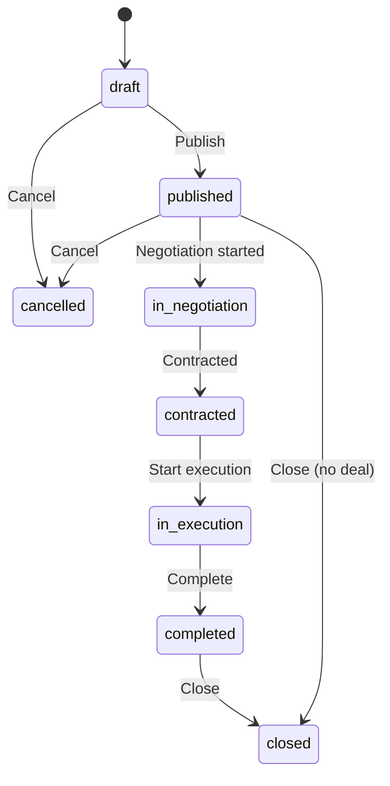

# Opportunity Workflow

End-to-end flow for creating, editing, publishing, and closing opportunities. Applies to both users and companies as creators.

---

## 1. Opportunity Lifecycle (States)

**Status values (CONFIG.OPPORTUNITY_STATUS):**  
`draft` | `published` | `in_negotiation` | `contracted` | `in_execution` | `completed` | `closed` | `cancelled`

---

## 2. Create Opportunity (Draft)

**Steps:**

1. User/company navigates to **Create opportunity** (`/opportunities/create`).
2. May use **Collaboration wizard** (`/collaboration-wizard`) to choose model, or go directly to create form.
3. Form is driven by **modelType** and **subModelType** (e.g. project_based → task_based, consortium, project_jv, spv). Fields come from `opportunity-models.js`.
4. User sets:
   - **Intent:** request (need), offer, or hybrid.
   - **Collaboration model:** project, service, advisory, consortium (wizard step 4).
   - **Payment modes:** cash, barter, equity, profit_sharing, hybrid (multi-select).
   - **Value exchange:** accepted_modes, estimated_value, scope (requiredSkills/offeredSkills), attributes (budgetRange, timeline, memberRoles for consortium, etc.).
5. Submit → `data-service.createOpportunity(data)` → opportunity created with `status: 'draft'`.
6. Redirect to opportunity detail or pipeline.

**Inputs:** Title, description, intent, modelType, subModelType, scope, value_exchange, attributes, exchangeData.  
**Outputs:** New opportunity (id, creatorId, status draft, createdAt).

**Edge cases:**

- Validation errors: form shows errors; no create.
- Sub-models with entity restrictions (e.g. SPV company-only): enforced in form or opportunity-models (CONFIG.MODEL_ELIGIBILITY).

---

## 3. Edit Opportunity (Draft or Published)

1. User opens **Opportunity detail** (`/opportunities/:id`) or **Opportunity edit** (`/opportunities/edit/:id` or similar).
2. If user is creator, edit form is shown; load opportunity via `data-service.getOpportunityById(id)`.
3. Save → `data-service.updateOpportunity(id, updates)`.
4. If status was `draft` and is changed to **published**, see step 4 below (matching trigger).

**Inputs:** Same as create (partial updates allowed).  
**Outputs:** Updated opportunity.

**Edge cases:**

- Editing published: allowed in POC; changing key fields (e.g. intent, scope) may affect existing matches; no automatic re-matching on edit unless re-published.
- Non-creator: no edit (UI should hide edit or return 403).

---

## 4. Publish Opportunity (Trigger Matching)

**Steps:**

1. From draft, user clicks **Publish** (e.g. in pipeline or opportunity detail).
2. `data-service.updateOpportunity(id, { status: 'published' })` is called.
3. Inside `updateOpportunity`, when `updates.status === 'published'`:
   - Opportunity is saved.
   - `matching-service.persistPostMatches(id)` is invoked (async, non-blocking).
4. **persistPostMatches(opportunityId):**
   - Loads opportunity; if status !== 'published', returns [].
   - Calls `findMatchesForPost(opportunityId, {})` → detects model (one_way, two_way, consortium, circular) and runs corresponding matching (findOffersForNeed, findBarterMatches, findConsortiumCandidates, findCircularExchanges).
   - For each result above threshold (POST_TO_POST_THRESHOLD, default 0.50), creates a **post_match** via `data-service.createPostMatch(...)`.
   - For each created post_match, calls `notifyPostMatch(postMatch)` → creates notifications for participants.
5. User sees success; matches appear in **Matches** for affected users; notifications sent.

**Inputs:** opportunityId (implicit from update).  
**Outputs:** opportunity status = published; zero or more post_match records; notifications.

**Edge cases:**

- Opportunity already published: update just overwrites; persistPostMatches runs again (may create duplicates; deduplication is by _postMatchSignature in createPostMatch).
- Matching fails: errors logged; opportunity still published; no post_matches for that run.

---

## 5. Close / Cancel Opportunity

1. User (or admin) sets opportunity status to `closed` or `cancelled` via update.
2. `data-service.updateOpportunity(id, { status: 'closed' })` (or cancelled).
3. No automatic cleanup of existing post_matches or deals; they remain linked to the opportunity. UI may filter out closed/cancelled from “active” lists.

**Inputs:** opportunityId, new status (closed/cancelled).  
**Outputs:** Updated opportunity.

---

## 6. Opportunity Discovery (Find) and Apply

- **Find** page lists published opportunities; user/company can open detail.
- From detail, user can **Apply** → creates **Application** (opportunityId, applicantId, proposal, status: pending).
- Application workflow (review, shortlist, accept, reject) is separate; see pipeline and application handling in codebase.

---

## State Changes Summary

| Action | Before | After |
|--------|--------|-------|
| Create | — | opportunity created, status draft |
| Publish | draft | published; post_matches created; notifications |
| Start negotiation | published | in_negotiation (typically when deal created or application accepted) |
| Contracted | in_negotiation | contracted (when contract is in place) |
| Start execution | contracted | in_execution |
| Complete | in_execution | completed |
| Close | any | closed |
| Cancel | draft or published | cancelled |

---

## Related Documentation

- [Data Model](../data-model.md) — Opportunity entity.
- [Matching Workflow](matching-workflow.md) — How publish triggers matching.
- [Deal Workflow](deal-workflow.md) — From match to deal and opportunity status progression.
