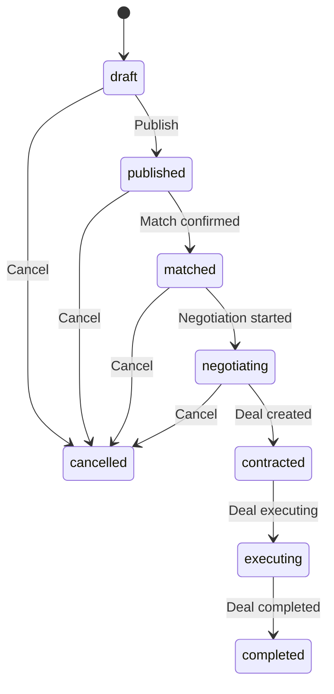

# Opportunity Workflow

> **Runtime authority:** Active product behavior is `web/` (command gateway + handlers) and shared `packages/*`. `POC/` is legacy reference / seed / regression only — do not implement new opportunity logic there.

### What this page is

Step-by-step reference for **creating**, **publishing**, and advancing opportunities in the web runtime.

### Why it matters

Publishing triggers matching. Opportunity **lifecycle status** then advances with match / negotiation / deal events (policy B).

### Status policy B (canonical)

| Event | Opportunity status |
|-------|--------------------|
| Publish | `published` |
| PostMatch **confirmed** | `matched` |
| Negotiation started from match | `negotiating` |
| Commercial agreement / deal created | `contracted` |
| Deal executing / completed / cancelled | `executing` / `completed` / `cancelled` (orchestrator) |

Discover alone does **not** change opportunity status.

```mermaid
stateDiagram-v2
  [*] --> draft
  draft --> published : Publish
  draft --> cancelled : Cancel
  published --> matched : Match confirmed
  matched --> negotiating : Negotiation started
  negotiating --> contracted : Deal created
  contracted --> executing : Deal executing
  executing --> completed : Deal completed
  published --> cancelled : Cancel
  matched --> cancelled : Cancel
  negotiating --> cancelled : Cancel
```

**Canonical statuses** (`@pm-twin/lifecycle`):  
`draft` | `published` | `matched` | `negotiating` | `contracted` | `executing` | `completed` | `cancelled`

---

## Create (draft)

1. User opens Create opportunity (`/opportunities/create` or wizard).
2. Web issues `CreateOpportunity` via command gateway → `OpportunityCommandHandler`.
3. Opportunity stored as `draft` with `createdByUserId`, `ownerPartyId`, `workspaceId` from the active actor.
4. Updates use `UpdateOpportunity` (status is not set via patch — lifecycle commands only).

---

## Publish

1. UI calls `publishOpportunityUiAction` ([`web/src/lib/publish-opportunity-ui-actions.ts`](../../web/src/lib/publish-opportunity-ui-actions.ts)).
2. Gates: profile readiness + opportunity readiness + vetting.
3. `TransitionOpportunityStatus` → `published` (and `visibilityStatus: published`).
4. Then matching runs (see [matching-workflow.md](matching-workflow.md)).

**Edge cases**

- Editing a **published** opportunity does **not** re-run matching. Use admin **Re-run matching** on the opportunity detail page.
- Publish succeeds even if matching partially fails (errors returned in the UI action result).

---

## After match / deal

- Confirm PostMatch → lifecycle orchestrator advances linked opportunities to `matched`.
- Start negotiation → `negotiating`.
- Create commercial agreement → `contracted`.
- Late deal stages (executing / completed / cancelled) sync via `syncOpportunitiesFromDeal` (all `opportunityIds`, including multi-party).

---

## Close / Archive

`CloseOpportunity` / `ArchiveOpportunity` set `visibilityStatus` to `closed` / `archived` (marketplace withdrawal). Lifecycle `status` is unchanged.

**Match sync (intended):** discovered and accepted PostMatches linked to the opportunity are expired so they leave the active match list. Confirmed matches are left unchanged so negotiation/deal pipelines can continue. Prefer lifecycle `cancelled` / `completed` for terminal business outcomes when wiring automation.

Closed/archived opportunities are excluded from the publish-matching candidate pool.
