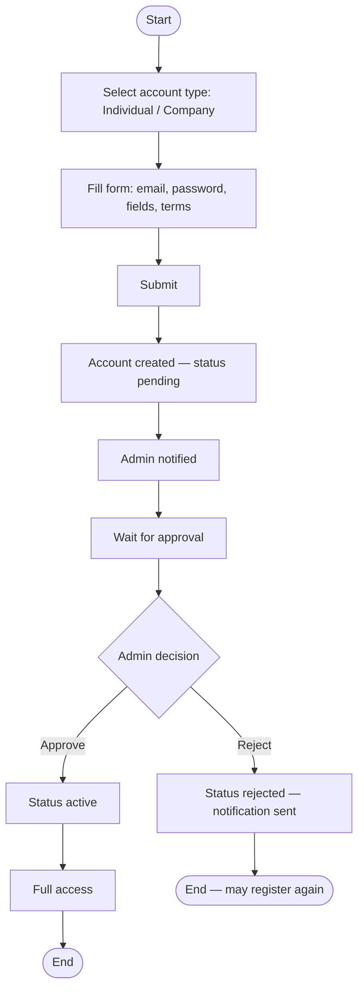
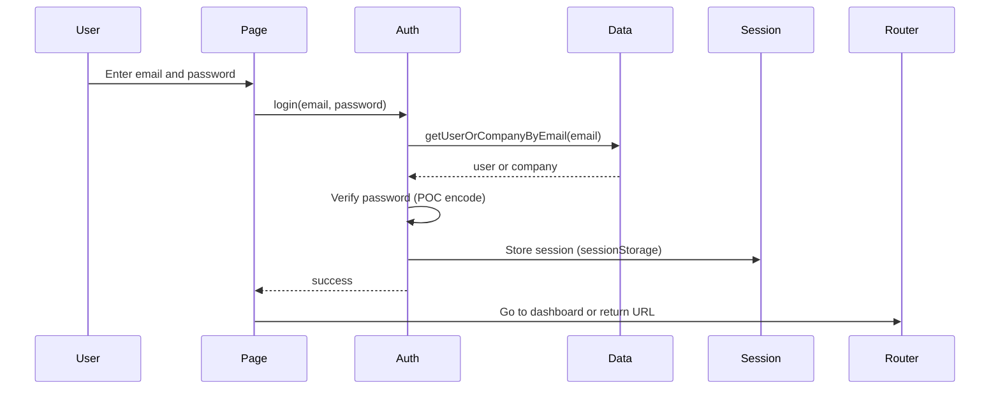

# User workflow

### What this page is

Step-by-step flows for **individual** users (professionals and consultants): register, log in, profile, discovery, and password reset.

### Why it matters

These screens are the first touchpoints before opportunities and matches.

### What you can do here

- Follow the registration diagram end to end.
- See how login checks both **users** and **companies** by email.
- Trace profile and Find flows for QA.

### Step-by-step actions

1. Read **Registration** if you test onboarding.
2. Read **Login** and **Profile** for everyday use.
3. Use **Discovery** when testing Apply vs Match entry points.

### What happens next

After login, users typically open **Dashboard**, then **Opportunities** or **Matches** ([opportunity-workflow.md](opportunity-workflow.md), [matching-workflow.md](matching-workflow.md)).

### Tips

- Password handling in the POC is for demonstration; use real security patterns in production.

---

## 1. Registration flow

**Steps (implemented):**

1. Open **Register** (register route).
2. Choose individual or company; fields follow the type.
3. Submit through auth and data services to create the record.
4. Account is stored with status **`pending`**.
5. Admin sees the account under **Admin → Users** or **Vetting** and approves or rejects.
6. On approve: status becomes **`active`**; approval notification is created.
7. On reject: status **`rejected`**; rejection notification is created.

**Inputs:** Email, password, profile fields.  
**Outputs:** New account row; notifications on decision.

**Edge cases:**

- Duplicate email: blocked when an account already exists.
- Clarification: status may become **`clarification_requested`**; resubmit per product rules.

### What happens next

When **active**, the user can use the full portal (subject to role).

---

## 2. Login flow

**Steps:**

1. Open **Login**; enter email and password.
2. Auth looks up **user or company** by email.
3. Password is checked (POC encoding—not production hashing).
4. Session is stored (token, user id, expiry).
5. Redirect to dashboard or the route you tried to open.

**Edge cases:**

- Wrong password: error, no session.
- Non-active accounts: POC may still allow login; production should block as needed.

### What happens next

You land on the **Dashboard** (or deep link) with a live session until logout.

---

## 3. Profile view and edit

**Steps:**

1. Open **Profile** or **Settings**.
2. Load the current user from session and storage.
3. Edit fields (name, specializations, certifications, sectors, skills, and so on).
4. Save → profile updates persist.

**Edge cases:**

- Company vs individual: different sections.
- Verification badges: usually admin-controlled.

### What happens next

Matching and discovery use updated profile data on the next load or merge.

---

## 4. Discovery (Find) flow

**Steps:**

1. Open **Find**.
2. Load **published** opportunities.
3. Filter or search; open **Opportunity detail**.
4. From detail: **Apply** (applications) or jump to **Matches** if a match already exists.

### What happens next

Applications follow the pipeline workflow; matches follow [matching-workflow.md](matching-workflow.md).

---

## 5. Password reset (forgot / reset)

**Forgot password**

1. Open **Forgot password**; enter email.
2. Look up account; create a reset token (stored locally in POC).
3. Email send is simulated; demo may show a link with token.
4. Open **Reset password** with token; set a new password.
5. Invalidate token; redirect to login.

### What happens next

You sign in with the new password.

---

## State changes summary

| Action | Entity | State change |
|--------|--------|--------------|
| Register | User/company | Created **`pending`** |
| Admin approve | User/company | → **`active`** |
| Admin reject | User/company | → **`rejected`** |
| Login | Session | Created in sessionStorage |
| Logout | Session | Cleared |
| Update profile | User/company | Profile and **`updatedAt`** |

---

## Related documentation

- [Actors](../actors.md)
- [Opportunity workflow](opportunity-workflow.md)
- [Matching workflow](matching-workflow.md)
- [Deal workflow](deal-workflow.md)
